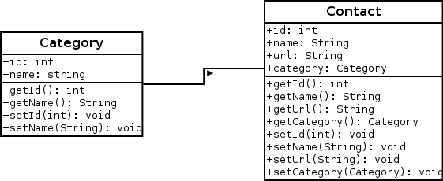
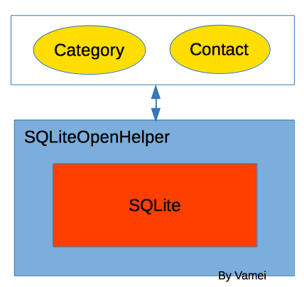
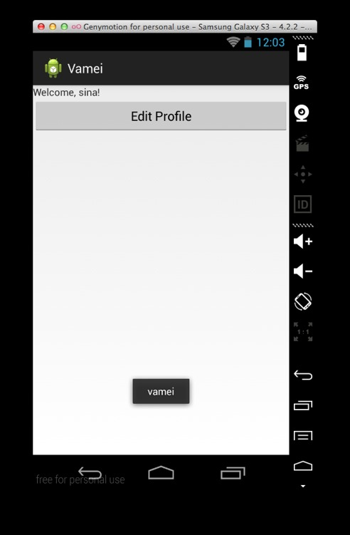

# 安卓第七夜 雅典学院

作者：Vamei 出处：http://www.cnblogs.com/vamei 欢迎转载，也请保留这段声明。谢谢！ 

我之前只使用了一种持续保存数据的方法，即 SharedPreferences。然而，SharedPreferences 只能存储少量松散的数据，并不适合大量数据的存储。安卓带有 SQLite 数据库，它是一个简单版本的关系型数据库，可以应对更复杂的数据存取需求。我将在这里说明安卓中该数据库的使用方法。这里只专注于安卓中 SQLite 数据库的接口使用，并没有深入关系型数据库和 SQL 语言的背景知识。

《雅典学院》是拉斐尔的画。他在这幅壁画中描绘了许多古典时代的哲学家，如苏格拉底、柏拉图、亚里士多德等。画中的哲学家生活在不同的时代，硬是被拉斐尔放在了一起。


### 描述

这一讲，我将继续拓展应用的功能，让应用存储多个联系人信息。相关的安卓知识点包括：

*   使用 SQLite 数据库。

*   使用 adb 命令行工具查看数据库。

在这一讲中的新增代码，都将放入到 me.vamei.vamei.model 包中。右键点击 src 文件夹，选择 New -> Package，就可以在 src 中创建新的包。

### 创建对象模型

在面向对象语言中，对象用于描述和操作数据。我使用两个类 Category 和 Contact 的对象：

*   Category：联系人分类。包括 id 属性和 name 属性。
*   Contact：联系人。包括 id，url，name 和 categoryId 属性。其中 categoryId 是 Contact 所属 Category 对象的 id。



Category 类与 Contact 类 

Category 类有 id 和 name 属性，分别存储序号和分类姓名。它定义在 Category.java 中：

```java
package me.vamei.vamei.model;

public class Category {
    int id;
    String name;

    public Category() {}

    public Category(String name) {
        this.name = name;
    }

    public Category(int id, String name) {
        this.id = id;
        this.name = name;
    }

    public int getId() {
        return this.id;
    }

    public void setId(int id) {
        this.id = id;
    }

    public String getName() {
        return this.name;
    }

    public void setName(String name) {
        this.name = name;
    }
}
```

Contact 类的定义在 Contact.java 中。它的 id 和 name 属性，用于记录联系人序号和联系人姓名。url 用以存储联系人的博客地址。Contact 还有一个 Category 类的属性。这是用组合的方式，说明了 Contact 所归属的 Category。

```java
package me.vamei.vamei.model;

public class Contact {
    int id;
    Category category;
    String name;
    String url;

    public Contact() {

    }

    public Contact(String name, String url, Category category) {
        this.name = name;
        this.url  = url;
        this.category = category;
    }

    public Contact(int id, String name, String url, Category category) {
        this.id   = id;
        this.name = name;
        this.url  = url;
        this.category = category;
    }

    public int getId() {
        return this.id;
    }

    public void setId(int id) {
        this.id = id;
    }

    public String getName() {
        return this.name;
    }

    public void setName(String name) {
        this.name = name;
    }

    public String getUrl() {
        return this.url;
    }

    public void setUrl(String url) {
        this.url = url;
    }

    public Category getCategory() {
        return this.category;
    }

    public void setCategory(Category category) {
        this.category = category;
    }
}
```

上面的对象数据模型只是存活于内存中，只能临时保存数据。要想持续的保存数据，我们还要想办法把对象中的数据放入 SQLite 的表中。安卓提供了一个类来实现相关的交互，即 SQLiteOpenHelper。

### SQLiteOpenHelper

SQLiteOpenHelper 是对象数据模型和关系型数据库的一个接口。我通过继承该类，对每一个数据库建立一个子类。这个子类即代表了该数据库。数据库操作的相关 SQL 语句都存放在该子类中。



下面的 contactsManager 类管理了"contactsManager"数据库。这个类定义在 ContactsManager.java 中。我需要覆盖该类的 onCreate()和 onUpgrade()方法，用于说明创建和升级时，数据库将采取的行动，比如在创建时新建数据库的表。SQLite 利用 SQL 语言进行操作，所以建表的过程就是执行 SQL 的"create table ..."语句。在该类中，我还额外增加 CRUD 方法，即新建(Create)、读取(Read)、更新(Update)、删除(Delete)数据库记录。

```java
package me.vamei.vamei.model;

import java.util.LinkedList;
import java.util.List;

import android.content.ContentValues;
import android.content.Context;
import android.database.Cursor;
import android.database.sqlite.SQLiteDatabase;
import android.database.sqlite.SQLiteOpenHelper;

/*
 * Database Manager
 * Interfacing between the database and the object models
 * */
public class ContactsManager extends SQLiteOpenHelper {

    // All Static variables
    // Database Version
    private static final int DATABASE_VERSION = 1;

    // Database Name
    private static final String DATABASE_NAME = "contactsManager";

    // Contacts table name
    private static final String TABLE_CONTACTS   = "contacts";
    private static final String TABLE_CATEGORIES = "categories";

    // Contacts Table Columns names
    private static final String KEY_ID   = "id";
    private static final String KEY_CATEGORY_ID = "category_id";
    private static final String KEY_NAME = "name";
    private static final String KEY_URL  = "url";

    // Constructor
    public ContactsManager(Context context) {
        super(context, DATABASE_NAME, null, DATABASE_VERSION);
    }

    @Override
    public void onCreate(SQLiteDatabase db) {
        String CREATE_CATEGORIES_TABLE = "CREATE TABLE " + TABLE_CATEGORIES + "("
                + KEY_ID + " INTEGER PRIMARY KEY AUTOINCREMENT," 
                + KEY_NAME + " TEXT UNIQUE" + ")";
        String CREATE_CONTACTS_TABLE = "CREATE TABLE " + TABLE_CONTACTS + "("
                + KEY_ID + " INTEGER PRIMARY KEY AUTOINCREMENT," + KEY_NAME + " TEXT," 
                + KEY_CATEGORY_ID + " INTEGER," + KEY_URL + " TEXT," 
                + "FOREIGN KEY(" + KEY_CATEGORY_ID +") REFERENCES " 
                + TABLE_CATEGORIES + "(" + KEY_ID + ")"
                + ")";
        db.execSQL(CREATE_CATEGORIES_TABLE);
        db.execSQL(CREATE_CONTACTS_TABLE);
    }

    @Override
    public void onUpgrade(SQLiteDatabase db, int oldVersion, int newVersion) {
        // Drop older table if existed
        db.execSQL("DROP TABLE IF EXISTS " + TABLE_CATEGORIES);
        db.execSQL("DROP TABLE IF EXISTS " + TABLE_CONTACTS);
        // Create tables again
        onCreate(db);
    }

     /**
     * All CRUD(Create, Read, Update, Delete) Operations for Contacts
     */

    public void createContact(Contact contact) {
        SQLiteDatabase db = this.getWritableDatabase();

        ContentValues values = new ContentValues();
        values.put(KEY_NAME, contact.getName());
        values.put(KEY_URL, contact.getUrl());
        values.put(KEY_CATEGORY_ID, contact.getCategory().getId());

        db.insert(TABLE_CONTACTS, null, values);
        db.close();
    }

    // Getting single contact
    public Contact getContact(int id) {
        SQLiteDatabase db = this.getReadableDatabase();

        Cursor cursor = db.query(TABLE_CONTACTS, new String[] { KEY_ID,
            KEY_NAME, KEY_URL, KEY_CATEGORY_ID }, KEY_ID + "=?",
            new String[] { String.valueOf(id) }, null, null, null, null);
        if (cursor != null)
            cursor.moveToFirst();

        Category category = getCategory(Integer.parseInt(cursor.getString(3)));
        Contact contact = new Contact(Integer.parseInt(cursor.getString(0)),
            cursor.getString(1), cursor.getString(2), 
            category);

        // return contact
        return contact;
    }

    // Getting all contacts
    public List<Contact> getAllContacts() {
        List<Contact> contacts = new LinkedList<Contact>();

        // build the query
        String query = "SELECT  * FROM " + TABLE_CONTACTS;

        // get reference to writable DB
        SQLiteDatabase db = this.getReadableDatabase();
        Cursor cursor = db.rawQuery(query, null);

        // iterate over all retrieved rows
        Contact contact = null;
        if (cursor.moveToFirst()) {
            do {
                contact = new Contact();
                contact.setId(Integer.parseInt(cursor.getString(0)));
                contact.setName(cursor.getString(1));
                contact.setUrl(cursor.getString(2));

                Category category = getCategory(Integer.parseInt(cursor.getString(3)));
                contact.setCategory(category);

                // Add category to categories
                contacts.add(contact);
            } while (cursor.moveToNext());
        }

        // return books
        return contacts;
    }

    // Updating single contact
    public int updateContact(Contact contact) {
        SQLiteDatabase db = this.getWritableDatabase();

        ContentValues values = new ContentValues();
        values.put(KEY_NAME, contact.getName());
        values.put(KEY_URL, contact.getUrl());
        values.put(KEY_CATEGORY_ID, contact.getCategory().getId());

        // updating row
        return db.update(TABLE_CONTACTS, values, KEY_ID + " = ?",
            new String[] { String.valueOf(contact.getId()) });
    }

    // Deleting single contact
    public void deleteContact(Contact contact) {
        SQLiteDatabase db = this.getWritableDatabase();
        db.delete(TABLE_CONTACTS, KEY_ID + " = ?",
            new String[] { String.valueOf(contact.getId()) });
        db.close();
    }

     /**
     * All CRUD(Create, Read, Update, Delete) Operations for Contacts
     */

    // Adding a single category
    public void createCategory(Category category) {
        SQLiteDatabase db = this.getWritableDatabase();

        ContentValues values = new ContentValues();
        values.put(KEY_NAME, category.getName());
        db.insert(TABLE_CATEGORIES, null, values);
        db.close();
    }

    // Getting single contact
    public Category getCategory(int id) {
        SQLiteDatabase db = this.getReadableDatabase();

        Cursor cursor = db.query(TABLE_CATEGORIES, new String[] { KEY_ID,
            KEY_NAME }, KEY_ID + "=?",
            new String[] { String.valueOf(id) }, null, null, null, null);
        if (cursor != null)
            cursor.moveToFirst();

        Category category = new Category(Integer.parseInt(cursor.getString(0)), 
                cursor.getString(1));

        // return contact
        return category;
    }

    // Getting all categories
    public List<Category> getAllCategories() {
        List<Category> categories = new LinkedList<Category>();

        // build the query
        String query = "SELECT  * FROM " + TABLE_CATEGORIES;

        SQLiteDatabase db = this.getWritableDatabase();
        Cursor cursor = db.rawQuery(query, null);

        // iterate over the categories
        Category category = null;
        if (cursor.moveToFirst()) {
            do {
                category = new Category();
                category.setId(Integer.parseInt(cursor.getString(0)));
                category.setName(cursor.getString(1));

                // Add category to categories
                categories.add(category);
            } while (cursor.moveToNext());
        }

        // return categories
        return categories;
    }

    // Updating single contact
    public int updateCategory(Category category) {
        SQLiteDatabase db = this.getWritableDatabase();

        ContentValues values = new ContentValues();
        values.put(KEY_NAME, category.getName());

        // updating row
        return db.update(TABLE_CATEGORIES, values, KEY_ID + " = ?",
            new String[] { String.valueOf(category.getId()) });
    }

    // Deleting single contact
    public void deleteCategory(Category category) {
        SQLiteDatabase db = this.getWritableDatabase();
        db.delete(TABLE_CATEGORIES, KEY_ID + " = ?",
            new String[] { String.valueOf(category.getId()) });
        db.close();
    } 
}
```

在属性中，我说明了数据库的一些相关参数，如数据库版本，数据库名和表名。我还在数据库中定义了表的属性名称。

onCreate()方法负责了表格的创建。而 onUpgrade()方法中，则说明了数据库升级后，需要删除所有数据，重新创建表格。

此外，我还编写了进行数据库操作的 CRUD 方法。这些方法的核心实际上是一些操作数据库的 SQL 语句。如果上面的 CRUD 方法无法满足数据库操作的需求，你还可以根据需要增加方法。

### 数据库使用

在之前编写的 MainActivity 的 onCreate()方法中，调用数据库：

```java
......
    @Override
    public void onCreate() {
            ......
        ContactsManager cm = new ContactsManager(this);

        // add categories to the database
        cm.createCategory(new Category("Friend"));
        cm.createCategory(new Category("Enermy"));

        // add contact to the database
        Category cat1 = cm.getCategory(1);
        cm.createContact(new Contact("vamei", "http://www.cnblogs.com/vamei", cat1));

        // retrieve and display
        Toast.makeText(this, cm.getContact(1).getName(), Toast.LENGTH_LONG).show();
    }
......
```

上面进行了简单的数据存储和读取。效果如下：



我将在下一讲中，利用数据库实现更复杂的功能。

### adb 查看数据库

adb 是安卓提供的命令行工具。你可以在计算机上使用该命令行，查看安卓设备中的 SQLite 数据库。首先，查看连接在计算机上的安卓设备：

```java
adb devices -l
```

该命令会列出所有的设备及其端口。

打开某个设备：

```java
adb -s 192.168.56.101:5555 shell
```

-s 参数说明了设备的端口。这样就进入了该设备的命令行 Shell。我们可以在该命令行使用常用的如 cd, ls, pwd 命令。

应用的数据库存在下面文件夹中：

/data/data/me.vamei.vamei/databases/

其中的 me.vamei.vamei 是我们正在编写的应用。

之前部分已经创建了 contactsManager 数据库。使用 sqlite3 打开：

```java
sqlite3 /data/data/me.vamei.vamei/databases/contactsManager
```

将进入 SQLite 提供的命令行。可以按照 SQLite 终端的使用方法操作。例如

.tables   #显示所有的表格

或者直接使用 SQL 语句：

select * from categories;

使用结束后，按 Ctrl + D 推出 SQLite 终端。

在开发过程中，这一命令行工具可以帮助我们快捷查询数据库状态，方便 debug。

### 总结

SQLiteOpenHelper

adb 终端查看数据库