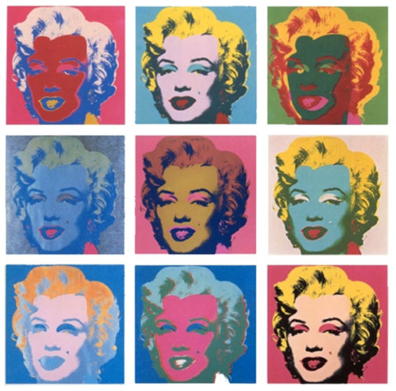
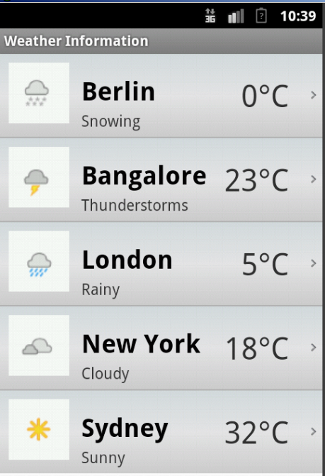
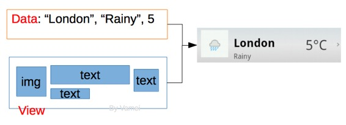
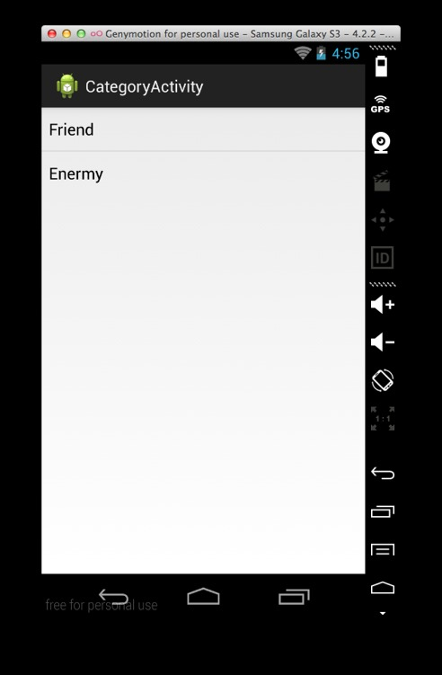
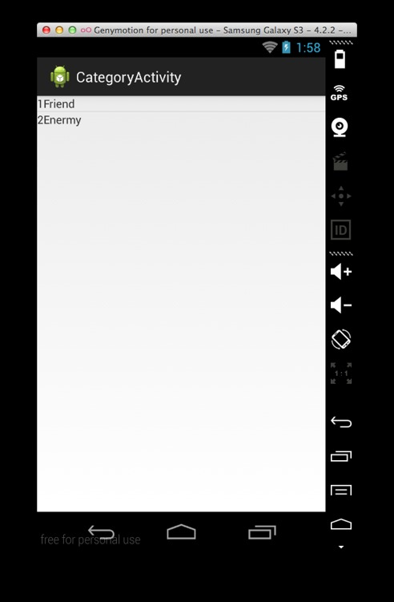

# 安卓第八夜 玛丽莲梦露

作者：Vamei 出处：http://www.cnblogs.com/vamei 欢迎转载，也请保留这段声明。谢谢！ 

上一讲说明了数据库中存取数据的方法。这一讲将以条目的视图方式，来以相似的视图方式，显示多个数据对象。这种方式特别适合于显示从数据库中取出的多个结构相似的数据，比如多个联系人，或者多个联系人分类。

《玛丽莲梦露》，这是一副现代艺术作品。听到玛丽莲梦露自杀的消息后，现代艺术家沃霍尔深为震惊。他通过重复玛丽莲梦露的形象，创作了这幅波普艺术的名作。每一个形象既是重复，又有变化。



### 描述

多个条目的视图方式在应用中很常见，比如联系人目录。我们经常会根据数据的数量，动态的调整显示条目的个数。譬如一个社交应用显示好友信息。当好友数目增加或减少时，安卓需要动态的增加或减少显示好友条目。我将介绍 ListView 和 ListAdapter，两者结合，可以动态的显示条目。我将利用它们，创建一个条目页面，显示所有的联系人类别。相关知识点：

*   onClickListener 接口。实现点击监听的一种新方式。
*   ListView。这是一个 View Group，用于包含多个条目。
*   ArrayAdapter。它让数据以特定的条目视图格式显示出来。

### Activity 实施 OnClickListener 接口

我将修改 MainActivity，增加一个按钮，通向新的页面。新的页面中将包含条目视图。在 activity_main.xml 中增加按钮元素：

```java
<LinearLayout 

    android:orientation="vertical"
    android:layout_width="match_parent"
    android:layout_height="match_parent" >

    <TextView 
        android:id="@+id/welcome"
        android:layout_width="match_parent"
        android:layout_height="wrap_content" />

    <Button
        android:id="@+id/author"
        android:layout_width="match_parent"
        android:layout_height="wrap_content"
        android:text="Edit Profile" />

    <Button
        android:id="@+id/category"
        android:layout_width="match_parent"
        android:layout_height="wrap_content"
        android:text="Contact Categories" />
</LinearLayout>
```

上面 id 为 category 的元素为新增按钮。

在 MainActivity 中监听新的按钮。之前的事件监听方式，是将新建的 OnClickListener 对象传递给视图元素。实际上，OnClickListener 只是一个接口(interface)。我让 MainActivity 实施 OnClickListener 接口，并让 MainActivity 对象负责监听：

```java
package me.vamei.vamei;

import android.app.Activity;
import android.content.Context;
import android.content.Intent;
import android.content.SharedPreferences;
import android.os.Bundle;
import android.view.View;
import android.view.View.OnClickListener;
import android.widget.Button;
import android.widget.TextView;

public class MainActivity extends Activity implements OnClickListener {
    private SharedPreferences sharedPref;

    @Override
    protected void onCreate(Bundle savedInstanceState) {
        super.onCreate(savedInstanceState);
        setContentView(R.layout.activity_main);

        sharedPref = this.getSharedPreferences("me.vamei.vamei", 
                Context.MODE_PRIVATE);

        Button btn1 = (Button) findViewById(R.id.author);
        btn1.setOnClickListener(this);
        Button btn2 = (Button) findViewById(R.id.category);
        btn2.setOnClickListener(this);        
    }

    @Override
    protected void onResume() {
        super.onResume();
        TextView nameView = (TextView) findViewById(R.id.welcome);

        // retrieve content from shared preference, with key "name"
        String   welcome  = "Welcome, " + sharedPref.getString("name", "unknown") + "!";
        nameView.setText(welcome);
    }

    // method for interface OnClickListener
    @Override
    public void onClick(View v) {
        Intent intent;
        // Routing to different view elements
        switch(v.getId()) {
            case R.id.author:
                intent = new Intent(this, 
                        SelfEditActivity.class);
                startActivity(intent);
                break;
            case R.id.category:
                intent = new Intent(this,
                        CategoryActivity.class);
                startActivity(intent);
                break;
        }
    }
}
```

MainActivity 实施了 OnClickListener 接口，因此也是一个 OnClickListener 类型的对象。OnClickListener 接口有一个规定的方法 onClick()。事件发生后，安卓将调用的该方法。我们用 setOnClickListener 的方法，让 MainActivity 同时监听两个按钮的点击事件。当事件触发后，安卓调用 onClick()方法。通过 switch 结构，安卓了解到底是哪个按钮被点击，并针对不同的情况，启动了不同的下游 Activity。

我们当然也可以用之前的 new OnClickListener()的方法，为两个按钮分别创建监听对象，但会相对比较繁琐。

可以看到，点击 id 为 category 的按钮后，安卓将启动 CategoryActivity 按钮。这就是我们下一步将要编写的。

### 使用 ArrayAdapter

CategoryActivity 将以条目的方式来显示数据库中存储的所有 Category，即联系人的类别。我在上一讲中，已经将数据存储到了 SQLite 数据库中。我需要把数据取出，并放入到 CategoryActivity 的视图中。

困难的地方在于，我无法预知数据库中有多少个 Category，因此，我没法在设计布局的时候静态的说明所有的视图元素。这个问题可以通过动态布局的方式，用 addView()方法，把视图元素加到视图树中。视图元素的动态添加，会导致安卓本身的效率会变慢。

我将使用 ListView 来重复利用构图方式。ListView 是一个 View Group，用于管理多条布局相似的视图元素。例如：



可以看到，在 ListView 中，虽然每个条目的具体数据不同，但它们的构图方式都相同。这样，我不用微观的操作每个条目，就可以把注意力放在数据的变更上。

我们创建 CategoryActivity 将要使用的布局文件 activity_category.xml：

```java
<ListView 
    android:id="@+id/categoryList"
    android:layout_width="wrap_content"
    android:layout_height="wrap_content" />
```

这里只有一个 ListView 便签，作为高层框架，用于容纳多个条目。至于每个条目的具体内容和显示格式，将在下面的 CategoryActivity 中说明。

### 使用 ArrayAdapter

现在，有了视图，我们要考虑数据。当我们取出多个数据后，最自然的方式是记录为一个表或数组。我们需要根据小条目的布局，为数据赋予显示格式。最后，再把图像化的多个条目合成到 ListView 上。安卓提供了 ArrayAdapter 类，可以综合以上功能。它可以为每个数据元素赋予相同的视图格式。将 ListView 与 ArrayAdapter 绑定后，安卓就可以动态的调整条目了。



为数据赋予视图格式

我在 CategoryActivity.java 中使用 ArrayAdapter：

```java
package me.vamei.vamei;

import java.util.ArrayList;
import java.util.List;

import me.vamei.vamei.model.Category;
import me.vamei.vamei.model.ContactsManager;
import android.os.Bundle;
import android.app.Activity;
```

```java
import android.widget.ArrayAdapter;
import android.widget.ListView;

public class CategoryActivity extends Activity {

    @Override
    protected void onCreate(Bundle savedInstanceState) {
        super.onCreate(savedInstanceState);
        setContentView(R.layout.activity_category);

        ListView listview = (ListView) findViewById(R.id.categoryList);

        // retrieve data from the database
        ContactsManager cm        = new ContactsManager(this);
        List<Category> categories =  cm.getAllCategories();

        // transform data to a list of strings
        ArrayList<String> list = new ArrayList<String>();
        for (int i = 0; i < categories.size(); ++i) {
            list.add(categories.get(i).getName());
        }

        ArrayAdapter<String> adapter = new ArrayAdapter<String>(this,
            android.R.layout.simple_list_item_1, list);

        // bind the listview and the adapter
        listview.setAdapter(adapter);
    }
}
```

代码中新建了一个 ArrayAdapter 对象。ArrayAdapter 构造器接收三个参数，第一个为 Context，第二个说明了条目的具体构图，第三个为包含有数据的表。由于数据是字符串类型的表，ArrayAdapter 也有一个 String 的类型参数。一个 ArrayAdapter 中包含了数据和条目的具体格式。

需要注意的是第二个参数 android.R.layout.simple_list_item_1，它是安卓框架自己提供的一个简单的 XML 布局，包含了一个 TextView 元素。未来的字符串型数据按照该视图元素规定的格式显示。这个布局的源代码可[参考链接](https://github.com/android/platform_frameworks_base/blob/master/core/res/res/layout/simple_list_item_1.xml)。安卓还提供了其它一些简易的布局，[参考链接](http://developer.android.com/reference/android/R.layout.html)。我们当然可以用自己的布局来替代它。

最后，通过 ListView 的 setAdapter()方法，把 ArrayAdapter 所形成的多个条目视图(包含视图格式和数据)，放置在 ListView 这个大容器中：



### 继承 ArrayAdapter

我上面从 Category 类型的表中，提取出一个字符串类型的表，作为数据传递给 ArrayAdapter。ArrayAdapter 随后自动的把字符串数据加工为 simple_list_item_1 格式。我也可以通过继承 ArrayAdapter，来创建一个新的 Adapter 类型。在该过程中，我可以更自由的控制对数据和 ListView 的绑定。下面的 CategoryAdapter 继承了 ArrayAdapter。它将允许我：

*   使用 Category 表中的数据。数据不用提前转换为字符串类型的表。
*   使用更复杂的视图格式。控制 Category 对象中的多个属性的显示方式。

我在 me.vamei.vamei 中新增 CategoryActivity.java。它包含了类 CategoryAdapter：

```java
package me.vamei.vamei;

import java.util.List;

import me.vamei.vamei.model.Category;
import android.content.Context;
import android.view.LayoutInflater;
import android.view.View;
import android.view.ViewGroup;
import android.widget.ArrayAdapter;
import android.widget.TextView;

public class CategoryAdapter extends ArrayAdapter<Category> {
    private int viewId;
    private Context context;
    private List<Category> objects;

    // Constructor
    public CategoryAdapter(Context context, int viewId, List<Category> objects) {
        super(context, viewId, objects);
        this.context = context;
        this.viewId  = viewId;
        this.objects = objects;
    }

    // For each row, control the view assigned to the data
    public View getView(int position, View convertView, ViewGroup parent) {
        View v = convertView;

        // Inflate the row view, if it doesn't exist.
        // ViewList is capable of reusing the views.
        if(v == null) {
            LayoutInflater inflater = (LayoutInflater) context.getSystemService(Context.LAYOUT_INFLATER_SERVICE);
            v = inflater.inflate(viewId, parent, false);
        }

        Category category = objects.get(position);

        // Add data to views
        if(category != null) {
            TextView tv1 = (TextView) v.findViewById(R.id.seq);
            if(tv1 != null) { 
                tv1.setText(Integer.toString(category.getId())); 
            }

            TextView tv2 = (TextView) v.findViewById(R.id.name);
            if(tv2 != null) { 
                tv2.setText(category.getName()); 
            }
        }

        return v;
    }
}
```

这是一个 ArrayAdapter 的子类。我通过编写 getView()方法，来说明每个 Category 对象和对应条目视图的绑定方式。该方法的第一个参数代表了条目的编号，第二个参数是条目的视图，第三个参数代表了母视图，也就是整个 ListView。需要注意的是第二个参数，即 convertView。随着用户上下滑动屏幕，ListView 的条目可能消失。安卓会重复利用消失条目的视图树，以节省重新建立条目视图所需要的时间。convertView 中就包含了这样一个重复利用的条目视图。如果没有可以重复利用的条目视图，那么该参数就为 null。此时，我们需要如 if 结构中那样，重建新的条目视图。

我将要赋予给条目的视图布局保存在 list_category.xml 中。它在位于一行中包含了两个 TextView：

```java
<?xml version="1.0" encoding="utf-8"?>
<LinearLayout 
    android:layout_width="match_parent"
    android:layout_height="wrap_content"
    android:orientation="horizontal" >
    <TextView
        android:id="@+id/seq"
        android:layout_width="wrap_content"
        android:layout_height="wrap_content" />
    <TextView
        android:id="@+id/name"
        android:layout_width="wrap_content"
        android:layout_height="wrap_content" />
</LinearLayout>
```

我们在 CategoryActivity.java，来利用新建的 CategoryAdapter 类。在创建对象时，我把上面的条目布局，即 R.layout.list_category 作为参数传给构造器：

```java
package me.vamei.vamei;

import java.util.ArrayList;
import java.util.List;

import me.vamei.vamei.model.Category;
import me.vamei.vamei.model.ContactsManager;
import android.app.Activity;
import android.content.Context;
import android.os.Bundle;
import android.view.LayoutInflater;
import android.view.View;
import android.view.ViewGroup;
import android.widget.AdapterView;
import android.widget.AdapterView.OnItemClickListener;
import android.widget.ArrayAdapter;
import android.widget.ListView;
import android.widget.TextView;
import android.widget.Toast;

public class CategoryActivity extends Activity {

    @Override
    protected void onCreate(Bundle savedInstanceState) {
        super.onCreate(savedInstanceState);
        setContentView(R.layout.activity_category);

        ListView listview = (ListView) findViewById(R.id.categoryList);

        ContactsManager cm              = new ContactsManager(this);
        final List<Category> categories = cm.getAllCategories();

        CategoryAdapter adapter = new CategoryAdapter(this,
            R.layout.list_category, categories);

        listview.setAdapter(adapter);

        listview.setOnItemClickListener(new OnItemClickListener() {
            public void onItemClick(AdapterView<?> parent, View view,int position, long id) {
                    // When clicked, show a Toast text
                    Toast.makeText(getApplicationContext(),
                    "id:" + categories.get(position).getId(), Toast.LENGTH_SHORT).show();
            }
        });
    }
}
```

通过新的 CategoryAdapter 类对象，并借用 setAdapter()方法，我就把 Category 表中的数据和条目视图组织到了 ListView 中。此后，我还通过 setOnItemClickListener()方法，监听每个条目的点击事件。



### 使用 setTag()优化 CategoryAdapter

上面已经提到，ArrayAdapter 可以通过重复利用条目视图，来优化安卓应用的效率。在 ArrayAdapter 中，我还可以用 setTag()的方式，保存条目中具体视图元素的引用，从而减少使用 findViewId()方法的次数。这也能提高应用的运行效率。

setTag()用于把对象“粘附”在某个视图元素上。由于 ListView 中消失的条目会通过 convertView 参数来重复利用，我们可以为 convertView 附加两个 TextView 元素(R.id.seq, R.id.name)的引用。当 convertView 被重复利用时，粘附于其上的两个视图元素的引用也会被重复利用，从而减少了调用 findViewById()进行检索的次数。

为了实践上面的想法，我修改 CategoryAdapter.java 如下：

```java
package me.vamei.vamei;

import java.util.List;

import me.vamei.vamei.model.Category;
import android.content.Context;
import android.view.LayoutInflater;
import android.view.View;
import android.view.ViewGroup;
import android.widget.ArrayAdapter;
import android.widget.TextView;

public class CategoryAdapter extends ArrayAdapter<Category> {
    private int viewId;
    private Context context;
    private List<Category> objects;

    // Constructor
    public CategoryAdapter(Context context, int viewId, List<Category> objects) {
        super(context, viewId, objects);
        this.context = context;
        this.viewId  = viewId;
        this.objects = objects;
    }

    private class Holder {
        TextView tv1;
        TextView tv2;
        public Holder(TextView tv1, TextView tv2) {
            this.tv1 = tv1;
            this.tv2 = tv2;
        } 
    }
    // For each row, control the view assigned to the data
    public View getView(int position, View convertView, ViewGroup parent) {
        View v = convertView;
        Holder holder;

        // inflate the row view, if it doesn't exist.
        // ViewList is capable of reusing the views.
        if(v == null) {
            LayoutInflater inflater = (LayoutInflater) context.getSystemService(Context.LAYOUT_INFLATER_SERVICE);
            v = inflater.inflate(viewId, parent, false);
            holder = new Holder((TextView) v.findViewById(R.id.seq), 
                    (TextView) v.findViewById(R.id.name));
            v.setTag(holder);
        } else {
            holder = (Holder) v.getTag();
        }

        Category category = objects.get(position);

        // add data to views
        if(category != null) {
            holder.tv1.setText(Integer.toString(category.getId())); 
            holder.tv2.setText(category.getName()); 
        }

        return v;
    }
}
```

上面代码中的 Holder 类型的对象用于保存两个 TextView 类型的引用。在 if(convertView == null)的结构中可以看出，如果条目被重复利用，粘附在条目上的 Holder 对象将借助 getTag()方法取出。我们可以重复利用该 Holder 对象中包含的两个 TextView 引用，从而减少了 findViewById()的调用次数。

### 总结

ArrayAdapter, getView()

setAdapter()

setOnItemClickListener()

setTag(), getTag()

欢迎继续阅读“[Java 快速教程](http://www.cnblogs.com/vamei/archive/2013/03/31/2991531.html)”系列文章