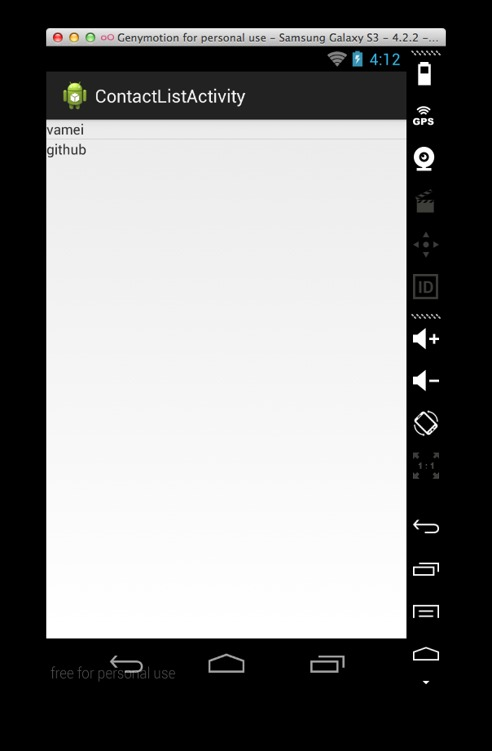
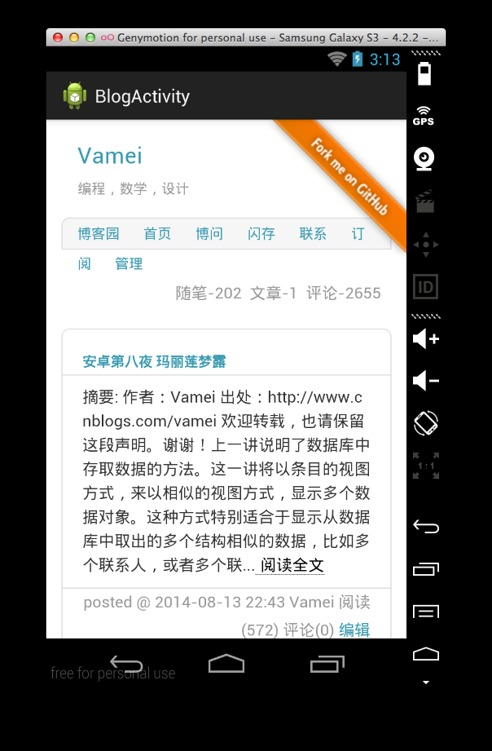

# 安卓第九夜 狂风

作者：Vamei 出处：http://www.cnblogs.com/vamei 欢迎转载，也请保留这段声明。谢谢！

我们经常需要在安卓应用中包含简易的网页显示功能。我将在这一讲中实现网页的显示。

《狂风》，来自小 Willem，荷兰画派黄金时代的作品。作为当时海上马车夫的荷兰，对航海题材的画情有独钟。 这种倾斜的船身，是当时的画家常用的手法，用于表现很强的风。


### 描述

上一讲实现了一个类别条目页面。现在，我希望点击某个类别后，能再次以条目的方式显示所有的联系人。在这个新的条目页面中，点击某个联系人后，能显示该联系人的 URL 指向的页面。相关的安卓知识点为：

*   Intent 和 Bundle。传递数据。
*   WebView。用于显示一个网页。

### 新的数据库查询方法

我将增加一个条目页面，用于显示某个类别下的所有联系人。在数据层面上，我需要从数据库中取出某个类别下的所有联系人。在上一讲中，我创建了 ContactsManager 类，用于和数据库交互。但之前的 CRUD 方法无法满足我的需求。我将为该类增加新的方法，以便从数据库中取出某个类别下的所有联系人。这个方法如下：

```java
    // Getting all contacts of a category
    public List<Contact> getContactsByCategoryId(int categoryId) {
        List<Contact> contacts = new LinkedList<Contact>();

        SQLiteDatabase db = this.getReadableDatabase();

        Cursor cursor = db.query(TABLE_CONTACTS, new String[] { KEY_ID,
            KEY_NAME, KEY_URL, KEY_CATEGORY_ID }, KEY_CATEGORY_ID + "=?",
            new String[] { String.valueOf(categoryId) }, null, null, null, null);

        // iterate over all retrieved rows
        Contact contact = null;
        if (cursor.moveToFirst()) {
            do {
                contact = new Contact();
                contact.setId(Integer.parseInt(cursor.getString(0)));
                contact.setName(cursor.getString(1));
                contact.setUrl(cursor.getString(2));

                Category category = getCategory(Integer.parseInt(cursor.getString(3)));
                contact.setCategory(category);

                // Add contact to contacts
                contacts.add(contact);
            } while (cursor.moveToNext());
        }

        // return contacts
        return contacts;
    }
```

上面方法中查询了数据库的 TABLE_CONTACTS 表格。我在数据库的 query()方法中规定，在数据库查询时，将只保留符合 KEY_CATEGORY_ID 等于 categoryId 条件的数据记录。该方法将返回某个 categoryId 下的所有 Contact 数据，也就是某个目录下的所有联系人信息。

我将在后面使用这一新增方法。

### 在 Intent 放入附加数据

我希望点击类别后，能够进入显示该类别所有联系人，即启动一个新的联系人条目页面。由于类别的数目是动态变化的，我不可能为每个类别创建一个下游页面（而且这样也太麻烦了）。然而，我可以把类别信息传递给同一个下游页面，让该下游页面根据类别，进行不同的处理。这个数据传递的任务，将由 Intent 完成。从[概念漫游（上）](http://www.cnblogs.com/vamei/p/3657249.html)中，我们已经知道，Intent 就像传令兵。现在，我要让传令兵夹带一点“私货”了。

```java
package me.vamei.vamei;

import java.util.List;

import me.vamei.vamei.model.Category;
import me.vamei.vamei.model.ContactsManager;
import android.app.Activity;
import android.content.Intent;
import android.os.Bundle;
import android.view.View;
import android.widget.AdapterView;
import android.widget.AdapterView.OnItemClickListener;
import android.widget.ListView;

public class CategoryActivity extends Activity {

    @Override
    protected void onCreate(Bundle savedInstanceState) {
        super.onCreate(savedInstanceState);
        setContentView(R.layout.activity_category);

        ListView listview = (ListView) findViewById(R.id.categoryList);

        ContactsManager cm              = new ContactsManager(this);
        final List<Category> categories = cm.getAllCategories();

        CategoryAdapter adapter = new CategoryAdapter(this,
            R.layout.list_category, categories);

        listview.setAdapter(adapter);

        listview.setOnItemClickListener(new OnItemClickListener() {
            public void onItemClick(AdapterView<?> parent, View view,int position, long id) {
                Intent intent = new Intent(CategoryActivity.this, ContactListActivity.class);
                // put extra data into intent
                // the data will be passed along with the intent, as a key-value pair
                intent.putExtra("CATEGORY_ID", categories.get(position).getId());

                startActivity(intent);
            }
        });
    }
}
```

putExtra()方法在 Intent 中放入一个键值对。"CATEGORY_ID"是“键”，而点击条目对应 Category 的 ID 是“值”。

putExtra()方法会先创建一个 Bundle 对象，再传递这个 Bundle 对象。在安卓中，一个 Bundle 对象即一个键值对。键是一个字符串，值是任意可以打包的对象(parcelable object)。Bundle 在安卓中的用途非常广泛。

我可以用下面的语句，等效的代替上面的 putExtra()：

```java
Bundle extra = new Bundle();
extra.putString("CATEGORY_ID",  categories.get(position).getId());
intent.putExtra(extra);
```

即手动创建 Bundle 对象，再利用 putExtra()将 Bundle 对象附加在 Intent 对象上。

### 提取 Intent 中的附加数据

在下游的 Activity 中，我可以通过 Context 的 getIntent()方法来获取 Intent 对象。下游 Activity 是新建的 ContactListActivity。它将以条目的方式，显示类别下所有联系人：

```java
package me.vamei.vamei;

import java.util.List;

import me.vamei.vamei.model.Contact;
import me.vamei.vamei.model.ContactsManager;
import android.app.Activity;
import android.content.Intent;
import android.os.Bundle;
import android.view.View;
import android.widget.AdapterView;
import android.widget.AdapterView.OnItemClickListener;
import android.widget.ListView;

public class ContactListActivity extends Activity {

    @Override
    protected void onCreate(Bundle savedInstanceState) {
        super.onCreate(savedInstanceState);
        setContentView(R.layout.activity_contact_list);

        // Get extra data from the Intent
        // i.e., category id
         Intent intent = getIntent();
        int cat_id    = intent.getIntExtra("CATEGORY_ID", -1);

        ContactsManager cm     = new ContactsManager(this);
        final List<Contact> contacts = cm.getContactsByCategoryId(cat_id);

        ListView listview = (ListView) findViewById(R.id.contactList);

        ContactAdapter adapter = new ContactAdapter(this,
                R.layout.list_contact, contacts);

        listview.setAdapter(adapter);

        listview.setOnItemClickListener(new OnItemClickListener() {
            public void onItemClick(AdapterView<?> parent, View view,int position, long id) {
                Intent intent = new Intent(ContactListActivity.this, BlogActivity.class);
                // Put extra data into the Intent, which is a URL
                intent.putExtra("BLOG_URL", contacts.get(position).getUrl());

                startActivity(intent);
            }
        });
    }
}
```

我在第一部分编写的数据库交互方法 getContactsByCategoryId()，在上面的 Activity 中登场。提取出的 Contact 表，通过 ListView 和 ContactAdapter，显示为联系人的条目页面。在点击条目后，URL 信息放入 Intent 中，并启动下游的 BlogActivity。BlogActivity 根据 Intent 中的 URL，来打开联系人的网页。

练习 参考[安卓第八夜 玛丽莲梦露](http://www.cnblogs.com/vamei/p/3908538.html)，增加 ContactAdapter，activity_category_list.xml 和 list_contact.xml，以完整的实现联系人条目页面。 

练习 根据之前提到的 adb shell，为数据库增加 Category 和 Contact 记录。

 

联系人条目

### 使用 WebView

下面我要添加 BlogActivity。它使用了 WebView 视图元素来显示 Web 页面。我将增加一个布局文件 activity_blog.xml，这个文件包含一个简单的 WebView 视图元素：

```java
<WebView  

        android:id="@+id/web"
        android:layout_width="wrap_content"
        android:layout_height="wrap_content"
        android:text="@string/hello_world" />
```

通过操纵该视图元素，我可以把网页加载入这个视图元素。 

下面，我将创建对应的 BlogActivity。它将从 Intent 中提取 URL 地址。WebView 的 loadUrl()方法，用于加载 URL 所指向的网页：

```java
package me.vamei.vamei;

import android.annotation.SuppressLint;
import android.app.Activity;
import android.content.Intent;
import android.os.Bundle;
import android.webkit.WebView;

@SuppressLint("SetJavaScriptEnabled")
public class BlogActivity extends Activity {
    @Override
    protected void onCreate(Bundle savedInstanceState) {
        super.onCreate(savedInstanceState);
        setContentView(R.layout.activity_blog);

        // Receive the URL from the upstream activity
         Intent intent = getIntent();
        String url    = intent.getStringExtra("BLOG_URL");

        WebView webView = (WebView) findViewById(R.id.web);

        // Enable JavaScript
        webView.getSettings().setJavaScriptEnabled(true);

        // Load the web page of the URL
        webView.loadUrl(url);
    }
}
```

注意上面的 getSettings()方法将返回一个 WebSettings 对象，包含了 WebView 的设置功能。该对象的 setJavaScriptEnabled()方法，将允许 WebView 运行网页上的 JavaScript 脚本。

为了 WebView 正常运行，我需要赋予应用访问互联网的权限，在 AndroidManifest.xml 中增加 uses-permission 标签：

```java
<manifest ...>
    ... 
    <uses-permission android:name="android.permission.INTERNET" />
    ...
</manifest>
```



### 总结

putExtra(), getIntent(), getIntExtra()

WebView, getSettings(), loadUrl()

欢迎继续阅读“[Java 快速教程](http://www.cnblogs.com/vamei/archive/2013/03/31/2991531.html)”系列文章