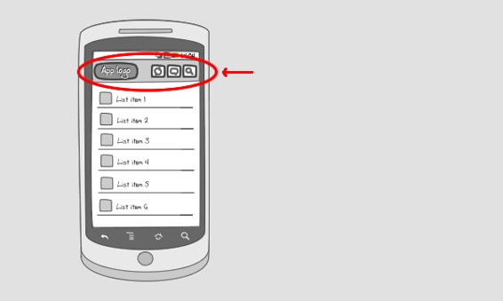
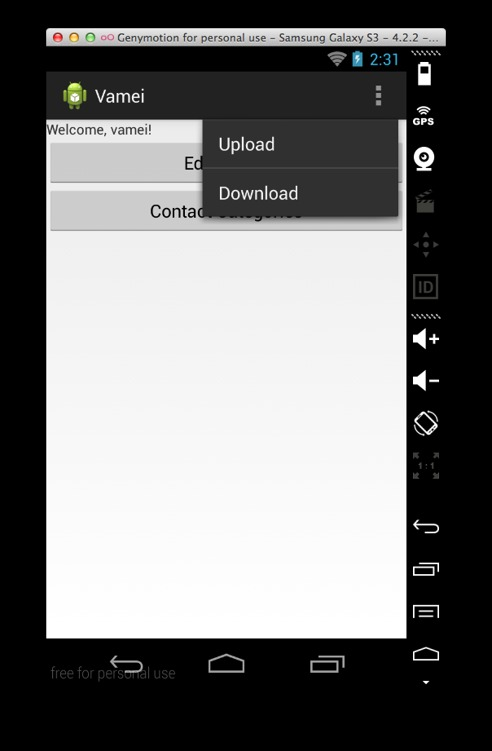
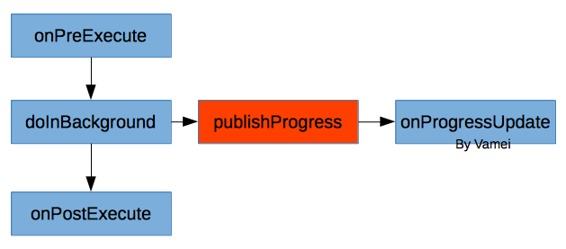

# 安卓第十夜 亚当的诞生

作者：Vamei 出处：http://www.cnblogs.com/vamei 欢迎转载，也请保留这段声明。谢谢！

上一讲介绍了用 WebView 来抓取一个网页内容。这一讲我将介绍如何在安卓内部直接进行 HTTP 通信。

《亚当的诞生》，西斯廷礼拜堂的吊顶画，米开朗基罗之作。当时的教皇强迫沉迷于雕塑的米开朗基罗画巨幅壁画。米开朗基罗认为这是在浪费自己的才华，充满愤怒的作画。当然，他又成功了。


### 描述

这一讲中，我将使用 JSON，将数据库备份到远程的数据库中。反过来我也将从远程数据库中抓取条目，并放入安卓的数据库。相关的安卓知识点包括：

*   线程
*   HTTP 通信
*   JSON

### 增加 ActionBar

我首先在首页上增加一菜单，用于触发下载和上传功能。这是通过 ActionBar 实现的。ActionBar 在页面的顶端增加一个横幅。这个横幅上可以有应用的图标、文字信息和选项菜单(OptionMenu)。



我在布局文件 res/menu/main.xml 中定义 ActionBar 的菜单：

```java
<menu 

     >

    <item
        android:id="@+id/action_upload"
        android:orderInCategory="100"
        android:title="Upload"
        app:showAsAction="never"/>  
    <item
        android:id="@+id/action_download"
        android:orderInCategory="100"
        android:title="Download"
        app:showAsAction="never"/>
</menu>
```

现在，修改之前的 MainActivity.java。MainActivity 将继承 ActionBarActivity。这样，MainActivity 页面的顶端将增加一条 ActionBar。接下来，我要覆盖 ActionBarActivity 的两个方法。一个是 onCreateOptionsMenu()方法。在这个方法中，我绑定上面的视图文件到 ActionBar 上。另一个方法 onOptionsItemSelected()，主要用于说明菜单各个选项被点击后的动作。代码如下：

```java
package me.vamei.vamei;import android.content.Context;
import android.content.Intent;
import android.content.SharedPreferences;
import android.os.Bundle;
import android.support.v7.app.ActionBarActivity;import android.view.Menu;
import android.view.MenuItem;
import android.view.View;
import android.view.View.OnClickListener;
import android.widget.Button;
import android.widget.TextView;public class MainActivity extends ActionBarActivity implements OnClickListener {
    private SharedPreferences sharedPref;

    @Override
    protected void onCreate(Bundle savedInstanceState) {
        super.onCreate(savedInstanceState);
        setContentView(R.layout.activity_main);

        sharedPref = this.getSharedPreferences("me.vamei.vamei", 
                Context.MODE_PRIVATE);

        Button btn1 = (Button) findViewById(R.id.author);
        btn1.setOnClickListener(this);
        Button btn2 = (Button) findViewById(R.id.category);
        btn2.setOnClickListener(this);        
    }

    @Override
    protected void onResume() {
        super.onResume();
        TextView nameView = (TextView) findViewById(R.id.welcome);

        // retrieve content from shared preference, with key "name"
        String   welcome  = "Welcome, " + sharedPref.getString("name", "unknown") + "!";
        nameView.setText(welcome);
    }

    // method for interface OnClickListener
    @Override
    public void onClick(View v) {
        Intent intent;
        // Routing to different view elements
        switch(v.getId()) {
            case R.id.author:
                intent = new Intent(this, 
                        SelfEditActivity.class);
                startActivity(intent);
                break;
            case R.id.category:
                intent = new Intent(this,
                        CategoryActivity.class);
                startActivity(intent);
                break;
        }
    }

    @Override
    public boolean onCreateOptionsMenu(Menu menu) {

        // Inflate the menu; this adds items to the action bar if it is present.
        getMenuInflater().inflate(R.menu.main, menu);
        return true;
    }

    @Override
    public boolean onOptionsItemSelected(MenuItem item) {
        // Handle action bar item clicks here. The action bar will
        // automatically handle clicks on the Home/Up button, so long
        // as you specify a parent activity in AndroidManifest.xml.
        int id = item.getItemId();
        switch (id) {
          case R.id.action_download:
                    return true;
                  case R.id.action_upload:
                    return true;
                }
        return super.onOptionsItemSelected(item);
    }
}
```

在上面，我的 onOptionsItemSelected()方法还没有包含具体的功能。我将在下一部分为该方法增加功能。 运行应用后效果如下：



### HTTP 获得数据

下一步，我将增加"Download"按钮点击后的功能。按钮点击后，应用将访问互联网，并获得 URL 指向的.js 文件。获得.js 文件后，我从该文件中提取 JSON 对象，这个对象中包含一些新的 Category 名字。最后，我在数据库中增加 Category 条目:

```java
@Override
public boolean onOptionsItemSelected(MenuItem item) {
    // Handle action bar item clicks here. The action bar will
    // automatically handle clicks on the Home/Up button, so long
    // as you specify a parent activity in AndroidManifest.xml.
    int id = item.getItemId();
    switch (id) {
      case R.id.action_download:
            Thread thread = new Thread() {
                @Override
                public void run(){
                    try{
                        // Http Get
                        InputStream content;
                        HttpClient httpclient = new DefaultHttpClient();
                        HttpResponse response = httpclient.execute(
                                new HttpGet("http://files.cnblogs.com/vamei/android_contact.js"));
                        content = response.getEntity().getContent();
                        BufferedReader reader = new BufferedReader(new InputStreamReader(content));
                        final StringBuilder sb = new StringBuilder();
                        String line = null;

                        while ((line = reader.readLine()) != null) {
                            sb.append(line);
                        }
                        content.close();

                        // Parse JSON Object and Save to DB
                        JSONObject receivedObject = new JSONObject(sb.toString());
                        JSONArray categoryObjects  = receivedObject.getJSONArray("category");

                        ContactsManager cm        = new ContactsManager(getApplicationContext());
                        JSONObject categoryObject;
                        for (int i=0; i< categoryObjects.length(); i++) {
                            categoryObject = categoryObjects.getJSONObject(i);
                            String name = categoryObject.getString("name");
                            Category category = new Category(name);
                            cm.createCategory(category); 
                        }
                      } catch (Exception e) {
                        Log.i("Http Error", e.getMessage().toString());
                      }
                }
            };
            thread.start();
            break;
    }      
    return super.onOptionsItemSelected(item);
}
```

注意到，上面的网络访问部分启动了一个新线程 Thread。为了确保界面的流畅，安卓规定网络访问不能在负责图画界面的主线程中进行。所以，我们必须把网络访问放在一个新的线程中。我们通过异步的方式进行网络访问，将在下一部分介绍。

程序中的 JSONObject 和 JSONArray 用于解析接收到的 JSON 字符串。

### 使用 AsyncTask

AsyncTask 在背景进程中工作。AsyncTask 分为工作准备、工作进行和工作完成三个部分。AsyncTask 有三个方法，onPreExecute(), doInBackground(), onPostExecute()分别代表这三个部分的任务。其中，doInBackground 在背景进程中进行，因此可以把网络访问放入其中。此外，在 doInBackground 中，可以通过调用 publishProgress()，来更新任务的进度。进度更新后，AsyncTask 将调用 onProgressUpdate()方法。



AsyncTask 有三个类型<X, Y, Z>。它们分别是 doInBackground(X), onProgressUpdate(Y)和 onPostExecute(Z)的参数类型。此外，doInBackground()方法的返回值将成为 onPostExecute()的参数，因此 doInBackground()方法的返回值类型也是 Z。

当工作完成，AsyncTask 会通知主线程。AsyncTask 与 Thread 的目的相同，但它异步的调用方式更方便编写，也更容易实现主线程和背景线程之间的信息传递。我下面会实现 Upload 的对应功能，即把 Category 表转成 JSON，再把该 JSON 字符串发送到特定的 URL。

```java
@Override
public boolean onOptionsItemSelected(MenuItem item) {
    // Handle action bar item clicks here. The action bar will
    // automatically handle clicks on the Home/Up button, so long
    // as you specify a parent activity in AndroidManifest.xml.
    int id = item.getItemId();
    switch (id) {
            case R.id.action_download:
              Thread thread = new Thread() {
                  @Override
                public void run(){
                    try{
                        InputStream content;

                        // Http Get
                        HttpClient httpclient = new DefaultHttpClient();
                        HttpResponse response = httpclient.execute(
                                new HttpGet("http://files.cnblogs.com/vamei/android_contact.js"));
                        content = response.getEntity().getContent();
                        BufferedReader reader = new BufferedReader(new InputStreamReader(content));
                        StringBuilder sb = new StringBuilder();
                        String line = null;

                        while ((line = reader.readLine()) != null) {
                            sb.append(line);
                        }
                        content.close();

                        // Parse JSON Object and Save to DB
                        JSONObject receivedObject = new JSONObject(sb.toString());
                        JSONArray categoryObjects = receivedObject.getJSONArray("category");

                        ContactsManager cm        = new ContactsManager(getApplicationContext());
                        JSONObject categoryObject;
                        for (int i=0; i< categoryObjects.length(); i++) {
                            categoryObject = categoryObjects.getJSONObject(i);
                            String name = categoryObject.getString("name");
                            Category category = new Category(name);
                            cm.createCategory(category); 
                        }
                      } catch (Exception e) {
                        Log.i("Http Error", e.getMessage().toString());
                      }
                }
            };
            thread.start();
            break;
          // upload action
          case R.id.action_upload:
        UploadTask newTask = new UploadTask();
        newTask.execute("http://files.cnblogs.com/");
        break;
    }      
    return super.onOptionsItemSelected(item);
}

private class UploadTask extends AsyncTask <String, String, String> {
    /*main worker*/
    @Override
    protected String doInBackground(String...params) {
        ContactsManager cm  = new             ContactsManager(getApplicationContext());
        List<Category> categories = cm.getAllCategories();
        JSONObject sendObject = new JSONObject();
        JSONArray categoryObjects = new JSONArray();
        try {
            for (int i=0; i<categories.size(); i++) {
            JSONObject categoryObject = new JSONObject();
            categoryObject.put("name",
            categories.get(i).getName());
            categoryObjects.put(categoryObject);
                }
            sendObject.put("category", categoryObjects);
                    // update progress once
                publishProgress("JSON DONE");

            // posting to URL   
                HttpClient httpClient = new DefaultHttpClient();
            HttpPost httpPost = new HttpPost(params[0]);
            StringEntity se   = new StringEntity(sendObject.toString());
                se.setContentEncoding(new BasicHeader(HTTP.CONTENT_TYPE, 
                        "application/json"));
            httpPost.setEntity(se);
            HttpResponse httpResponse = httpClient.execute(httpPost);
                    // update progress again
            publishProgress("NETWORK DONE");

            return httpResponse.getStatusLine().toString();
         } catch (Exception e) {
            e.printStackTrace();
            return "Crashed";
        }
    }

    /*after background work is done*/
    @Override
    protected void onPostExecute(String result) {
        Toast.makeText(MainActivity.this, 
                result, Toast.LENGTH_LONG).show();
    }

    /*when progress is updated*/
    @Override
    protected void onProgressUpdate(String...params) {
        Toast.makeText(MainActivity.this, 
                params[0], Toast.LENGTH_SHORT).show();
    }
}
```

这里的 URL 并不能处理 POST 方法。如果有兴趣，可以使用上一部分的 Play 框架，自制接受 POST 的服务器，并处理这里上传的 JSON。

### 总结

ActionBarActivity

Thread, AsyncTask

JSONObject, JSONArray

Http, get and post