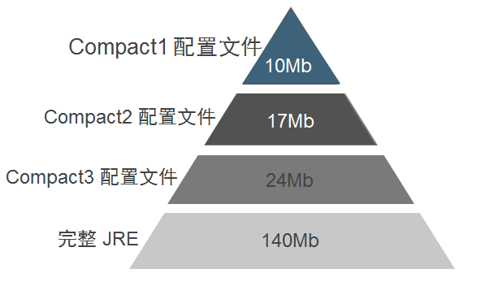

# 八、精简的 JRE 详解

> 来源：[Java 8 新特性探究（八）精简的 JRE 详解](http://my.oschina.net/benhaile/blog/211804)

Oracle 公司如期发布了 Java 8 正式版！没有让广大 javaer 失望。对于一个人来说，18 岁是人生的转折点，从稚嫩走向成熟，法律意味着你是完全民事行为能力人，不再收益于未成年人保护法，到今年为止，java 也走过了 18 年，java8 是一个新的里程碑，带来了前所未有的诸多特性，lambda 表达式，Stream API，新的 Date time api，多核并发支持，重大安全问题改进等，相信 java 会越来越好，丰富的类库以及庞大的开源生态环境是其他语言所不具备的，说起丰富的类库，很多同学就吐槽了，java 该减肥了，确实是该减肥，java8 有个很好的特性，即 JEP161([`openjdk.java.net/jeps/161`](http://openjdk.java.net/jeps/161) ),该特性定义了 Java SE 平台规范的一些子集，使 java 应用程序不需要整个 JRE 平台即可部署和运行在小型设备上。开发人员可以基于目标硬件的可用资源选择一个合适的 JRE 运行环境。

### **好处**

1.  更小的 Java 环境需要更少的计算资源。
2.  一个较小的运行时环境可以更好的优化性能和启动时间。
3.  消除未使用的代码从安全的角度总是好的。
4.  这些打包的应用程序可以下载速度更快。

### **概念**

紧凑的 JRE 分 3 种，分别是 compact1、compact2、compact3，他们的关系是 compact1<compact2<compact3,他们包含的 API 如下图所示


### **使用 javac 根据 profile 编译应用程序**

javac –bootclasspath, or javac –profile

如果不符合 compact 的 api，则报错。

```java
$ javac -profile compact2 Test.java
Test.java:7: error: ThreadMXBean is not available in profile 'compact2'
 ThreadMXBean bean = ManagementFactory.getThreadMXBean();
 ^
Test.java:7: error: ManagementFactory is not available in profile 'compact2'
 ThreadMXBean bean = ManagementFactory.getThreadMXBean();
                     ^
2 errors 
```

### **使用工具开发的效果**


### **JPEDS 工具使用**

java8 新增一个工具，用来分析应用程序所依赖的 profile，有三个参数比较常用 -p，-v，-r

```java
import java.util.Set;
import java.util.HashSet;

public class Deps {
  public static void main(String[] args) {
    System.out.println(Math.random());
    Set<String> set = new HashSet<>();
  }
} 
```

```java
************** PROFILE ********************
jdeps -P Deps.class 
Deps.class -> /Library/Java/JavaVirtualMachines/jdk1.8.0.jdk/Contents/Home/jre/lib/rt.jar
   <unnamed> (Deps.class)
      -> java.io                                            compact1
      -> java.lang                                          compact1
      -> java.util                                          compact1

************** VERBOSE ********************
jdeps -v Deps.class 
Deps.class -> /Library/Java/JavaVirtualMachines/jdk1.8.0.jdk/Contents/Home/jre/lib/rt.jar
   Deps (Deps.class)
      -> java.io.PrintStream                                
      -> java.lang.Math                                     
      -> java.lang.Object                                   
      -> java.lang.String                                   
      -> java.lang.System                                   
      -> java.util.HashSet  

************** RECURSIVE ********************
jdeps -R Deps.class 
Deps.class -> /Library/Java/JavaVirtualMachines/jdk1.8.0.jdk/Contents/Home/jre/lib/rt.jar
   <unnamed> (Deps.class)
      -> java.io                                            
      -> java.lang                                          
      -> java.util                                          
/Library/Java/JavaVirtualMachines/jdk1.8.0.jdk/Contents/Home/jre/lib/jce.jar -> /Library/Java/JavaVirtualMachines/jdk1.8.0.jdk/Contents/Home/jre/lib/rt.jar
   javax.crypto (jce.jar)
      -> java.io                                            
      -> java.lang                                          
      -> java.lang.reflect                                  
      -> java.net                                           
      -> java.nio                                           
      -> java.security                                      
      -> java.security.cert                                 
      -> java.security.spec                                 
      -> java.util                                          
      -> java.util.concurrent                               
      -> java.util.jar                                      
      -> java.util.regex                                    
      -> java.util.zip                                      
      -> javax.security.auth                                
      -> sun.security.jca                                   JDK internal API (rt.jar)
      -> sun.security.util                                  JDK internal API (rt.jar)
      -> sun.security.validator                             JDK internal API (rt.jar)
   javax.crypto.interfaces (jce.jar)
      -> java.lang                                          
      -> java.math                                          
      -> java.security                                      
   javax.crypto.spec (jce.jar)
      -> java.lang                                          
      -> java.math                                          
      -> java.security.spec                                 
      -> java.util                                          
/Library/Java/JavaVirtualMachines/jdk1.8.0.jdk/Contents/Home/jre/lib/rt.jar -> /Library/Java/JavaVirtualMachines/jdk1.8.0.jdk/Contents/Home/jre/lib/jce.jar
   java.security (rt.jar)
      -> javax.crypto                                       JDK internal API (jce.jar)
   sun.security.util (rt.jar)
      -> javax.crypto                                       JDK internal API (jce.jar)
      -> javax.crypto.interfaces                            JDK internal API (jce.jar)
      -> javax.crypto.spec                                  JDK internal API (jce.jar) 
```

### **在 linux 上构建 profile**

```java
$ hg clone http://hg.openjdk.java.net/jdk8/jdk8/
$ cd jdk8
$ make images profiles : 
## Finished profiles (build time 00:00:27)
----- Build times -------
Start 2013-03-17 14:47:35
End 2013-03-17 14:58:26
00:00:25 corba
00:00:15 demos
00:01:50 hotspot
00:00:24 images
00:00:21 jaxp
00:00:31 jaxws
00:05:37 jdk
00:00:43 langtools
00:00:18 nashorn
00:00:27 profiles
00:10:51 TOTAL
-------------------------
Finished building Java(TM) for target 'images profiles'
$ cd images
$ ls -d *image
j2re-compact1-image j2re-compact2-image j2re-compact3-image j2re-image j2sdk-image 
```

### **编译后 compact 大致的占用空间**



### **总结**

如今，物联网正风行一时。我们看到大量不同的设备在市场上出现，每一种的更新速度都越来越快。java 需要一个占用资源少的 JRE 运行环境，紧凑的 JRE 特性的出现，希望能带来以后的物联网的发展，甚至还是会有大量的 java 应用程序出现在物联网上面。目前 oracle 也发布了针对 raspberry pi 的 JRE 了。

另外该特性也是为 java9 的模块化项目做准备，模块化特性是 javaer 所期待的特性。他是解决业务系统复杂度的一个利器，当然 OSGI 也是相当的出色。但 osgi 对于新学者来说未免太复杂了。