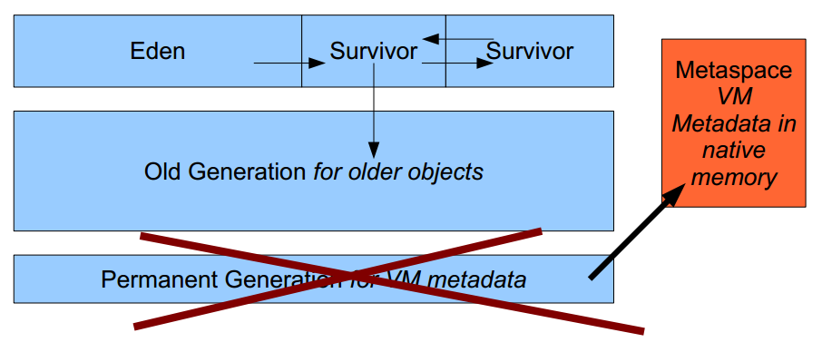
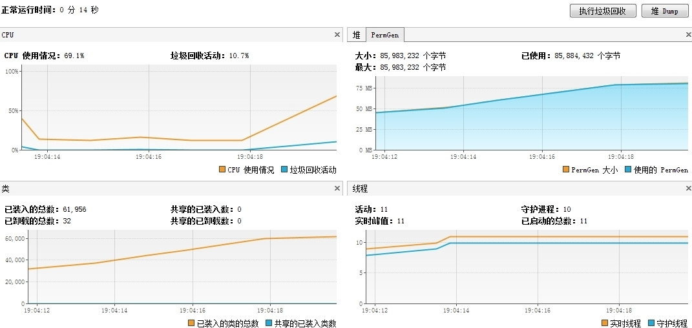

# 九、跟 OOM：Permgen 说再见吧

> 来源：[Java 8 新特性探究（九）跟 OOM：Permgen 说再见吧](http://my.oschina.net/benhaile/blog/214159)

很多开发者都在其系统中见过“java.lang.OutOfMemoryError: PermGen space”这一问题。这往往是由类加载器相关的内存泄漏以及新类加载器的创建导致的，通常出现于代码热部署时。相对于正式产品，该问题在开发机上出现的频率更高，在产品中最常见的“问题”是默认值太低了。常用的解决方法是将其设置为 256MB 或更高。

### **PermGen space 简单介绍**

PermGen space 的全称是 Permanent Generation space,是指内存的永久保存区域，说说为什么会内存益出：这一部分用于存放 Class 和 Meta 的信息,Class 在被 Load 的时候被放入 PermGen space 区域，它和和存放 Instance 的 Heap 区域不同,所以如果你的 APP 会 LOAD 很多 CLASS 的话,就很可能出现 PermGen space 错误。这种错误常见在 web 服务器对 JSP 进行 pre compile 的时候。

JVM 种类有很多，比如 Oralce-Sun Hotspot, Oralce JRockit, IBM J9, Taobao JVM（淘宝好样的！）等等。当然武林盟主是 Hotspot 了，这个毫无争议。需要注意的是，PermGen space 是 Oracle-Sun Hotspot 才有，JRockit 以及 J9 是没有这个区域。

### **元空间（MetaSpace）一种新的内存空间诞生**

JDK8 HotSpot JVM 将移除永久区，使用本地内存来存储类元数据信息并称之为：元空间（Metaspace）；这与 Oracle JRockit 和 IBM JVM’s 很相似，如下图所示



这意味着不会再有 java.lang.OutOfMemoryError: PermGen 问题，也不再需要你进行调优及监控内存空间的使用……但请等等，这么说还为时过早。在默认情况下，这些改变是透明的，接下来我们的展示将使你知道仍然要关注类元数据内存的占用。请一定要牢记，这个新特性也不能神奇地消除类和类加载器导致的内存泄漏。

java8 中 metaspace 总结如下：

**PermGen 空间的状况**

这部分内存空间将全部移除。

JVM 的参数：PermSize 和 MaxPermSize 会被忽略并给出警告（如果在启用时设置了这两个参数）。

**Metaspace 内存分配模型**

大部分类元数据都在本地内存中分配。

用于描述类元数据的“klasses”已经被移除。

**Metaspace 容量**

默认情况下，类元数据只受可用的本地内存限制（容量取决于是 32 位或是 64 位操作系统的可用虚拟内存大小）。

新参数（MaxMetaspaceSize）用于限制本地内存分配给类元数据的大小。如果没有指定这个参数，元空间会在运行时根据需要动态调整。

**Metaspace 垃圾回收**

对于僵死的类及类加载器的垃圾回收将在元数据使用达到“MaxMetaspaceSize”参数的设定值时进行。

适时地监控和调整元空间对于减小垃圾回收频率和减少延时是很有必要的。持续的元空间垃圾回收说明，可能存在类、类加载器导致的内存泄漏或是大小设置不合适。

**Java 堆内存的影响**

一些杂项数据已经移到 Java 堆空间中。升级到 JDK8 之后，会发现 Java 堆 空间有所增长。

**Metaspace 监控**

元空间的使用情况可以从 HotSpot1.8 的详细 GC 日志输出中得到。

Jstat 和 JVisualVM 两个工具，在使用 b75 版本进行测试时，已经更新了，但是还是能看到老的 PermGen 空间的出现。

前面已经从理论上充分说明，下面让我们通过“泄漏”程序进行新内存空间的观察……

### **PermGen vs. Metaspace 运行时比较**

为了更好地理解 Metaspace 内存空间的运行时行为，

将进行以下几种场景的测试：

1.  使用 JDK1.7 运行 Java 程序，监控并耗尽默认设定的 85MB 大小的 PermGen 内存空间。
2.  使用 JDK1.8 运行 Java 程序，监控新 Metaspace 内存空间的动态增长和垃圾回收过程。
3.  使用 JDK1.8 运行 Java 程序，模拟耗尽通过“MaxMetaspaceSize”参数设定的 128MB 大小的 Metaspace 内存空间。

首先建立了一个模拟 PermGen OOM 的代码

```java
public class ClassA {
 public void method(String name) {
  // do nothing
 }
} 
```

上面是一个简单的 ClassA，把他编译成 class 字节码放到 D：/classes 下面，测试代码中用 URLClassLoader 来加载此类型上面类编译成 class

```java
/**
 * 模拟 PermGen OOM
 * @author benhail
 */
public class OOMTest {
    public static void main(String[] args) {
        try {
            //准备 url
            URL url = new File("D:/classes").toURI().toURL();
            URL[] urls = {url};
            //获取有关类型加载的 JMX 接口
            ClassLoadingMXBean loadingBean = ManagementFactory.getClassLoadingMXBean();
            //用于缓存类加载器
            List<ClassLoader> classLoaders = new ArrayList<ClassLoader>();
            while (true) {
                //加载类型并缓存类加载器实例
                ClassLoader classLoader = new URLClassLoader(urls);
                classLoaders.add(classLoader);
                classLoader.loadClass("ClassA");
                //显示数量信息（共加载过的类型数目，当前还有效的类型数目，已经被卸载的类型数目）
                System.out.println("total: " + loadingBean.getTotalLoadedClassCount());
                System.out.println("active: " + loadingBean.getLoadedClassCount());
                System.out.println("unloaded: " + loadingBean.getUnloadedClassCount());
            }
        } catch (Exception e) {
            e.printStackTrace();
        }
    }
} 
```

虚拟机器参数设置如下：-verbose -verbose:gc

设置-verbose 参数是为了获取类型加载和卸载的信息

设置-verbose:gc 是为了获取垃圾收集的相关信息

**JDK 1.7 @64-bit – PermGen 耗尽测试**

Java1.7 的 PermGen 默认空间为 85 MB（或者可以通过-XX:MaxPermSize=XXXm 指定）



可以从上面的 JVisualVM 的截图看出：当加载超过 6 万个类之后，PermGen 被耗尽。我们也能通过程序和 GC 的输出观察耗尽的过程。

程序输出(摘取了部分)

```java
......
[Loaded ClassA from file:/D:/classes/]
total: 64887
active: 64887
unloaded: 0
[GC 245041K->213978K(536768K), 0.0597188 secs]
[Full GC 213978K->211425K(644992K), 0.6456638 secs]
[GC 211425K->211425K(656448K), 0.0086696 secs]
[Full GC 211425K->211411K(731008K), 0.6924754 secs]
[GC 211411K->211411K(726528K), 0.0088992 secs]
...............
java.lang.OutOfMemoryError: PermGen space 
```

**JDK 1.8 @64-bit – Metaspace 大小动态调整测试**

Java 的 Metaspace 空间：不受限制 （默认）


从上面的截图可以看到，JVM Metaspace 进行了动态扩展，本地内存的使用由 20MB 增长到 646MB，以满足程序中不断增长的类数据内存占用需求。我们也能观察到 JVM 的垃圾回收事件—试图销毁僵死的类或类加载器对象。但是，由于我们程序的泄漏，JVM 别无选择只能动态扩展 Metaspace 内存空间。程序加载超过 10 万个类，而没有出现 OOM 事件。

**JDK 1.8 @64-bit – Metaspace 受限测试**

Java 的 Metaspace 空间：128MB（-XX:MaxMetaspaceSize=128m）


可以从上面的 JVisualVM 的截图看出：当加载超过 2 万个类之后，Metaspace 被耗尽；与 JDK1.7 运行时非常相似。我们也能通过程序和 GC 的输出观察耗尽的过程。另一个有趣的现象是，保留的原生内存占用量是设定的最大大小两倍之多。这可能表明，如果可能的话，可微调元空间容量大小策略，来避免本地内存的浪费。

从 Java 程序的输出中看到如下异常。

```java
[Loaded ClassA from file:/D:/classes/]
total: 21393
active: 21393
unloaded: 0
[GC (Metadata GC Threshold) 64306K->57010K(111616K), 0.0145502 secs]
[Full GC (Metadata GC Threshold) 57010K->56810K(122368K), 0.1068084 secs]
java.lang.OutOfMemoryError: Metaspace 
```

在设置了 MaxMetaspaceSize 的情况下，该空间的内存仍然会耗尽，进而引发“java.lang.OutOfMemoryError: Metadata space”错误。因为类加载器的泄漏仍然存在，而通常 Java 又不希望无限制地消耗本机内存，因此设置一个类似于 MaxPermSize 的限制看起来也是合理的。

# 总结

1.  之前不管是不是需要，JVM 都会吃掉那块空间……如果设置得太小，JVM 会死掉；如果设置得太大，这块内存就被 JVM 浪费了。理论上说，现在你完全可以不关注这个，因为 JVM 会在运行时自动调校为“合适的大小”；
2.  提高 Full GC 的性能，在 Full GC 期间，Metadata 到 Metadata pointers 之间不需要扫描了，别小看这几纳秒时间；
3.  隐患就是如果程序存在内存泄露，像 OOMTest 那样，不停的扩展 metaspace 的空间，会导致机器的内存不足，所以还是要有必要的调试和监控。