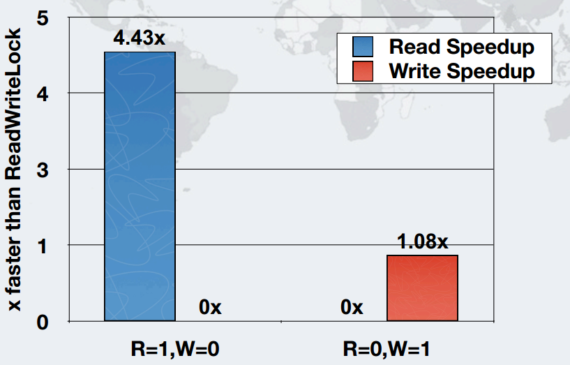

# 十、StampedLock 将是解决同步问题的新宠

> 来源：[Java 8 新特性探究（十）StampedLock 将是解决同步问题的新宠](http://my.oschina.net/benhaile/blog/264383)

Java8 就像一个宝藏，一个小的 API 改进，也足与写一篇文章，比如同步，一直是多线程并发编程的一个老话题，相信没有人喜欢同步的代码，这会降低应用的吞吐量等性能指标，最坏的时候会挂起死机，但是即使这样你也没得选择，因为要保证信息的正确性。所以本文决定将从 synchronized、Lock 到 Java8 新增的 StampedLock 进行对比分析，相信 StampedLock 不会让大家失望。

### **synchronized**

在 java5 之前，实现同步主要是使用 synchronized。它是 Java 语言的关键字，当它用来修饰一个方法或者一个代码块的时候，能够保证在同一时刻最多只有一个线程执行该段代码。

有四种不同的同步块：

1.  实例方法
2.  静态方法
3.  实例方法中的同步块
4.  静态方法中的同步块

大家对此应该不陌生，所以不多讲了，以下是代码示例

```java
synchronized(this)
// do operation
} 
```

小结：在多线程并发编程中 Synchronized 一直是元老级角色，很多人都会称呼它为重量级锁，但是随着 Java SE1.6 对 Synchronized 进行了各种优化之后，性能上也有所提升。

### **Lock**

```java
rwlock.writeLock().lock();
try {
// do operation
} finally {
rwlock.writeLock().unlock();
} 
```

它是 Java 5 在 java.util.concurrent.locks 新增的一个 API。

Lock 是一个接口，核心方法是 lock()，unlock()，tryLock()，实现类有 ReentrantLock, ReentrantReadWriteLock.ReadLock, ReentrantReadWriteLock.WriteLock；

ReentrantReadWriteLock, ReentrantLock 和 synchronized 锁都有相同的内存语义。

与 synchronized 不同的是，Lock 完全用 Java 写成，在 java 这个层面是无关 JVM 实现的。Lock 提供更灵活的锁机制，很多 synchronized 没有提供的许多特性，比如锁投票，定时锁等候和中断锁等候，但因为 lock 是通过代码实现的，要保证锁定一定会被释放，就必须将 unLock()放到 finally{}中

下面是 Lock 的一个代码示例

```java
class Point {
   private double x, y;
   private final StampedLock sl = new StampedLock();
   void move(double deltaX, double deltaY) { // an exclusively locked method
     long stamp = sl.writeLock();
     try {
       x += deltaX;
       y += deltaY;
     } finally {
       sl.unlockWrite(stamp);
     }
   }
  //下面看看乐观读锁案例
   double distanceFromOrigin() { // A read-only method
     long stamp = sl.tryOptimisticRead(); //获得一个乐观读锁
     double currentX = x, currentY = y; //将两个字段读入本地局部变量
     if (!sl.validate(stamp)) { //检查发出乐观读锁后同时是否有其他写锁发生？
        stamp = sl.readLock(); //如果没有，我们再次获得一个读悲观锁
        try {
          currentX = x; // 将两个字段读入本地局部变量
          currentY = y; // 将两个字段读入本地局部变量
        } finally {
           sl.unlockRead(stamp);
        }
     }
     return Math.sqrt(currentX * currentX + currentY * currentY);
   }
//下面是悲观读锁案例
   void moveIfAtOrigin(double newX, double newY) { // upgrade
     // Could instead start with optimistic, not read mode
     long stamp = sl.readLock();
     try {
       while (x == 0.0 && y == 0.0) { //循环，检查当前状态是否符合
         long ws = sl.tryConvertToWriteLock(stamp); //将读锁转为写锁
         if (ws != 0L) { //这是确认转为写锁是否成功
           stamp = ws; //如果成功 替换票据
           x = newX; //进行状态改变
           y = newY; //进行状态改变
           break;
         }
         else { //如果不能成功转换为写锁
           sl.unlockRead(stamp); //我们显式释放读锁
           stamp = sl.writeLock(); //显式直接进行写锁 然后再通过循环再试
         }
       }
     } finally {
       sl.unlock(stamp); //释放读锁或写锁
     }
   }
 } 
```

小结：比 synchronized 更灵活、更具可伸缩性的锁定机制，但不管怎么说还是 synchronized 代码要更容易书写些

### **StampedLock**

它是 java8 在 java.util.concurrent.locks 新增的一个 API。

ReentrantReadWriteLock 在沒有任何读写锁时，才可以取得写入锁，这可用于实现了悲观读取（Pessimistic Reading），即如果执行中进行读取时，经常可能有另一执行要写入的需求，为了保持同步，ReentrantReadWriteLock 的读取锁定就可派上用场。

然而，如果读取执行情况很多，写入很少的情况下，使用 ReentrantReadWriteLock 可能会使写入线程遭遇饥饿（Starvation）问题，也就是写入线程吃吃无法竞争到锁定而一直处于等待状态。

StampedLock 控制锁有三种模式（写，读，乐观读），一个 StampedLock 状态是由版本和模式两个部分组成，锁获取方法返回一个数字作为票据 stamp，它用相应的锁状态表示并控制访问，数字 0 表示没有写锁被授权访问。在读锁上分为悲观锁和乐观锁。

所谓的乐观读模式，也就是若读的操作很多，写的操作很少的情况下，你可以乐观地认为，写入与读取同时发生几率很少，因此不悲观地使用完全的读取锁定，程序可以查看读取资料之后，是否遭到写入执行的变更，再采取后续的措施（重新读取变更信息，或者抛出异常） ，这一个小小改进，可大幅度提高程序的吞吐量！！

下面是 java doc 提供的 StampedLock 一个例子

```java
class Point {
   private double x, y;
   private final StampedLock sl = new StampedLock();
   void move(double deltaX, double deltaY) { // an exclusively locked method
     long stamp = sl.writeLock();
     try {
       x += deltaX;
       y += deltaY;
     } finally {
       sl.unlockWrite(stamp);
     }
   }
  //下面看看乐观读锁案例
   double distanceFromOrigin() { // A read-only method
     long stamp = sl.tryOptimisticRead(); //获得一个乐观读锁
     double currentX = x, currentY = y; //将两个字段读入本地局部变量
     if (!sl.validate(stamp)) { //检查发出乐观读锁后同时是否有其他写锁发生？
        stamp = sl.readLock(); //如果没有，我们再次获得一个读悲观锁
        try {
          currentX = x; // 将两个字段读入本地局部变量
          currentY = y; // 将两个字段读入本地局部变量
        } finally {
           sl.unlockRead(stamp);
        }
     }
     return Math.sqrt(currentX * currentX + currentY * currentY);
   }
//下面是悲观读锁案例
   void moveIfAtOrigin(double newX, double newY) { // upgrade
     // Could instead start with optimistic, not read mode
     long stamp = sl.readLock();
     try {
       while (x == 0.0 && y == 0.0) { //循环，检查当前状态是否符合
         long ws = sl.tryConvertToWriteLock(stamp); //将读锁转为写锁
         if (ws != 0L) { //这是确认转为写锁是否成功
           stamp = ws; //如果成功 替换票据
           x = newX; //进行状态改变
           y = newY; //进行状态改变
           break;
         }
         else { //如果不能成功转换为写锁
           sl.unlockRead(stamp); //我们显式释放读锁
           stamp = sl.writeLock(); //显式直接进行写锁 然后再通过循环再试
         }
       }
     } finally {
       sl.unlock(stamp); //释放读锁或写锁
     }
   }
 } 
```

小结：

StampedLock 要比 ReentrantReadWriteLock 更加廉价，也就是消耗比较小。

### **StampedLock 与 ReadWriteLock 性能对比**

下图是和 ReadWritLock 相比，在一个线程情况下，是读速度其 4 倍左右，写是 1 倍。



下图是六个线程情况下，读性能是其几十倍，写性能也是近 10 倍左右：


下图是吞吐量提高：


### **总结**

1.  synchronized 是在 JVM 层面上实现的，不但可以通过一些监控工具监控 synchronized 的锁定，而且在代码执行时出现异常，JVM 会自动释放锁定；
2.  ReentrantLock、ReentrantReadWriteLock,、StampedLock 都是对象层面的锁定，要保证锁定一定会被释放，就必须将 unLock()放到 finally{}中；
3.  StampedLock 对吞吐量有巨大的改进，特别是在读线程越来越多的场景下；
4.  StampedLock 有一个复杂的 API，对于加锁操作，很容易误用其他方法;
5.  当只有少量竞争者的时候，synchronized 是一个很好的通用的锁实现;
6.  当线程增长能够预估，ReentrantLock 是一个很好的通用的锁实现;

StampedLock 可以说是 Lock 的一个很好的补充，吞吐量以及性能上的提升足以打动很多人了，但并不是说要替代之前 Lock 的东西，毕竟他还是有些应用场景的，起码 API 比 StampedLock 容易入手，下篇博文争取更新快一点，可能会是 Nashorn 的内容，这里允许我先卖个关子。。。