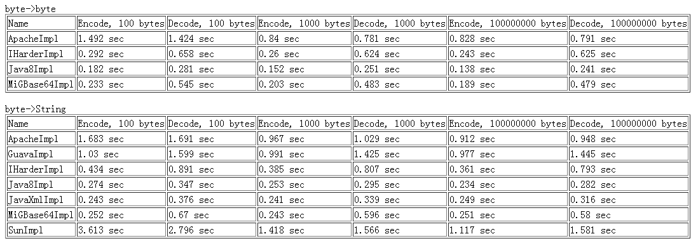

# 十一：Base64 详解

> 来源：[Java 8 新特性探究（十一）Base64 详解](http://my.oschina.net/benhaile/blog/267738)

BASE64 编码是一种常用的字符编码，在很多地方都会用到。但 base64 不是安全领域下的加密解密算法。能起到安全作用的效果很差，而且很容易破解，他核心作用应该是传输数据的正确性，有些网关或系统只能使用 ASCII 字符。Base64 就是用来将非 ASCII 字符的数据转换成 ASCII 字符的一种方法，而且 base64 特别适合在 http，mime 协议下快速传输数据。

### **JDK 里面实现 Base64 的 API**

在 JDK1.6 之前，JDK 核心类一直没有 Base64 的实现类，有人建议用 Sun/Oracle JDK 里面的 sun.misc.BASE64Encoder 和 sun.misc.BASE64Decoder，使用它们的优点就是不需要依赖第三方类库，缺点就是可能在未来版本会被删除（用 maven 编译会发出警告），而且性能不佳，后面会有性能测试。

JDK1.6 中添加了另一个 Base64 的实现，javax.xml.bind.DatatypeConverter 两个静态方法 parseBase64Binary 和 printBase64Binary，隐藏在 javax.xml.bind 包下面，不被很多开发者知道。

在 Java 8 在 java.util 包下面实现了 BASE64 编解码 API，而且性能不俗，API 也简单易懂，下面展示下这个类的使用例子。

**java.util.Base64**

该类提供了一套静态方法获取下面三种 BASE64 编解码器：

1）Basic 编码：是标准的 BASE64 编码，用于处理常规的需求

```java
// 编码
String asB64 = Base64.getEncoder().encodeToString("some string".getBytes("utf-8"));
System.out.println(asB64); // 输出为: c29tZSBzdHJpbmc=
// 解码
byte[] asBytes = Base64.getDecoder().decode("c29tZSBzdHJpbmc=");
System.out.println(new String(asBytes, "utf-8")); // 输出为: some string 
```

2）URL 编码：使用下划线替换 URL 里面的反斜线“/”

```java
String urlEncoded = Base64.getUrlEncoder().encodeToString("subjects?abcd".getBytes("utf-8"));
System.out.println("Using URL Alphabet: " + urlEncoded);
// 输出为:
Using URL Alphabet: c3ViamVjdHM_YWJjZA== 
```

3）MIME 编码：使用基本的字母数字产生 BASE64 输出，而且对 MIME 格式友好：每一行输出不超过 76 个字符，而且每行以“\r\n”符结束。

```java
StringBuilder sb = new StringBuilder();
for (int t = 0; t < 10; ++t) {
  sb.append(UUID.randomUUID().toString());
}
byte[] toEncode = sb.toString().getBytes("utf-8");
String mimeEncoded = Base64.getMimeEncoder().encodeToString(toEncode);
System.out.println(mimeEncoded); 
```

### **第三方实现 Base64 的 API**

首先便是常用的 Apache Commons Codec library 里面的 org.apache.commons.codec.binary.Base64；

第二个便是 Google Guava 库里面的 com.google.common.io.BaseEncoding.base64() 这个静态方法；

第三个是 net.iharder.Base64，这个 jar 包就一个类；

最后一个，号称 Base64 编码速度最快的 MigBase64，而且是 10 年前的实现，到现在是否能保持这个称号，测一测便知道；

### **Base64 编码性能测试**

上面讲了一共 7 种实现 Base64 编码，Jdk 里面 3 种，第三方实现 4 种，一旦有选择，则有必要将他们进行一次高低对比，性能测试是最直接的方式

首先来定义两个接口

```java
private static interface Base64Codec
    {
        public String encode(final byte[] data);
        public byte[] decode(final String base64) throws IOException;
    }
    private static interface Base64ByteCodec
    {
        public byte[] encodeBytes(final byte[] data);
        public byte[] decodeBytes(final byte[] base64) throws IOException;
    } 
```

两个接口区别就是其中一个接口方法参数接收 byte 数组，返回 byte 数组，因为 byte->byte 相比 String->byte 或者 byte->String 性能上会快一点，所以区分两组来测试

```java
private static final Base64Codec[] m_codecs = { new GuavaImpl(), new JavaXmlImpl(),
        new Java8Impl(), new SunImpl(), new ApacheImpl(),new MiGBase64Impl(),new IHarderImpl() };
private static final Base64ByteCodec[] m_byteCodecs = {
        new ApacheImpl(), new Java8Impl(),new MiGBase64Impl(),new IHarderImpl() }; 
```

从上面看出，其中支持 byte->byte 只有 4 中 API；

7 个 Base64 的实现类

```java
private static class Java8Impl implements Base64Codec, Base64ByteCodec
    {
        private final Base64.Decoder m_decoder = Base64.getDecoder();
        private final Base64.Encoder m_encoder = Base64.getEncoder();
        @Override
        public String encode(byte[] data) {
            return m_encoder.encodeToString(data);
        }
        @Override
        public byte[] decode(String base64) throws IOException {
            return m_decoder.decode(base64);
        }
        public byte[] encodeBytes(byte[] data) {
            return m_encoder.encode( data );
        }
        public byte[] decodeBytes(byte[] base64) throws IOException {
            return m_decoder.decode( base64 );
        }
    }
    private static class JavaXmlImpl implements Base64Codec //no byte[] implementation
    {
        public String encode(byte[] data) {
            return DatatypeConverter.printBase64Binary( data );
        }
        public byte[] decode(String base64) throws IOException {
            return DatatypeConverter.parseBase64Binary( base64 );
        }
    }
.............. 
```

后面代码基本就是各种 API 实现 Base64 的代码了，就不详细列出。

主要测试手段是，生成 100M 的随机数，分成 100byte 或者 1000byte 的块，然后将他们分别编码和解码，记录时间，如下方法

```java
private static TestResult testByteCodec( final Base64ByteCodec codec, final List<byte[]> buffers ) throws IOException {
        final List<byte[]> encoded = new ArrayList<byte[]>( buffers.size() );
        final long start = System.currentTimeMillis();
        for ( final byte[] buf : buffers )
            encoded.add( codec.encodeBytes(buf) );
        final long encodeTime = System.currentTimeMillis() - start;
        final List<byte[]> result = new ArrayList<byte[]>( buffers.size() );
        final long start2 = System.currentTimeMillis();
        for ( final byte[] ar : encoded )
            result.add( codec.decodeBytes(ar) );
        final long decodeTime = System.currentTimeMillis() - start2;
        for ( int i = 0; i < buffers.size(); ++i )
        {
            if ( !Arrays.equals( buffers.get( i ), result.get( i ) ) )
                System.out.println( "Diff at pos = " + i );
        }
        return new TestResult( encodeTime / 1000.0, decodeTime / 1000.0 );
    } 
```

**测试结果**

jvm 参数：-Xms512m -Xmx4G



一切都很明显了，从上面看出，sun 的表现不是很好，IHarder 和 MigBase64 性能可以接受，传说 MigBase64 性能第一，那也是过去了，在这次测试结果中，新的 java8 base64 运行速度最好，javaXml 表现次之。

### **总结**

如果你需要一个性能好，可靠的 Base64 编解码器，不要找 JDK 外面的了，java8 里面的 java.util.Base64 以及 java6 中隐藏很深的 javax.xml.bind.DatatypeConverter,他们两个都是不错的选择。

本篇中所有代码都在[`git.oschina.net/benhail/javase8-sample`](http://git.oschina.net/benhail/javase8-sample%E4%B8%8B%E8%BD%BD) ，欢迎大家去关注下载