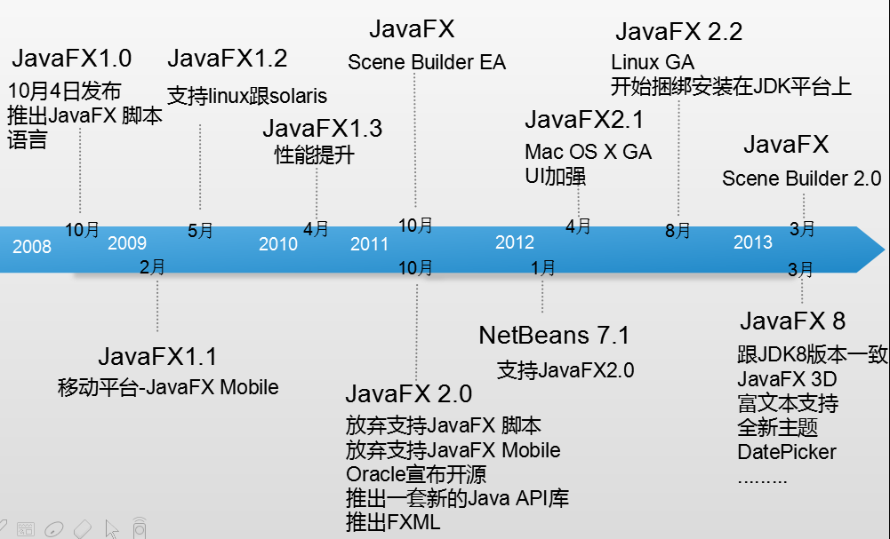
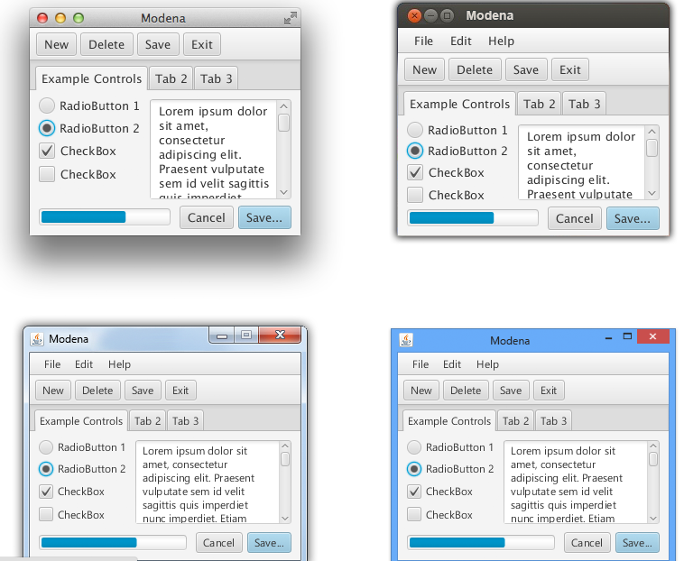
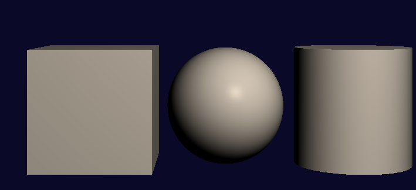
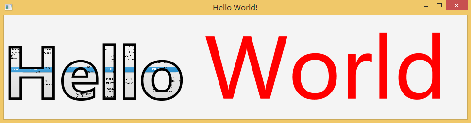
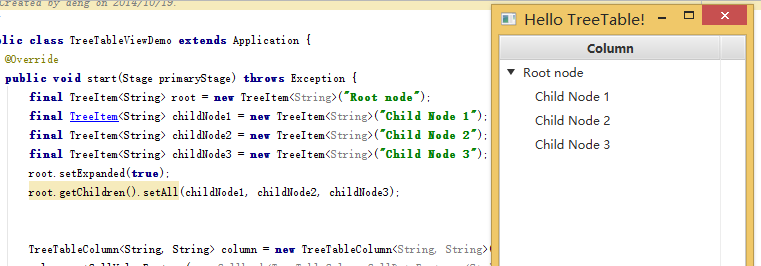
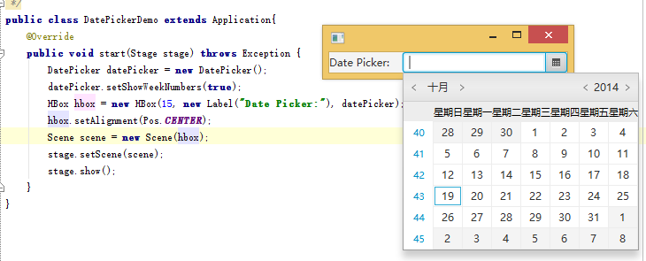
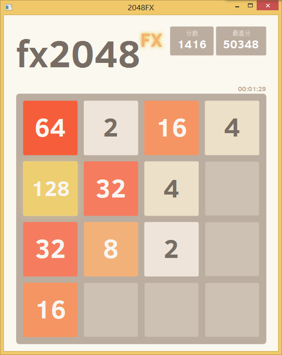

# 十三：JavaFX8 新特性以及开发 2048 游戏

> 来源：[Java 8 新特性探究（十三）JavaFX 8 新特性以及开发 2048 游戏](http://my.oschina.net/benhaile/blog/335109)

JavaFX 主要致力于富客户端开发，以弥补 swing 的缺陷，主要提供图形库与 media 库，支持 audio,video,graphics,animation,3D 等，同时采用现代化的 css 方式支持界面设计。同时又采用 XUI 方式以 XML 方式设计 UI 界面，达到显示与逻辑的分离。与 android 这方面确实有点相似性。

### **JavaFX 历史**

跟 java 在服务器端和 web 端成绩相比，桌面一直是 java 的软肋，于是 Sun 公司在 2008 年推出 JavaFX，弥补桌面软件的缺陷，请看下图 JavaFX 一路走过来的改进

从上图看出，一开始推出时候，开发者需使用一种名为 JavaFX Script 的静态的、声明式的编程语言来开发 JavaFX 应用程序。因为 JavaFX Script 将会被编译为 Java bytecode，程序员可以使用 Java 代码代替。

JavaFX 2.0 之后的版本摒弃了 JavaFX Script 语言，而作为一个 Java API 来使用。因此使用 JavaFX 平台实现的应用程序将直接通过标准 Java 代码来实现。

JavaFX 2.0 包含非常丰富的 UI 控件、图形和多媒体特性用于简化可视化应用的开发，WebView 可直接在应用中嵌入网页；另外 2.0 版本允许使用 FXML 进行 UI 定义，这是一个脚本化基于 XML 的标识语言。

从 JDK 7u6 开始，JavaFx 就与 JDK 捆绑在一起了，JavaFX 团队称，下一个版本将是 8.0，目前所有的工作都已经围绕 8.0 库进行。这是因为 JavaFX 将捆绑在 Java 8 中，因此该团队决定跳过几个版本号，迎头赶上 Java 8。

### **JavaFx8 的新特性**

**全新现代主题：Modena**

新的 Modena 主题来替换原来的 Caspian 主题。不过在 Application 的 start()方法中，可以通过 setUserAgentStylesheet(STYLESHEET_CASPIAN)来继续使用 Caspian 主题。

参考[`fxexperience.com/2013/03/modena-theme-update/`](http://fxexperience.com/2013/03/modena-theme-update/)

**JavaFX 3D**

在 JavaFX8 中提供了 3D 图像处理 API，包括 Shape3D (Box, Cylinder, MeshView, Sphere 子类),SubScene, Material, PickResult, LightBase (AmbientLight 和 PointLight 子类),SceneAntialiasing 等。Camera 类也得到了更新。从 JavaDoc 中可以找到更多信息。

**富文本**

强化了富文本的支持

**TreeTableView**

**日期控件 DatePicker**

增加日期控件

**用于 CSS 结构的公共 API**

1.  CSS 样式设置是 JavaFX 的一项主要特性
2.  CSS 已专门在私有 API 中实现（com.sun.javafx.css 软件包）
3.  多种工具（例如 Scene Builder）需要 CSS 公共 API
4.  开发人员将能够定义自定义 CSS 样式

**WebView 增强功能**

1.  Nashorn JavaScript 引擎 [`blogs.oracle.com/nashorn/entry/open_for_business`](https://blogs.oracle.com/nashorn/entry/open_for_business)
2.  WebSocket [`javafx-jira.kenai.com/browse/RT-14947`](http://javafx-jira.kenai.com/browse/RT-14947)
3.  Web Workers [`javafx-jira.kenai.com/browse/RT-9782`](http://javafx-jira.kenai.com/browse/RT-9782)

### **JavaFX Scene Builder 2.0**

可视化工具，加速 JavaFX 图形界面的开发，[下载地址](http://download.oracle.com/otn-pub/java/javafx_scenebuilder/2.0-b20/javafx_scenebuilder-2_0-windows.msi?AuthParam=1413689191_b1300b23d317876b7e71f9449351c348)

JavaFX Scene Builder 如同 NetBeans 一般，通过拖拽的方式配置界面，待完成界面之後，保存为 FXML 格式文件，此文件以 XML 描述物件配置，再交由 JavaFX 程式处理，因此可減少直接以 JavaFX 编写界面的困難度。

JavaFX Scene Builder 2.0 新增 JavaFX Theme 预览功能，菜单「Preview」→「JavaFX Theme」选择不同的主題，包括：

*   Modena (FX8).
*   Modena Touch (FX8).
*   Modena High Contrast – Black on White (FX8).
*   Modena High Contrast – White on Black (FX8).
*   Modena High Contrast – Yellow on Black (FX8).
*   Caspian (FX2).
*   Caspian Embedded (FX2).
*   Caspian Embedded QVGA (FX2).

### **JavaFX 8 开发 2048 游戏**

2048 虽然不像前段时间那么火了，但个人还是非常喜欢玩 2048，空闲时间都忍不住来一发，感谢 Gabriele Cirulli 发明了这了不起 (并且会上瘾)的 2048 游戏，因为是用 MIT 协议开源出来，各种语言版本的 2048 游戏横空出世，下图是用 JavaFX 8 来开发的一款 2048。

**所用到的技术**

*   Lambda expressions
*   Stream API
*   JavaFX 8
*   JavaFX CSS basics
*   JavaFX animations**fx2048 相关类的说明**
*   Game2048,游戏主类
*   GameManager,包含游戏界面布局（Board）以及 Grid 的操作（GridOperator）
*   Board,包含 labels ，分数，grid ，Tile
*   Tile,游戏中的数字块
*   GridOperator,Grid 操作类
*   Location,Direction 位置帮助类
*   RecordManager，SessionManager，纪录游戏分数，会话类

这里是[源码地址](http://git.oschina.net/benhail/javase8-sample/tree/master/src/main/java/javase8sample/chapter13/javafx8/fx2048)，大家感兴趣的可以去学习下

### **总结**

以上的相关源码都托管在 [这里](http://git.oschina.net/benhail/javase8-sample/)。

比起 AWT 和 SWING，JavaFX 的优势很明显，各大主流 IDE 已经支持 JavaFX 的开发了，最佳的工具莫过于 NetBeans，且随着 lambda 带来的好处，JavaFX 的事件处理简洁了不少，以前需要写匿名函数类。另外 JavaFX 开源以来，JavaFX 的生态环境也越来越活跃了，包括各种教程，嵌入式尝试，还有一些开源项目，比如：ControlsFX，JRebirth，DataFX Flow，mvvmFX，TestFX 等等。还有 JavaFX 是可以运行在[Android](http://www.infoq.com/cn/articles/Building-JavaFX-Android-Apps?utm_campaign=infoq_content&utm_source=infoq&utm_medium=feed&utm_term=Java)和 ios 上面，这个很赞！

好了，总结到这里也差不多了，在 RIA 平台上面，有 HTML5、Flex 和微软的 Sliverlight，JavaFX 能否表现优秀，在于大家的各位，只要我们多用 JavaFX，那么 JavaFX 也会越来越优秀，任何语言都是这样, THE END .