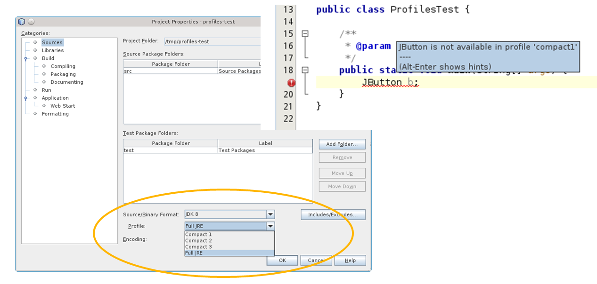
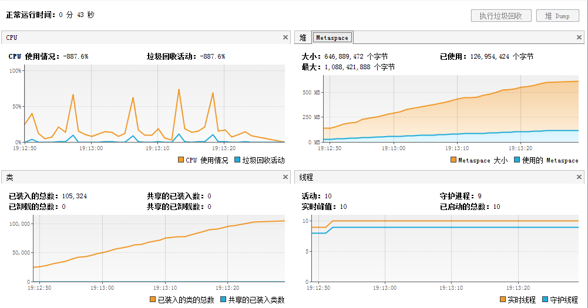

# Java 8 教程汇总

# Java 8 Lambda 序列化？

# Java8：Lambda 序列化？

最近我一直在考虑为 Tyrus 项目做一个优化处理，允许用户跨越集群向连接到一个 URL 的一部分客户端进行广播。 有很多方法可以达成目标。但自从使用了 JDK 8 后，这个问题简已经变成了我的眼中钉。

为了达到这个目的，我创建了一个简单的单元测试。通过过滤器将它序列化到磁盘上、读取然后执行。我们可以直接或间接地引用它的一个实例字段 “VALUE”，以此来查出究竟是什么导致了序列化失败。

```java
import java.io.File;
import java.io.FileInputStream;
import java.io.FileOutputStream;
import java.io.IOException;
import java.io.NotSerializableException;
import java.io.ObjectInput;
import java.io.ObjectInputStream;
import java.io.ObjectOutput;
import java.io.ObjectOutputStream;
import java.io.Serializable;

import java.util.function.Predicate;

import org.junit.Test;

public class SerializablePredicateFilterTest {

  public String VALUE = "Bob";

  public interface SerializablePredicate<T> extends Predicate<T>, Serializable {}

  public <T> void filter(SerializablePredicate<T> sp, T value) throws IOException, ClassNotFoundException {
    sp.getClass().isLocalClass();
    File tempFile = File.createTempFile("labmda", "set");

    try (ObjectOutput oo = new ObjectOutputStream(new FileOutputStream(tempFile))) {
      oo.writeObject(sp);
    }

    try (ObjectInput oi = new ObjectInputStream(new FileInputStream(tempFile))) {
      SerializablePredicate<T> p = (SerializablePredicate<T>) oi.readObject();

      System.out.println(p.test(value));
    }
  }
} 
```

既然只是为了校对，我们可以让匿名内部类测试失败，因为它总是包含了一个宿主类的对象的引用……

```java
@Test(expected = NotSerializableException.class)
public void testAnonymousDirect() throwsIOException, ClassNotFoundException { 

    String value = VALUE;  

    filter(newSerializablePredicate<String>() { 

         @Override
         public boolean test(String t) { 
               return value.length() > t.length()； 
         }
    }, "Bob"); 

} 
```

对于本地类来说同样如此， 本地类有什么不可以使用呢?

```java
@Test(expected = NotSerializableException.class)
public void testLocalClass() throws IOException, ClassNotFoundException {

  class LocalPredicate implements SerializablePredicate<String> {
    @Override
    public boolean test(String t) {
      // TODO Implement this method
      return false;
    }
  }

  filter(new LocalPredicate(), "Bobby");

} 
```

一个独立的类当然可以工作，在这个示例中为了方便起见使用了一个嵌套类。

```java
public static class LengthPredicate implements SerializablePredicate<String> {

  private String value;

  public LengthPredicate(String value) {
    super();
    this.value = value;
  }

  public void setValue(String value) {
    this.value = value;
  }

  public String getValue() {
    return value;
  }

  @Override
  public boolean test(String t) {
    // TODO Implement this method
    return false;
  }
}

@Test
public void testStaticInnerClass() throws IOException, ClassNotFoundException {

  filter(new LengthPredicate(VALUE), "Bobby");

} 
```

我们还是使用 JDK 8，结果证明我的第一个 try 也失败了。但它证明了，通常情况下序列化是非常乐意接受一个 Lambda 表达式的。

```java
@Test(expected = NotSerializableException.class)
public void testLambdaDirect() throws IOException, ClassNotFoundException {

  filter((String s) -> VALUE.length() > s.length(), "Bobby");

} 
```

稍微做下改动，拷贝值到一个有效的 final 属性中。瞧，lambda 现在被正确地序列化并且恢复了。

```java
@Test
public void testLambdaInDirect() throws IOException, ClassNotFoundException {

  String value = VALUE;

  filter((String s) -> value.length() > s.length(), "Bobby");

} 
```

当然，如果 value 是一个简单方法的参数，也可以工作正常。

```java
@Test
public void testLambdaParameter() throws IOException, ClassNotFoundException {

  invokeWithParameter(VALUE);

}

private void invokeWithParameter(String value) throws java.lang.ClassNotFoundException, java.io.IOException {
  filter((String s) -> value.length() > s.length(), "Bobby");
} 
```

因此答案是肯定的，只要你小心一点就可以对 lambda 进行序列化。

原文链接： [dzone](http://java.dzone.com/articles/lambda-will-it-serialize)

翻译： [ImportNew.com](http://www.importnew.com) - [黄飞飞](http://www.importnew.com/author/huangfeifei)

译文链接： [`www.importnew.com/8554.html`](http://www.importnew.com/8554.html)

**转载请保留原文出处、译者和译文链接。**

# Java 8 lambda 最佳实践

原文出处： [oschina-成熟的毛毛虫](http://my.oschina.net/benhaile/blog/408377)

Java 8 已经推出一段时间了，越来越多开发人员选择升级 JDK，这条[热门动弹](http://my.oschina.net/u/1591837/tweet/5288037?p=1)里面看出，JDK7 最多，其次是 6 和 8，这是好事！

在 8 里面 Lambda 是最火的主题，不仅仅是因为语法的改变，更重要的是带来了函数式编程的思想，我觉得优秀的程序员，有必要学习一下函数式编程的思想以开阔思路。所以这篇文章聊聊 Lambda 的应用场景，性能，也会提及下不好的一面。

## Java 为何需要 Lambda

1996 年 1 月，Java 1.0 发布了，此后计算机编程领域发生了翻天覆地的变化。商业发展需要更复杂的应用，大多数程序都跑在更强大的装备多核 CPU 的机器上。带有高效运行期编译器的 Java 虚拟机（JVM）的出现，使得程序员将精力更多放在编写干净、易于维护的代码上，而不是思考如何将每一个 CPU 时钟、每一字节内存物尽其用。

多核 CPU 的出现成了“房间里的大象”，无法忽视却没人愿意正视。算法中引入锁不但容易出错，而且消耗时间。人们开发了 java.util.concurrent 包和很多第三方类库，试图将并发抽象化，用以帮助程序员写出在多核 CPU 上运行良好的程序。不幸的是，到目前为止，我们走得还不够远。

那些类库的开发者使用 Java 时，发现抽象的级别还不够。处理大数据就是个很好的例子，面对大数据，Java 还欠缺高效的并行操作。Java 8 允许开发者编写复杂的集合处理算法，只需要简单修改一个方法，就能让代码在多核 CPU 上高效运行。为了编写并行处理这些大数据的类库，需要在语言层面上修改现有的 Java：增加 lambda 表达式。

当然，这样做是有代价的，程序员必须学习如何编写和阅读包含 lambda 表达式的代码，但是，这不是一桩赔本的买卖。与手写一大段复杂的、线程安全的代码相比，学习一点新语法和一些新习惯容易很多。开发企业级应用时，好的类库和框架极大地降低了开发时间和成本，也扫清了开发易用且高效的类库的障碍。

如果你还未接触过 Lambda 的语法，可以看[这里](http://my.oschina.net/benhaile/blog/175012)。

## Lambda 的应用场景

你有必要学习下函数式编程的概念，比如[函数式编程初探](http://www.ruanyifeng.com/blog/2012/04/functional_programming.html)，但下面我将重点放在函数式编程的实用性上，包括那些可以被大多数程序员理解和使用的技术，我们关心的如何写出好代码，而不是符合函数编程风格的代码。

### 1.使用() -> {} 替代匿名类

现在 Runnable 线程，Swing，JavaFX 的事件监听器代码等，在 java 8 中你可以使用 Lambda 表达式替代丑陋的匿名类。

```java
//Before Java 8:
new Thread(new Runnable() {
    @Override
    public void run() {
        System.out.println("Before Java8 ");
    }
}).start();

//Java 8 way:
new Thread(() -> System.out.println("In Java8!"));

// Before Java 8:
JButton show =  new JButton("Show");
show.addActionListener(new ActionListener() {
     @Override
     public void actionPerformed(ActionEvent e) {
           System.out.println("without lambda expression is boring");
        }
     });

// Java 8 way:
show.addActionListener((e) -> {
    System.out.println("Action !! Lambda expressions Rocks");
}); 
```

### 2.使用内循环替代外循环

外循环：描述怎么干，代码里嵌套 2 个以上的 for 循环的都比较难读懂；只能顺序处理 List 中的元素；

内循环：描述要干什么，而不是怎么干；不一定需要顺序处理 List 中的元素

```java
//Prior Java 8 :
List features = Arrays.asList("Lambdas", "Default Method",
"Stream API", "Date and Time API");
for (String feature : features) {
   System.out.println(feature);
}

//In Java 8:
List features = Arrays.asList("Lambdas", "Default Method", "Stream API",
 "Date and Time API");
features.forEach(n -> System.out.println(n));

// Even better use Method reference feature of Java 8
// method reference is denoted by :: (double colon) operator
// looks similar to score resolution operator of C++
features.forEach(System.out::println);

Output:
Lambdas
Default Method
Stream API
Date and Time API 
```

### 3.支持函数编程

为了支持函数编程，Java 8 加入了一个新的包 java.util.function，其中有一个接口 java.util.function.Predicate 是支持 Lambda 函数编程：

```java
public static void main(args[]){
  List languages = Arrays.asList("Java", "Scala", "C++", "Haskell", "Lisp");

  System.out.println("Languages which starts with J :");
  filter(languages, (str)->str.startsWith("J"));

  System.out.println("Languages which ends with a ");
  filter(languages, (str)->str.endsWith("a"));

  System.out.println("Print all languages :");
  filter(languages, (str)->true);

   System.out.println("Print no language : ");
   filter(languages, (str)->false);

   System.out.println("Print language whose length greater than 4:");
   filter(languages, (str)->str.length() > 4);
}

 public static void filter(List names, Predicate condition) {
    names.stream().filter((name) -> (condition.test(name)))
        .forEach((name) -> {System.out.println(name + " ");
    });
 }

Output:
Languages which starts with J :
Java
Languages which ends with a
Java
Scala
Print all languages :
Java
Scala
C++
Haskell
Lisp
Print no language :
Print language whose length greater than 4:
Scala
Haskell 
```

### 4.处理数据？用管道的方式更加简洁

Java 8 里面新增的 Stream API ，让集合中的数据处理起来更加方便，性能更高，可读性更好

假设一个业务场景：对于 20 元以上的商品，进行 9 折处理，最后得到这些商品的折后价格。

```java
final BigDecimal totalOfDiscountedPrices = prices.stream()
.filter(price -> price.compareTo(BigDecimal.valueOf(20)) > 0)
.map(price -> price.multiply(BigDecimal.valueOf(0.9)))
.reduce(BigDecimal.ZERO,BigDecimal::add);

System.out.println("Total of discounted prices: " + totalOfDiscountedPrices); 
```

想象一下：如果用面向对象处理这些数据，需要多少行？多少次循环？需要声明多少个中间变量？

关于 Stream API 的详细信息，可以查看我之前写的[文章](http://my.oschina.net/benhaile/blog/177148) 。

## Lambda 的性能

Oracle 公司的性能工程师 Sergey Kuksenko 有一篇很好的性能比较的文档： [JDK 8: Lambda Performance study](http://www.oracle.com/technetwork/java/jvmls2013kuksen-2014088.pdf)， 详细而全面的比较了 lambda 表达式和匿名函数之间的性能差别。这里是[视频](http://medianetwork.oracle.com/video/player/2623576348001)。 16 页讲到最差（capture）也和 inner class 一样， non-capture 好的情况是 inner class 的 5 倍。

lambda 开发组也有一篇[ppt](http://wiki.jvmlangsummit.com/images/7/7b/Goetz-jvmls-lambda.pdf)， 其中也讲到了 lambda 的性能(包括 capture 和非 capture 的情况)。看起来 lambda 最差的情况性能内部类一样， 好的情况会更好。

[Java 8 Lambdas – they are fast, very fast](http://nerds-central.blogspot.tw/2013/03/java-8-lambdas-they-are-fast-very-fast.html)也有篇文章 (需要翻墙)，表明 lambda 表达式也一样快。


## Lambda 的阴暗面

前面都是讲 Lambda 如何改变 Java 程序员的思维习惯，但 Lambda 确实也带来了困惑

JVM 可以执行任何语言编写的代码，只要它们能编译成字节码，字节码自身是充分 OO 的，被设计成接近于 Java 语言，这意味着 Java 被编译成的字节码非常容易被重新组装。

但是如果不是 Java 语言，差距将越来越大，Scala 源码和被编译成的字节码之间巨大差距是一个证明，编译器加入了大量合成类 方法和变量，以便让 JVM 按照语言自身特定语法和流程控制执行。

我们首先看看 Java 6/7 中的一个传统方法案例：

```java
// simple check against empty strings
public static int check(String s) {
    if (s.equals("")) {
        throw new IllegalArgumentException();
    }
    return s.length();
}

//map names to lengths

List lengths = new ArrayList();

for (String name : Arrays.asList(args)) {
    lengths.add(check(name));
} 
```

如果一个空的字符串传入，这段代码将抛出错误，堆栈跟踪如下：

```java
at LmbdaMain.check(LmbdaMain.java:19)
at LmbdaMain.main(LmbdaMain.java:34) 
```

再看看 Lambda 的例子

```java
Stream lengths = names.stream().map(name -> check(name));

at LmbdaMain.check(LmbdaMain.java:19)
at LmbdaMain.lambda$0(LmbdaMain.java:37)
at LmbdaMain$Lambda$1/821270929.apply(Unknown Source)
at java.util.stream.ReferencePipeline$3$1.accept(ReferencePipeline.java:193)
at java.util.Spliterators$ArraySpliterator.forEachRemaining(Spliterators.java:948)
at java.util.stream.AbstractPipeline.copyInto(AbstractPipeline.java:512)
at java.util.stream.AbstractPipeline.wrapAndCopyInto(AbstractPipeline.java:502)
at java.util.stream.ReduceOps$ReduceOp.evaluateSequential(ReduceOps.java:708)
at java.util.stream.AbstractPipeline.evaluate(AbstractPipeline.java:234)
at java.util.stream.LongPipeline.reduce(LongPipeline.java:438)
at java.util.stream.LongPipeline.sum(LongPipeline.java:396)
at java.util.stream.ReferencePipeline.count(ReferencePipeline.java:526)
at LmbdaMain.main(LmbdaMain.java:39) 
```

这非常类似 Scala，出错栈信息太长，我们为代码的精简付出力代价，更精确的代码意味着更复杂的调试。

但这并不影响我们喜欢 Lambda！

## 总结

在 Java 世界里面，面向对象还是主流思想，对于习惯了面向对象编程的开发者来说，抽象的概念并不陌生。面向对象编程是对数据进行抽象，而函数式编程是对行为进行抽象。现实世界中，数据和行为并存，程序也是如此，因此这两种编程方式我们都得学。

这种新的抽象方式还有其他好处。很多人不总是在编写性能优先的代码，对于这些人来说，函数式编程带来的好处尤为明显。程序员能编写出更容易阅读的代码——这种代码更多地表达了业务逻辑，而不是从机制上如何实现。易读的代码也易于维护、更可靠、更不容易出错。

在写回调函数和事件处理器时，程序员不必再纠缠于匿名内部类的冗繁和可读性，函数式编程让事件处理系统变得更加简单。能将函数方便地传递也让编写惰性代码变得容易，只有在真正需要的时候，才初始化变量的值。

总而言之，Java 更趋于完美了。

# Java 8 lambda 表达式 10 个示例

# Java8 lambda 表达式 10 个示例

Java 8 刚于几周前发布，日期是 2014 年 3 月 18 日，这次开创性的发布在 Java 社区引发了不少讨论，并让大家感到激动。特性之一便是随同发布的 lambda 表达式，它将允许我们将行为传到函数里。在 Java 8 之前，如果想将行为传入函数，仅有的选择就是匿名类，需要 6 行代码。而定义行为最重要的那行代码，却混在中间不够突出。Lambda 表达式取代了匿名类，取消了模板，允许用函数式风格编写代码。这样有时可读性更好，表达更清晰。在 Java 生态系统中，函数式表达与对面向对象的全面支持是个激动人心的进步。将进一步促进并行第三方库的发展，充分利用多核 CPU。尽管业界需要时间来消化 Java 8，但我认为任何严谨的 Java 开发者都不应忽视此次 Java 发布的核心特性，即 lambda 表达式、函数式接口、流 API、默认方法和新的 Date 以及 Time API。作为开发人员，我发现学习和掌握 lambda 表达式的最佳方法就是勇于尝试，尽可能多练习 lambda 表达式例子。鉴于受 Java 8 发布的影响最大的是 Java 集合框架（Java Collections framework），所以最好练习流 API 和 lambda 表达式，用于对列表（Lists）和集合（Collections）数据进行提取、过滤和排序。我一直在进行关于 Java 8 的写作，过去也曾分享过一些资源来帮助大家[掌握 Java 8](http://javarevisited.blogspot.jp/2013/11/java-8-tutorials-resources-and-examples-lambda-expression-stream-api-functional-interfaces.html)。本文分享在代码中最有用的 10 个 lambda 表达式的使用方法，这些例子都短小精悍，将帮助你快速学会 lambda 表达式。

## Java 8 lambda 表达式示例

我个人对 Java 8 发布非常激动，尤其是 lambda 表达式和流 API。越来越多的了解它们，我能写出更干净的代码。虽然一开始并不是这样。第一次看到用 lambda 表达式写出来的 Java 代码时，我对这种神秘的语法感到非常失望，认为它们把 Java 搞得不可读，但我错了。花了一天时间做了一些 lambda 表达式和流 API 示例的练习后，我开心的看到了更清晰的 Java 代码。这有点像学习[泛型](http://javarevisited.blogspot.sg/2011/09/generics-java-example-tutorial.html)，第一次见的时候我很讨厌它。我甚至继续使用老版 Java 1.4 来处理集合，直到有一天，朋友跟我介绍了使用泛型的好处（才意识到它的好处）。所以基本立场就是，不要畏惧 lambda 表达式以及方法引用的神秘语法，做几次练习，从集合类中提取、过滤数据之后，你就会喜欢上它。下面让我们开启学习 Java 8 lambda 表达式的学习之旅吧，首先从简单例子开始。

### 例 1、用 lambda 表达式实现 Runnable

我开始使用 Java 8 时，首先做的就是使用 lambda 表达式替换匿名类，而实现 Runnable 接口是匿名类的最好示例。看一下 Java 8 之前的 runnable 实现方法，需要 4 行代码，而使用 lambda 表达式只需要一行代码。我们在这里做了什么呢？那就是用() -> {}代码块替代了整个[匿名类](http://javarevisited.blogspot.sg/2012/12/inner-class-and-nested-static-class-in-java-difference.html)。

```java
// Java 8 之前：
new Thread(new Runnable() {
    @Override
    public void run() {
    System.out.println("Before Java8, too much code for too little to do");
    }
}).start(); 
```

```java
//Java 8 方式：
new Thread( () -> System.out.println("In Java8, Lambda expression rocks !!") ).start(); 
```

输出：

```java
too much code, for too little to do
Lambda expression rocks !! 
```

这个例子向我们展示了 Java 8 lambda 表达式的语法。你可以使用 lambda 写出如下代码：

```java
(params) -> expression
(params) -> statement
(params) -> { statements } 
```

例如，如果你的方法不对参数进行修改、重写，只是在控制台打印点东西的话，那么可以这样写：

```java
() -> System.out.println("Hello Lambda Expressions"); 
```

如果你的方法接收两个参数，那么可以写成如下这样：

```java
(int even, int odd) -> even + odd 
```

顺便提一句，通常都会把 lambda 表达式内部变量的名字起得短一些。这样能使代码更简短，放在同一行。所以，在上述代码中，变量名选用 a、b 或者 x、y 会比 even、odd 要好。

### 例 2、使用 Java 8 lambda 表达式进行事件处理

如果你用过 Swing API 编程，你就会记得怎样写事件监听代码。这又是一个旧版本简单匿名类的经典用例，但现在可以不这样了。你可以用 lambda 表达式写出更好的事件监听代码，如下所示：

```java
// Java 8 之前：
JButton show =  new JButton("Show");
show.addActionListener(new ActionListener() {
    @Override
    public void actionPerformed(ActionEvent e) {
    System.out.println("Event handling without lambda expression is boring");
    }
}); 
```

```java
// Java 8 方式：
show.addActionListener((e) -> {
    System.out.println("Light, Camera, Action !! Lambda expressions Rocks");
}); 
```

Java 开发者经常使用匿名类的另一个地方是为 Collections.sort() 定制 [Comparator](http://javarevisited.blogspot.sg/2014/01/java-comparator-example-for-custom.html)。在 Java 8 中，你可以用更可读的 lambda 表达式换掉丑陋的匿名类。我把这个留做练习，应该不难，可以按照我在使用 lambda 表达式实现 [Runnable](http://javarevisited.blogspot.sg/2012/01/difference-thread-vs-runnable-interface.html) 和 ActionListener 的过程中的套路来做。

### 例 3、使用 lambda 表达式对列表进行迭代

如果你使过几年 Java，你就知道针对集合类，最常见的操作就是进行迭代，并将业务逻辑应用于各个元素，例如处理订单、交易和事件的列表。由于 Java 是命令式语言，Java 8 之前的所有循环代码都是顺序的，即可以对其元素进行并行化处理。如果你想做并行过滤，就需要自己写代码，这并不是那么容易。通过引入 lambda 表达式和默认方法，将做什么和怎么做的问题分开了，这意味着 Java 集合现在知道怎样做迭代，并可以在 API 层面对集合元素进行并行处理。下面的例子里，我将介绍如何在[使用](http://javarevisited.blogspot.sg/2012/03/how-to-loop-arraylist-in-java-code.html)[lambda](http://javarevisited.blogspot.sg/2012/03/how-to-loop-arraylist-in-java-code.html)或不使用 lambda 表达式的情况下迭代列表。你可以看到列表现在有了一个 forEach() 方法，它可以迭代所有对象，并将你的 lambda 代码应用在其中。

```java
// Java 8 之前：
List features = Arrays.asList("Lambdas", "Default Method", "Stream API", "Date and Time API");
for (String feature : features) {
    System.out.println(feature);
} 
```

```java
// Java 8 之后：
List features = Arrays.asList("Lambdas", "Default Method", "Stream API", "Date and Time API");
features.forEach(n -> System.out.println(n));

// 使用 Java 8 的方法引用更方便，方法引用由::双冒号操作符标示，
// 看起来像 C++的作用域解析运算符
features.forEach(System.out::println); 
```

输出：

```java
Lambdas
Default Method
Stream API
Date and Time API 
```

[列表循环](http://javarevisited.blogspot.sg/2012/10/jstl-foreach-tag-example-in-jsp-looping.html)的最后一个例子展示了如何在 Java 8 中使用方法引用（method reference）。你可以看到 C++里面的双冒号、范围解析操作符现在在 Java 8 中用来表示方法引用。

### 例 4、使用 lambda 表达式和函数式接口 Predicate

除了在语言层面支持函数式编程风格，Java 8 也添加了一个包，叫做 java.util.function。它包含了很多类，用来支持 Java 的函数式编程。其中一个便是 Predicate，使用 java.util.function.Predicate 函数式接口以及 lambda 表达式，可以向 API 方法添加逻辑，用更少的代码支持更多的动态行为。下面是 Java 8 Predicate 的例子，展示了过滤集合数据的多种常用方法。Predicate 接口非常适用于做过滤。

```java
public static void main(args[]){
    List languages = Arrays.asList("Java", "Scala", "C++", "Haskell", "Lisp");

    System.out.println("Languages which starts with J :");
    filter(languages, (str)->str.startsWith("J"));

    System.out.println("Languages which ends with a ");
    filter(languages, (str)->str.endsWith("a"));

    System.out.println("Print all languages :");
    filter(languages, (str)->true);

    System.out.println("Print no language : ");
    filter(languages, (str)->false);

    System.out.println("Print language whose length greater than 4:");
    filter(languages, (str)->str.length() > 4);
}

public static void filter(List names, Predicate condition) {
    for(String name: names)  {
        if(condition.test(name)) {
            System.out.println(name + " ");
        }
    }
} 
```

输出：

```java
Languages which starts with J :
Java
Languages which ends with a
Java
Scala
Print all languages :
Java
Scala
C++
Haskell
Lisp
Print no language :
Print language whose length greater than 4:
Scala
Haskell 
```

```java
// 更好的办法
public static void filter(List names, Predicate condition) {
    names.stream().filter((name) -> (condition.test(name))).forEach((name) -> {
        System.out.println(name + " ");
    });
} 
```

可以看到，Stream API 的过滤方法也接受一个 Predicate，这意味着可以将我们定制的 filter() 方法替换成写在里面的内联代码，这就是 lambda 表达式的魔力。另外，Predicate 接口也允许进行多重条件的测试，下个例子将要讲到。

### 例 5、如何在 lambda 表达式中加入 Predicate

上个例子说到，java.util.function.Predicate 允许将两个或更多的 Predicate 合成一个。它提供类似于逻辑操作符 AND 和 OR 的方法，名字叫做 and()、or()和 xor()，用于将传入 filter() 方法的条件合并起来。例如，要得到所有以 J 开始，长度为四个字母的语言，可以定义两个独立的 Predicate 示例分别表示每一个条件，然后用 Predicate.and() 方法将它们合并起来，如下所示：

```java
// 甚至可以用 and()、or()和 xor()逻辑函数来合并 Predicate，
// 例如要找到所有以 J 开始，长度为四个字母的名字，你可以合并两个 Predicate 并传入
Predicate<String> startsWithJ = (n) -> n.startsWith("J");
Predicate<String> fourLetterLong = (n) -> n.length() == 4;
names.stream()
    .filter(startsWithJ.and(fourLetterLong))
    .forEach((n) -> System.out.print("nName, which starts with 'J' and four letter long is : " + n)); 
```

类似地，也可以使用 or() 和 xor() 方法。本例着重介绍了如下要点：可按需要将 Predicate 作为单独条件然后将其合并起来使用。简而言之，你可以以传统 Java 命令方式使用 Predicate 接口，也可以充分利用 lambda 表达式达到事半功倍的效果。

### 例 6、Java 8 中使用 lambda 表达式的 Map 和 Reduce 示例

本例介绍最广为人知的函数式编程概念 map。它允许你将对象进行转换。例如在本例中，我们将 costBeforeTax 列表的每个元素转换成为税后的值。我们将 x -> x*x lambda 表达式传到 map() 方法，后者将其应用到流中的每一个元素。然后用 forEach() 将列表元素打印出来。使用流 API 的收集器类，可以得到所有含税的开销。有 toList() 这样的方法将 map 或任何其他操作的结果合并起来。由于收集器在流上做终端操作，因此之后便不能重用流了。你甚至可以用流 API 的 reduce() 方法将所有数字合成一个，下一个例子将会讲到。

```java
// 不使用 lambda 表达式为每个订单加上 12%的税
List costBeforeTax = Arrays.asList(100, 200, 300, 400, 500);
for (Integer cost : costBeforeTax) {
    double price = cost + .12*cost;
    System.out.println(price);
}

// 使用 lambda 表达式
List costBeforeTax = Arrays.asList(100, 200, 300, 400, 500);
costBeforeTax.stream().map((cost) -> cost + .12*cost).forEach(System.out::println); 
```

输出：

```java
112.0
224.0
336.0
448.0
560.0
112.0
224.0
336.0
448.0
560.0 
```

#### 例 6.2、Java 8 中使用 lambda 表达式的 Map 和 Reduce 示例

在上个例子中，可以看到 map 将集合类（例如列表）元素进行转换的。还有一个 reduce() 函数可以将所有值合并成一个。Map 和 Reduce 操作是函数式编程的核心操作，因为其功能，reduce 又被称为折叠操作。另外，reduce 并不是一个新的操作，你有可能已经在使用它。SQL 中类似 sum()、avg() 或者 count() 的聚集函数，实际上就是 reduce 操作，因为它们接收多个值并返回一个值。流 API 定义的 reduceh() 函数可以接受 lambda 表达式，并对所有值进行合并。IntStream 这样的类有类似 average()、count()、sum() 的内建方法来做 reduce 操作，也有 mapToLong()、mapToDouble() 方法来做转换。这并不会限制你，你可以用内建方法，也可以自己定义。在这个 Java 8 的 Map Reduce 示例里，我们首先对所有价格应用 12% 的 VAT，然后用 reduce() 方法计算总和。

```java
// 为每个订单加上 12%的税
// 老方法：
List costBeforeTax = Arrays.asList(100, 200, 300, 400, 500);
double total = 0;
for (Integer cost : costBeforeTax) {
    double price = cost + .12*cost;
    total = total + price;
}
System.out.println("Total : " + total);

// 新方法：
List costBeforeTax = Arrays.asList(100, 200, 300, 400, 500);
double bill = costBeforeTax.stream().map((cost) -> cost + .12*cost).reduce((sum, cost) -> sum + cost).get();
System.out.println("Total : " + bill); 
```

输出：

```java
Total : 1680.0
Total : 1680.0 
```

### 例 7、通过过滤创建一个 String 列表

过滤是 Java 开发者在大规模集合上的一个常用操作，而现在使用 lambda 表达式和流 API 过滤大规模数据集合是惊人的简单。流提供了一个 filter() 方法，接受一个 Predicate 对象，即可以传入一个 lambda 表达式作为过滤逻辑。下面的例子是用 lambda 表达式过滤 Java 集合，将帮助理解。

```java
// 创建一个字符串列表，每个字符串长度大于 2
List<String> filtered = strList.stream().filter(x -> x.length()> 2).collect(Collectors.toList());
System.out.printf("Original List : %s, filtered list : %s %n", strList, filtered); 
```

输出：

```java
Original List : [abc, , bcd, , defg, jk], filtered list : [abc, bcd, defg] 
```

另外，关于 filter() 方法有个常见误解。在现实生活中，做过滤的时候，通常会丢弃部分，但使用 filter()方法则是获得一个新的列表，且其每个元素符合过滤原则。

### 例 8、对列表的每个元素应用函数

我们通常需要对列表的每个元素使用某个函数，例如逐一乘以某个数、除以某个数或者做其它操作。这些操作都很适合用 map() 方法，可以将转换逻辑以 lambda 表达式的形式放在 map() 方法里，就可以对集合的各个元素进行转换了，如下所示。

```java
// 将字符串换成大写并用逗号链接起来
List<String> G7 = Arrays.asList("USA", "Japan", "France", "Germany", "Italy", "U.K.","Canada");
String G7Countries = G7.stream().map(x -> x.toUpperCase()).collect(Collectors.joining(", "));
System.out.println(G7Countries); 
```

输出：

```java
USA, JAPAN, FRANCE, GERMANY, ITALY, U.K., CANADA 
```

### 例 9、复制不同的值，创建一个子列表

本例展示了如何利用流的 distinct() 方法来对集合进行去重。

```java
// 用所有不同的数字创建一个正方形列表
List<Integer> numbers = Arrays.asList(9, 10, 3, 4, 7, 3, 4);
List<Integer> distinct = numbers.stream().map( i -> i*i).distinct().collect(Collectors.toList());
System.out.printf("Original List : %s,  Square Without duplicates : %s %n", numbers, distinct); 
```

输出：

```java
Original List : [9, 10, 3, 4, 7, 3, 4],  Square Without duplicates : [81, 100, 9, 16, 49] 
```

### 例 10、计算集合元素的最大值、最小值、总和以及平均值

IntStream、LongStream 和 DoubleStream 等流的类中，有个非常有用的方法叫做 summaryStatistics() 。可以返回 IntSummaryStatistics、LongSummaryStatistics 或者 DoubleSummaryStatistic s，描述流中元素的各种摘要数据。在本例中，我们用这个方法来计算列表的最大值和最小值。它也有 getSum() 和 getAverage() 方法来获得列表的所有元素的总和及平均值。

```java
//获取数字的个数、最小值、最大值、总和以及平均值
List<Integer> primes = Arrays.asList(2, 3, 5, 7, 11, 13, 17, 19, 23, 29);
IntSummaryStatistics stats = primes.stream().mapToInt((x) -> x).summaryStatistics();
System.out.println("Highest prime number in List : " + stats.getMax());
System.out.println("Lowest prime number in List : " + stats.getMin());
System.out.println("Sum of all prime numbers : " + stats.getSum());
System.out.println("Average of all prime numbers : " + stats.getAverage()); 
```

输出：

```java
Highest prime number in List : 29
Lowest prime number in List : 2
Sum of all prime numbers : 129
Average of all prime numbers : 12.9 
```

### Lambda 表达式 vs 匿名类

既然 lambda 表达式即将正式取代 Java 代码中的匿名内部类，那么有必要对二者做一个比较分析。一个关键的不同点就是关键字 this。匿名类的 this 关键字指向匿名类，而 lambda 表达式的 this 关键字指向包围 lambda 表达式的类。另一个不同点是二者的编译方式。Java 编译器将 lambda 表达式编译成类的私有方法。使用了 Java 7 的 invokedynamic 字节码指令来动态绑定这个方法。

### Java 8 Lambda 表达式要点

#### 10 个 Java lambda 表达式、流 API 示例

到目前为止我们看到了 Java 8 的 10 个 lambda 表达式，这对于新手来说是个合适的任务量，你可能需要亲自运行示例程序以便掌握。试着修改要求创建自己的例子，达到快速学习的目的。我还想建议大家使用 Netbeans IDE 来练习 lambda 表达式，它对 Java 8 支持良好。当把代码转换成函数式的时候，Netbeans 会及时给你提示。只需跟着 Netbeans 的提示，就能很容易地把匿名类转换成 lambda 表达式。此外，如果你喜欢阅读，那么记得看一下 Java 8 的 lambdas，实用函数式编程这本书（[Java 8 Lambdas, pragmatic functional programming](http://www.amazon.com/Java-Lambdas-Pragmatic-Functional-Programming/dp/B00OVMRHPO/ref=sr_1_3?ie=UTF8&qid=1438567374&sr=8-3&keywords=Java+8+Lambdas%2C+pragmatic+functional+programming)），作者是 Richard Warburton，或者也可以看看 Manning 的 Java 8 实战（[Java 8 in Action](http://www.amazon.com/Java-Action-Lambdas-functional-style-programming/dp/1617291994/ref=sr_1_1?ie=UTF8&qid=1438567348&sr=8-1&keywords=Java+8+in+Action)），这本书虽然还没出版，但我猜线上有第一章的免费 pdf。不过，在你开始忙其它事情之前，先回顾一下 Java 8 的 lambda 表达式、默认方法和函数式接口的重点知识。

1）lambda 表达式仅能放入如下代码：预定义使用了 @Functional 注释的函数式接口，自带一个抽象函数的方法，或者 SAM（Single Abstract Method 单个抽象方法）类型。这些称为 lambda 表达式的目标类型，可以用作返回类型，或 lambda 目标代码的参数。例如，若一个方法接收 Runnable、Comparable 或者 Callable 接口，都有单个抽象方法，可以传入 lambda 表达式。类似的，如果一个方法接受声明于 java.util.function 包内的接口，例如 Predicate、Function、Consumer 或 Supplier，那么可以向其传 lambda 表达式。

2）lambda 表达式内可以使用方法引用，仅当该方法不修改 lambda 表达式提供的参数。本例中的 lambda 表达式可以换为方法引用，因为这仅是一个参数相同的简单方法调用。

```java
list.forEach(n -> System.out.println(n)); 
list.forEach(System.out::println);  // 使用方法引用 
```

然而，若对参数有任何修改，则不能使用方法引用，而需键入完整地 lambda 表达式，如下所示：

```java
list.forEach((String s) -> System.out.println("*" + s + "*")); 
```

事实上，可以省略这里的 lambda 参数的类型声明，编译器可以从列表的类属性推测出来。

3）lambda 内部可以使用静态、非静态和局部变量，这称为 lambda 内的变量捕获。

4）Lambda 表达式在 Java 中又称为闭包或匿名函数，所以如果有同事把它叫闭包的时候，不用惊讶。

5）Lambda 方法在编译器内部被翻译成私有方法，并派发 invokedynamic 字节码指令来进行调用。可以使用 JDK 中的 javap 工具来反编译 class 文件。使用 javap -p 或 javap -c -v 命令来看一看 lambda 表达式生成的字节码。大致应该长这样：

```java
private static java.lang.Object lambda$0(java.lang.String); 
```

6）lambda 表达式有个限制，那就是只能引用 final 或 final 局部变量，这就是说不能在 lambda 内部修改定义在域外的变量。

```java
List<Integer> primes = Arrays.asList(new Integer[]{2, 3,5,7});
int factor = 2;
primes.forEach(element -> { factor++; }); 
```

```java
Compile time error : "local variables referenced from a lambda expression must be final or effectively final" 
```

另外，只是访问它而不作修改是可以的，如下所示：

```java
List<Integer> primes = Arrays.asList(new Integer[]{2, 3,5,7});
int factor = 2;
primes.forEach(element -> { System.out.println(factor*element); }); 
```

输出：

```java
4
6
10
14 
```

因此，它看起来更像不可变闭包，类似于 Python。

以上就是 Java 8 的 lambda 表达式的全部 10 个例子。此次修改将成为 Java 史上最大的一次，将深远影响未来 Java 开发者使用集合框架的方式。我想规模最相似的一次修改就是 Java 5 的发布了，它带来了很多优点，提升了代码质量，例如：泛型、枚举、自动装箱（Autoboxing）、静态导入、并发 API 和变量参数。上述特性使得 Java 代码更加清晰，我想 lambda 表达式也将进一步改进它。我在期待着开发并行第三方库，这可以使高性能应用变得更容易写。

更多阅读：[`javarevisited.blogspot.com/2014/02/10-example-of-lambda-expressions-in-java8.html#ixzz3gCMp6Vhc`](http://javarevisited.blogspot.com/2014/02/10-example-of-lambda-expressions-in-java8.html#ixzz3gCMp6Vhc)

原文链接： [javarevisited](http://javarevisited.blogspot.sg/2014/02/10-example-of-lambda-expressions-in-java8.html)

翻译： [ImportNew.com](http://www.importnew.com) - [lemeilleur](http://www.importnew.com/author/lemeilleur)

译文链接： [`www.importnew.com/16436.html`](http://www.importnew.com/16436.html)

**转载请保留原文出处、译者和译文链接。**

# Java 8 Lambda 表达式和流操作如何让你的代码变慢 5 倍

# Java8 Lambda 表达式和流操作如何让你的代码变慢 5 倍

有许许多多关于 Java 8 中流效率的讨论，但根据 Alex Zhitnitsky 的测试结果显示：坚持使用传统的 Java 编程风格——iterator 和 for-each 循环——比 Java 8 的实现性能更佳。

Java 8 中的 Lambda 表达式和流（Stream）受到了热烈欢迎。这是 Java 迄今为止最令人激动的特征。这些新的语言特征允许采用函数式风格来进行编码，我们可以用这些特性完成许多有趣的功能。这些特性如此有趣以至于被认为是不合理的。我们对此表示怀疑，于是决定对这些特性进行测试。

我们创建一个简单的任务：从一个 ArrayList 找出最大值，将传统方式与 Java 8 中的新方式进行测试比较。说实话，测试的结果让我感到非常惊讶。

### 命令式风格与 Java 8 函数式编程风格比较

我喜欢直接进入主题，所以先看一下结果。为了做这次基准测试，我们先创建了一个 ArrayList，并插入一个 100000 个随机整数，并通过 7 种不同的方式遍历所有的值来查找最大值。实现分为两组：Java 8 中引入的函数式风格与 Java 一直使用的命令式风格。

这是每个方法耗费的时长：


最大错误记录是并行流上的 0.042，完整输出结果在这篇文章结尾部分可以看到。

### 小贴士：

哇哦！Java 8 中提供的任何一种新方式都会产生约 5 倍的性能差异。有时使用简单迭代器循环比混合 lambda 表达式和流更有效，即便这样需要多写几行代码，且需要跳过甜蜜的语法糖（syntactic suger）。

使用迭代器或 for-each 循环是遍历 ArrayList 最有效的方式，性能比采用索引值的传统 for 循环方式好两倍。

在 Java 8 的方法中，并行流的性能最佳。但是请小心，在某些情况下它也可能会导致程序运行得更慢。

Lambda 表达式的速度介于流与并行流之间。这个结果确实挺令人惊讶的，因为 lambda 表达式的实现方式是基于流的 API 来实现的。

不是所有的情况都如上所示：当我们想演示在 lambda 表达式和流中很容易犯错时，我们收到了很多社区的反馈，要求我们优化基准测试代码，如消除整数的自动装包和解包操作。第二次测试（已优化）的结果在这篇文章结束位置可以看到。

让我们快速看一下每个方法，按照运行速度由快到慢：

### 命令式风格

iteratorMaxInteger()——使用迭代器遍历列表：

```java
public int iteratorMaxInteger() {
    int max = Integer.MIN_VALUE;
    for (Iterator it = integers.iterator(); it.hasNext(); ) {
        max = Integer.max(max, it.next());
    }
    return max;
} 
```

forEachLoopMaxInteger()——不使用迭代器，使用 For-Each 循环遍历列表（不要误用 Java 8 的 forEach）

```java
public int forEachLoopMaxInteger() {
    int max = Integer.MIN_VALUE;
    for (Integer n : integers) {
        max = Integer.max(max, n);
    }
    return max;
} 
```

forMaxInteger()——使用简单的 for 循环和索引遍历列表：

```java
public int forMaxInteger() {
    int max = Integer.MIN_VALUE;
    for (int i = 0; i < size; i++) {
        max = Integer.max(max, integers.get(i));
    }
    return max;
} 
```

### 函数式风格

parallelStreamMaxInteger()——使用 Java 8 并行流遍历列表：

```java
public int parallelStreamMaxInteger() {
    Optional max = integers.parallelStream().reduce(Integer::max);
    return max.get();
} 
```

lambdaMaxInteger()——使用 lambda 表达式及流遍历列表。优雅的一行代码：

```java
public int lambdaMaxInteger() {
    return integers.stream().reduce(Integer.MIN_VALUE, (a, b) -> Integer.max(a, b));
} 
```

forEachLambdaMaxInteger()——这个用例有点混乱。可能是因为 Java 8 的 forEach 特性有一个很烦人的东西：只能使用 final 变量，所以我们创建一个 final 包装类来解决该问题，这样我们就能访问到更新后的最大值。

```java
public int forEachLambdaMaxInteger() {
    final Wrapper wrapper = new Wrapper();
    wrapper.inner = Integer.MIN_VALUE;

    integers.forEach(i -> helper(i, wrapper));
    return wrapper.inner.intValue();
}

public static class Wrapper {
    public Integer inner;
}

private int helper(int i, Wrapper wrapper) {
    wrapper.inner = Math.max(i, wrapper.inner);
    return wrapper.inner;
} 
```

顺便提一下，如果要讨论 forEach，我们提供了一些有趣的关于它的缺点的见解，答案参见 [StackOverflow](http://stackoverflow.com/questions/16635398/java-8-iterable-foreach-vs-foreach-loop/20177092#20177092)。

streamMaxInteger()——使用 Java 8 的流遍历列表：

```java
public int streamMaxInteger() {
    Optional max = integers.stream().reduce(Integer::max);
    return max.get();
} 
```

### 优化后的基准测试

根据这篇文章的反馈，我们创建另一个版本的基准测试。源代码的不同之处可以在[这里](https://github.com/takipi/loops-jmh-playground/commit/d91c55aee2d480c31fa7fad72f6f0b94fb59612e)查看。下面是测试结果：


### 修改总结：

列表不再用 volatile 修饰。 新方法 forMax2 删除对成员变量的访问。 删除 forEachLambda 中的冗余 helper 函数。现在 lambda 表达式作为一个值赋给变量。可读性有所降低，但是速度更快。 消除自动装箱。如果你在 [Eclipse](http://res.importnew.com/eclipse "Eclipse ImportNew 主页") 中打开项目的自动装箱警告，旧的代码会有 15 处警告。 优化流代码，在 reduce 前先使用 mapToInt。 非常感谢 Patrick Reinhart, Richard Warburton, Yan Bonnel, Sergey Kuksenko, Jeff Maxwell, Henrik Gustafsson 以及每个 Twitter 上评论的人，感谢你们的贡献。

### 测试基础

我们使用 JMH(Java Microbenchmarking Harness) 执行基准测试。如果想知道怎么将其应用在你自己的项目中，可以参考[这篇文章](https://jaxenter.com/a-hands-on-session-with-the-java-microbenchmarking-harness-122104.html)，我们通过一个自己写的实例来演示 JMH 的主要特性。

基础测试的配置包含 2 个 JVM、5 次预热迭代和 5 次测量迭代。该测试运行在 c3.xlarge Amazon EC2 实例上（CPU：4 核，内存：7.5G，存储：2 x 40 GB SSD），采用 Java 8u66 和 JMH 1.11.2。所有的源代码都在 [GitHub](https://github.com/takipi/loops-jmh-playground/blob/master/src/main/java/com/takipi/oss/benchmarks/jmh/loops/LoopBenchmarkMain.java) 上，你可以在[这里](http://pastebin.com/fB1jirqU)看到原始的输出结果。

顺便做一下免责申明：基准测试往往不是完全可信的，也很难保证绝对正确。虽然我们试图以最准确的方式来运行，但仍然建议接受结果时抱有怀疑的态度。

### 最后的思考

开始使用 Java 8 的第一件事情是在实践中使用 lambda 表达式和流。但是请记住：它确实非常好，好到可能会让你上瘾！但是，我们也看到了，使用传统迭代器和 for-each 循环的 Java 编程风格比 Java 8 中的新方式性能高很多。

当然，这也不是绝对的。但这确实是一个相当常见的例子，它显示可能会有大约 5 倍的性能差距。如果这影响到系统的核心功能或成为系统一个新的瓶颈，那就相当可怕了。

原文链接： [jaxenter](https://jaxenter.com/how-java-8-lambdas-and-streams-can-make-your-code-5-times-slower-122603.html)

翻译： [ImportNew.com](http://www.importnew.com) - [paddx](http://www.importnew.com/author/paddx)

译文链接： [`www.importnew.com/17262.html`](http://www.importnew.com/17262.html)

**转载请保留原文出处、译者和译文链接。**

# Java 8 Lambda 表达式增强版 Comparator 和排序

# Java8：Lambda 表达式增强版 Comparator 和排序

### **1、概述**

在这篇教程里，我们将要去了解下即将到来的**JDK 8**（译注，现在 JDK 8 已经发布了）**中的 Lambda 表达式——特别是怎样使用它来编写 Comparator 和对集合（Collection）进行排序。**

这篇文章是 Baeldung 上的[“Java ——回归基础”（“Java – Back to Basic”）系列](http://www.baeldung.com/java-tutorial)的一部分。

首先，让我们先定义一个简单的实体类：

```java
public class Human {
    private String name;
    private int age;

    public Human() {
        super();
    }

    public Human(final String name, final int age) {
        super();

        this.name = name;
        this.age = age;
    }

    // standard getters and setters
} 
```

### **2、不使用 Lambda 表达式的基本排序**

在 Java 8 之前，对集合进行排序要**为 Comparator 创建一个匿名内部类**用来排序：

```java
new Comparator<Human>() {
@Override
public int compare(Human h1, Human h2) {
return h1.getName().compareTo(h2.getName());
}
} 
```

简单地用它来对 Human 实体列表进行排序：

```java
@Test
public void givenPreLambda_whenSortingEntitiesByName_thenCorrectlySorted() {
List<Human> humans = Lists.newArrayList(new Human("Sarah", 10), new Human("Jack", 12));
Collections.sort(humans, new Comparator<Human>() {
@Override
public int compare(Human h1, Human h2) {
return h1.getName().compareTo(h2.getName());
}
});
Assert.assertThat(humans.get(0), equalTo(new Human("Jack", 12)));
} 
```

### **3、使用 Lambda 表达式的基本排序**

根据 Lambda 表达式的介绍，我们现在可以不使用匿名内部类，只使用**简单实用的语义**就可以得到相同的结果。

```java
(final Human h1, final Human h2) -> h1.getName().compareTo(h2.getName()); 
```

类似地，我们现在可以像之前那样来测试它的行为：

```java
@Test
public void whenSortingEntitiesByName_thenCorrectlySorted() {
List<Human> humans = Lists.newArrayList(new Human("Sarah", 10), new Human("Jack", 12));

humans.sort((Human h1, Human h2) -> h1.getName().compareTo(h2.getName()));
Assert.assertThat(humans.get(0), equalTo(new Human("Jack", 12)));
} 
```

注意：我们同样使用**新的 sort API，这个 API 在 Java 8 里被添加到 java.util.List** ——而不是旧的 Collections.sort API。

### **4、没有类型定义（ Type Definitions）的基本排序**

我们通过不指定类型定义来进一步简化表达式 ——**编译器自己可以进行类型判断**：

```java
(h1, h2) -> h1.getName().compareTo(h2.getName()) 
```

测试仍然很相似：

```java
@Test
public void givenLambdaShortForm_whenSortingEntitiesByName_thenCorrectlySorted() {
    List<Human> humans = Lists.newArrayList(new Human("Sarah", 10), new Human("Jack", 12));

    humans.sort((h1, h2) -> h1.getName().compareTo(h2.getName()));
    Assert.assertThat(humans.get(0), equalTo(new Human("Jack", 12)));
} 
```

### **5、使用静态方法的引用来排序**

下面我们将要使用带有静态方法引用的 Lambda 表达式去进行排序。

首先，我们要定义 compareByNameThenAge 方法 ——这个方法拥有与 Comparator<human class="calibre13">对象里的 compareTo 方法完全相同的签名：</human>

```java
public static int compareByNameThenAge(Human lhs, Human rhs) {
    if (lhs.name.equals(rhs.name)) {
        return lhs.age - rhs.age;
    } else {
        return lhs.name.compareTo(rhs.name);
    }
} 
```

现在，我们要使用这个引用去调用 humans.sort 方法：

```java
humans.sort(Human::compareByNameThenAge); 
```

最终结果是一个使用静态方法作为 Comparator 的有效的排序集合：

```java
@Test
public void givenMethodDefinition_whenSortingEntitiesByNameThenAge_thenCorrectlySorted() {
    List<Human> humans = Lists.newArrayList(new Human("Sarah", 10), new Human("Jack", 12));

    humans.sort(Human::compareByNameThenAge);
    Assert.assertThat(humans.get(0), equalTo(new Human("Jack", 12)));
} 
```

### **6、提取 Comparator 进行排序**

我们可以通过使用**实例方法的引用**和 Comparator.comparing 方法来避免定义比较逻辑——它会提取和创建一个基于那个函数的 Comparable。

我们准备使用 getName() getter 方法去建造 Lambda 表达式并通过 name 对列表进行排序：

```java
@Test
public void givenInstanceMethod_whenSortingEntitiesByNameThenAge_thenCorrectlySorted() {
    List<Human> humans = Lists.newArrayList(new Human("Sarah", 10), new Human("Jack", 12));

    Collections.sort(humans, Comparator.comparing(Human::getName));
    Assert.assertThat(humans.get(0), equalTo(new Human("Jack", 12)));
} 
```

### **7、反转排序**

JDK 8 同样提供了一个有用的方法用来**反转 Comparator（reverse Comparator）**——我们可以快速地利用它来反转我们的排序：

```java
@Test
public void whenSortingEntitiesByNameReversed_thenCorrectlySorted() {
    List<Human> humans = Lists.newArrayList(
      new Human("Sarah", 10), new Human("Jack", 12));
    Comparator<Human> comparator = (h1, h2) -> h1.getName().compareTo(h2.getName());

    humans.sort(comparator.reversed());
    Assert.assertThat(humans.get(0), equalTo(new Human("Sarah", 10)));
} 
```

### **8、多条件排序**

比较操作的 Lambda 表达式不一定都是这么简单的——我们**同样可以编写更复杂的表达式，**比如先根据 name 后根据 age 来对实体进行排序：

```java
@Test
public void whenSortingEntitiesByNameThenAge_thenCorrectlySorted() {
    List<Human> humans = Lists.newArrayList(
      new Human("Sarah", 12), new Human("Sarah", 10), new Human("Zack", 12));

    humans.sort((lhs, rhs) -> {
        if (lhs.getName().equals(rhs.getName())) {
            return lhs.getAge() - rhs.getAge();
        } else {
            return lhs.getName().compareTo(rhs.getName());
        }
    });
    Assert.assertThat(humans.get(0), equalTo(new Human("Sarah", 10)));
} 
```

### **9、多条件组合排序**

同样的比较逻辑——先根据 name 进行排序其次是 age，同样可以通过 Comparator 新的组合支持来实现。

**从 JDK 8 开始，我们现在可以把多个 Comparator 链在一起（chain together）**去建造更复杂的比较逻辑：

```java
@Test
public void givenComposition_whenSortingEntitiesByNameThenAge_thenCorrectlySorted() {
    List<Human> humans = Lists.newArrayList(
      new Human("Sarah", 12), new Human("Sarah", 10), new Human("Zack", 12));

    humans.sort(Comparator.comparing(Human::getName).thenComparing(Human::getAge));
    Assert.assertThat(humans.get(0), equalTo(new Human("Sarah", 10)));
} 
```

### **10、总结**

这篇文章举例说明了多种令人兴奋的方法：**使用 Java 8 Lambda 表达式对列表进行排序**——正确使用过去的语法糖和真正、强大实用的语义。

所有这些例子的实现和代码片段都可以在[我的 github 项目](https://github.com/eugenp/tutorials/tree/master/core-java-8#readme)上获取到——这是一个基于[Eclipse](http://res.importnew.com/eclipse "Eclipse ImportNew 主页")的项目，所以它应该很容易被导入和运行。

原文链接： [baeldung](http://www.baeldung.com/java-8-sort-lambda)

翻译： [ImportNew.com](http://www.importnew.com) - [进林](http://www.importnew.com/author/8zjl8)

译文链接： [`www.importnew.com/15259.html`](http://www.importnew.com/15259.html)

**转载请保留原文出处、译者和译文链接。**

# Java 8 LongAdders 管理并发计数器的正确方式

# Java 8 LongAdders：管理并发计数器的正确方式

我只是喜欢新鲜的事物，而 Java 8 有[很多新东西](http://www.takipiblog.com/2014/03/18/5-features-in-java-8-that-will-change-how-you-code/)。这次我想讨论其中我最喜欢的之一：并发加法器。这是一个新的类集合，他们用来管理被多线程读写的计数器。这个新的 API 在显著提升性能同时，仍然保持了简单直接的特点。

多核架构到来之后人们就解决着并发计数器，让我们来看看到现在为止 Java 提供了哪些解决并发计数器的选项，并对比一下他们与新 API 的性能。

**脏计数器** – 这种方法意味着一个常规对象或静态属性正在被多线程读写。不幸的是，由于两个原因这行不通。原因之一，在 Java 中 A += B 操作不是原子的。如果你打开输出字节码，你将至少看到四个指令 —— 第一个用来将属性值从堆加载到线程栈，第二个用来加载 delta，第三个用来把它们相加，第四个用来将结果重新分配给属性值。

如果多个线程同时作用于同一块内存单元，写操作有很大机会丢失，因为一个线程可以覆盖另一个线程的值（又名“读-修改-写”），另一个令人不快的是这种情况下你不得不处理值的冲突，还有更坏的情况。

这是相当菜鸟的一个问题，而且超级难调试。如果你确实发现有人在你的应用中这么做的话，我想要你帮个小忙。在你的数据库中搜索“Tal Weiss”，如果存在我的记录，请删除，这样我会觉得安全些。

**Synchronized** – 最基本的并发用语，它在读写一个值的时候会阻塞所有想读写该值的其他线程。虽然它是可行的，但你的代码却注定要被转向[DMV line](https://www.youtube.com/watch?v=1w_XVPImsqQ)。

**读写锁** – 基本 Java 锁的略复杂版本，它使你能够区分修改值并且需要阻塞其他线程的线程和仅是读取值并且不需要临界区的线程。虽然这更有效率（假设写线程数量很少），但由于当你获取写锁的时候阻塞了所有其他线程的执行，这真是一个“漂亮”的方法。事实上，只有当你了解到相比读线程，写线程的数量极大地受限时它才真正是一个好方法。

**Volatile** – 这个关键词非常容易被误解，它指示 JIT 编译器重新优化运行时机器码，使得属性的任何修改对其他线程都是即时可见的。

这将导致一些 JIT 处理内存分配的顺序这项 JIT 编译器最喜爱的优化失效。你再说一遍？是的，你没有听错。JIT 编译器可以改变属性分配的顺序。这个神秘的小策略（又叫[happens-before](http://en.wikipedia.org/wiki/Happened-before)）能够最小化程序访问全局堆的次数，同时仍然确保你的代码没有被影响。真是相当隐蔽…

所以什么时候应该使用 volatile 处理计数器呢？如果你仅有一个线程更新值并且多个线程读取它，这时使用 volatile 无疑是一个真正好的策略。

那为什么不总是使用它呢？因为当多个线程同时更新属性的时候它不能很好的工作。由于 A += B 不是原子操作，这将带来覆盖其他写操作的风险。在 Java8 之前，处理这种情况你需要使用的是 AtomicInteger。

**AtomicInteger** – 这组类使用 CAS（比较并交换）处理器指令来更新计数器的值。听起来不错，真的是这样吗？是也不是。好的一面是它通过一个直接机器码指令设置值时，能够最小程度地影响其他线程的执行。坏的一面是如果它在与其他线程竞争设置值时失败了，它不得不再次尝试。在高竞争下，这将转化为一个自旋锁，线程不得不持续尝试设置值，无限循环直到成功。这可不是我们想要的方法。让我们进入 Java 8 的 LongAdders。

**Java 8 加法器** – 这是一个如此酷的新 API 以至于我一直在滔滔不绝地谈论它。从使用的角度看它与 AtomicInteger 非常相似，简单地创建一个 LongAdder 实例，并使用 intValue()和 add()来获取和设置值。神奇的地方发生在幕后。

这个类所做的事情是当一个直接 CAS 由于竞争失败时，它将 delta 保存在为该线程分配的一个内部单元对象中，然后当 intValue()被调用时，它会将这些临时单元的值再相加到结果和中。这就减少了返回重新 CAS 或者阻塞其他线程的必要。多么聪明的做法！

好吧，已经说的够多了-让我们看看这个类的实际表现吧。我们设立了下面的基准测试-通过多线程将一个计数器增加到 10⁸。我们用总共 10 个线程来运行这个测试-5 个写操作，5 个读操作。测试机器仅有一个四核的 i7 处理器，因此测试一定会产生一些严重的竞争：


**代码**在[这里](https://github.com/takipi/counters-benchmark)可以下载到

注意 dirty 和 volatile 都冒着一些严重的值覆盖危险。

**总结**

*   并行加法器相比原子整数拥有 60%-100%的性能提升
*   执行加法的线程之间没有太大差别，除非被锁定
*   注意当你使用 synchronized 或读写锁时所带来的巨大性能问题 – 慢一个甚至两个数量级

我非常愿意听到-你已经有机会在你的代码中使用这些类了。

*扩展阅读 – [Brian Goetz](https://www.goodreads.com/author/quotes/73409.Brian_Goetz)关于 Java concurrecy 的语录

原文链接： [takipiblog](http://www.takipiblog.com/2014/04/16/java-8-longadders-the-fastest-way-to-add-numbers-concurrently/)

翻译： [ImportNew.com](http://www.importnew.com) - [will](http://www.importnew.com/author/dongshuwang)

译文链接： [`www.importnew.com/11345.html`](http://www.importnew.com/11345.html)

**转载请保留原文出处、译者和译文链接。**

# Java 8 Optional 类深度解析

身为一名 Java 程序员，大家可能都有这样的经历：调用一个方法得到了返回值却不能直接将返回值作为参数去调用别的方法。我们首先要判断这个返回值是否为 null，只有在非空的前提下才能将其作为其他方法的参数。这正是一些类似[Guava](http://docs.guava-libraries.googlecode.com/git/javadoc/com/google/common/base/Optional.html)的外部 API 试图解决的问题。一些 JVM 编程语言比如 Scala、Ceylon 等已经将对在核心 API 中解决了这个问题。在我的[前一篇文章](http://blog.sanaulla.info/2013/08/24/a-brieft-introduction-to-using-option-and-either-classes/)中，介绍了[Scala](http://blog.sanaulla.info/category/scala-4/)是如何解决了这个问题。

新版本的 Java，比如[Java 8](http://blog.sanaulla.info/tag/java-8/)引入了一个新的[Optional](http://download.java.net/jdk8/docs/api/java/util/Optional.html)类。Optional 类的 Javadoc 描述如下：

> 这是一个可以为 null 的容器对象。如果值存在则 isPresent()方法会返回 true，调用 get()方法会返回该对象。

本文会逐个探讨 Optional 类包含的方法，并通过一两个示例展示如何使用。

**of**

> 为非 null 的值创建一个 Optional。

of 方法通过工厂方法创建 Optional 类。需要注意的是，创建对象时传入的参数不能为 null。如果传入参数为 null，则抛出 NullPointerException 。

```java
//调用工厂方法创建 Optional 实例
Optional<String> name = Optional.of("Sanaulla");
//传入参数为 null，抛出 NullPointerException.
Optional<String> someNull = Optional.of(null); 
```

**ofNullable**

> 为指定的值创建一个 Optional，如果指定的值为 null，则返回一个空的 Optional。

ofNullable 与 of 方法相似，唯一的区别是可以接受参数为 null 的情况。示例如下：

```java
//下面创建了一个不包含任何值的 Optional 实例
//例如，值为'null'
Optional empty = Optional.ofNullable(null); 
```

**isPresent**

非常容易理解

> 如果值存在返回 true，否则返回 false。

类似下面的代码：

```java
//isPresent 方法用来检查 Optional 实例中是否包含值
if (name.isPresent()) {
  //在 Optional 实例内调用 get()返回已存在的值
  System.out.println(name.get());//输出 Sanaulla
} 
```

**get**

> 如果 Optional 有值则将其返回，否则抛出 NoSuchElementException。

上面的示例中，get 方法用来得到 Optional 实例中的值。下面我们看一个抛出 NoSuchElementException 的例子：

```java
//执行下面的代码会输出：No value present 
try {
  //在空的 Optional 实例上调用 get()，抛出 NoSuchElementException
  System.out.println(empty.get());
} catch (NoSuchElementException ex) {
  System.out.println(ex.getMessage());
} 
```

**ifPresent**

> 如果 Optional 实例有值则为其调用 consumer，否则不做处理

要理解 ifPresent 方法，首先需要了解[Consumer 类](http://blog.sanaulla.info/2013/04/01/predicate-and-consumer-interface-in-java-util-function-package-in-java-8/)。简答地说，Consumer 类包含一个抽象方法。该抽象方法对传入的值进行处理，但没有返回值。[Java8](http://blog.sanaulla.info/tag/java-8/)支持不用接口直接通过[lambda 表达式](http://blog.sanaulla.info/2013/03/11/using-lambda-expression-to-sort-a-list-in-java-8-using-netbeans-lambda-support/)传入参数。

如果 Optional 实例有值，调用 ifPresent()可以接受接口段或 lambda 表达式。类似下面的代码：

```java
//ifPresent 方法接受 lambda 表达式作为参数。
//lambda 表达式对 Optional 的值调用 consumer 进行处理。
name.ifPresent((value) -> {
  System.out.println("The length of the value is: " + value.length());
}); 
```

**orElse**

> 如果有值则将其返回，否则返回指定的其它值。

如果 Optional 实例有值则将其返回，否则返回 orElse 方法传入的参数。示例如下：

```java
//如果值不为 null，orElse 方法返回 Optional 实例的值。
//如果为 null，返回传入的消息。
//输出：There is no value present!
System.out.println(empty.orElse("There is no value present!"));
//输出：Sanaulla
System.out.println(name.orElse("There is some value!")); 
```

**orElseGet**

orElseGet 与 orElse 方法类似，区别在于得到的默认值。orElse 方法将传入的字符串作为默认值，orElseGet 方法可以接受[Supplier 接口](http://blog.sanaulla.info/2013/04/02/supplier-interface-in-java-util-function-package-in-java-8/)的实现用来生成默认值。示例如下：

```java
//orElseGet 与 orElse 方法类似，区别在于 orElse 传入的是默认值，
//orElseGet 可以接受一个 lambda 表达式生成默认值。
//输出：Default Value
System.out.println(empty.orElseGet(() -> "Default Value"));
//输出：Sanaulla
System.out.println(name.orElseGet(() -> "Default Value")); 
```

**orElseThrow**

> 如果有值则将其返回，否则抛出 supplier 接口创建的异常。

在 orElseGet 方法中，我们传入一个[Supplier 接口](http://blog.sanaulla.info/2013/04/02/supplier-interface-in-java-util-function-package-in-java-8/)。然而，在 orElseThrow 中我们可以传入一个 lambda 表达式或方法，如果值不存在来抛出异常。示例如下：

```java
try {
  //orElseThrow 与 orElse 方法类似。与返回默认值不同，
  //orElseThrow 会抛出 lambda 表达式或方法生成的异常 

  empty.orElseThrow(ValueAbsentException::new);
} catch (Throwable ex) {
  //输出: No value present in the Optional instance
  System.out.println(ex.getMessage());
} 
```

ValueAbsentException 定义如下：

```java
class ValueAbsentException extends Throwable {

  public ValueAbsentException() {
    super();
  }

  public ValueAbsentException(String msg) {
    super(msg);
  }

  @Override
  public String getMessage() {
    return "No value present in the Optional instance";
  }
} 
```

**map**

map 方法文档说明如下：

> 如果有值，则对其执行调用 mapping 函数得到返回值。如果返回值不为 null，则创建包含 mapping 返回值的 Optional 作为 map 方法返回值，否则返回空 Optional。

map 方法用来对 Optional 实例的值执行一系列操作。通过一组实现了 Function 接口的 lambda 表达式传入操作。如果你不熟悉 Function 接口，可以参考我的[这篇博客](http://blog.sanaulla.info/2013/03/27/function-interface-a-functional-interface-in-the-java-util-function-package-in-java-8/)。map 方法示例如下：

```java
//map 方法执行传入的 lambda 表达式参数对 Optional 实例的值进行修改。
//为 lambda 表达式的返回值创建新的 Optional 实例作为 map 方法的返回值。
Optional<String> upperName = name.map((value) -> value.toUpperCase());
System.out.println(upperName.orElse("No value found")); 
```

**flatMap**

> 如果有值，为其执行 mapping 函数返回 Optional 类型返回值，否则返回空 Optional。flatMap 与 map（Funtion）方法类似，区别在于 flatMap 中的 mapper 返回值必须是 Optional。调用结束时，flatMap 不会对结果用 Optional 封装。

flatMap 方法与 map 方法类似，区别在于 mapping 函数的返回值不同。map 方法的 mapping 函数返回值可以是任何类型 T，而 flatMap 方法的 mapping 函数必须是 Optional。

参照 map 函数，使用 flatMap 重写的示例如下：

```java
//flatMap 与 map（Function）非常类似，区别在于传入方法的 lambda 表达式的返回类型。
//map 方法中的 lambda 表达式返回值可以是任意类型，在 map 函数返回之前会包装为 Optional。 
//但 flatMap 方法中的 lambda 表达式返回值必须是 Optionl 实例。 
upperName = name.flatMap((value) -> Optional.of(value.toUpperCase()));
System.out.println(upperName.orElse("No value found"));//输出 SANAULLA 
```

**filter**

filter 个方法通过传入限定条件对 Optional 实例的值进行过滤。文档描述如下：

> 如果有值并且满足断言条件返回包含该值的 Optional，否则返回空 Optional。

读到这里，可能你已经知道如何为 filter 方法传入一段代码。是的，这里可以传入一个 lambda 表达式。对于 filter 函数我们应该传入实现了 Predicate 接口的 lambda 表达式。如果你不熟悉 Predicate 接口，可以参考[这篇文章](http://blog.sanaulla.info/2013/04/01/predicate-and-consumer-interface-in-java-util-function-package-in-java-8/)。

现在我来看看 filter 的各种用法，下面的示例介绍了满足限定条件和不满足两种情况：

```java
//filter 方法检查给定的 Option 值是否满足某些条件。
//如果满足则返回同一个 Option 实例，否则返回空 Optional。
Optional<String> longName = name.filter((value) -> value.length() > 6);
System.out.println(longName.orElse("The name is less than 6 characters"));//输出 Sanaulla

//另一个例子是 Optional 值不满足 filter 指定的条件。
Optional<String> anotherName = Optional.of("Sana");
Optional<String> shortName = anotherName.filter((value) -> value.length() > 6);
//输出：name 长度不足 6 字符
System.out.println(shortName.orElse("The name is less than 6 characters")); 
```

以上，我们介绍了 Optional 类的各个方法。下面通过一个完整的示例对用法集中展示：

```java
public class OptionalDemo {

  public static void main(String[] args) {
    //创建 Optional 实例，也可以通过方法返回值得到。
    Optional<String> name = Optional.of("Sanaulla");

    //创建没有值的 Optional 实例，例如值为'null'
    Optional empty = Optional.ofNullable(null);

    //isPresent 方法用来检查 Optional 实例是否有值。
    if (name.isPresent()) {
      //调用 get()返回 Optional 值。
      System.out.println(name.get());
    }

    try {
      //在 Optional 实例上调用 get()抛出 NoSuchElementException。
      System.out.println(empty.get());
    } catch (NoSuchElementException ex) {
      System.out.println(ex.getMessage());
    }

    //ifPresent 方法接受 lambda 表达式参数。
    //如果 Optional 值不为空，lambda 表达式会处理并在其上执行操作。
    name.ifPresent((value) -> {
      System.out.println("The length of the value is: " + value.length());
    });

    //如果有值 orElse 方法会返回 Optional 实例，否则返回传入的错误信息。
    System.out.println(empty.orElse("There is no value present!"));
    System.out.println(name.orElse("There is some value!"));

    //orElseGet 与 orElse 类似，区别在于传入的默认值。
    //orElseGet 接受 lambda 表达式生成默认值。
    System.out.println(empty.orElseGet(() -> "Default Value"));
    System.out.println(name.orElseGet(() -> "Default Value"));

    try {
      //orElseThrow 与 orElse 方法类似，区别在于返回值。
      //orElseThrow 抛出由传入的 lambda 表达式/方法生成异常。
      empty.orElseThrow(ValueAbsentException::new);
    } catch (Throwable ex) {
      System.out.println(ex.getMessage());
    }

    //map 方法通过传入的 lambda 表达式修改 Optonal 实例默认值。 
    //lambda 表达式返回值会包装为 Optional 实例。
    Optional<String> upperName = name.map((value) -> value.toUpperCase());
    System.out.println(upperName.orElse("No value found"));

    //flatMap 与 map（Funtion）非常相似，区别在于 lambda 表达式的返回值。
    //map 方法的 lambda 表达式返回值可以是任何类型，但是返回值会包装成 Optional 实例。
    //但是 flatMap 方法的 lambda 返回值总是 Optional 类型。
    upperName = name.flatMap((value) -> Optional.of(value.toUpperCase()));
    System.out.println(upperName.orElse("No value found"));

    //filter 方法检查 Optiona 值是否满足给定条件。
    //如果满足返回 Optional 实例值，否则返回空 Optional。
    Optional<String> longName = name.filter((value) -> value.length() > 6);
    System.out.println(longName.orElse("The name is less than 6 characters"));

    //另一个示例，Optional 值不满足给定条件。
    Optional<String> anotherName = Optional.of("Sana");
    Optional<String> shortName = anotherName.filter((value) -> value.length() > 6);
    System.out.println(shortName.orElse("The name is less than 6 characters"));

  }

} 
```

上述代码输出如下：

```java
Sanaulla
No value present
The length of the value is: 8
There is no value present!
Sanaulla
Default Value
Sanaulla
No value present in the Optional instance
SANAULLA
SANAULLA
Sanaulla
The name is less than 6 characters 
```

原文链接： [javacodegeeks](http://www.javacodegeeks.com/2013/09/deep-dive-into-optional-class-api-in-java-8.html)

翻译： [ImportNew.com](http://www.importnew.com) - [高俊阳](http://www.importnew.com/author/gaojunyang)

译文链接： [`www.importnew.com/6675.html`](http://www.importnew.com/6675.html)

**转载请保留原文出处、译者和译文链接。**

# Java 8 中的 java.util.Random 类

# Java8 中的 java.util.Random 类

在 Java8 中 java.util.Random 类的一个非常明显的变化就是新增了返回随机数流(random Stream of numbers)的一些方法。

下面的代码是创建一个无穷尽的 double 类型的数字流，这些数字在 0（包括 0）和 1（不包含 1）之间。

```java
 Random random = new Random();
    DoubleStream doubleStream = random.doubles(); 
```

下面的代码是创建一个无穷尽的 int 类型的数字流，这些数字在 0（包括 0）和 100（不包括 100）之间。

```java
 Random random = new Random();
    IntStream intStream = random.ints(0, 100); 
```

那么这些无穷尽的数字流用来做什么呢？接下来，我通过一些案例来分析。记住，这些无穷大的数字流只能通过某种方式被截断（limited）。

示例 1：创建 10 个随机的整数流并打印出来：

```java
 intStream.limit(10).forEach(System.out::println); 
```

示例 2：创建 100 个随机整数：

```java
 List<Integer> randomBetween0And99 = intStream
                                       .limit(100)
                                       .boxed()
                                       .collect(Collectors.toList()); 
```

对于高斯伪随机数（gaussian pseudo-random values）来说，random.doubles()方法所创建的流不能等价于高斯伪随机数，然而，如果用 java8 所提供的功能是非常容易实现的。

```java
 Random random = new Random();
    DoubleStream gaussianStream = Stream.generate(random::nextGaussian).mapToDouble(e -> e); 
```

这里，我使用了[Stream.generate](http://download.java.net/jdk8/docs/api/java/util/stream/Stream.html#generate-java.util.function.Supplier-) api，并传入 Supplier 类的对象作为参数，这个对象是通过调用 Random 类中的方法 [nextGaussian()](http://download.java.net/jdk8/docs/api/java/util/Random.html#nextGaussian--)创建另一个高斯伪随机数。

接下来，我们来对 double 类型的伪随机数流和 double 类型的高斯伪随机数流做一个更加有意思的事情，那就是获得两个流的随机数的分配情况。预期的结果是：double 类型的伪随机数是均匀的分配的，而 double 类型的高斯伪随机数应该是正态分布的。

通过下面的代码，我生成了一百万个伪随机数，这是通过 java8 提供的 api 实现的：

```java
 Random random = new Random();
    DoubleStream doubleStream = random.doubles(-1.0, 1.0);
    LinkedHashMap<Range, Integer> rangeCountMap = doubleStream.limit(1000000)
        .boxed()
        .map(Ranges::of)
        .collect(Ranges::emptyRangeCountMap, (m, e) -> m.put(e, m.get(e) + 1), Ranges::mergeRangeCountMaps);

    rangeCountMap.forEach((k, v) -> System.out.println(k.from() + "\t" + v)); 
```

代码的运行结果如下：

```java
 -1      49730
    -0.9    49931
    -0.8    50057
    -0.7    50060
    -0.6    49963
    -0.5    50159
    -0.4    49921
    -0.3    49962
    -0.2    50231
    -0.1    49658
    0       50177
    0.1     49861
    0.2     49947
    0.3     50157
    0.4     50414
    0.5     50006
    0.6     50038
    0.7     49962
    0.8     50071
    0.9     49695 
```

为了类比，我们再生成一百万个高斯伪随机数：

```java
 Random random = new Random();
    DoubleStream gaussianStream = Stream.generate(random::nextGaussian).mapToDouble(e -> e);
    LinkedHashMap<Range, Integer> gaussianRangeCountMap =
        gaussianStream
                .filter(e -> (e >= -1.0 && e < 1.0))
                .limit(1000000)
                .boxed()
                .map(Ranges::of)
                .collect(Ranges::emptyRangeCountMap, (m, e) -> m.put(e, m.get(e) + 1), Ranges::mergeRangeCountMaps);

    gaussianRangeCountMap.forEach((k, v) -> System.out.println(k.from() + "\t" + v)); 
```

上面代码输出的结果恰恰与我们预期结果相吻合，即：double 类型的伪随机数是均匀的分配的，而 double 类型的高斯伪随机数应该是正态分布的。

用伪随机数所得的结果：

用高斯伪随机数所得的结果：

附：完整代码可点击[这里](https://gist.github.com/bijukunjummen/8129250)获取

原文链接： [javacodegeeks](http://www.javacodegeeks.com/2014/01/java-util-random-in-java-8.html)

翻译： [ImportNew.com](http://www.importnew.com) - [踏雁寻花](http://www.importnew.com/author/songtao)

译文链接： [`www.importnew.com/9672.html`](http://www.importnew.com/9672.html)

**转载请保留原文出处、译者和译文链接。**

# Java 8 中的简易并发

# Java8 中的简易并发

有人曾经说过（很抱歉，我们找不到原句了）：

> 初级程序员认为并发很难。 中级程序员认为并发很简单。 高级程序员认为并发很难。

这说的很对。但是从好的方面来看，Java8 为我们带来了转机，通过 lambda 表达式和改进的 API 可以使得编写并发代码更容易。让我们来具体的看看 Java8 的改进吧：

### Java8 对 JDK 1.0 API 的改进

[java.lang.Thread](http://download.java.net/jdk8/docs/api/java/lang/Thread.html)早在 JDK 1.0 版本中就已经存在。在 java8 中被注解为[功能性接口](http://download.java.net/jdk8/docs/api/java/lang/FunctionalInterface.html)的[java.lang.Runnable](http://download.java.net/jdk8/docs/api/java/lang/Runnable.html)也是。

从现在起，几乎不需要动大脑我们就可以提交 Runnables 给一个线程。让我们假设我们有一个很耗时的操作：

```java
 public static int longOperation() {
        System.out.println("Running on thread #"
        + Thread.currentThread().getId());

        // [...]
        return 42;
    } 
```

我们可以用多种方法把这个操作传递给线程，例如：

```java
 Thread[] threads = {

        // Pass a lambda to a thread
        new Thread(() -> {
        longOperation();
        }),

        // Pass a method reference to a thread
        new Thread(ThreadGoodies::longOperation)
    };

    // Start all threads
    Arrays.stream(threads).forEach(Thread::start);

    // Join all threads
    Arrays.stream(threads).forEach(t -> {
        try { t.join(); }
        catch (InterruptedException ignore) {}
    }); 
```

就像我们在之前的博文里提到的一样，lambda 表达式没有一个简洁的方式来处理被检查异常实在是一大憾事。在[java.util.function](http://download.java.net/jdk8/docs/api/java/util/function/package-frame.html)包中新增的功能性接口都不会抛出被检查异常，把这项工作留给了调用端。

[在上一篇博文中](http://blog.jooq.org/2014/03/07/java-8-friday-goodies-sql-resultset-streams/)，我们已经因此而发布了[jOOλ(also jOOL，jOO-Lambda)](https://github.com/jOOQ/jOOL)包,该包包装了 JDK 中的每一个功能性接口，具有相同功能而且也允许抛出被检异常。这在使用老的 JDK API 时特别有用，例如 JDBC，或者上面提到的 Thread API。使用[jOOλ](https://github.com/jOOQ/jOOL)，我们可以这么写：

```java
 // Join all threads
    Arrays.stream(threads).forEach(Unchecked.consumer(
        t -> t.join()
    )); 
```

### Java8 中改进的 Java5 API

Java 的多线程功能一直没有什么起色，直到 Java5 的[ExecutorService](http://download.java.net/jdk8/docs/api/java/util/concurrent/ExecutorService.html)的发布。管理多线程是一个负担，人们需要额外的库或者一个 J2EE/JEE 容器来管理线程池。这些用 Java5 来处理已经容易了很多。我们现在可以[提交](http://download.java.net/jdk8/docs/api/java/util/concurrent/ExecutorService.html#submit-java.util.concurrent.Callable-)一个[Runnable](http://download.java.net/jdk8/docs/api/java/lang/Runnable.html)对象或者一个[Callable](http://download.java.net/jdk8/docs/api/java/util/concurrent/Callable.html)对象到[ExcutorService](http://download.java.net/jdk8/docs/api/java/util/concurrent/ExecutorService.html)，它管理自己的线程池。

下面是一个我们如何在 Java8 中利用这些 Java5 的并发 API 的例子：

```java
 ExecutorService service = Executors
        .newFixedThreadPool(5);

    Future[] answers = {
        service.submit(() -> longOperation()),
        service.submit(ThreadGoodies::longOperation)
    };

    Arrays.stream(answers).forEach(Unchecked.consumer(
        f -> System.out.println(f.get())
    )); 
```

注意看，我们是如何再次使用 jOOλ中的 UncheckedConsumer 来包装在运行期调用 get()方法抛出的被检异常。

### Java8 中的并行和 ForkJoinPool

现在，Java8 的 Streams API 在并发和并行方面有了很大改进。 在 Java8 中你可以写出如下的代码：

```java
 Arrays.stream(new int[]{ 1, 2, 3, 4, 5, 6 })
      .parallel()
      .max()
      .ifPresent(System.out::println); 
```

虽然在这个特殊的例子中不是很必要，但还是挺有意思的，你仅仅调用了 parallel()就运行 IntStream.max()来启用 ForkJoinPool，而你不必担心包含的 ForkJoinTasks。这是非常有用的，因为不是每个人都能够接受[JDK7 中引进的复杂的 JorkJoin API](http://coopsoft.com/ar/CalamityArticle.html)。

原文链接： [jaxenter](http://jaxenter.com/lean-concurrency-in-java-8-49924.html)

翻译： [ImportNew.com](http://www.importnew.com) - [kingviker](http://www.importnew.com/author/kingviker)

译文链接： [`www.importnew.com/11590.html`](http://www.importnew.com/11590.html)

**转载请保留原文出处、译者和译文链接。**

# Java 8 学习 Lambda 表达式、Stream API 和功能性接口 教程、资源、书籍和实例

# Java8 学习：Lambda 表达式、Stream API 和功能性接口 — 教程、资源、书籍和实例

尽管离 Java 8 的正式发布还有几个月，有计划说是在明年年初，但是 Java 开发团队还是共享了一些非常好的 Lambda 表达式的学习教程。lambda 语句的使用，可能会在 Java 世界中一石激起千层浪。Lambda 表达式，乍听起来可能很抽象学术，但其会在你日后的编程中产生重大影响。此外，伴随 Java 8 出现的除了 Lambda 表达式，还有 Stream API、功能接口和默认方法。不出意外，我也在开始学习 Java 8 的新特征，同时也感谢那些乐意分享 Lambda 表达式学习资源的人，正是他们的拓荒工作为我们的学习开了方便之门。在这里，我也将追随他们，分享这些学习资源。如果你是一名专业的 Java 开发者，不久之后你也会加入学习 Java 8 的大军。这也必将会对使用 Java 集合框架编程产生重大影响，特别是高性能应用方面。之前，我在分享[一些 Java 和 Scala 的区别](http://javarevisited.blogspot.sg/2013/11/scala-vs-java-differences-similarities-books.html)时提到：Scala 的一些非常酷的特征会让代码更加简洁、简明、可读性更好。今天，Java 8 也能达到这些效果。因此，我们要持续关注 Java 8 的 Lambda 表达式、Stream API、功能接口等新特征，也是因为他们是第一次出现在 Java 中，其带来的改变可能会比 Java 1.5 引入[泛型](http://javarevisited.blogspot.com/2011/09/generics-java-example-tutorial.html)带来的改变更大。

**在 Java 中什么是 Lambda 表达式？**

简单来说，Lambda 表达式就是个函数——一段代码——能当作参数传给方法，因此能用 Lambda 表示的行为参数来处理各种变化情况。如果有 JS 的编程经验，你会发现能将匿名函数当参数给传给另一个函数。但直到 Java 1.7，你还是只能将基本类型或者对象传给方法。Java 的这些即将发生实质性改变的部分 API 将会名声遐迩，并更有可能用在被 Stream API 回炉再造的集合框架中。Java 8 的 Lambda 和 Stream API 这些功能编程特征使得在遍历集合变得更为简洁。他们同样也能帮助在多核处理器下写出更为简洁、易管理和可扩展的代码。

**Java 8 Lambda 表达式、Stream API、功能接口学习教程**

我说过，为尽快上手 Java 8 我也在学习其新特征。直觉告诉我，一旦 Java 8 正式发布，业界将很难看到用 Java 1.6 或 1.7 建一个项目，就像在泛型出现之后，你很难看到一个不含泛型的集合框架一样。现在网上已经有很多好的学习教程可供利用。我已经选择一些最适合教程开始学习。下面这张列表是不完整的，如果今后学习中还能发现一些有趣和进度的地方，我也会将他们增加进表中。

**1、[Maurice Naftalin’s Lambda FAQ](http://www.lambdafaq.org/)**

不管何时谈到 Java 8 的 Lambda 表达式学习资源，脑海中第一个想起的总是它。我虽曾多次访问这个站点，但每次都惊奇依旧。如果你对 Maurice Naftalin，《Java 集合和泛型》的作者之一没有印象，没关系，在看其它资料之前，强烈建议你先访问这个网站，作者他对 Lambda 表达式的 FAQ 做了很多如“宝石”般有价值的工作。为了让你先睹为快，这里先列举一些其 Lambda FAQ 中的一些问题。

*   什么是 Lambda 表达式？
*   为什么在 Java 中加入 lambda 表达式？
*   什么是功能接口？
*   Lambda 表达式是对象吗？
*   Lambda 表达式能用在哪些场合？
*   Lambda 表达式的域规则是什么？
*   Lambda 表达式的类型
*   Lambda 表达式能用来定义递归函数吗？
*   Lambda 语境中能使用变量吗？
*   什么是方法引用？
*   实例方法引用的语法是怎样？
*   什么是构造方法引用？

我猜想，Maurice Naftalin 也正在将 Java 8 中的变化更新到新版的《Java 集合和泛型》一书中，届时这本书也是一个非常好的入门学习资源。期待他的新书！

**2、[Oracle 官方 Lambda 语句学习教程](http://docs.oracle.com/javase/tutorial/java/javaOO/lambdaexpressions.html)**

这是另一个非常棒的学习资源，正如 Java 的其它的官方教程一样，值得大家的 mark！它采用对比的方式，以传统编程风格用本地和匿名类实现，最后再用 lambda 表达式得到一个更高效简洁的实现。它也解释了什么是方法引用及怎样使用它们。由于能用 Lambda 表达式创建匿名方法，但是，如果只是用 lambda 表达式调用一个已存在的方法，则直接用方法名来的更为简洁，用 lambda 表达式反而麻烦。这时，方法引用就有用武之地了，它用更为紧凑易读的 lambda 表达式来处理那些已经有名字的方法。对于所有的初学者来说，一旦你阅读完 Maurice 的 lambda 表达式的 FAQ，你就可以着手阅读这里的内容了，在对比分析这些例子中学习和提高。

**3、Java 8 Lambda 语句介绍和视频教程**

这里有很多 Java 8 新特征的介绍，包括 lambda 表达式、Stream API、功能接口、默认方法和 lambda 表达式使用等 8 个主题。我已经收集了最好的一些权威作者的作品，比如 Brian Goetz，甲骨文的语言架构师和 Java 并发编程著作《Java 并发实践》的主要作者。他的介绍：A Peek Under the Hood 详细介绍了 lambda 表达式实现的技术细节；The Road to Lambda 也是他的另一个介绍，其中综合深入展开了一个 lambda 项目。另一个好的介绍来自于 2012 年 9 月的 JavaZone：Angelika Langer 写的 Lambdas in Java 8，这篇介绍中讨论了 lambda 表达式，功能类型，扩展方法和方法应用。

*   [Lambda: A Peek Under the Hood by Brian Goetz](http://www.youtube.com/watch?v=C_QbkGU_lqY)
*   [Jump Starting Lambda Programming (Stuart Marks)](https://oracleus.activeevents.com/connect/sessionDetail.ww?SESSION_ID=5089)
*   [The Road to Lambda (Brian Goetz)](https://oracleus.activeevents.com/connect/sessionDetail.ww?SESSION_ID=4862)
*   [JavaZone, Lambdas in Java 8 By Angelika Langer](http://vimeo.com/49385450)

**4、学习 OpenJDK 的 lambda 教程**

这里有一系列教你如何使用 Java 8 lamdba 语法、新 Streams API 的练习。它包含了为在 Github 做这练习的合适指令，为在 Ubuntu、Mac OS、Windows 上使用 Java 8 lambda 语句安装[Eclipse](http://res.importnew.com/eclipse "Eclipse ImportNew 主页")、IntelliJ 等 IDE 入门教程。它同样包含了一些好的有关内部和外部循环、过滤和集合、映射和方法引用的练习。现在你要做的是用 Java 8 的测试版去运行这些教程和实例。你也可以从[官方项目的 lambda 页面](http://openjdk.java.net/projects/lambda/)得到更多的信息。

**5、[来自 Dreamsys Software 的 Java 8 lambda 教程](http://www.dreamsyssoft.com/java-8-lambda-tutorial/index.php)**

这里是一些简单的 Java 8 Lambda 表达式的教程集合。我喜欢那些主题上的简单易学的例子。Java 8 教程被划分为以下几个主题：

*   介绍：基础为主。
*   比较：使用比较器。
*   集合过滤：筛选集合。
*   函数参数：将函数当对象传递。
*   监听器：用 lambdas 当监听器。
*   Map/Reduce：用 Java 8 实现 Map/Reduce。
*   DRY：DRY （Don’t Repeat Yourself）。

我想说，对于那些忙碌的 Java 开发者来说这些教程非常便利。

**6、Java 8 Lambda 表达式的 IDE 支持**

所有这三个主要的 IDE，如 Eclipse、IntelliJ 和 Netbeans 都在某种程度上支持 lambda 表达式，但他们大多数还只是不稳定的测试版本，只能用来将进一步研发和学习。我相信到目前为止它们中还没有哪个开放了 Java 8 的稳定版本。Eclipse 在[这里](http://downloads.efxclipse.org/eclipse-java8/2013-05-19/)公布了支持 JDK 8 的测试版，你可以按照甲骨文的教程：[在 Eclipsee 中尝试使用 lambda 表达式](http://www.oracle.com/technetwork/articles/java/lambda-1984522.html)。Netbeans 测试版也支持 JDK 8，你可以从[`wiki.netbeans.org/JDK8`](http://wiki.netbeans.org/JDK8)得到更多的相关信息。

**7、Java 8 Lambdas 实战**

《Java 8 Lambdas 实战》估计是第一本关于 Java 8 lambda 表示式的书。这本书还没完本，但已经完成了前面的几章。它是 Java 8 lambda 表达式和功能编程的深入浅出的指南之一。它以实践出发，汲取了现实的 Java 编程的经验。这本书其后介绍了 Stream API，并展示了它们如何将与容器相关的代码变得更易懂更好管理。随后，你会看到许多新的面向对象设计中关于代码复用，代码可读性，异常处理，数据处理和并发的函数式编程。由于有开发人员在 JVM 探索上其他的功能语言，这本书也调查总结了 Scala 和 Clojure 的实用特征。好事多磨啊，《Java 8 Lambdas 实战》第一章是免费的，你可以下来先睹为快。

就是这些了，学习 Lambda 表达式，Stream API 和功能接口的资源远远不止这些。对了，别忘了还有我们的老朋友 Google，当你有疑惑时，它总能找到适合你的答案。

好运并享受学习 Java 8 的过程吧。

**一些关于 Java 8 编程的书**

所有 Java 8 的书离出版还有段时间，都要等到 Java 8 的正式发布之后，但还是很高兴频频看到一些学习资源，这也是 Java 8 的[影响力](http://www.amazon.cn/gp/product/B0044KME2E/ref=as_li_qf_sp_asin_il_tl?ie=UTF8&tag=importnew-23&linkCode=as2&camp=536&creative=3200&creativeASIN=B0044KME2E "影响力")和知名度在不断提升。

下面是一些即将出版的书单：

Java SE 8 for the Really Impatient by Cay Horstmann (Jan 27, 2014)

Java 8 Lambdas: Pragmatic Functional Programming by Richard Warburton (Apr 22, 2014)

Functional Programming in Java: Harnessing the Power Of Java 8 Lambda Expressions by Venkat Subramaniam (Feb 22, 2014)

原文链接： [javarevisited](http://javarevisited.blogspot.com/2013/11/java-8-tutorials-resources-and-examples-lambda-expression-stream-api-functional-interfaces.html)

翻译： [ImportNew.com](http://www.importnew.com) - [韩远青](http://www.importnew.com/author/hanyuanqing)

译文链接： [`www.importnew.com/8118.html`](http://www.importnew.com/8118.html)

**转载请保留原文出处、译者和译文链接。**

# Java 8 并发教程 Threads 和 Executors

# Java8 并发教程：Threads 和 Executors

> 译者[BlankKelly](https://github.com/BlankKelly)
> 
> 来源：[Java8 并发教程：Threads 和 Executors](https://github.com/BlankKelly/ConcurrencyNote/blob/master/Java8%E5%B9%B6%E5%8F%91%E6%95%99%E7%A8%8B%EF%BC%9AThreads%E5%92%8CExecutors.md)

欢迎阅读我的 Java8 并发教程的第一部分。这份指南将会以简单易懂的代码示例来教给你如何在 Java8 中进行并发编程。这是一系列教程中的第一部分。在接下来的 15 分钟，你将会学会如何通过线程，任务（tasks）和 exector services 来并行执行代码。

*   第一部分：Threads 和 Executors
*   第二部分：同步和锁

并发在 Java5 中首次被引入并在后续的版本中不断得到增强。在这篇文章中介绍的大部分概念同样适用于以前的 Java 版本。不过我的代码示例聚焦于 Java8，大量使用 lambda 表达式和其他新特性。如果你对 lambda 表达式不属性，我推荐你首先阅读我的[Java 8 教程](http://winterbe.com/posts/2014/03/16/java-8-tutorial/)。

## Threads 和 Runnables

所有的现代操作系统都通过进程和线程来支持并发。进程是通常彼此独立运行的程序的实例，比如，如果你启动了一个 Java 程序，操作系统产生一个新的进程，与其他程序一起并行执行。在这些进程的内部，我们使用线程并发执行代码，因此，我们可以最大限度的利用 CPU 可用的核心（core）。

Java 从 JDK1.0 开始执行线程。在开始一个新的线程之前，你必须指定由这个线程执行的代码，通常称为 task。这可以通过实现`Runnable`——一个定义了一个无返回值无参数的`run()`方法的函数接口，如下面的代码所示：

```java
Runnable task = () -> {
    String threadName = Thread.currentThread().getName();
    System.out.println("Hello " + threadName);
};

task.run();

Thread thread = new Thread(task);
thread.start();

System.out.println("Done!"); 
```

因为`Runnable`是一个函数接口，所以我们利用 lambda 表达式将当前的线程名打印到控制台。首先，在开始一个线程前我们在主线程中直接运行 runnable。

控制台输出的结果可能像下面这样：

```java
Hello main
Hello Thread-0
Done! 
```

或者这样：

```java
Hello main
Done!
Hello Thread-0 
```

由于我们不能预测这个 runnable 是在打印'done'前执行还是在之后执行。顺序是不确定的，因此在大的程序中编写并发程序是一个复杂的任务。

我们可以将线程休眠确定的时间。在这篇文章接下来的代码示例中我们可以通过这种方法来模拟长时间运行的任务。

```java
Runnable runnable = () -> {
    try {
        String name = Thread.currentThread().getName();
        System.out.println("Foo " + name);
        TimeUnit.SECONDS.sleep(1);
        System.out.println("Bar " + name);
    }
    catch (InterruptedException e) {
        e.printStackTrace();
    }
};

Thread thread = new Thread(runnable);
thread.start(); 
```

当你运行上面的代码时，你会注意到在第一条打印语句和第二条打印语句之间存在一分钟的延迟。`TimeUnit`在处理单位时间时一个有用的枚举类。你可以通过调用`Thread.sleep(1000)`来达到同样的目的。

使用`Thread`类是很单调的且容易出错。由于并发 API 在 2004 年 Java5 发布的时候才被引入。这些 API 位于`java.util.concurrent`包下，包含很多处理并发编程的有用的类。自从这些并发 API 引入以来，在随后的新的 Java 版本发布过程中得到不断的增强，甚至 Java8 提供了新的类和方法来处理并发。

接下来，让我们走进并发 API 中最重要的一部——executor services。

## Executors

并发 API 引入了`ExecutorService`作为一个在程序中直接使用 Thread 的高层次的替换方案。Executos 支持运行异步任务，通常管理一个线程池，这样一来我们就不需要手动去创建新的线程。在不断地处理任务的过程中，线程池内部线程将会得到复用，因此，在我们可以使用一个 executor service 来运行和我们想在我们整个程序中执行的一样多的并发任务。

下面是使用 executors 的第一个代码示例：

```java
ExecutorService executor = Executors.newSingleThreadExecutor();
executor.submit(() -> {
String threadName = Thread.currentThread().getName();
System.out.println("Hello " + threadName);
});

// => Hello pool-1-thread-1 
```

`Executors`类提供了便利的工厂方法来创建不同类型的 executor services。在这个示例中我们使用了一个单线程线程池的 executor。

代码运行的结果类似于上一个示例，但是当运行代码时，你会注意到一个很大的差别：Java 进程从没有停止！Executors 必须显式的停止-否则它们将持续监听新的任务。

`ExecutorService`提供了两个方法来达到这个目的——`shutdwon()`会等待正在执行的任务执行完而`shutdownNow()`会终止所有正在执行的任务并立即关闭 execuotr。

这是我喜欢的通常关闭 executors 的方式：

```java
try {
    System.out.println("attempt to shutdown executor");
    executor.shutdown();
    executor.awaitTermination(5, TimeUnit.SECONDS);
    }
catch (InterruptedException e) {
    System.err.println("tasks interrupted");
}
finally {
    if (!executor.isTerminated()) {
        System.err.println("cancel non-finished tasks");
    }
    executor.shutdownNow();
    System.out.println("shutdown finished");
} 
```

executor 通过等待指定的时间让当前执行的任务终止来“温柔的”关闭 executor。在等待最长 5 分钟的时间后，execuote 最终会通过中断所有的正在执行的任务关闭。

### Callables 和 Futures

除了`Runnable`，executor 还支持另一种类型的任务——`Callable`。Callables 也是类似于 runnables 的函数接口，不同之处在于，Callable 返回一个值。

下面的 lambda 表达式定义了一个 callable：在休眠一分钟后返回一个整数。

```java
Callable<Integer> task = () -> {
    try {
        TimeUnit.SECONDS.sleep(1);
        return 123;
    }
    catch (InterruptedException e) {
        throw new IllegalStateException("task interrupted", e);
    }
}; 
```

Callbale 也可以像 runnbales 一样提交给 executor services。但是 callables 的结果怎么办？因为`submit()`不会等待任务完成，executor service 不能直接返回 callable 的结果。不过，executor 可以返回一个`Future`类型的结果，它可以用来在稍后某个时间取出实际的结果。

```java
ExecutorService executor = Executors.newFixedThreadPool(1);
Future<Integer> future = executor.submit(task);

System.out.println("future done? " + future.isDone());

Integer result = future.get();

System.out.println("future done? " + future.isDone());
System.out.print("result: " + result); 
```

在将 callable 提交给 exector 之后，我们先通过调用`isDone()`来检查这个 future 是否已经完成执行。我十分确定这会发生什么，因为在返回那个整数之前 callable 会休眠一分钟、

在调用`get()`方法时，当前线程会阻塞等待，直到 callable 在返回实际的结果 123 之前执行完成。现在 future 执行完毕，我们可以在控制台看到如下的结果：

```java
future done? false
future done? true
result: 123 
```

Future 与底层的 executor service 紧密的结合在一起。记住，如果你关闭 executor，所有的未中止的 future 都会抛出异常。

```java
executor.shutdownNow();
future.get(); 
```

你可能注意到我们这次创建 executor 的方式与上一个例子稍有不同。我们使用`newFixedThreadPool(1)`来创建一个单线程线程池的 execuot service。 这等同于使用`newSingleThreadExecutor`不过使用第二种方式我们可以稍后通过简单的传入一个比 1 大的值来增加线程池的大小。

### Timeouts

任何`future.get()`调用都会阻塞，然后等待直到 callable 中止。在最糟糕的情况下，一个 callable 持续运行——因此使你的程序将没有响应。我们可以简单的传入一个时长来避免这种情况。

```java
 ExecutorService executor = Executors.newFixedThreadPool(1);

    Future<Integer> future = executor.submit(() -> {
    try {
        TimeUnit.SECONDS.sleep(2);
        return 123;
    }
    catch (InterruptedException e) {
        throw new IllegalStateException("task interrupted", e);
    }
});

    future.get(1, TimeUnit.SECONDS); 
```

运行上面的代码将会产生一个`TimeoutException`：

```java
Exception in thread "main" java.util.concurrent.TimeoutException
    at java.util.concurrent.FutureTask.get(FutureTask.java:205) 
```

你可能已经猜到俄为什么会排除这个异常。我们指定的最长等待时间为 1 分钟，而这个 callable 在返回结果之前实际需要两分钟。

### invokeAll

Executors 支持通过`invokeAll()`一次批量提交多个 callable。这个方法结果一个 callable 的集合，然后返回一个 future 的列表。

```java
ExecutorService executor = Executors.newWorkStealingPool();

List<Callable<String>> callables = Arrays.asList(
        () -> "task1",
        () -> "task2",
        () -> "task3");

executor.invokeAll(callables)
    .stream()
    .map(future -> {
        try {
            return future.get();
        }
        catch (Exception e) {
            throw new IllegalStateException(e);
        }
    })
    .forEach(System.out::println); 
```

在这个例子中，我们利用 Java8 中的函数流（stream）来处理`invokeAll()`调用返回的所有 future。我们首先将每一个 future 映射到它的返回值，然后将每个值打印到控制台。如果你还不属性 stream，可以阅读我的[Java8 Stream 教程](http://winterbe.com/posts/2014/07/31/java8-stream-tutorial-examples/)。

### invokeAny

批量提交 callable 的另一种方式就是`invokeAny()`，它的工作方式与`invokeAll()`稍有不同。在等待 future 对象的过程中，这个方法将会阻塞直到第一个 callable 中止然后返回这一个 callable 的结果。

为了测试这种行为，我们利用这个帮助方法来模拟不同执行时间的 callable。这个方法返回一个 callable，这个 callable 休眠指定 的时间直到返回给定的结果。

```java
Callable<String> callable(String result, long sleepSeconds) {
    return () -> {
        TimeUnit.SECONDS.sleep(sleepSeconds);
        return result;
    };
} 
```

我们利用这个方法创建一组 callable，这些 callable 拥有不同的执行时间，从 1 分钟到 3 分钟。通过`invokeAny()`将这些 callable 提交给一个 executor，返回最快的 callable 的字符串结果-在这个例子中为任务 2：

```java
ExecutorService executor = Executors.newWorkStealingPool();

List<Callable<String>> callables = Arrays.asList(
callable("task1", 2),
callable("task2", 1),
callable("task3", 3));

String result = executor.invokeAny(callables);
System.out.println(result);

// => task2 
```

上面这个例子又使用了另一种方式来创建 executor——调用`newWorkStealingPool()`。这个工厂方法是 Java8 引入的，返回一个`ForkJoinPool`类型的 executor，它的工作方法与其他常见的 execuotr 稍有不同。与使用一个固定大小的线程池不同，`ForkJoinPools`使用一个并行因子数来创建，默认值为主机 CPU 的可用核心数。

ForkJoinPools 在 Java7 时引入，将会在这个系列后面的教程中详细讲解。让我们深入了解一下 scheduled executors 来结束本次教程。

## Scheduled Executors

我们已经学习了如何在一个 executor 中提交和运行一次任务。为了持续的多次执行常见的任务，我们可以利用调度线程池。

`ScheduledExecutorService`支持任务调度，持续执行或者延迟一段时间后执行。

下面的实例，调度一个任务在延迟 3 分钟后执行：

```java
ScheduledExecutorService executor =                 Executors.newScheduledThreadPool(1);

Runnable task = () -> System.out.println("Scheduling: " + System.nanoTime());
ScheduledFuture<?> future = executor.schedule(task, 3, TimeUnit.SECONDS);

TimeUnit.MILLISECONDS.sleep(1337);

long remainingDelay = future.getDelay(TimeUnit.MILLISECONDS);
System.out.printf("Remaining Delay: %sms", remainingDelay); 
```

调度一个任务将会产生一个专门的 future 类型——`ScheduleFuture`，它除了提供了 Future 的所有方法之外，他还提供了`getDelay()`方法来获得剩余的延迟。在延迟消逝后，任务将会并发执行。

为了调度任务持续的执行，executors 提供了两个方法`scheduleAtFixedRate()`和`scheduleWithFixedDelay()`。第一个方法用来以固定频率来执行一个任务，比如，下面这个示例中，每分钟一次：

```java
ScheduledExecutorService executor =     Executors.newScheduledThreadPool(1);

Runnable task = () -> System.out.println("Scheduling: " + System.nanoTime());

int initialDelay = 0;
int period = 1;
executor.scheduleAtFixedRate(task, initialDelay, period, TimeUnit.SECONDS); 
```

另外，这个方法还接收一个初始化延迟，用来指定这个任务首次被执行等待的时长。

请记住：`scheduleAtFixedRate()`并不考虑任务的实际用时。所以，如果你指定了一个 period 为 1 分钟而任务需要执行 2 分钟，那么线程池为了性能会更快的执行。

在这种情况下，你应该考虑使用`scheduleWithFixedDelay()`。这个方法的工作方式与上我们上面描述的类似。不同之处在于等待时间 period 的应用是在一次任务的结束和下一个任务的开始之间。例如：

```java
ScheduledExecutorService executor =         Executors.newScheduledThreadPool(1);

Runnable task = () -> {
    try {
        TimeUnit.SECONDS.sleep(2);
        System.out.println("Scheduling: " + System.nanoTime());
    }
    catch (InterruptedException e) {
        System.err.println("task interrupted");
    }
};

executor.scheduleWithFixedDelay(task, 0, 1, TimeUnit.SECONDS); 
```

这个例子调度了一个任务，并在一次执行的结束和下一次执行的开始之间设置了一个 1 分钟的固定延迟。初始化延迟为 0，任务执行时间为 0。所以我们分别在 0s,3s,6s,9s 等间隔处结束一次执行。如你所见，`scheduleWithFixedDelay()`在你不能预测调度任务的执行时长时是很有用的。

这是并发系列教程的第以部分。我推荐你亲手实践一下上面的代码示例。你可以从 [Github](https://github.com/winterbe/java8-tutorial) 上找到这篇文章中所有的代码示例，所以欢迎你 fork 这个 repo，[给我星星](https://github.com/winterbe/java8-tutorial/stargazers)。

我希望你会喜欢这篇文章。如果你有任何的问题都可以在下面评论或者通过 [Twitter](https://twitter.com/benontherun) 给我回复。

# Java 8 新特性之旅 使用 Stream API 处理集合

# Java 8 新特性之旅：使用 Stream API 处理集合

在这篇“Java 8 新特性教程”系列文章中，我们会深入解释，并通过代码来展示，如何通过流来遍历集合，如何从集合和数组来创建流，以及怎么聚合流的值。

在之前的文章“遍历、过滤、处理集合及使用 Lambda 表达式增强方法”中，我已经深入解释并演示了通过 lambda 表达式和方法引用来遍历集合，使用 predicate 接口来过滤集合，实现接口的默认方法，最后还演示了接口静态方法的实现。

源代码都在我的 Github 上：可以从 [这里](https://github.com/mohamed-taman/JavaSE8-Features)克隆。

**内容列表**

*   使用流来遍历集合。
*   从集合或数组创建流。
*   聚合流中的值。

### 1\. 使用流来遍历集合

**简介：**

Java 的集合框架，如 List 和 Map 接口及 Arraylist 和 HashMap 类，让我们很容易地管理有序和无序集合。集合框架自引入的第一天起就在 持续的改进。在 Java SE 8 中，我们可以通过流的 API 来管理、遍历和聚合集合。一个基于流的集合与输入输出流是不同的。

**如何工作？**

它采用一种全新的方式，将数据作为一个整体，而不是单独的个体来处理。当你使用流时，你不需要关心循环或遍历的细节。你可以直接从一个集合创建一个流。然 后你就能用这个流来许多事件了，如遍历、过滤及聚和。我将从项目 Java8Features 的 com.tm.java8.features.stream.traversing 包下的例子开始。代码在一个 SequentialStream 类中，Java SE 8 中有两种集合流，即串行流和并行流。

```java
List<person> people = new ArrayList<>();

people.add(new Person("Mohamed", 69));
people.add(new Person("Doaa", 25));
people.add(new Person("Malik", 6));

Predicate<person> pred = (p) -> p.getAge() > 65;

displayPeople(people, pred);

...........

private static void displayPeople(List<person> people, Predicate<person> pred) {

     System.out.println("Selected:");
     people.forEach(p -> {
         if (pred.test(p)) {
             System.out.println(p.getName());
         }
     });
} 
```

在这两种流中，串行流相对比较简单，它类似一个迭代器，每次处理集合中的一个元素。但是语法与以前不同。在这段代码中，我创建了 pepole 的数组列表，向上转型为 List。它包含三个 Person 类的实例。然后我们使用 Predicate 声明一个条件，只有满足这个条件的 people 才会显示。在 displayPeople() 方法的 48 到 52 行循环遍历该集合，挨个测试其中的每一项。运行这段代码，你将获得如下的结果：

```java
Selected:
Mohamed 
```

我将会展示如何使用流来[重构](http://www.amazon.cn/gp/product/B003BY6PLK/ref=as_li_qf_sp_asin_il_tl?ie=UTF8&tag=importnew-23&linkCode=as2&camp=536&creative=3200&creativeASIN=B003BY6PLK "重构")这段代码。首先，我注释了这段代码。然后，在这段注释的代码下，我开始使用集合对象 people。然后我调用一个 stream() 方法。一个 stream 对象，类似集合，也要声明泛型。如果你从一个集合获取流，则该流中每一项的类型与集合本身是一致的。我的集合是 Person 类的实例，所以流中也使用同样的泛型类型。

```java
System.out.println("Selected:");
 //        people.forEach(p -> {
 //            if (pred.test(p)) {
 //                System.out.println(p.getName());
 //            }
 //        });

  people.stream().forEach(p -> System.out.println(p.getName()));
} 
```

你可以调用一个 stream() 方法来获得了一个流对象，然后可以在该对象上进行一些操作。我简单地调用了 forEach 方法，该方法需要一个 Lamda 表达式。我在参数中传递了一个 Lamda 表达式。列表中的每一项就是通过迭代器处理的每一项。处理过程是通过 Lambda 操作符和方法实现来完成的。我简单使用 system output 来输出每个人的名称。保存并运行这段代码，输出结果如下。因为没有过滤，所以输出了列表中所有元素。

```java
Selected:
Mohamed
Doaa
Malik 
```

现在，一旦有了一个流对象，就可以很容易使用 predicate 对象了。当使用 for each 方法处理每一项时，我不得不显示调用 predicate 的 test 方法，但是使用流时，你可以调用一个名为 filter 的方法。该方法接收一个 predicate 对象，所有的 predicate 对象都有一个 test 方法，所以它已经知道怎样去调用该方法。所以，我对该代码做一点改动。我将.forEach()方法下移了两行，然后在中间的空白行，我调用了 filter 方法。

```java
people.stream()
     .filter(pred)
     .forEach(p -> System.out.println(p.getName())); 
```

filter 方法接收一个 predicate 接口的实例对象。我将 predicate 对象传进去。filtr 方法返回一个过滤后的流对象，在这个对象上我就可以去调用 forEach()方法了。我运行这段代码，这次我只显示集合中满足预定义条件的项了。你可以在 流对象上做更多的事情。去看看 Java SE 8 API 中流的 doc 文档吧。

```java
Selected:
Mohamed 
```

你将会看到除了过滤，你还可以做聚合、排序等其他的事情。在我总结这段演示之前，我想向你们展示一下串行流和并行流之前的重要区别。Java SE 8 的一个重要目标就是改善多 CPU 系统的处理能力。Java 可在运行期自动协调多个 CPU 的运行。你需要做的所有事情仅仅是将串行流转换为并行流。

从语法上讲，有两种方法来实现流的转换。我复制一份串行流类。在包视图窗口，我复制并粘贴该类，然后对它重命名，ParallelStream，打开这个 新的类。在这个版本中，删除了注释的代码。我不再需要这些注释了。现在就可以通过两种方式创建并行流。第一种方式是调用集合中的 parallelStream()方法。现在我就拥有一个可以自动分配处理器的流了。

```java
private static void displayPeople(List<person> people, Predicate<person> pred) {
     System.out.println("Selected:");
     people.parallelStream()
             .filter(pred)
             .forEach(p -> System.out.println(p.getName()));
 } 
```

运行这段代码，就可以看到完全一致的结果，过滤然后返回数据。

```java
Selected:
Mohamed 
```

第二种创建并行流的方式。再次调用 stream() 方法，然后在 stream 方法的基础上调用 parallel() 方法，其本质上做的事情是一样的。开始是一个串行的流，然后再将其转换为并行流。但是它仍然是一个流。可以过滤，可以用之前的一样方式去处理。只是现在的 流可以分解到多个处理起来处理。

```java
people.stream()
      .parallel()
      .filter(pred)
      .forEach(p -> System.out.println(p.getName())); 
```

**总结**

现在还没有一个明确的规定来说明在什么情况下并行流优于串行流。这个依赖于数据的大小和复杂性以及硬件的处理能力。还有你运行的多 CPU 系统。我可以给你的唯一建议是测试你的应用和数据。建立一个基准的、计时的操作。然后分别使用串行流和并行流，看哪一个更适合于你。

### 2、从集合或数组创建流

**简介**

Java SE 8’s stream API 是为了帮助管理数据集合而设计的，这些对象是指集合框架中的对象，例如数组列表或哈希表。但是，你也可以直接从数组创建流。

**如何工作？**

在 Java8Features 项目中的 eg.com.tm.java8.features.stream.creating 包下，我创建了一个名为 ArrayToStream 的类。在这个类的 main 方法中，我创建了一个包含三个元素的数组。每个元素都是 Person 类的一个实例对象。

```java
public static void main(String args[]) {

    Person[] people = {
        new Person("Mohamed", 69),
        new Person("Doaa", 25),
        new Person("Malik", 6)};
    for (int i = 0; i < people.length; i++) {
        System.out.println(people[i].getInfo());
    }
} 
```

该类中为私有成员创建了 setters 和 getters 方法，以及 getInfo() 方法，该方法返回一个拼接的字符串。

```java
public String getInfo() {
    return name + " (" + age + ")";
} 
```

现在，如果想使用流来处理这个数组，你可能认为需要先将数组转为数组列表，然后从这个列表创建流。但是，实际上你可以有两种方式直接从数组创建流。第一方式，我不需要处理数据的那三行代码，所以先注释掉。然后，在这个下面，我声明一个流类型的对象。

Stream 是 java.util.stream 下的一个接口。当我按下 Ctrl+Space 并选取它的时候，会提示元素的泛型，这就是流管理的类型。在这里，元素的类型即为 Person，与数组元素本身的类型是一致的。我将我新的流对象命名为 stream，所有的字母都是小写的。这就是第一种创建流的方法，使用流的接口，调用 of() 方法。注意，该方法存在两个不同版本。

第一个是需要单个对象，第二个是需要多个对象。我使用一个参数的方法，所以传递一个名为 people 的数组，这就是我需要做的所有事情。Stream.of() 意思就是传入一个数组，然后将该数组包装在流中。现在，我就可以使用 lambda 表达式、过滤、方法引用等流对象的方法。我将调用流的 for each 方法，并传入一个 lambda 表达式，将当前的 person 对象和 lambda 操作符后传入后，就能获取到 person 对象的信息。该信息是通过对象的 getInfo() 方法获取到的。

```java
Person[] people = {
        new Person("Mohamed", 69),
        new Person("Doaa", 25),
        new Person("Malik", 6)};

//        for (int i = 0; i < people.length; i++) {
//            System.out.println(people[i].getInfo());
//        }
        Stream<Person> stream = Stream.of(people);
        stream.forEach(p -> System.out.println(p.getInfo())); 
```

保存并运行这段代码，就可获取到结果。输出的元素的顺序与我放入的顺序是一致的。这就是第一种方式：使用 Stream.of() 方法。

```java
Mohamed (69)
Doaa (25)
Malik (6) 
```

另一种方式与上面的方式实际上是相同的。复制上面的代码，并注释掉第一种方式。这次不使用 Stream.of() 方法，我们使用名为 Arrays 的类，该类位于 java.util 包下。在这个类上，可以调用名为 stream 的方法。注意，stream 方法可以包装各种类型的数组，包括基本类型和复合类型。

```java
//      Stream<person> stream = Stream.of(people);

        Stream<person> stream = Arrays.stream(people);
        stream.forEach(p -> System.out.println(p.getInfo())); 
```

保存并运行上面的代码，流完成的事情与之前实质上是一致的。

```java
Mohamed (69)
Doaa (25)
Malik (6) 
```

**结论**

所以，无论是 Stream.of() 还是 Arrays.stream()，所做的事情实质上是一样的。都是从一个基本类型或者复合对象类型的数组转换为流对象，然后就可以使用 lambda 表达式、过滤、方法引用等功能了。

### 3、聚合流的值

**简介**

之前，我已经描述过怎么使用一个流来迭代一个集合。你也可以使用流来聚合集合中的每一项。如计算总和、平均值、总数等等。当你做这些操作的时候，弄明白并行流特性就非常重要。

**如何工作？**

我会在 Java8Features 项目的 eg.com.tm.java8.features.stream.aggregating 包下进行演示。首先我们使用 ParallelStreams 类。在这个类的 main 方法中，我创建了一个包含字符串元素的数组列表。我简单地使用循环在列表中添加了 10000 个元素。然后在 35 和 36 行，我创建了一个流对象，并通过 for each 方法挨个输出流中每一项。

```java
public static void main(String args[]) {

    System.out.println("Creating list");
    List<string> strings = new ArrayList<>();
    for (int i = 0; i < 10000; i++) {
        strings.add("Item " + i);
    }
    strings.stream()
           .forEach(str -> System.out.println(str));
} 
```

运行这段代码后，就获得了一个我所预期的结果。在屏幕上输出的顺序与添加到列表中的顺序是一致的。

```java
.........
Item 9982
Item 9983
Item 9984
Item 9985
Item 9986
Item 9987
Item 9988
Item 9989
Item 9990
Item 9991
Item 9992
Item 9993
Item 9994
Item 9995
Item 9996
Item 9997
Item 9998
Item 9999 
```

现在，让我们看一下当转换成并行流后会发生什么。正如我之前所描述的，我即可以调用 parallelStream 方法，也可以在流上调用 parallel 方法。

我将采用第二种方法。现在，我就可以使用并行流了，该流可以根据负载分配到多个处理器来处理。

```java
strings.stream()
       .parallel()
       .forEach(str -> System.out.println(str)); 
```

再次运行该段代码，然后观察会发生什么。注意，现在最后打印的元素不是列表中最后一个元素，最后一个元素应该是 9999。如果我滚动输出结果，就能发现处理过程以某种方式在循环跳动。这是因为在运行时将数据划分成了多个块。

```java
.........
Item 5292
Item 5293
Item 5294
Item 5295
Item 5296
Item 5297
Item 5298
Item 5299
Item 5300
Item 5301
Item 5302
Item 5303
Item 5304
Item 5305
Item 5306
Item 5307
Item 5308
Item 5309
Item 5310
Item 5311 
```

然后，将数据块分配给合适的处理器去处理。只有当所有块都处理完成了，才会执行之后的代码。本质上讲，这是在调用 forEach() 方法时，将整个过程是根据需要来进行划分了。现在，这么做可能会提高性能，也可能不会。这依赖于数据集的大小以及你硬件的性能。通过这个例子，也可以看 出，如果需要按照添加的顺序挨个处理每一项，那么并行流可能就不合适了。

串行流能保证每次运行的顺序是一致的。但并行流，从定义上讲，是一种更有效率的方式。所以并行流在聚合操作的时候非常有效。很适合将集合作为一个整体考虑，然后在该集合上进行一些聚合操作的情况。我将会通过一个例子来演示集合元素的计数、求平均值及求和操作。

我们在这个类的 main 方法中来计数，开始还是用相同的基础代码。创建 10,000 个字符串的列表。然后通过一个 for each 方法循环处理每一项。

```java
public static void main(String args[]) {

    System.out.println("Creating list");
    List<string> strings = new ArrayList<>();
    for (int i = 0; i < 10000; i++) {
        strings.add("Item " + i);
    }
    strings.stream()
           .forEach(str -> System.out.println(str));
} 
```

在这个例子中，我想直接对集合元素进行计数，而不是挨个来处理。所以，我注释掉原来的代码，使用下面的代码。因为不能准确的知道该集合到底有多少个元素。所以我使用长整型变量来存储结果。

我将这个变量命名为 count，通过调用集合 strings 的.stream(), .count()方法，返回一个长整型的值。然后将这个值与“count:”拼接起来，再通过 system 的 output 来打印。

```java
//      strings.stream()
//             .forEach(str -> System.out.println(str));
        long count = strings.stream().count();
        System.out.println("Count: " + count); 
```

保存并运行该段代码，下面是输出结果。集合中元素数量的统计几乎是瞬间完成。

```java
Creating list
Count: 10000 
```

现在对上面的代码做一点小小的改动，增加两个 0。现在，开始处理 1000,000 个字符串。我再次运行这段代码，也很快就返回结果了。

```java
Creating list
Count: 1000000 
```

现在，我使用并行流来处理，看会发生什么。我在下面增加 parallel 方法：

```java
//      strings.stream()
//             .forEach(str -> System.out.println(str));
        long count = strings.stream().parallel().count();
        System.out.println("Count: " + count); 
```

然后我运行这段代码，发现花费的时间更长一点了。现在，我做一个基准测试，通过抓取操作前后的时间戳来观察发生了什么。然后做一点数学的事情。不同的系统 上，得到的结果可能不同。但是根据我的经验来说，这种包含简单类型的简单集合，使用并行流并没有太多的优势。不过，我还是鼓励你去自己做基准测试，虽然有 点麻烦。 不过这也要你是如何去做的。

再让我们看一下求和及求均值。我将使用 SumAndAverage 类。这次，我有一个包含三个 person 对象的列表，每个 person 对象的有不同的年龄值。我的目的是求三个年龄的和及年龄的平均值。我在所有的 person 对象都加入到列表之后加入了一行新的代码。然后，我创建了一个名为 sum 的整型变量。

首先，我通过 pepole.stream() 方法获取一个流。在这个流基础上，我可以调用 mapToInt() 方法。注意，还有两个类似的 Map Method：mapToDouble() 和 mapToLong()。这些方法的目的就是，从复合类型中获取简单的基本类型数据，创建流对象。你可以用 lambda 表达式来完成这项工作。所以，我选择 mapToInt() 方法，因为每个人的年龄都是整数。

关于 Lambda 表达式，开始是一个代表当前 person 的变量。然后，通过 Lambda 操作符和 Lambda 表达式（p.getAge()）返回一个整数。这种返回值，我们有时也叫做 int 字符串。也可以返回 double 字符串或其它类型。现在，由于已经知道它 是一个数字类型的值，所以我可以调用 sum() 方法。现在，我就已经将所有集合中 person 对象的年龄值全部加起来了。通过一条语句，我就可以用 System Output 来输出结果了。我将求和的结果与“Total of ages”连接在一起输出。

```java
List<person> people = new ArrayList<>();
        people.add(new Person("Mohamed", 69));
        people.add(new Person("Doaa", 25));
        people.add(new Person("Malik", 6));

        int sum = people.stream()
                  .mapToInt(p -> p.getAge())
                  .sum();
        System.out.println("Total of ages " + sum); 
```

保存并运行上面的代码。三个年龄的总和是 100。

```java
Total of ages 100 
```

求这些值的平均值非常类似。但是，求平均值需要做除法操作，所以需要考虑除数为 0 的问题，因此，当你求平均值的时候，可以返回一个 Optional 的变量。

你可以使用多种数据类型。在计算平均值的时候，我想获得一个 doule 类型的值。所以，我创建了一个 OptionalDouble 类型的变量。注意，还存在 Optional Int 和 Optional Long。我将平均值命名为 avg，使用的代码与求和的代码也是一致的，开始用 people.stream()。在这个基础上，再次使用 mapToInt()。并且传递了相同的 lambda 表达式，最后，调用 average 方法。

现在，获得了一个 OptionalDouble 类型的变量。在处理这个变量前，你可以通过 isPresent() 来确保它确实是一个 double 值。所以，我使用了一段 if/else 的模板代码来处理。判定的条件是 avg.isPresent()。如果条件为真，就使用 System Output 输出“Average”标签和平均值。在 else 子句中，我简单地打印“average wasn’t calculated”。

```java
OptionalDouble avg = people.stream()
                .mapToInt(p -> p.getAge())
                .average();
if (avg.isPresent()) {
    System.out.println("Average: " + avg);
} else {
    System.out.println("average wasn't calculated");
} 
```

现在，在这个例子中，我知道能成功，因为我给三个人的年龄都赋值了。但是，情况不总是这样的。正如我前面说的，存在除 0 的情况，这时你就不能获取到一个 double 类型返回值。我保存并运行这段代码，请注意 optional double 类，它是一个复合对象。

```java
Total of ages 100
Average: OptionalDouble[33.333333333333336] 
```

所以，真实的值被包含在该类型中，回到这段代码，直接引用该对象，并调用 getAsDouble() 方法。

```java
if (avg.isPresent()) {
    System.out.println("Average: " + avg.getAsDouble());
} else {
    System.out.println("average wasn't calculated");
} 
```

现在，我就可以获得 double 类型的值。我再次运行这段代码，输出结果如下：

```java
Total of ages 100
Average: 33.333333333333336 
```

**结论**

通过流和 lambda 表达式，你可以用非常非常少的代码就可以完成集合的聚合计算。

原文链接： [javacodegeeks](http://www.javacodegeeks.com/2015/07/java-se-8-new-features-tour-processing-collections-with-streams-api.html)

翻译： [ImportNew.com](http://www.importnew.com) - [paddx](http://www.importnew.com/author/paddx)

译文链接： [`www.importnew.com/16545.html`](http://www.importnew.com/16545.html)

**转载请保留原文出处、译者和译文链接。**

# Java 8 新特性探究（一）通往 lambda 之路 语法篇

# Java 8 新特性探究（一）通往 lambda 之路 _ 语法篇

原文出处： [成熟的毛毛虫的博客](http://my.oschina.net/benhaile/blog/175012)

现在开始要灌输一些概念性的东西了，这能帮助你理解 lambda 更加透彻一点，如果你之前听说过，也可当是温习，所谓温故而知新……

在开始之前，可以同步下载 jdk 8 和 IDE，IDE 根据个人习惯了，不过[Eclipse](http://res.importnew.com/eclipse "Eclipse ImportNew 主页")官方版本还没出来，所以目前看的话，netbean7.4 是首选的，毕竟前段子刚刚出的正式版本，以下是他们的下载地址。

*   jdk 8：[`jdk8.java.net/download.html`](https://jdk8.java.net/download.html) （毕竟是国外的网站，如果下载慢，可以到我的云盘下载[`pan.baidu.com/share/link?shareid=61064476&uk=4060588963`](http://my.oschina.net/benhaile/admin/jdk%208%EF%BC%9Ahttps:/jdk8.java.net/download.html%20%EF%BC%88%E6%AF%95%E7%AB%9F%E6%98%AF%E5%9B%BD%E5%A4%96%E7%9A%84%E7%BD%91%E7%AB%99%EF%BC%8C%E5%A6%82%E6%9E%9C%E4%B8%8B%E8%BD%BD%E6%85%A2%EF%BC%8C%E5%8F%AF%E4%BB%A5%E5%88%B0%E6%88%91%E7%9A%84%E4%BA%91%E7%9B%98%E4%B8%8B%E8%BD%BDhttp:/pan.baidu.com/share/link?shareid=61064476&uk=4060588963%EF%BC%89)）
*   Netbeans 7.4 正式版[:https://netbeans.org/downloads/](https://netbeans.org/downloads/)(推荐，oracle 官方发布)
*   IDEA 12 EAP [`confluence.jetbrains.net/display/IDEADEV/IDEA+12+EAP`](http://confluence.jetbrains.net/display/IDEADEV/IDEA+12+EAP)
*   Unofficial builds of Eclipse [:http://downloads.efxclipse.org/eclipse-java8/](http://my.oschina.net/benhaile/admin/:http:/downloads.efxclipse.org/eclipse-java8)

### **函数式接口**

函数式接口（functional interface 也叫功能性接口，其实是同一个东西）。简单来说，函数式接口是只包含一个方法的接口。比如 Java 标准库中的 java.lang.Runnable 和 java.util.Comparator 都是典型的函数式接口。java 8 提供 @FunctionalInterface 作为注解,这个注解是非必须的，只要接口符合函数式接口的标准（即只包含一个方法的接口），虚拟机会自动判断，但 最好在接口上使用注解@FunctionalInterface 进行声明，以免团队的其他人员错误地往接口中添加新的方法。

Java 中的 lambda 无法单独出现，它需要一个函数式接口来盛放，lambda 表达式方法体其实就是函数接口的实现，下面讲到语法会讲到

### **Lambda 语法**

包含三个部分

1.  一个括号内用逗号分隔的形式参数，参数是函数式接口里面方法的参数
2.  一个箭头符号：->
3.  方法体，可以是表达式和代码块，方法体函数式接口里面方法的实现，如果是代码块，则必须用{}来包裹起来，且需要一个 return 返回值，但有个例外，若函数式接口里面方法返回值是 void，则无需{}

总体看起来像这样

```java
(parameters) -> expression 或者 (parameters) -> { statements; } 
```

看一个完整的例子，方便理解

```java
/**
 * 测试 lambda 表达式
 *
 * @author benhail
 */
public class TestLambda {

    public static void runThreadUseLambda() {
        //Runnable 是一个函数接口，只包含了有个无参数的，返回 void 的 run 方法；
        //所以 lambda 表达式左边没有参数，右边也没有 return，只是单纯的打印一句话
        new Thread(() ->System.out.println("lambda 实现的线程")).start(); 
    }

    public static void runThreadUseInnerClass() {
        //这种方式就不多讲了，以前旧版本比较常见的做法
        new Thread(new Runnable() {
            @Override
            public void run() {
                System.out.println("内部类实现的线程");
            }
        }).start();
    }

    public static void main(String[] args) {
        TestLambda.runThreadUseLambda();
        TestLambda.runThreadUseInnerClass();
    }
} 
```

可以看出，使用 lambda 表达式设计的代码会更加简洁，而且还可读。

### **方法引用**

其实是 lambda 表达式的一个简化写法，所引用的方法其实是 lambda 表达式的方法体实现，语法也很简单，左边是容器（可以是类名，实例名），中间是”::”，右边是相应的方法名。如下所示：

```java
ObjectReference::methodName 
```

一般方法的引用格式是

1.  如果是静态方法，则是 ClassName::methodName。如 Object ::equals
2.  如果是实例方法，则是 Instance::methodName。如 Object obj=new Object();obj::equals;
3.  构造函数.则是 ClassName::new

再来看一个完整的例子，方便理解

```java
import java.awt.FlowLayout;
import java.awt.event.ActionEvent;
import javax.swing.JButton;
import javax.swing.JFrame;

/**
 *
 * @author benhail
 */
public class TestMethodReference {

    public static void main(String[] args) {

        JFrame frame = new JFrame();
        frame.setLayout(new FlowLayout());
        frame.setVisible(true);

        JButton button1 = new JButton("点我!");
        JButton button2 = new JButton("也点我!");

        frame.getContentPane().add(button1);
        frame.getContentPane().add(button2);
        //这里 addActionListener 方法的参数是 ActionListener，是一个函数式接口
        //使用 lambda 表达式方式
        button1.addActionListener(e -> { System.out.println("这里是 Lambda 实现方式"); });
        //使用方法引用方式
        button2.addActionListener(TestMethodReference::doSomething);

    }
    /**
     * 这里是函数式接口 ActionListener 的实现方法
     * @param e 
     */
    public static void doSomething(ActionEvent e) {

        System.out.println("这里是方法引用实现方式");

    }
} 
```

可以看出，doSomething 方法就是 lambda 表达式的实现，这样的好处就是，如果你觉得 lambda 的方法体会很长，影响代码可读性，方法引用就是个解决办法

### **总结**

以上就是 lambda 表达式语法的全部内容了，相信大家对 lambda 表达式都有一定的理解了，但只是代码简洁了这个好处的话，并不能打动很多观众，java 8 也不会这么令人期待，其实 java 8 引入 lambda 迫切需求是因为 lambda 表达式能简化集合上数据的多线程或者多核的处理，提供更快的集合处理速度 ，这个后续会讲到，关于 JEP126 的这一特性，将分 3 部分，之所以分开，是因为这一特性可写的东西太多了，这部分让读者熟悉 lambda 表达式以及方法引用的语法和概念，第二部分则是虚拟扩展方法（default method）的内容，最后一部分则是大数据集合的处理，解开 lambda 表达式的最强作用的神秘面纱。敬请期待。。。。

# Java 8 新特性探究（六）泛型的目标类型推断

原文出处： [成熟的毛毛虫的博客](http://my.oschina.net/benhaile/blog/184390)

### **简单理解泛型**

泛型是 Java SE 1.5 的新特性，泛型的本质是参数化类型，也就是说所操作的数据类型被指定为一个参数。通俗点将就是“类型的变量”。这种类型变量可以用在类、接口和方法的创建中。

理解 Java 泛型最简单的方法是把它看成一种便捷语法，能节省你某些 Java 类型转换(casting)上的操作：

```java
List<Apple> box = new ArrayList<Apple>();box.add(new Apple());Apple apple =box.get(0); 
```

上面的代码自身已表达的很清楚：box 是一个装有 Apple 对象的 List。get 方法返回一个 Apple 对象实例，这个过程不需要进行类型转换。没有泛型，上面的代码需要写成这样：

```java
Apple apple = (Apple)box.get(0); 
```

### **泛型的尴尬**

泛型的最大优点是提供了程序的类型安全同时可以向后兼容，但也有尴尬的地方，就是每次定义时都要写明泛型的类型，这样显示指定不仅感觉有些冗长，最主要是很多程序员不熟悉泛型，因此很多时候不能够给出正确的类型参数，现在通过编译器自动推断泛型的参数类型，能够减少这样的情况，并提高代码可读性。

### **java7 的泛型类型推断改进**

在以前的版本中使用泛型类型，需要在声明并赋值的时候，两侧都加上泛型类型。例如：

```java
Map<String, String> myMap = new HashMap<String, String>(); 
```

你可能觉得:老子在声明变量的的时候已经指明了参数类型，为毛还要在初始化对象时再指定？幸好，在 Java SE 7 中，这种方式得以改进，现在你可以使用如下语句进行声明并赋值：

```java
Map<String, String> myMap = new HashMap<>(); //注意后面的"<>" 
```

在这条语句中，编译器会根据变量声明时的泛型类型自动推断出实例化 HashMap 时的泛型类型。再次提醒一定要注意 new HashMap 后面的“<>”，只有加上这个“<>”才表示是自动类型推断，否则就是非泛型类型的 HashMap，并且在使用编译器编译源代码时会给出一个警告提示。

但是：Java SE 7 在创建泛型实例时的类型推断是有限制的：只有构造器的参数化类型在上下文中被显著的声明了，才可以使用类型推断，否则不行。例如：下面的例子在 java 7 无法正确编译（但现在在 java8 里面可以编译，因为根据方法参数来自动推断泛型的类型）：

```java
List<String> list = new ArrayList<>();
list.add("A");// 由于 addAll 期望获得 Collection<? extends String>类型的参数，因此下面的语句无法通过
list.addAll(new ArrayList<>()); 
```

### **Java8 的泛型类型推断改进**

java8 里面泛型的目标类型推断主要 2 个：

1.支持通过方法上下文推断泛型目标类型

2.支持在方法调用链路当中，泛型类型推断传递到最后一个方法

让我们看看官网的例子

```java
class List<E> {
   static <Z> List<Z> nil() { ... };
   static <Z> List<Z> cons(Z head, List<Z> tail) { ... };
   E head() { ... }
} 
```

根据 JEP101 的特性，我们在调用上面方法的时候可以这样写

```java
//通过方法赋值的目标参数来自动推断泛型的类型
List<String> l = List.nil();
//而不是显示的指定类型
//List<String> l = List.<String>nil();
//通过前面方法参数类型推断泛型的类型
List.cons(42, List.nil());
//而不是显示的指定类型
//List.cons(42, List.<Integer>nil()); 
```

### **总结**

以上是 JEP101 的特性内容了，Java 作为静态语言的代表者，可以说类型系统相当丰富。导致类型间互相转换的问题困扰着每个 java 程序员，通过编译器自动推断类型的东西可以稍微缓解一下类型转换太复杂的问题。 虽然说是小进步，但对于我们天天写代码的程序员，肯定能带来巨大的作用，至少心情更愉悦了~~说不定在 java 9 里面，我们会得到一个通用的类型 var，像 js 或者 scala 的一些动态语言那样^_^

# Java 8 新特性探究（七）深入解析日期和时间 JSR310

# Java 8 新特性探究（七）深入解析日期和时间-JSR310

原文出处： [成熟的毛毛虫的博客](http://my.oschina.net/benhaile/blog/193956)

众所周知，日期是商业逻辑计算一个关键的部分，任何企业应用程序都需要处理时间问题。应用程序需要知道当前的时间点和下一个时间点，有时它们还必须计算这两个时间点之间的路径。但 java 之前的日期做法太令人恶心了，我们先来吐槽一下。

### **吐槽 java.util.Date 跟 Calendar**

Tiago Fernandez 做过一次投票，选举最烂的 JAVA API，排第一的 EJB2.X，第二的就是日期 API。

**槽点一**

最开始的时候，Date 既要承载日期信息，又要做日期之间的转换，还要做不同日期格式的显示，职责较繁杂（不懂单一职责，你妈妈知道吗？纯属恶搞~哈哈）

后来从 JDK 1.1 开始，这三项职责分开了：

*   使用 Calendar 类实现日期和时间字段之间转换；
*   使用 DateFormat 类来格式化和分析日期字符串；
*   而 Date 只用来承载日期和时间信息。

原有 Date 中的相应方法已废弃。不过，无论是 Date，还是 Calendar，都用着太不方便了，这是 API 没有设计好的地方。

**槽点二**

坑爹的 year 和 month

```java
Date date = new Date(2012,1,1);
System.out.println(date);
输出 Thu Feb 01 00:00:00 CST 3912 
```

观察输出结果，year 是 2012+1900，而 month，月份参数我不是给了 1 吗？怎么输出二月（Feb）了？

应该曾有人告诉你，如果你要设置日期，应该使用 java.util.Calendar，像这样…

```java
Calendar calendar = Calendar.getInstance();
calendar.set(2013, 8, 2); 
```

这样写又不对了，calendar 的 month 也是从 0 开始的，表达 8 月份应该用 7 这个数字，要么就干脆用枚举

```java
calendar.set(2013, Calendar.AUGUST, 2); 
```

注意上面的代码，Calendar 年份的传值不需要减去 1900（当然月份的定义和 Date 还是一样），这种不一致真是让人抓狂！

有些人可能知道，Calendar 相关的 API 是 IBM 捐出去的，所以才导致不一致。

**槽点三**

java.util.Date 与 java.util.Calendar 中的所有属性都是可变的

下面的代码，计算两个日期之间的天数….

```java
public static void main(String[] args) {
    Calendar birth = Calendar.getInstance();
    birth.set(1975, Calendar.MAY, 26);
    Calendar now = Calendar.getInstance();
    System.out.println(daysBetween(birth, now));
    System.out.println(daysBetween(birth, now)); // 显示 0？
 }  

public static long daysBetween(Calendar begin, Calendar end) {
    long daysBetween = 0;
    while(begin.before(end)) {
        begin.add(Calendar.DAY_OF_MONTH, 1);
        daysBetween++;
    }
    return daysBetween;
} 
```

daysBetween 有点问题，如果连续计算两个 Date 实例的话，第二次会取得 0，因为 Calendar 状态是可变的，考虑到重复计算的场合，最好复制一个新的 Calendar

```java
public static long daysBetween(Calendar begin, Calendar end) {
    Calendar calendar = (Calendar) begin.clone(); // 复制
    long daysBetween = 0;
    while(calendar.before(end)) {
        calendar.add(Calendar.DAY_OF_MONTH, 1);
        daysBetween++;
    }
    return daysBetween;
} 
```

**JSR310**

以上种种，导致目前有些第三方的 java 日期库诞生，比如广泛使用的 JODA-TIME，还有 Date4j 等，虽然第三方库已经足够强大，好用，但还是有兼容问题的，比如标准的 JSF 日期转换器与 joda-time API 就不兼容，你需要编写自己的转换器，所以标准的 API 还是必须的，于是就有了 JSR310。

JSR 310 实际上有两个日期概念。第一个是 Instant，它大致对应于 java.util.Date 类，因为它代表了一个确定的时间点，即相对于标准 Java 纪元（1970 年 1 月 1 日）的偏移量；但与 java.util.Date 类不同的是其精确到了纳秒级别。

第二个对应于人类自身的观念，比如 LocalDate 和 LocalTime。他们代表了一般的时区概念，要么是日期（不包含时间），要么是时间（不包含日期），类似于 java.sql 的表示方式。此外，还有一个 MonthDay，它可以存储某人的生日（不包含年份）。每个类都在内部存储正确的数据而不是像 java.util.Date 那样利用午夜 12 点来区分日期，利用 1970-01-01 来表示时间。

目前 Java8 已经实现了 JSR310 的全部内容。新增了 java.time 包定义的类表示了日期-时间概念的规则，包括 instants, durations, dates, times, time-zones and periods。这些都是基于 ISO 日历系统，它又是遵循 Gregorian 规则的。最重要的一点是值不可变，且线程安全，通过下面一张图，我们快速看下[java.time](http://download.java.net/jdk8/docs/api/index.html?java/time/package-summary.html)包下的一些主要的类的值的格式，方便理解。


**方法概览**

该包的 API 提供了大量相关的方法，这些方法一般有一致的方法前缀：

of：静态工厂方法。

parse：静态工厂方法，关注于解析。

get：获取某些东西的值。

is：检查某些东西的是否是 true。

with：不可变的 setter 等价物。

plus：加一些量到某个对象。

minus：从某个对象减去一些量。

to：转换到另一个类型。

at：把这个对象与另一个对象组合起来，例如： date.atTime(time)。

**与旧的 API 对应关系**


**简单使用 java.time 的 API**

参考[`jinnianshilongnian.iteye.com/blog/1994164`](http://jinnianshilongnian.iteye.com/blog/1994164) 被我揉在一起，可读性很差，相应的代码都有注释了，我就不过多解释了。

```java
public class TimeIntroduction {
    public static void testClock() throws InterruptedException {
        //时钟提供给我们用于访问某个特定 时区的 瞬时时间、日期 和 时间的。  
        Clock c1 = Clock.systemUTC(); //系统默认 UTC 时钟（当前瞬时时间 System.currentTimeMillis()）  
        System.out.println(c1.millis()); //每次调用将返回当前瞬时时间（UTC）  
        Clock c2 = Clock.systemDefaultZone(); //系统默认时区时钟（当前瞬时时间）  
        Clock c31 = Clock.system(ZoneId.of("Europe/Paris")); //巴黎时区  
        System.out.println(c31.millis()); //每次调用将返回当前瞬时时间（UTC）  
        Clock c32 = Clock.system(ZoneId.of("Asia/Shanghai"));//上海时区  
        System.out.println(c32.millis());//每次调用将返回当前瞬时时间（UTC）  
        Clock c4 = Clock.fixed(Instant.now(), ZoneId.of("Asia/Shanghai"));//固定上海时区时钟  
        System.out.println(c4.millis());
        Thread.sleep(1000);
        System.out.println(c4.millis()); //不变 即时钟时钟在那一个点不动  
        Clock c5 = Clock.offset(c1, Duration.ofSeconds(2)); //相对于系统默认时钟两秒的时钟  
        System.out.println(c1.millis());
        System.out.println(c5.millis());
    }
    public static void testInstant() {
        //瞬时时间 相当于以前的 System.currentTimeMillis()  
        Instant instant1 = Instant.now();
        System.out.println(instant1.getEpochSecond());//精确到秒 得到相对于 1970-01-01 00:00:00 UTC 的一个时间  
        System.out.println(instant1.toEpochMilli()); //精确到毫秒  
        Clock clock1 = Clock.systemUTC(); //获取系统 UTC 默认时钟  
        Instant instant2 = Instant.now(clock1);//得到时钟的瞬时时间  
        System.out.println(instant2.toEpochMilli());
        Clock clock2 = Clock.fixed(instant1, ZoneId.systemDefault()); //固定瞬时时间时钟  
        Instant instant3 = Instant.now(clock2);//得到时钟的瞬时时间  
        System.out.println(instant3.toEpochMilli());//equals instant1  
    }
    public static void testLocalDateTime() {
        //使用默认时区时钟瞬时时间创建 Clock.systemDefaultZone() -->即相对于 ZoneId.systemDefault()默认时区  
        LocalDateTime now = LocalDateTime.now();
        System.out.println(now);
//自定义时区  
        LocalDateTime now2 = LocalDateTime.now(ZoneId.of("Europe/Paris"));
        System.out.println(now2);//会以相应的时区显示日期  
//自定义时钟  
        Clock clock = Clock.system(ZoneId.of("Asia/Dhaka"));
        LocalDateTime now3 = LocalDateTime.now(clock);
        System.out.println(now3);//会以相应的时区显示日期  
//不需要写什么相对时间 如 java.util.Date 年是相对于 1900 月是从 0 开始  
//2013-12-31 23:59  
        LocalDateTime d1 = LocalDateTime.of(2013, 12, 31, 23, 59);
//年月日 时分秒 纳秒  
        LocalDateTime d2 = LocalDateTime.of(2013, 12, 31, 23, 59, 59, 11);
//使用瞬时时间 + 时区  
        Instant instant = Instant.now();
        LocalDateTime d3 = LocalDateTime.ofInstant(Instant.now(), ZoneId.systemDefault());
        System.out.println(d3);
//解析 String--->LocalDateTime  
        LocalDateTime d4 = LocalDateTime.parse("2013-12-31T23:59");
        System.out.println(d4);
        LocalDateTime d5 = LocalDateTime.parse("2013-12-31T23:59:59.999");//999 毫秒 等价于 999000000 纳秒  
        System.out.println(d5);
//使用 DateTimeFormatter API 解析 和 格式化  
        DateTimeFormatter formatter = DateTimeFormatter.ofPattern("yyyy/MM/dd HH:mm:ss");
        LocalDateTime d6 = LocalDateTime.parse("2013/12/31 23:59:59", formatter);
        System.out.println(formatter.format(d6));
//时间获取  
        System.out.println(d6.getYear());
        System.out.println(d6.getMonth());
        System.out.println(d6.getDayOfYear());
        System.out.println(d6.getDayOfMonth());
        System.out.println(d6.getDayOfWeek());
        System.out.println(d6.getHour());
        System.out.println(d6.getMinute());
        System.out.println(d6.getSecond());
        System.out.println(d6.getNano());
//时间增减  
        LocalDateTime d7 = d6.minusDays(1);
        LocalDateTime d8 = d7.plus(1, IsoFields.QUARTER_YEARS);
//LocalDate 即年月日 无时分秒  
//LocalTime 即时分秒 无年月日  
//API 和 LocalDateTime 类似就不演示了  
    }
    public static void testZonedDateTime() {
        //即带有时区的 date-time 存储纳秒、时区和时差（避免与本地 date-time 歧义）。  
//API 和 LocalDateTime 类似，只是多了时差(如 2013-12-20T10:35:50.711+08:00[Asia/Shanghai])  
        ZonedDateTime now = ZonedDateTime.now();
        System.out.println(now);
        ZonedDateTime now2 = ZonedDateTime.now(ZoneId.of("Europe/Paris"));
        System.out.println(now2);
//其他的用法也是类似的 就不介绍了  
        ZonedDateTime z1 = ZonedDateTime.parse("2013-12-31T23:59:59Z[Europe/Paris]");
        System.out.println(z1);
    }
    public static void testDuration() {
        //表示两个瞬时时间的时间段  
        Duration d1 = Duration.between(Instant.ofEpochMilli(System.currentTimeMillis() - 12323123), Instant.now());
//得到相应的时差  
        System.out.println(d1.toDays());
        System.out.println(d1.toHours());
        System.out.println(d1.toMinutes());
        System.out.println(d1.toMillis());
        System.out.println(d1.toNanos());
//1 天时差 类似的还有如 ofHours()  
        Duration d2 = Duration.ofDays(1);
        System.out.println(d2.toDays());
    }
    public static void testChronology() {
        //提供对 java.util.Calendar 的替换，提供对年历系统的支持  
        Chronology c = HijrahChronology.INSTANCE;
        ChronoLocalDateTime d = c.localDateTime(LocalDateTime.now());
        System.out.println(d);
    }
    /**
     * 新旧日期转换
     */
    public static void testNewOldDateConversion(){
        Instant instant=new Date().toInstant();
        Date date=Date.from(instant);
        System.out.println(instant);
        System.out.println(date);
    }
    public static void main(String[] args) throws InterruptedException {
        testClock();
        testInstant();
        testLocalDateTime();
        testZonedDateTime();
        testDuration();
        testChronology();
        testNewOldDateConversion();
    }
} 
```

**与 Joda-Time 的区别**

其实 JSR310 的规范领导者 Stephen Colebourne，同时也是 Joda-Time 的创建者，JSR310 是在 Joda-Time 的基础上建立的，参考了绝大部分的 API，但并不是说 JSR310=JODA-Time，下面几个比较明显的区别是

1.  最明显的变化就是包名（从 org.joda.time 以及 java.time）
2.  JSR310 不接受 NULL 值，Joda-Time 视 NULL 值为 0
3.  JSR310 的计算机相关的时间（Instant）和与人类相关的时间（DateTime）之间的差别变得更明显
4.  JSR310 所有抛出的异常都是 DateTimeException 的子类。虽然 DateTimeException 是一个 RuntimeException

### **总结**

对比旧的日期 API

| Java.time | java.util.Calendar 以及 Date |
| --- | --- |
| 流畅的 API | 不流畅的 API |
| 实例不可变 | 实例可变 |
| 线程安全 | 非线程安全 |

日期与时间处理 API，在各种语言中，可能都只是个不起眼的 API，如果你没有较复杂的时间处理需求，可能只是利用日期与时间处理 API 取得系统时间，简单做些显示罢了，然而如果认真看待日期与时间，其复杂程度可能会远超过你的想象，天文、地理、历史、政治、文化等因素，都会影响到你对时间的处理。所以在处理时间上，最好选用 JSR310（如果你用 java8 的话就实现 310 了），或者 Joda-Time。

不止是 java 面临时间处理的尴尬，其他语言同样也遇到过类似的问题，比如

Arrow：Python 中更好的日期与时间处理库

Moment.js：JavaScript 中的日期库

Noda-Time：.NET 阵营的 Joda-Time 的复制

# Java 8 新特性探究（八）精简的 JRE 详解

原文出处： [成熟的毛毛虫的博客](http://my.oschina.net/benhaile/blog/211804)

Oracle 公司如期发布了 Java 8 正式版！没有让广大 javaer 失望。对于一个人来说，18 岁是人生的转折点，从稚嫩走向成熟，法律意味着你是完全民事行为能力人，不再收益于未成年人保护法，到今年为止，java 也走过了 18 年，java8 是一个新的里程碑，带来了前所未有的诸多特性，lambda 表达式，Stream API，新的 Date time api，多核并发支持，重大安全问题改进等，相信 java 会越来越好，丰富的类库以及庞大的开源生态环境是其他语言所不具备的，说起丰富的类库，很多同学就吐槽了，java 该减肥了，确实是该减肥，java8 有个很好的特性，即 JEP161([`openjdk.java.net/jeps/161`](http://openjdk.java.net/jeps/161) ),该特性定义了 Java SE 平台规范的一些子集，使 java 应用程序不需要整个 JRE 平台即可部署和运行在小型设备上。开发人员可以基于目标硬件的可用资源选择一个合适的 JRE 运行环境。

### **好处**

1.  更小的 Java 环境需要更少的计算资源。
2.  一个较小的运行时环境可以更好的优化性能和启动时间。
3.  消除未使用的代码从安全的角度总是好的。
4.  这些打包的应用程序可以下载速度更快。

### **概念**

紧凑的 JRE 分 3 种，分别是 compact1、compact2、compact3，他们的关系是 compact1<compact2<compact3,他们包含的 API 如下图所示


### **使用 javac 根据 profile 编译应用程序**

javac –bootclasspath, or javac –profile

如果不符合 compact 的 api，则报错。

```java
$ javac -profile compact2 Test.java
Test.java:7: error: ThreadMXBean is not available in profile 'compact2'
 ThreadMXBean bean = ManagementFactory.getThreadMXBean();
 ^
Test.java:7: error: ManagementFactory is not available in profile 'compact2'
 ThreadMXBean bean = ManagementFactory.getThreadMXBean();
                     ^
2 errors 
```

### **使用工具开发的效果**



### **JPEDS 工具使用**

java8 新增一个工具，用来分析应用程序所依赖的 profile，有三个参数比较常用 -p，-v，-r

```java
import java.util.Set;
import java.util.HashSet;

public class Deps {
  public static void main(String[] args) {
    System.out.println(Math.random());
    Set<String> set = new HashSet<>();
  }
} 
```

```java
************** PROFILE ********************
jdeps -P Deps.class 
Deps.class -> /Library/Java/JavaVirtualMachines/jdk1.8.0.jdk/Contents/Home/jre/lib/rt.jar
   <unnamed> (Deps.class)
      -> java.io                                            compact1
      -> java.lang                                          compact1
      -> java.util                                          compact1

************** VERBOSE ********************
jdeps -v Deps.class 
Deps.class -> /Library/Java/JavaVirtualMachines/jdk1.8.0.jdk/Contents/Home/jre/lib/rt.jar
   Deps (Deps.class)
      -> java.io.PrintStream                                
      -> java.lang.Math                                     
      -> java.lang.Object                                   
      -> java.lang.String                                   
      -> java.lang.System                                   
      -> java.util.HashSet  

************** RECURSIVE ********************
jdeps -R Deps.class 
Deps.class -> /Library/Java/JavaVirtualMachines/jdk1.8.0.jdk/Contents/Home/jre/lib/rt.jar
   <unnamed> (Deps.class)
      -> java.io                                            
      -> java.lang                                          
      -> java.util                                          
/Library/Java/JavaVirtualMachines/jdk1.8.0.jdk/Contents/Home/jre/lib/jce.jar -> /Library/Java/JavaVirtualMachines/jdk1.8.0.jdk/Contents/Home/jre/lib/rt.jar
   javax.crypto (jce.jar)
      -> java.io                                            
      -> java.lang                                          
      -> java.lang.reflect                                  
      -> java.net                                           
      -> java.nio                                           
      -> java.security                                      
      -> java.security.cert                                 
      -> java.security.spec                                 
      -> java.util                                          
      -> java.util.concurrent                               
      -> java.util.jar                                      
      -> java.util.regex                                    
      -> java.util.zip                                      
      -> javax.security.auth                                
      -> sun.security.jca                                   JDK internal API (rt.jar)
      -> sun.security.util                                  JDK internal API (rt.jar)
      -> sun.security.validator                             JDK internal API (rt.jar)
   javax.crypto.interfaces (jce.jar)
      -> java.lang                                          
      -> java.math                                          
      -> java.security                                      
   javax.crypto.spec (jce.jar)
      -> java.lang                                          
      -> java.math                                          
      -> java.security.spec                                 
      -> java.util                                          
/Library/Java/JavaVirtualMachines/jdk1.8.0.jdk/Contents/Home/jre/lib/rt.jar -> /Library/Java/JavaVirtualMachines/jdk1.8.0.jdk/Contents/Home/jre/lib/jce.jar
   java.security (rt.jar)
      -> javax.crypto                                       JDK internal API (jce.jar)
   sun.security.util (rt.jar)
      -> javax.crypto                                       JDK internal API (jce.jar)
      -> javax.crypto.interfaces                            JDK internal API (jce.jar)
      -> javax.crypto.spec                                  JDK internal API (jce.jar) 
```

### **在 linux 上构建 profile**

```java
$ hg clone http://hg.openjdk.java.net/jdk8/jdk8/
$ cd jdk8
$ make images profiles : 
## Finished profiles (build time 00:00:27)
----- Build times -------
Start 2013-03-17 14:47:35
End 2013-03-17 14:58:26
00:00:25 corba
00:00:15 demos
00:01:50 hotspot
00:00:24 images
00:00:21 jaxp
00:00:31 jaxws
00:05:37 jdk
00:00:43 langtools
00:00:18 nashorn
00:00:27 profiles
00:10:51 TOTAL
-------------------------
Finished building Java(TM) for target 'images profiles'
$ cd images
$ ls -d *image
j2re-compact1-image j2re-compact2-image j2re-compact3-image j2re-image j2sdk-image 
```

### **编译后 compact 大致的占用空间**


### **总结**

如今，物联网正风行一时。我们看到大量不同的设备在市场上出现，每一种的更新速度都越来越快。java 需要一个占用资源少的 JRE 运行环境，紧凑的 JRE 特性的出现，希望能带来以后的物联网的发展，甚至还是会有大量的 java 应用程序出现在物联网上面。目前 oracle 也发布了针对 raspberry pi 的 JRE 了。

另外该特性也是为 java9 的模块化项目做准备，模块化特性是 javaer 所期待的特性。他是解决业务系统复杂度的一个利器，当然 OSGI 也是相当的出色。但 osgi 对于新学者来说未免太复杂了。

# Java 8 新特性探究（九）跟 OOM Permgen 说再见吧

# Java 8 新特性探究（九）跟 OOM：Permgen 说再见吧

原文出处： [成熟的毛毛虫的博客](http://my.oschina.net/benhaile/blog/214159)

很多开发者都在其系统中见过“java.lang.OutOfMemoryError: PermGen space”这一问题。这往往是由类加载器相关的内存泄漏以及新类加载器的创建导致的，通常出现于代码热部署时。相对于正式产品，该问题在开发机上出现的频率更高，在产品中最常见的“问题”是默认值太低了。常用的解决方法是将其设置为 256MB 或更高。

### **PermGen space 简单介绍**

PermGen space 的全称是 Permanent Generation space,是指内存的永久保存区域，说说为什么会内存益出：这一部分用于存放 Class 和 Meta 的信息,Class 在被 Load 的时候被放入 PermGen space 区域，它和和存放 Instance 的 Heap 区域不同,所以如果你的 APP 会 LOAD 很多 CLASS 的话,就很可能出现 PermGen space 错误。这种错误常见在 web 服务器对 JSP 进行 pre compile 的时候。

JVM 种类有很多，比如 Oralce-Sun Hotspot, Oralce JRockit, IBM J9, Taobao JVM（淘宝好样的！）等等。当然武林盟主是 Hotspot 了，这个毫无争议。需要注意的是，PermGen space 是 Oracle-Sun Hotspot 才有，JRockit 以及 J9 是没有这个区域。

### **元空间（MetaSpace）一种新的内存空间诞生**

JDK8 HotSpot JVM 将移除永久区，使用本地内存来存储类元数据信息并称之为：元空间（Metaspace）；这与 Oracle JRockit 和 IBM JVM’s 很相似，如下图所示


这意味着不会再有 java.lang.OutOfMemoryError: PermGen 问题，也不再需要你进行调优及监控内存空间的使用……但请等等，这么说还为时过早。在默认情况下，这些改变是透明的，接下来我们的展示将使你知道仍然要关注类元数据内存的占用。请一定要牢记，这个新特性也不能神奇地消除类和类加载器导致的内存泄漏。

java8 中 metaspace 总结如下：

**PermGen 空间的状况**

这部分内存空间将全部移除。

JVM 的参数：PermSize 和 MaxPermSize 会被忽略并给出警告（如果在启用时设置了这两个参数）。

**Metaspace 内存分配模型**

大部分类元数据都在本地内存中分配。

用于描述类元数据的“klasses”已经被移除。

**Metaspace 容量**

默认情况下，类元数据只受可用的本地内存限制（容量取决于是 32 位或是 64 位操作系统的可用虚拟内存大小）。

新参数（MaxMetaspaceSize）用于限制本地内存分配给类元数据的大小。如果没有指定这个参数，元空间会在运行时根据需要动态调整。

**Metaspace 垃圾回收**

对于僵死的类及类加载器的垃圾回收将在元数据使用达到“MaxMetaspaceSize”参数的设定值时进行。

适时地监控和调整元空间对于减小垃圾回收频率和减少延时是很有必要的。持续的元空间垃圾回收说明，可能存在类、类加载器导致的内存泄漏或是大小设置不合适。

**Java 堆内存的影响**

一些杂项数据已经移到 Java 堆空间中。升级到 JDK8 之后，会发现 Java 堆 空间有所增长。

**Metaspace 监控**

元空间的使用情况可以从 HotSpot1.8 的详细 GC 日志输出中得到。

Jstat 和 JVisualVM 两个工具，在使用 b75 版本进行测试时，已经更新了，但是还是能看到老的 PermGen 空间的出现。

前面已经从理论上充分说明，下面让我们通过“泄漏”程序进行新内存空间的观察……

### **PermGen vs. Metaspace 运行时比较**

为了更好地理解 Metaspace 内存空间的运行时行为，

将进行以下几种场景的测试：

1.  使用 JDK1.7 运行 Java 程序，监控并耗尽默认设定的 85MB 大小的 PermGen 内存空间。
2.  使用 JDK1.8 运行 Java 程序，监控新 Metaspace 内存空间的动态增长和垃圾回收过程。
3.  使用 JDK1.8 运行 Java 程序，模拟耗尽通过“MaxMetaspaceSize”参数设定的 128MB 大小的 Metaspace 内存空间。

首先建立了一个模拟 PermGen OOM 的代码

```java
public class ClassA {
 public void method(String name) {
  // do nothing
 }
} 
```

上面是一个简单的 ClassA，把他编译成 class 字节码放到 D：/classes 下面，测试代码中用 URLClassLoader 来加载此类型上面类编译成 class

```java
/**
 * 模拟 PermGen OOM
 * @author benhail
 */
public class OOMTest {
    public static void main(String[] args) {
        try {
            //准备 url
            URL url = new File("D:/classes").toURI().toURL();
            URL[] urls = {url};
            //获取有关类型加载的 JMX 接口
            ClassLoadingMXBean loadingBean = ManagementFactory.getClassLoadingMXBean();
            //用于缓存类加载器
            List<ClassLoader> classLoaders = new ArrayList<ClassLoader>();
            while (true) {
                //加载类型并缓存类加载器实例
                ClassLoader classLoader = new URLClassLoader(urls);
                classLoaders.add(classLoader);
                classLoader.loadClass("ClassA");
                //显示数量信息（共加载过的类型数目，当前还有效的类型数目，已经被卸载的类型数目）
                System.out.println("total: " + loadingBean.getTotalLoadedClassCount());
                System.out.println("active: " + loadingBean.getLoadedClassCount());
                System.out.println("unloaded: " + loadingBean.getUnloadedClassCount());
            }
        } catch (Exception e) {
            e.printStackTrace();
        }
    }
} 
```

虚拟机器参数设置如下：-verbose -verbose:gc

设置-verbose 参数是为了获取类型加载和卸载的信息

设置-verbose:gc 是为了获取垃圾收集的相关信息

**JDK 1.7 @64-bit – PermGen 耗尽测试**

Java1.7 的 PermGen 默认空间为 85 MB（或者可以通过-XX:MaxPermSize=XXXm 指定）


可以从上面的 JVisualVM 的截图看出：当加载超过 6 万个类之后，PermGen 被耗尽。我们也能通过程序和 GC 的输出观察耗尽的过程。

程序输出(摘取了部分)

```java
......
[Loaded ClassA from file:/D:/classes/]
total: 64887
active: 64887
unloaded: 0
[GC 245041K->213978K(536768K), 0.0597188 secs]
[Full GC 213978K->211425K(644992K), 0.6456638 secs]
[GC 211425K->211425K(656448K), 0.0086696 secs]
[Full GC 211425K->211411K(731008K), 0.6924754 secs]
[GC 211411K->211411K(726528K), 0.0088992 secs]
...............
java.lang.OutOfMemoryError: PermGen space 
```

**JDK 1.8 @64-bit – Metaspace 大小动态调整测试**

Java 的 Metaspace 空间：不受限制 （默认）



从上面的截图可以看到，JVM Metaspace 进行了动态扩展，本地内存的使用由 20MB 增长到 646MB，以满足程序中不断增长的类数据内存占用需求。我们也能观察到 JVM 的垃圾回收事件—试图销毁僵死的类或类加载器对象。但是，由于我们程序的泄漏，JVM 别无选择只能动态扩展 Metaspace 内存空间。程序加载超过 10 万个类，而没有出现 OOM 事件。

**JDK 1.8 @64-bit – Metaspace 受限测试**

Java 的 Metaspace 空间：128MB（-XX:MaxMetaspaceSize=128m）


可以从上面的 JVisualVM 的截图看出：当加载超过 2 万个类之后，Metaspace 被耗尽；与 JDK1.7 运行时非常相似。我们也能通过程序和 GC 的输出观察耗尽的过程。另一个有趣的现象是，保留的原生内存占用量是设定的最大大小两倍之多。这可能表明，如果可能的话，可微调元空间容量大小策略，来避免本地内存的浪费。

从 Java 程序的输出中看到如下异常。

```java
[Loaded ClassA from file:/D:/classes/]
total: 21393
active: 21393
unloaded: 0
[GC (Metadata GC Threshold) 64306K->57010K(111616K), 0.0145502 secs]
[Full GC (Metadata GC Threshold) 57010K->56810K(122368K), 0.1068084 secs]
java.lang.OutOfMemoryError: Metaspace 
```

在设置了 MaxMetaspaceSize 的情况下，该空间的内存仍然会耗尽，进而引发“java.lang.OutOfMemoryError: Metadata space”错误。因为类加载器的泄漏仍然存在，而通常 Java 又不希望无限制地消耗本机内存，因此设置一个类似于 MaxPermSize 的限制看起来也是合理的。

# 总结

1.  之前不管是不是需要，JVM 都会吃掉那块空间……如果设置得太小，JVM 会死掉；如果设置得太大，这块内存就被 JVM 浪费了。理论上说，现在你完全可以不关注这个，因为 JVM 会在运行时自动调校为“合适的大小”；
2.  提高 Full GC 的性能，在 Full GC 期间，Metadata 到 Metadata pointers 之间不需要扫描了，别小看这几纳秒时间；
3.  隐患就是如果程序存在内存泄露，像 OOMTest 那样，不停的扩展 metaspace 的空间，会导致机器的内存不足，所以还是要有必要的调试和监控。

# Java 8 新特性探究（十） StampedLock 将是解决同步问题的新宠

# Java 8 新特性探究（十）StampedLock 将是解决同步问题的新宠

原文出处： [成熟的毛毛虫的博客](http://my.oschina.net/benhaile/blog/264383)

Java8 就像一个宝藏，一个小的 API 改进，也足与写一篇文章，比如同步，一直是多线程并发编程的一个老话题，相信没有人喜欢同步的代码，这会降低应用的吞吐量等性能指标，最坏的时候会挂起死机，但是即使这样你也没得选择，因为要保证信息的正确性。所以本文决定将从 synchronized、Lock 到 Java8 新增的 StampedLock 进行对比分析，相信 StampedLock 不会让大家失望。

### **synchronized**

在 java5 之前，实现同步主要是使用 synchronized。它是 Java 语言的关键字，当它用来修饰一个方法或者一个代码块的时候，能够保证在同一时刻最多只有一个线程执行该段代码。

有四种不同的同步块：

1.  实例方法
2.  静态方法
3.  实例方法中的同步块
4.  静态方法中的同步块

大家对此应该不陌生，所以不多讲了，以下是代码示例

```java
synchronized(this)
// do operation
} 
```

小结：在多线程并发编程中 Synchronized 一直是元老级角色，很多人都会称呼它为重量级锁，但是随着 Java SE1.6 对 Synchronized 进行了各种优化之后，性能上也有所提升。

### **Lock**

```java
rwlock.writeLock().lock();
try {
// do operation
} finally {
rwlock.writeLock().unlock();
} 
```

它是 Java 5 在 java.util.concurrent.locks 新增的一个 API。

Lock 是一个接口，核心方法是 lock()，unlock()，tryLock()，实现类有 ReentrantLock, ReentrantReadWriteLock.ReadLock, ReentrantReadWriteLock.WriteLock；

ReentrantReadWriteLock, ReentrantLock 和 synchronized 锁都有相同的内存语义。

与 synchronized 不同的是，Lock 完全用 Java 写成，在 java 这个层面是无关 JVM 实现的。Lock 提供更灵活的锁机制，很多 synchronized 没有提供的许多特性，比如锁投票，定时锁等候和中断锁等候，但因为 lock 是通过代码实现的，要保证锁定一定会被释放，就必须将 unLock()放到 finally{}中

下面是 Lock 的一个代码示例

```java
class Point {
   private double x, y;
   private final StampedLock sl = new StampedLock();
   void move(double deltaX, double deltaY) { // an exclusively locked method
     long stamp = sl.writeLock();
     try {
       x += deltaX;
       y += deltaY;
     } finally {
       sl.unlockWrite(stamp);
     }
   }
  //下面看看乐观读锁案例
   double distanceFromOrigin() { // A read-only method
     long stamp = sl.tryOptimisticRead(); //获得一个乐观读锁
     double currentX = x, currentY = y; //将两个字段读入本地局部变量
     if (!sl.validate(stamp)) { //检查发出乐观读锁后同时是否有其他写锁发生？
        stamp = sl.readLock(); //如果没有，我们再次获得一个读悲观锁
        try {
          currentX = x; // 将两个字段读入本地局部变量
          currentY = y; // 将两个字段读入本地局部变量
        } finally {
           sl.unlockRead(stamp);
        }
     }
     return Math.sqrt(currentX * currentX + currentY * currentY);
   }
//下面是悲观读锁案例
   void moveIfAtOrigin(double newX, double newY) { // upgrade
     // Could instead start with optimistic, not read mode
     long stamp = sl.readLock();
     try {
       while (x == 0.0 && y == 0.0) { //循环，检查当前状态是否符合
         long ws = sl.tryConvertToWriteLock(stamp); //将读锁转为写锁
         if (ws != 0L) { //这是确认转为写锁是否成功
           stamp = ws; //如果成功 替换票据
           x = newX; //进行状态改变
           y = newY; //进行状态改变
           break;
         }
         else { //如果不能成功转换为写锁
           sl.unlockRead(stamp); //我们显式释放读锁
           stamp = sl.writeLock(); //显式直接进行写锁 然后再通过循环再试
         }
       }
     } finally {
       sl.unlock(stamp); //释放读锁或写锁
     }
   }
 } 
```

小结：比 synchronized 更灵活、更具可伸缩性的锁定机制，但不管怎么说还是 synchronized 代码要更容易书写些

### **StampedLock**

它是 java8 在 java.util.concurrent.locks 新增的一个 API。

ReentrantReadWriteLock 在沒有任何读写锁时，才可以取得写入锁，这可用于实现了悲观读取（Pessimistic Reading），即如果执行中进行读取时，经常可能有另一执行要写入的需求，为了保持同步，ReentrantReadWriteLock 的读取锁定就可派上用场。

然而，如果读取执行情况很多，写入很少的情况下，使用 ReentrantReadWriteLock 可能会使写入线程遭遇饥饿（Starvation）问题，也就是写入线程吃吃无法竞争到锁定而一直处于等待状态。

StampedLock 控制锁有三种模式（写，读，乐观读），一个 StampedLock 状态是由版本和模式两个部分组成，锁获取方法返回一个数字作为票据 stamp，它用相应的锁状态表示并控制访问，数字 0 表示没有写锁被授权访问。在读锁上分为悲观锁和乐观锁。

所谓的乐观读模式，也就是若读的操作很多，写的操作很少的情况下，你可以乐观地认为，写入与读取同时发生几率很少，因此不悲观地使用完全的读取锁定，程序可以查看读取资料之后，是否遭到写入执行的变更，再采取后续的措施（重新读取变更信息，或者抛出异常） ，这一个小小改进，可大幅度提高程序的吞吐量！！

下面是 java doc 提供的 StampedLock 一个例子

```java
class Point {
   private double x, y;
   private final StampedLock sl = new StampedLock();
   void move(double deltaX, double deltaY) { // an exclusively locked method
     long stamp = sl.writeLock();
     try {
       x += deltaX;
       y += deltaY;
     } finally {
       sl.unlockWrite(stamp);
     }
   }
  //下面看看乐观读锁案例
   double distanceFromOrigin() { // A read-only method
     long stamp = sl.tryOptimisticRead(); //获得一个乐观读锁
     double currentX = x, currentY = y; //将两个字段读入本地局部变量
     if (!sl.validate(stamp)) { //检查发出乐观读锁后同时是否有其他写锁发生？
        stamp = sl.readLock(); //如果没有，我们再次获得一个读悲观锁
        try {
          currentX = x; // 将两个字段读入本地局部变量
          currentY = y; // 将两个字段读入本地局部变量
        } finally {
           sl.unlockRead(stamp);
        }
     }
     return Math.sqrt(currentX * currentX + currentY * currentY);
   }
//下面是悲观读锁案例
   void moveIfAtOrigin(double newX, double newY) { // upgrade
     // Could instead start with optimistic, not read mode
     long stamp = sl.readLock();
     try {
       while (x == 0.0 && y == 0.0) { //循环，检查当前状态是否符合
         long ws = sl.tryConvertToWriteLock(stamp); //将读锁转为写锁
         if (ws != 0L) { //这是确认转为写锁是否成功
           stamp = ws; //如果成功 替换票据
           x = newX; //进行状态改变
           y = newY; //进行状态改变
           break;
         }
         else { //如果不能成功转换为写锁
           sl.unlockRead(stamp); //我们显式释放读锁
           stamp = sl.writeLock(); //显式直接进行写锁 然后再通过循环再试
         }
       }
     } finally {
       sl.unlock(stamp); //释放读锁或写锁
     }
   }
 } 
```

小结：

StampedLock 要比 ReentrantReadWriteLock 更加廉价，也就是消耗比较小。

### **StampedLock 与 ReadWriteLock 性能对比**

下图是和 ReadWritLock 相比，在一个线程情况下，是读速度其 4 倍左右，写是 1 倍。


下图是六个线程情况下，读性能是其几十倍，写性能也是近 10 倍左右：


下图是吞吐量提高：


### **总结**

1.  synchronized 是在 JVM 层面上实现的，不但可以通过一些监控工具监控 synchronized 的锁定，而且在代码执行时出现异常，JVM 会自动释放锁定；
2.  ReentrantLock、ReentrantReadWriteLock,、StampedLock 都是对象层面的锁定，要保证锁定一定会被释放，就必须将 unLock()放到 finally{}中；
3.  StampedLock 对吞吐量有巨大的改进，特别是在读线程越来越多的场景下；
4.  StampedLock 有一个复杂的 API，对于加锁操作，很容易误用其他方法;
5.  当只有少量竞争者的时候，synchronized 是一个很好的通用的锁实现;
6.  当线程增长能够预估，ReentrantLock 是一个很好的通用的锁实现;

StampedLock 可以说是 Lock 的一个很好的补充，吞吐量以及性能上的提升足以打动很多人了，但并不是说要替代之前 Lock 的东西，毕竟他还是有些应用场景的，起码 API 比 StampedLock 容易入手，下篇博文争取更新快一点，可能会是 Nashorn 的内容，这里允许我先卖个关子。。。

# Java 8 新特性探究（十一） Base64 详解

# Java 8 新特性探究（十一）Base64 详解

原文出处： [成熟的毛毛虫的博客](http://my.oschina.net/benhaile/blog/267738)

BASE64 编码是一种常用的字符编码，在很多地方都会用到。但 base64 不是安全领域下的加密解密算法。能起到安全作用的效果很差，而且很容易破解，他核心作用应该是传输数据的正确性，有些网关或系统只能使用 ASCII 字符。Base64 就是用来将非 ASCII 字符的数据转换成 ASCII 字符的一种方法，而且 base64 特别适合在 http，mime 协议下快速传输数据。

### **JDK 里面实现 Base64 的 API**

在 JDK1.6 之前，JDK 核心类一直没有 Base64 的实现类，有人建议用 Sun/Oracle JDK 里面的 sun.misc.BASE64Encoder 和 sun.misc.BASE64Decoder，使用它们的优点就是不需要依赖第三方类库，缺点就是可能在未来版本会被删除（用 maven 编译会发出警告），而且性能不佳，后面会有性能测试。

JDK1.6 中添加了另一个 Base64 的实现，javax.xml.bind.DatatypeConverter 两个静态方法 parseBase64Binary 和 printBase64Binary，隐藏在 javax.xml.bind 包下面，不被很多开发者知道。

在 Java 8 在 java.util 包下面实现了 BASE64 编解码 API，而且性能不俗，API 也简单易懂，下面展示下这个类的使用例子。

**java.util.Base64**

该类提供了一套静态方法获取下面三种 BASE64 编解码器：

1）Basic 编码：是标准的 BASE64 编码，用于处理常规的需求

```java
// 编码
String asB64 = Base64.getEncoder().encodeToString("some string".getBytes("utf-8"));
System.out.println(asB64); // 输出为: c29tZSBzdHJpbmc=
// 解码
byte[] asBytes = Base64.getDecoder().decode("c29tZSBzdHJpbmc=");
System.out.println(new String(asBytes, "utf-8")); // 输出为: some string 
```

2）URL 编码：使用下划线替换 URL 里面的反斜线“/”

```java
String urlEncoded = Base64.getUrlEncoder().encodeToString("subjects?abcd".getBytes("utf-8"));
System.out.println("Using URL Alphabet: " + urlEncoded);
// 输出为:
Using URL Alphabet: c3ViamVjdHM_YWJjZA== 
```

3）MIME 编码：使用基本的字母数字产生 BASE64 输出，而且对 MIME 格式友好：每一行输出不超过 76 个字符，而且每行以“\r\n”符结束。

```java
StringBuilder sb = new StringBuilder();
for (int t = 0; t < 10; ++t) {
  sb.append(UUID.randomUUID().toString());
}
byte[] toEncode = sb.toString().getBytes("utf-8");
String mimeEncoded = Base64.getMimeEncoder().encodeToString(toEncode);
System.out.println(mimeEncoded); 
```

### **第三方实现 Base64 的 API**

首先便是常用的 Apache Commons Codec library 里面的 org.apache.commons.codec.binary.Base64；

第二个便是 Google Guava 库里面的 com.google.common.io.BaseEncoding.base64() 这个静态方法；

第三个是 net.iharder.Base64，这个 jar 包就一个类；

最后一个，号称 Base64 编码速度最快的 MigBase64，而且是 10 年前的实现，到现在是否能保持这个称号，测一测便知道；

### **Base64 编码性能测试**

上面讲了一共 7 种实现 Base64 编码，Jdk 里面 3 种，第三方实现 4 种，一旦有选择，则有必要将他们进行一次高低对比，性能测试是最直接的方式

首先来定义两个接口

```java
private static interface Base64Codec
    {
        public String encode(final byte[] data);
        public byte[] decode(final String base64) throws IOException;
    }
    private static interface Base64ByteCodec
    {
        public byte[] encodeBytes(final byte[] data);
        public byte[] decodeBytes(final byte[] base64) throws IOException;
    } 
```

两个接口区别就是其中一个接口方法参数接收 byte 数组，返回 byte 数组，因为 byte->byte 相比 String->byte 或者 byte->String 性能上会快一点，所以区分两组来测试

```java
private static final Base64Codec[] m_codecs = { new GuavaImpl(), new JavaXmlImpl(),
        new Java8Impl(), new SunImpl(), new ApacheImpl(),new MiGBase64Impl(),new IHarderImpl() };
private static final Base64ByteCodec[] m_byteCodecs = {
        new ApacheImpl(), new Java8Impl(),new MiGBase64Impl(),new IHarderImpl() }; 
```

从上面看出，其中支持 byte->byte 只有 4 中 API；

7 个 Base64 的实现类

```java
private static class Java8Impl implements Base64Codec, Base64ByteCodec
    {
        private final Base64.Decoder m_decoder = Base64.getDecoder();
        private final Base64.Encoder m_encoder = Base64.getEncoder();
        @Override
        public String encode(byte[] data) {
            return m_encoder.encodeToString(data);
        }
        @Override
        public byte[] decode(String base64) throws IOException {
            return m_decoder.decode(base64);
        }
        public byte[] encodeBytes(byte[] data) {
            return m_encoder.encode( data );
        }
        public byte[] decodeBytes(byte[] base64) throws IOException {
            return m_decoder.decode( base64 );
        }
    }
    private static class JavaXmlImpl implements Base64Codec //no byte[] implementation
    {
        public String encode(byte[] data) {
            return DatatypeConverter.printBase64Binary( data );
        }
        public byte[] decode(String base64) throws IOException {
            return DatatypeConverter.parseBase64Binary( base64 );
        }
    }
.............. 
```

后面代码基本就是各种 API 实现 Base64 的代码了，就不详细列出。

主要测试手段是，生成 100M 的随机数，分成 100byte 或者 1000byte 的块，然后将他们分别编码和解码，记录时间，如下方法

```java
private static TestResult testByteCodec( final Base64ByteCodec codec, final List<byte[]> buffers ) throws IOException {
        final List<byte[]> encoded = new ArrayList<byte[]>( buffers.size() );
        final long start = System.currentTimeMillis();
        for ( final byte[] buf : buffers )
            encoded.add( codec.encodeBytes(buf) );
        final long encodeTime = System.currentTimeMillis() - start;
        final List<byte[]> result = new ArrayList<byte[]>( buffers.size() );
        final long start2 = System.currentTimeMillis();
        for ( final byte[] ar : encoded )
            result.add( codec.decodeBytes(ar) );
        final long decodeTime = System.currentTimeMillis() - start2;
        for ( int i = 0; i < buffers.size(); ++i )
        {
            if ( !Arrays.equals( buffers.get( i ), result.get( i ) ) )
                System.out.println( "Diff at pos = " + i );
        }
        return new TestResult( encodeTime / 1000.0, decodeTime / 1000.0 );
    } 
```

**测试结果**

jvm 参数：-Xms512m -Xmx4G


一切都很明显了，从上面看出，sun 的表现不是很好，IHarder 和 MigBase64 性能可以接受，传说 MigBase64 性能第一，那也是过去了，在这次测试结果中，新的 java8 base64 运行速度最好，javaXml 表现次之。

### **总结**

如果你需要一个性能好，可靠的 Base64 编解码器，不要找 JDK 外面的了，java8 里面的 java.util.Base64 以及 java6 中隐藏很深的 javax.xml.bind.DatatypeConverter,他们两个都是不错的选择。

本篇中所有代码都在[`git.oschina.net/benhail/javase8-sample`](http://git.oschina.net/benhail/javase8-sample%E4%B8%8B%E8%BD%BD) ，欢迎大家去关注下载

# Java 8 新特性探究（十二） Nashorn 新犀牛

# Java 8 新特性探究（十二）Nashorn ：新犀牛

原文出处： [成熟的毛毛虫的博客](http://my.oschina.net/benhaile/blog/290276)

### Nashorn 是什么

Nashorn，发音“nass-horn”,是德国二战时一个坦克的命名，同时也是 java8 新一代的 javascript 引擎–替代老旧，缓慢的[Rhino](http://www.oschina.net/p/rhino)，符合 [ECMAScript-262 5.1](http://www.oschina.net/p/ecmascript) 版语言规范。你可能想 javascript 是运行在 web 浏览器，提供对 html 各种 dom 操作，但是 Nashorn 不支持浏览器 DOM 的对象。这个需要注意的一个点。

### 关于 Nashorn 的入门

主要是两个方面，jjs 工具以及 javax.script 包下面的 API：

jjs 是在 java_home/bin 下面自带的，作为例子，让我们创建一个 func.js， 内容如下：

```java
function f(){return 1;};
print(f() + 1); 
```

运行这个文件，把这个文件作为参数传给 jjs

```java
jjs func.js 
```

输出结果：2

另一个方面是 javax.script，也是以前 Rhino 余留下来的 API

```java
ScriptEngineManager manager = new ScriptEngineManager();
ScriptEngine engine = manager.getEngineByName( "JavaScript" );
System.out.println( engine.getClass().getName() );
System.out.println( "Result:" + engine.eval( "function f() { return 1; }; f() + 1;" ) ); 
```

输出如下：

jdk.nashorn.api.scripting.NashornScriptEngine

Result: 2

基本用法也可以去[`my.oschina.net/jsmagic/blog/212455`](http://my.oschina.net/jsmagic/blog/212455) 这篇博文参考一下；

### Nashorn VS Rhino

javascript 运行在 jvm 已经不是新鲜事了，Rhino 早在 jdk6 的时候已经存在，但现在为何要替代 Rhino，官方的解释是 Rhino 相比其他 javascript 引擎（比如 google 的 V8）实在太慢了，要改造 Rhino 还不如重写。既然性能是 Nashorn 的一个亮点，下面就测试下性能对比，为了对比两者之间的性能，需要用到[Esprima](http://www.oschina.net/search?scope=project&q=esprima)，一个 ECMAScript 解析框架，用它来解析未压缩版的 jquery（大约 268kb），测试核心代码如下：

```java
static void rhino(String parser, String code) {
        String source = "speedtest";
        int line = 1;
        Context context = Context.enter();
        context.setOptimizationLevel(9);
        try {
            Scriptable scope = context.initStandardObjects();
            context.evaluateString(scope, parser, source, line, null);
            ScriptableObject.putProperty(scope, "$code", Context.javaToJS(code, scope));
            Object tree = new Object();
            Object tokens = new Object();
            for (int i = 0; i < RUNS; ++i) {
                long start = System.nanoTime();
                tree = context.evaluateString(scope, "esprima.parse($code)", source, line, null);
                tokens = context.evaluateString(scope, "esprima.tokenize($code)", source, line, null);
                long stop = System.nanoTime();
                System.out.println("Run #" + (i + 1) + ": " + Math.round((stop - start) / 1e6) + " ms");
            }
        } finally {
            Context.exit();
            System.gc();
        }
    }
    static void nashorn(String parser, String code) throws ScriptException,NoSuchMethodException {
        ScriptEngineManager factory = new ScriptEngineManager();
        ScriptEngine engine = factory.getEngineByName("nashorn");
        engine.eval(parser);
        Invocable inv = (Invocable) engine;
        Object esprima = engine.get("esprima");
        Object tree = new Object();
        Object tokens = new Object();
        for (int i = 0; i < RUNS; ++i) {
            long start = System.nanoTime();
            tree = inv.invokeMethod(esprima, "parse", code);
            tokens = inv.invokeMethod(esprima, "tokenize", code);
            long stop = System.nanoTime();
            System.out.println("Run #" + (i + 1) + ": " + Math.round((stop - start) / 1e6) + " ms");
        }
        // System.out.println("Data is " + tokens.toString() + " and " + tree.toString());
    } 
```

从代码可以看出，测试程序将执行 Esprima 的 parse 和 tokenize 来运行测试文件的内容，Rhino 和 Nashorn 分别执行 30 次，在开始时候，Rhino 需要 1726 ms 并且慢慢加速，最终稳定在 950ms 左右，Nashorn 却有另一个特色，第一次运行耗时 3682ms，但热身后很快加速，最终每次运行稳定在 175ms，如下图所示


nashorn 首先编译 javascript 代码为 java 字节码，然后运行在 jvm 上，底层也是使用[invokedynamic](https://jcp.org/en/jsr/detail?id=292)命令来执行，所以运行速度很给力。

### **为何要用 java 实现 javascript**

这也是大部分同学关注的点，我认同的观点是：

1.  成熟的 GC
2.  成熟的 JIT 编译器
3.  多线程支持
4.  丰富的标准库和第三方库

总得来说，充分利用了 java 平台的已有资源。

### **总结**

新犀牛可以说是犀牛式战车，比 Rhino 速度快了许多，作为高性能的 javascript 运行环境，Nashorn 有很多可能。

举例， Avatar.js 是依赖于 Nashorn 用以支持在 JVM 上实现 Node.js 编程模型，另外还增加了其他新的功能，如使用一个内建的负载平衡器实现多事件循环，以及使用多线程实现轻量消息传递机制；Avatar 还提供了一个 Model-Store, 基于 JPA 的纯粹的 JavaScript ORM 框架。

在企业中另外一种借力 Nashorn 方式是脚本，相比通常我们使用 Linux 等 shell 脚本，现在我们也可以使用 Javascript 脚本和 Java 交互了，甚至使用 Nashorn 通过 REST 接口来监视服务器运行状况。

本文代码地址是：[`git.oschina.net/benhail/javase8-sample`](http://git.oschina.net/benhail/javase8-sample)

# Java 8 新特性终极指南

编者注：Java 8 已经公布有一段时间了，种种迹象表明 Java 8 是一个有重大改变的发行版。

在 Java Code Geeks 上已经有大量的关于 Java 8 的教程了，像[玩转 Java 8——lambda 与并发](http://www.javacodegeeks.com/2014/04/playing-with-java-8-lambdas-and-concurrency.html)，[Java 8 Date Time API 教程： LocalDateTime](http://www.javacodegeeks.com/2014/04/java-8-date-time-api-tutorial-localdatetime.html)和[在 Java 8 中抽象类与接口的比较](http://www.javacodegeeks.com/2014/04/abstract-class-versus-interface-in-the-jdk-8-era.html)。

我们也在其他地方引用了[15 个必读的 Java 8 教程](http://www.javacodegeeks.com/2014/04/15-must-read-java-8-tutorials.html)。当然，我们也探究了 Java 8 的一些不足之处，比如[Java 8 的“黑暗面”](http://www.javacodegeeks.com/2014/04/java-8-friday-the-dark-side-of-java-8.html)。

现在，是时候把所有 Java 8 的重要特性收集整理成一篇单独的文章了，希望这篇文章能给你带来阅读上的乐趣。开始吧！

## 目录结构

1.  介绍
2.  Java 语言的新特性

    2.1 Lambdas 表达式与 Functional 接口

    2.2 接口的默认与静态方法

    2.3 方法引用

    2.4 重复注解

    2.5 更好的类型推测机制

    2.6 扩展注解的支持

3.  Java 编译器的新特性

    3.1 参数名字

4.  Java 类库的新特性

    4.1 Optional

    4.2 Streams

    4.3 Date/Time API (JSR 310)

    4.4 JavaScript 引擎 Nashorn

    4.5 Base64

    4.6 并行（parallel）数组

    4.7 并发（Concurrency）

5.  新增的 Java 工具

    5.1 Nashorn 引擎: jjs

    5.2 类依赖分析器: jdeps

6.  Java 虚拟机（JVM）的新特性

7.  总结

8.  更多资源

### 1.介绍

毫无疑问，[Java 8 发行版](http://www.oracle.com/technetwork/java/javase/8train-relnotes-latest-2153846.html)是自 Java 5（发行于 2004，已经过了相当一段时间了）以来最具革命性的版本。Java 8 为 Java 语言、编译器、类库、开发工具与 JVM（Java 虚拟机）带来了大量新特性。在这篇教程中，我们将一一探索这些变化，并用真实的例子说明它们适用的场景。

这篇教程由以下几部分组成，它们分别涉及到 Java 平台某一特定方面的内容：

*   Java 语言
*   编译器
*   类库
*   工具
*   Java 运行时（JVM）

### 2.Java 语言的新特性

不管怎么说，Java 8 都是一个变化巨大的版本。你可能认为 Java 8 耗费了大量的时间才得以完成是为了实现了每个 Java 程序员所期待的特性。在这个小节里，我们将会涉及到这些特性的大部分。

#### 2.1 Lambda 表达式与 Functional 接口

Lambda 表达式（也称为闭包）是整个 Java 8 发行版中最受期待的在 Java 语言层面上的改变，Lambda 允许把函数作为一个方法的参数（函数作为参数传递进方法中），或者把代码看成数据：函数式程序员对这一概念非常熟悉。在 JVM 平台上的很多语言（Groovy，[Scala](http://www.javacodegeeks.com/tutorials/scala-tutorials/)，……）从一开始就有 Lambda，但是 Java 程序员不得不使用毫无新意的匿名类来代替 lambda。

关于 Lambda 设计的讨论占用了大量的时间与社区的努力。可喜的是，最终找到了一个平衡点，使得可以使用一种即简洁又紧凑的新方式来构造 Lambdas。在最简单的形式中，一个 lambda 可以由用逗号分隔的参数列表、–>符号与函数体三部分表示。例如：

```java
Arrays.asList( "a", "b", "d" ).forEach( e -> System.out.println( e ) ); 
```

请注意参数 e 的类型是由编译器推测出来的。同时，你也可以通过把参数类型与参数包括在括号中的形式直接给出参数的类型：

```java
Arrays.asList( "a", "b", "d" ).forEach( ( String e ) -> System.out.println( e ) ); 
```

在某些情况下 lambda 的函数体会更加复杂，这时可以把函数体放到在一对花括号中，就像在 Java 中定义普通函数一样。例如：

```java
Arrays.asList( "a", "b", "d" ).forEach( e -> {
    System.out.print( e );
    System.out.print( e );
} ); 
```

Lambda 可以引用类的成员变量与局部变量（如果这些变量不是 final 的话，它们会被隐含的转为 final，这样效率更高）。例如，下面两个代码片段是等价的：

```java
String separator = ",";
Arrays.asList( "a", "b", "d" ).forEach(
    ( String e ) -> System.out.print( e + separator ) ); 
```

和：

```java
final String separator = ",";
Arrays.asList( "a", "b", "d" ).forEach(
    ( String e ) -> System.out.print( e + separator ) ); 
```

Lambda 可能会返回一个值。返回值的类型也是由编译器推测出来的。如果 lambda 的函数体只有一行的话，那么没有必要显式使用 return 语句。下面两个代码片段是等价的：

```java
Arrays.asList( "a", "b", "d" ).sort( ( e1, e2 ) -> e1.compareTo( e2 ) ); 
```

和：

```java
Arrays.asList( "a", "b", "d" ).sort( ( e1, e2 ) -> {
    int result = e1.compareTo( e2 );
    return result;
} ); 
```

语言设计者投入了大量精力来思考如何使现有的函数友好地支持 lambda。最终采取的方法是：增加函数式接口的概念。函数式接口就是一个具有一个方法的普通接口。像这样的接口，可以被隐式转换为 lambda 表达式。java.lang.Runnable 与 java.util.concurrent.Callable 是函数式接口最典型的两个例子。在实际使用过程中，函数式接口是容易出错的：如有某个人在接口定义中增加了另一个方法，这时，这个接口就不再是函数式的了，并且编译过程也会失败。为了克服函数式接口的这种脆弱性并且能够明确声明接口作为函数式接口的意图，Java 8 增加了一种特殊的注解@FunctionalInterface（Java 8 中所有类库的已有接口都添加了@FunctionalInterface 注解）。让我们看一下这种函数式接口的定义：

```java
@FunctionalInterface
public interface Functional {
    void method();
} 
```

需要记住的一件事是：默认方法与静态方法并不影响函数式接口的契约，可以任意使用：

```java
@FunctionalInterface
public interface FunctionalDefaultMethods {
    void method();

    default void defaultMethod() {            
    }        
} 
```

Lambda 是 Java 8 最大的卖点。它具有吸引越来越多程序员到 Java 平台上的潜力，并且能够在纯 Java 语言环境中提供一种优雅的方式来支持函数式编程。更多详情可以参考[官方文档](http://docs.oracle.com/javase/tutorial/java/javaOO/lambdaexpressions.html)。

#### 2.2 接口的默认方法与静态方法

Java 8 用默认方法与静态方法这两个新概念来扩展接口的声明。[默认方法](http://www.javacodegeeks.com/2014/04/java-8-default-methods-what-can-and-can-not-do.html)使接口有点像 Traits（Scala 中特征(trait)类似于 Java 中的 Interface，但它可以包含实现代码，也就是目前 Java8 新增的功能），但与传统的接口又有些不一样，它允许在已有的接口中添加新方法，而同时又保持了与旧版本代码的兼容性。

默认方法与抽象方法不同之处在于抽象方法必须要求实现，但是默认方法则没有这个要求。相反，每个接口都必须提供一个所谓的默认实现，这样所有的接口实现者将会默认继承它（如果有必要的话，可以覆盖这个默认实现）。让我们看看下面的例子：

```java
private interface Defaulable {
    // Interfaces now allow default methods, the implementer may or
    // may not implement (override) them.
    default String notRequired() {
        return "Default implementation";
    }        
}

private static class DefaultableImpl implements Defaulable {
}

private static class OverridableImpl implements Defaulable {
    @Override
    public String notRequired() {
        return "Overridden implementation";
    }
} 
```

Defaulable 接口用关键字 default 声明了一个默认方法 notRequired()，Defaulable 接口的实现者之一 DefaultableImpl 实现了这个接口，并且让默认方法保持原样。Defaulable 接口的另一个实现者 OverridableImpl 用自己的方法覆盖了默认方法。

Java 8 带来的另一个有趣的特性是接口可以声明（并且可以提供实现）静态方法。例如：

```java
private interface DefaulableFactory {
    // Interfaces now allow static methods
    static Defaulable create( Supplier< Defaulable > supplier ) {
        return supplier.get();
    }
} 
```

下面的一小段代码片段把上面的默认方法与静态方法黏合到一起。

```java
public static void main( String[] args ) {
    Defaulable defaulable = DefaulableFactory.create( DefaultableImpl::new );
    System.out.println( defaulable.notRequired() );

    defaulable = DefaulableFactory.create( OverridableImpl::new );
    System.out.println( defaulable.notRequired() );
} 
```

这个程序的控制台输出如下：

```java
Default implementation
Overridden implementation 
```

在 JVM 中，默认方法的实现是非常高效的，并且通过字节码指令为方法调用提供了支持。默认方法允许继续使用现有的 Java 接口，而同时能够保障正常的编译过程。这方面好的例子是大量的方法被添加到 java.util.Collection 接口中去：stream()，parallelStream()，forEach()，removeIf()，……

尽管默认方法非常强大，但是在使用默认方法时我们需要小心注意一个地方：在声明一个默认方法前，请仔细思考是不是真的有必要使用默认方法，因为默认方法会带给程序歧义，并且在复杂的继承体系中容易产生编译错误。更多详情请参考[官方文档](http://docs.oracle.com/javase/tutorial/java/IandI/defaultmethods.html)

#### 2.3 方法引用

方法引用提供了非常有用的语法，可以直接引用已有 Java 类或对象（实例）的方法或构造器。与 lambda 联合使用，方法引用可以使语言的构造更紧凑简洁，减少冗余代码。

下面，我们以定义了 4 个方法的 Car 这个类作为例子，区分 Java 中支持的 4 种不同的方法引用。

```java
public static class Car {
    public static Car create( final Supplier< Car > supplier ) {
        return supplier.get();
    }              

    public static void collide( final Car car ) {
        System.out.println( "Collided " + car.toString() );
    }

    public void follow( final Car another ) {
        System.out.println( "Following the " + another.toString() );
    }

    public void repair() {   
        System.out.println( "Repaired " + this.toString() );
    }
} 
```

第一种方法引用是构造器引用，它的语法是 Class::new，或者更一般的 Class< T >::new。请注意构造器没有参数。

```java
final Car car = Car.create( Car::new );
final List< Car > cars = Arrays.asList( car ); 
```

第二种方法引用是静态方法引用，它的语法是 Class::static_method。请注意这个方法接受一个 Car 类型的参数。

```java
cars.forEach( Car::collide ); 
```

第三种方法引用是特定类的任意对象的方法引用，它的语法是 Class::method。请注意，这个方法没有参数。

```java
cars.forEach( Car::repair ); 
```

最后，第四种方法引用是特定对象的方法引用，它的语法是 instance::method。请注意，这个方法接受一个 Car 类型的参数

```java
final Car police = Car.create( Car::new );
cars.forEach( police::follow ); 
```

运行上面的 Java 程序在控制台上会有下面的输出（Car 的实例可能不一样）：

```java
Collided com.javacodegeeks.java8.method.references.MethodReferences$Car@7a81197d
Repaired com.javacodegeeks.java8.method.references.MethodReferences$Car@7a81197d
Following the com.javacodegeeks.java8.method.references.MethodReferences$Car@7a81197d 
```

关于方法引用的更多详情请参考[官方文档](http://docs.oracle.com/javase/tutorial/java/javaOO/methodreferences.html)。

#### 2.4 重复注解

自从 Java 5 引入了[注解](http://www.javacodegeeks.com/2012/08/java-annotations-explored-explained.html)机制，这一特性就变得非常流行并且广为使用。然而，使用注解的一个限制是相同的注解在同一位置只能声明一次，不能声明多次。Java 8 打破了这条规则，引入了重复注解机制，这样相同的注解可以在同一地方声明多次。

重复注解机制本身必须用@Repeatable 注解。事实上，这并不是语言层面上的改变，更多的是编译器的技巧，底层的原理保持不变。让我们看一个快速入门的例子：

```java
package com.javacodegeeks.java8.repeatable.annotations;

import java.lang.annotation.ElementType;
import java.lang.annotation.Repeatable;
import java.lang.annotation.Retention;
import java.lang.annotation.RetentionPolicy;
import java.lang.annotation.Target;

public class RepeatingAnnotations {
    @Target( ElementType.TYPE )
    @Retention( RetentionPolicy.RUNTIME )
    public @interface Filters {
        Filter[] value();
    }

    @Target( ElementType.TYPE )
    @Retention( RetentionPolicy.RUNTIME )
    @Repeatable( Filters.class )
    public @interface Filter {
        String value();
    };

    @Filter( "filter1" )
    @Filter( "filter2" )
    public interface Filterable {        
    }

    public static void main(String[] args) {
        for( Filter filter: Filterable.class.getAnnotationsByType( Filter.class ) ) {
            System.out.println( filter.value() );
        }
    }
} 
```

正如我们看到的，这里有个使用@Repeatable( Filters.class )注解的注解类 Filter，Filters 仅仅是 Filter 注解的数组，但 Java 编译器并不想让程序员意识到 Filters 的存在。这样，接口 Filterable 就拥有了两次 Filter（并没有提到 Filter）注解。

同时，反射相关的 API 提供了新的函数 getAnnotationsByType()来返回重复注解的类型（请注意 Filterable.class.getAnnotation( Filters.class )经编译器处理后将会返回 Filters 的实例）。

程序输出结果如下：

```java
filter1
filter2 
```

更多详情请参考[官方文档](http://docs.oracle.com/javase/tutorial/java/annotations/repeating.html)

#### 2.5 更好的类型推测机制

Java 8 在类型推测方面有了很大的提高。在很多情况下，编译器可以推测出确定的参数类型，这样就能使代码更整洁。让我们看一个例子：

```java
package com.javacodegeeks.java8.type.inference;

public class Value< T > {
    public static< T > T defaultValue() {
        return null;
    }

    public T getOrDefault( T value, T defaultValue ) {
        return ( value != null ) ? value : defaultValue;
    }
} 
```

这里是 Value< String >类型的用法。

```java
package com.javacodegeeks.java8.type.inference;

public class TypeInference {
    public static void main(String[] args) {
        final Value< String > value = new Value<>();
        value.getOrDefault( "22", Value.defaultValue() );
    }
} 
```

Value.defaultValue()的参数类型可以被推测出，所以就不必明确给出。在 Java 7 中，相同的例子将不会通过编译，正确的书写方式是 Value.< String >defaultValue()。

#### 2.6 扩展注解的支持

Java 8 扩展了注解的上下文。现在几乎可以为任何东西添加注解：局部变量、泛型类、父类与接口的实现，就连方法的异常也能添加注解。下面演示几个例子：

```java
package com.javacodegeeks.java8.annotations;

import java.lang.annotation.ElementType;
import java.lang.annotation.Retention;
import java.lang.annotation.RetentionPolicy;
import java.lang.annotation.Target;
import java.util.ArrayList;
import java.util.Collection;

public class Annotations {
    @Retention( RetentionPolicy.RUNTIME )
    @Target( { ElementType.TYPE_USE, ElementType.TYPE_PARAMETER } )
    public @interface NonEmpty {        
    }

    public static class Holder< @NonEmpty T > extends @NonEmpty Object {
        public void method() throws @NonEmpty Exception {           
        }
    }

    @SuppressWarnings( "unused" )
    public static void main(String[] args) {
        final Holder< String > holder = new @NonEmpty Holder< String >();       
        @NonEmpty Collection< @NonEmpty String > strings = new ArrayList<>();       
    }
} 
```

ElementType.TYPE_USE 和 ElementType.TYPE_PARAMETER 是两个新添加的用于描述适当的注解上下文的元素类型。在 Java 语言中，注解处理 API 也有小的改动来识别新增的类型注解。

### 3\. Java 编译器的新特性

#### 3.1 参数名字

很长一段时间里，Java 程序员一直在发明不同的方式使得[方法参数的名字能保留在 Java 字节码](http://www.javacodegeeks.com/2014/04/constructormethod-parameters-metadata-available-via-reflection-in-jdk-8.html)中，并且能够在运行时获取它们（比如，[Paranamer 类库](https://github.com/paul-hammant/paranamer)）。最终，在 Java 8 中把这个强烈要求的功能添加到语言层面（通过反射 API 与 Parameter.getName()方法）与字节码文件（通过新版的 javac 的–parameters 选项）中。

```java
package com.javacodegeeks.java8.parameter.names;

import java.lang.reflect.Method;
import java.lang.reflect.Parameter;

public class ParameterNames {
    public static void main(String[] args) throws Exception {
        Method method = ParameterNames.class.getMethod( "main", String[].class );
        for( final Parameter parameter: method.getParameters() ) {
            System.out.println( "Parameter: " + parameter.getName() );
        }
    }
} 
```

如果不使用–parameters 参数来编译这个类，然后运行这个类，会得到下面的输出：

```java
Parameter: arg0 
```

如果使用–parameters 参数来编译这个类，程序的结构会有所不同（参数的真实名字将会显示出来）：

```java
Parameter: args 
```

对于[有经验的 Maven 用户](http://www.javacodegeeks.com/tag/apache-maven/)，通过 maven-compiler-plugin 的配置可以将-parameters 参数添加到编译器中去。

```java
<plugin>
    <groupId>org.apache.maven.plugins</groupId>
    maven-compiler-plugin
    <version>3.1</version>
    <configuration>
        <compilerArgument>-parameters</compilerArgument>
        <source>1.8</source>
        <target>1.8</target>
    </configuration>
</plugin> 
```

针对 Java 8 最新发布的[Eclipse](http://res.importnew.com/eclipse "Eclipse ImportNew 主页") Kepler SR2（请检查这里的[下载说明](http://www.eclipse.org/downloads/java8/)）提供了非常实用的配置选项，可以通过下图的配置方式来控制编译器行为


图 1\. 配置 Eclipse 工程使之支持 Java 8 编译器的新特性——parameters 参数

此外，Parameter 类有一个很方便的方法 isNamePresent()来验证是否可以获取参数的名字。

### 4\. Java 类库的新特性

Java 8 通过增加大量新类，扩展已有类的功能的方式来改善对并发编程、函数式编程、日期/时间相关操作以及其他更多方面的支持。

#### 4.1 Optional

到目前为止，[臭名昭著的空指针异常](http://examples.javacodegeeks.com/java-basics/exceptions/java-lang-nullpointerexception-how-to-handle-null-pointer-exception/)是导致 Java 应用程序失败的最常见原因。以前，为了解决空指针异常，[Google 公司著名的 Guava 项目](http://code.google.com/p/guava-libraries/)引入了 Optional 类，Guava 通过使用检查空值的方式来防止代码污染，它鼓励程序员写更干净的代码。受到[Google Guava](http://code.google.com/p/guava-libraries/)的启发，Optional 类已经成为 Java 8 类库的一部分。

Optional 实际上是个容器：它可以保存类型 T 的值，或者仅仅保存 null。Optional 提供很多有用的方法，这样我们就不用显式进行空值检测。更多详情请参考[官方文档](http://docs.oracle.com/javase/8/docs/api/)。

我们下面用两个小例子来演示如何使用 Optional 类：一个允许为空值，一个不允许为空值。

```java
Optional< String > fullName = Optional.ofNullable( null );
System.out.println( "Full Name is set? " + fullName.isPresent() );        
System.out.println( "Full Name: " + fullName.orElseGet( () -> "[none]" ) );
System.out.println( fullName.map( s -> "Hey " + s + "!" ).orElse( "Hey Stranger!" ) ); 
```

如果 Optional 类的实例为非空值的话，isPresent()返回 true，否从返回 false。为了防止 Optional 为空值，orElseGet()方法通过回调函数来产生一个默认值。map()函数对当前 Optional 的值进行转化，然后返回一个新的 Optional 实例。orElse()方法和 orElseGet()方法类似，但是 orElse 接受一个默认值而不是一个回调函数。下面是这个程序的输出：

```java
Full Name is set? false
Full Name: [none]
Hey Stranger! 
```

让我们来看看另一个例子：

```java
Optional< String > firstName = Optional.of( "Tom" );
System.out.println( "First Name is set? " + firstName.isPresent() );        
System.out.println( "First Name: " + firstName.orElseGet( () -> "[none]" ) );
System.out.println( firstName.map( s -> "Hey " + s + "!" ).orElse( "Hey Stranger!" ) );
System.out.println(); 
```

下面是程序的输出：

```java
First Name is set? true
First Name: Tom
Hey Tom! 
```

更多详情请参考[官方文档](http://docs.oracle.com/javase/8/docs/api/java/util/Optional.html)

#### 4.2 Stream

最新添加的[Stream API](http://www.javacodegeeks.com/2014/05/the-effects-of-programming-with-java-8-streams-on-algorithm-performance.html)（java.util.stream） 把真正的函数式编程风格引入到 Java 中。这是目前为止对 Java 类库最好的补充，因为 Stream API 可以极大提供 Java 程序员的生产力，让程序员写出高效率、干净、简洁的代码。

Stream API 极大简化了集合框架的处理（但它的处理的范围不仅仅限于集合框架的处理，这点后面我们会看到）。让我们以一个简单的 Task 类为例进行介绍：

```java
public class Streams  {
    private enum Status {
        OPEN, CLOSED
    };

    private static final class Task {
        private final Status status;
        private final Integer points;

        Task( final Status status, final Integer points ) {
            this.status = status;
            this.points = points;
        }

        public Integer getPoints() {
            return points;
        }

        public Status getStatus() {
            return status;
        }

        @Override
        public String toString() {
            return String.format( "[%s, %d]", status, points );
        }
    }
} 
```

Task 类有一个分数的概念（或者说是伪复杂度），其次是还有一个值可以为 OPEN 或 CLOSED 的状态.让我们引入一个 Task 的小集合作为演示例子：

```java
final Collection< Task > tasks = Arrays.asList(
    new Task( Status.OPEN, 5 ),
    new Task( Status.OPEN, 13 ),
    new Task( Status.CLOSED, 8 )
); 
```

我们下面要讨论的第一个问题是所有状态为 OPEN 的任务一共有多少分数？在 Java 8 以前，一般的解决方式用 foreach 循环，但是在 Java 8 里面我们可以使用 stream：一串支持连续、并行聚集操作的元素。

```java
// Calculate total points of all active tasks using sum()
final long totalPointsOfOpenTasks = tasks
    .stream()
    .filter( task -> task.getStatus() == Status.OPEN )
    .mapToInt( Task::getPoints )
    .sum();

System.out.println( "Total points: " + totalPointsOfOpenTasks ); 
```

程序在控制台上的输出如下：

```java
Total points: 18 
```

这里有几个注意事项。第一，task 集合被转换化为其相应的 stream 表示。然后，filter 操作过滤掉状态为 CLOSED 的 task。下一步，mapToInt 操作通过 Task::getPoints 这种方式调用每个 task 实例的 getPoints 方法把 Task 的 stream 转化为 Integer 的 stream。最后，用 sum 函数把所有的分数加起来，得到最终的结果。

在继续讲解下面的例子之前，关于 stream 有一些需要注意的地方（详情[在这里](http://docs.oracle.com/javase/8/docs/api/java/util/stream/package-summary.html#StreamOps)）.stream 操作被分成了中间操作与最终操作这两种。

中间操作返回一个新的 stream 对象。中间操作总是采用惰性求值方式，运行一个像 filter 这样的中间操作实际上没有进行任何过滤，相反它在遍历元素时会产生了一个新的 stream 对象，这个新的 stream 对象包含原始 stream 中符合给定谓词的所有元素。

像 forEach、sum 这样的最终操作可能直接遍历 stream，产生一个结果或副作用。当最终操作执行结束之后，stream 管道被认为已经被消耗了，没有可能再被使用了。在大多数情况下，最终操作都是采用及早求值方式，及早完成底层数据源的遍历。

stream 另一个有价值的地方是能够原生支持并行处理。让我们来看看这个算 task 分数和的例子。

```java
// Calculate total points of all tasks
final double totalPoints = tasks
   .stream()
   .parallel()
   .map( task -> task.getPoints() ) // or map( Task::getPoints )
   .reduce( 0, Integer::sum );

System.out.println( "Total points (all tasks): " + totalPoints ); 
```

这个例子和第一个例子很相似，但这个例子的不同之处在于这个程序是并行运行的，其次使用 reduce 方法来算最终的结果。 下面是这个例子在控制台的输出：

```java
Total points (all tasks): 26.0 
```

经常会有这个一个需求：我们需要按照某种准则来对集合中的元素进行分组。Stream 也可以处理这样的需求，下面是一个例子：

```java
// Group tasks by their status
final Map< Status, List< Task > > map = tasks
    .stream()
    .collect( Collectors.groupingBy( Task::getStatus ) );
System.out.println( map ); 
```

这个例子的控制台输出如下：

```java
{CLOSED=[[CLOSED, 8]], OPEN=[[OPEN, 5], [OPEN, 13]]} 
```

让我们来计算整个集合中每个 task 分数（或权重）的平均值来结束 task 的例子。

```java
// Calculate the weight of each tasks (as percent of total points)
final Collection< String > result = tasks
    .stream()                                        // Stream< String >
    .mapToInt( Task::getPoints )                     // IntStream
    .asLongStream()                                  // LongStream
    .mapToDouble( points -> points / totalPoints )   // DoubleStream
    .boxed()                                         // Stream< Double >
    .mapToLong( weigth -> ( long )( weigth * 100 ) ) // LongStream
    .mapToObj( percentage -> percentage + "%" )      // Stream< String>
    .collect( Collectors.toList() );                 // List< String >

System.out.println( result ); 
```

下面是这个例子的控制台输出：

```java
[19%, 50%, 30%] 
```

最后，就像前面提到的，Stream API 不仅仅处理 Java 集合框架。像从文本文件中逐行读取数据这样典型的 I/O 操作也很适合用 Stream API 来处理。下面用一个例子来应证这一点。

```java
final Path path = new File( filename ).toPath();
try( Stream< String > lines = Files.lines( path, StandardCharsets.UTF_8 ) ) {
    lines.onClose( () -> System.out.println("Done!") ).forEach( System.out::println );
} 
```

对一个 stream 对象调用 onClose 方法会返回一个在原有功能基础上新增了关闭功能的 stream 对象，当对 stream 对象调用 close()方法时，与关闭相关的处理器就会执行。

Stream API、Lambda 表达式与方法引用在接口默认方法与静态方法的配合下是 Java 8 对现代软件开发范式的回应。更多详情请参考[官方文档](http://docs.oracle.com/javase/tutorial/collections/streams/index.html)。

#### 4.3 Date/Time API (JSR 310)

Java 8 通过发布[新的 Date-Time API (JSR 310)](https://jcp.org/en/jsr/detail?id=310)来进一步加强对日期与时间的处理。对日期与时间的操作一直是 Java 程序员最痛苦的地方之一。标准的 java.util.Date 以及后来的 java.util.Calendar 一点没有改善这种情况（可以这么说，它们一定程度上更加复杂）。

这种情况直接导致了[Joda-Time](http://www.joda.org/joda-time/)——一个可替换标准日期/时间处理且功能非常强大的 Java API 的诞生。Java 8[新的 Date-Time API (JSR 310)](https://jcp.org/en/jsr/detail?id=310)在很大程度上受到[Joda-Time](http://www.joda.org/joda-time/)的影响，并且吸取了其精髓。新的 java.time 包涵盖了[所有处理日期，时间，日期/时间，时区，时刻（instants），过程（during）与时钟（clock）的操作](http://www.javacodegeeks.com/2014/03/whats-new-in-java-8-date-api.html)。在设计新版 API 时，十分注重与旧版 API 的兼容性：不允许有任何的改变（从 java.util.Calendar 中得到的深刻教训）。如果需要修改，会返回这个类的一个新实例。

让我们用例子来看一下新版 API 主要类的使用方法。第一个是 Clock 类，它通过指定一个时区，然后就可以获取到当前的时刻，日期与时间。Clock 可以替换 System.currentTimeMillis()与 TimeZone.getDefault()。

```java
// Get the system clock as UTC offset
final Clock clock = Clock.systemUTC();
System.out.println( clock.instant() );
System.out.println( clock.millis() ); 
```

下面是程序在控制台上的输出：

```java
2014-04-12T15:19:29.282Z
1397315969360 
```

我们需要关注的其他类是 LocaleDate 与 LocalTime。LocaleDate 只持有 ISO-8601 格式且无时区信息的日期部分。相应的，LocaleTime 只持有 ISO-8601 格式且无时区信息的时间部分。LocaleDate 与 LocalTime 都可以从 Clock 中得到。

```java
// Get the local date and local time
final LocalDate date = LocalDate.now();
final LocalDate dateFromClock = LocalDate.now( clock );

System.out.println( date );
System.out.println( dateFromClock );

// Get the local date and local time
final LocalTime time = LocalTime.now();
final LocalTime timeFromClock = LocalTime.now( clock );

System.out.println( time );
System.out.println( timeFromClock ); 
```

下面是程序在控制台上的输出：

```java
2014-04-12
2014-04-12
11:25:54.568
15:25:54.568 
```

LocaleDateTime 把 LocaleDate 与 LocaleTime 的功能合并起来，它持有的是 ISO-8601 格式无时区信息的日期与时间。下面是一个[快速入门](http://www.javacodegeeks.com/2014/04/java-8-date-time-api-tutorial-localdatetime.html)的例子。

```java
// Get the local date/time
final LocalDateTime datetime = LocalDateTime.now();
final LocalDateTime datetimeFromClock = LocalDateTime.now( clock );

System.out.println( datetime );
System.out.println( datetimeFromClock ); 
```

下面是程序在控制台上的输出：

```java
2014-04-12T11:37:52.309
2014-04-12T15:37:52.309 
```

如果你需要特定时区的日期/时间，那么 ZonedDateTime 是你的选择。它持有 ISO-8601 格式具具有时区信息的日期与时间。下面是一些不同时区的例子：

```java
// Get the zoned date/time
final ZonedDateTime zonedDatetime = ZonedDateTime.now();
final ZonedDateTime zonedDatetimeFromClock = ZonedDateTime.now( clock );
final ZonedDateTime zonedDatetimeFromZone = ZonedDateTime.now( ZoneId.of( "America/Los_Angeles" ) );

System.out.println( zonedDatetime );
System.out.println( zonedDatetimeFromClock );
System.out.println( zonedDatetimeFromZone ); 
```

下面是程序在控制台上的输出：

```java
2014-04-12T11:47:01.017-04:00[America/New_York]
2014-04-12T15:47:01.017Z
2014-04-12T08:47:01.017-07:00[America/Los_Angeles] 
```

最后，让我们看一下 Duration 类：在秒与纳秒级别上的一段时间。Duration 使计算两个日期间的不同变的十分简单。下面让我们看一个这方面的例子。

```java
// Get duration between two dates
final LocalDateTime from = LocalDateTime.of( 2014, Month.APRIL, 16, 0, 0, 0 );
final LocalDateTime to = LocalDateTime.of( 2015, Month.APRIL, 16, 23, 59, 59 );

final Duration duration = Duration.between( from, to );
System.out.println( "Duration in days: " + duration.toDays() );
System.out.println( "Duration in hours: " + duration.toHours() ); 
```

上面的例子计算了两个日期 2014 年 4 月 16 号与 2014 年 4 月 16 号之间的过程。下面是程序在控制台上的输出：

```java
Duration in days: 365
Duration in hours: 8783 
```

对 Java 8 在日期/时间 API 的改进整体印象是非常非常好的。一部分原因是因为它建立在“久战杀场”的[Joda-Time](http://www.joda.org/joda-time/)基础上，另一方面是因为用来大量的时间来设计它，并且这次程序员的声音得到了认可。更多详情请参考[官方文档](http://docs.oracle.com/javase/tutorial/datetime/index.html)。

#### 4.4 JavaScript 引擎 Nashorn

Nashorn，一个新的 JavaScript 引擎随着 Java 8 一起公诸于世，它允许在 JVM 上开发运行某些 JavaScript 应用。Nashorn 就是 javax.script.ScriptEngine 的另一种实现，并且它们俩遵循相同的规则，允许 Java 与 JavaScript 相互调用。下面看一个例子：

```java
ScriptEngineManager manager = new ScriptEngineManager();
ScriptEngine engine = manager.getEngineByName( "JavaScript" );

System.out.println( engine.getClass().getName() );
System.out.println( "Result:" + engine.eval( "function f() { return 1; }; f() + 1;" ) ); 
```

下面是程序在控制台上的输出：

```java
jdk.nashorn.api.scripting.NashornScriptEngine
Result: 2 
```

我们在后面的 Java 新工具章节会再次谈到 Nashorn。

#### 4.5 Base64

在 Java 8 中，[Base64 编码](http://www.javacodegeeks.com/2014/04/base64-in-java-8-its-not-too-late-to-join-in-the-fun.html)已经成为 Java 类库的标准。它的使用十分简单，下面让我们看一个例子：

```java
package com.javacodegeeks.java8.base64;

import java.nio.charset.StandardCharsets;
import java.util.Base64;

public class Base64s {
    public static void main(String[] args) {
        final String text = "Base64 finally in Java 8!";

        final String encoded = Base64
            .getEncoder()
            .encodeToString( text.getBytes( StandardCharsets.UTF_8 ) );
        System.out.println( encoded );

        final String decoded = new String(
            Base64.getDecoder().decode( encoded ),
            StandardCharsets.UTF_8 );
        System.out.println( decoded );
    }
} 
```

程序在控制台上输出了编码后的字符与解码后的字符：

```java
QmFzZTY0IGZpbmFsbHkgaW4gSmF2YSA4IQ==
Base64 finally in Java 8! 
```

Base64 类同时还提供了对 URL、MIME 友好的编码器与解码器（Base64.getUrlEncoder() / Base64.getUrlDecoder(), Base64.getMimeEncoder() / Base64.getMimeDecoder()）。

#### 4.6 并行（parallel）数组

Java 8 增加了大量的新方法来对数组进行并行处理。可以说，最重要的是 parallelSort()方法，因为它可以在多核机器上极大提高数组排序的速度。下面的例子展示了新方法（parallelXxx）的使用。

```java
package com.javacodegeeks.java8.parallel.arrays;

import java.util.Arrays;
import java.util.concurrent.ThreadLocalRandom;

public class ParallelArrays {
    public static void main( String[] args ) {
        long[] arrayOfLong = new long [ 20000 ];        

        Arrays.parallelSetAll( arrayOfLong,
            index -> ThreadLocalRandom.current().nextInt( 1000000 ) );
        Arrays.stream( arrayOfLong ).limit( 10 ).forEach(
            i -> System.out.print( i + " " ) );
        System.out.println();

        Arrays.parallelSort( arrayOfLong );     
        Arrays.stream( arrayOfLong ).limit( 10 ).forEach(
            i -> System.out.print( i + " " ) );
        System.out.println();
    }
} 
```

上面的代码片段使用了 parallelSetAll()方法来对一个有 20000 个元素的数组进行随机赋值。然后，调用 parallelSort 方法。这个程序首先打印出前 10 个元素的值，之后对整个数组排序。这个程序在控制台上的输出如下（请注意数组元素是随机生产的）：

```java
Unsorted: 591217 891976 443951 424479 766825 351964 242997 642839 119108 552378
Sorted: 39 220 263 268 325 607 655 678 723 793 
```

#### 4.7 并发（Concurrency）

在新增 Stream 机制与 lambda 的基础之上，在 java.util.concurrent.ConcurrentHashMap 中加入了一些新方法来支持聚集操作。同时也在 java.util.concurrent.ForkJoinPool 类中加入了一些新方法来支持共有资源池（common pool）（请查看[我们关于 Java 并发的免费课程](http://academy.javacodegeeks.com/course/java-concurrency-essentials/)）。

新增的 java.util.concurrent.locks.StampedLock 类提供一直基于容量的锁，这种锁有三个模型来控制读写操作（它被认为是不太有名的 java.util.concurrent.locks.ReadWriteLock 类的替代者）。

在 java.util.concurrent.atomic 包中还增加了下面这些类：

*   DoubleAccumulator
*   DoubleAdder
*   LongAccumulator
*   LongAdder

### 5\. 新的 Java 工具

Java 8 也带来了一些新的命令行工具。在这节里我们将会介绍它们中最有趣的部分。

#### 5.1 Nashorn 引擎: jjs

jjs 是个基于 Nashorn 引擎的命令行工具。它接受一些 JavaScript 源代码为参数，并且执行这些源代码。例如，我们创建一个具有如下内容的 func.js 文件：

```java
function f() {
     return 1;
};

print( f() + 1 ); 
```

我们可以把这个文件作为参数传递给 jjs 使得这个文件可以在命令行中执行：

```java
jjs func.js 
```

下面是程序在控制台上的输出：

```java
2 
```

更多详情请参考[官方文档](http://docs.oracle.com/javase/8/docs/technotes/tools/unix/jjs.html)

#### 5.2 类依赖分析器 jdeps

jdeps 是一个很有用的命令行工具。它可以显示 Java 类的包级别或类级别的依赖。它接受一个.class 文件，一个目录，或者一个 jar 文件作为输入。jdeps 默认把结果输出到系统输出（控制台）上。

下面我们查看现阶段较流行的[Spring 框架](http://projects.spring.io/spring-framework/)类库的依赖报告，为了简化这个例子，我们只分析一个 jar 文件：**org.springframework.core-3.0.5.RELEASE.jar**

```java
jdeps org.springframework.core-3.0.5.RELEASE.jar 
```

这个命令输出的内容很多，所以这里我们只选取一小部分。依赖信息按照包名进行分组。如果依赖不在 classpath 中，那么就会显示**not found**。

```java
org.springframework.core-3.0.5.RELEASE.jar -> C:\Program Files\Java\jdk1.8.0\jre\lib\rt.jar
   org.springframework.core (org.springframework.core-3.0.5.RELEASE.jar)
      -> java.io                                            
      -> java.lang                                          
      -> java.lang.annotation                               
      -> java.lang.ref                                      
      -> java.lang.reflect                                  
      -> java.util                                          
      -> java.util.concurrent                               
      -> org.apache.commons.logging                         not found
      -> org.springframework.asm                            not found
      -> org.springframework.asm.commons                    not found
   org.springframework.core.annotation (org.springframework.core-3.0.5.RELEASE.jar)
      -> java.lang                                          
      -> java.lang.annotation                               
      -> java.lang.reflect                                  
      -> java.util 
```

更多详情请参考[官方文档](http://docs.oracle.com/javase/8/docs/technotes/tools/unix/jdeps.html)

### 6\. Java 虚拟机（JVM）的新特性

PermGen 空间[被移除了，取而代之的是 Metaspace](http://www.javacodegeeks.com/2013/02/java-8-from-permgen-to-metaspace.html)（[JEP 122](http://openjdk.java.net/jeps/122)）。JVM 选项**-XX:PermSize**与**-XX:MaxPermSize**分别被**-XX:MetaSpaceSize**与**-XX:MaxMetaspaceSize**所代替。

### 7\. 总结

更多展望：Java 8 通过发布一些可以增加程序员生产力的特性来推进这个伟大的平台的进步。现在把生产环境迁移到 Java 8 还为时尚早，但是在接下来的几个月里，它会被大众慢慢的接受。毫无疑问，现在是时候让你的代码与 Java 8 兼容，并且在 Java 8 足够安全稳定的时候迁移到 Java 8。

作为社区对 Java 8 的认可，最近 Pivotal 发布了[可在生产环境下支持 Java 8 的 Spring Framework 4.0.3](https://spring.io/blog/2014/03/27/spring-framework-4-0-3-released-with-java-8-support-now-production-ready)。

如果你喜欢这篇文章，请[订阅我们的邮件列表](http://eepurl.com/xRlkj)来查看每周的更新以及免费赠送的白皮书。对于更高级的教程，请查看我们的[JCG 学院][[JCG](http://academy.javacodegeeks.com/)]。

我们欢迎你对 Java 8 中激动人心的特性进行评论！

### 8\. 更多资源

下面一些文章从不同层面上深度讨论了 Java 8 的特性：

*   [JDK 8 新特性](http://www.oracle.com/technetwork/java/javase/8-whats-new-2157071.html)
*   [Java 教程](http://docs.oracle.com/javase/tutorial/)
*   [WildFly 8, JDK 8, NetBeans 8, Java EE 7](http://blog.arungupta.me/2014/03/wildfly8-jdk8-netbeans8-javaee7-excellent-combo-enterprise-java/)
*   [Java 8 教程](http://winterbe.com/posts/2014/03/16/java-8-tutorial/)
*   [JDK 8 命令行工具——静态依赖分析器](http://marxsoftware.blogspot.ca/2014/03/jdeps.html)
*   [探究 JDK 8 的 Javadoc](http://marxsoftware.blogspot.ca/2014/03/illuminating-javadoc-of-jdk-8.html)
*   [Java 8 的“黑暗面”](http://marxsoftware.blogspot.ca/2014/03/illuminating-javadoc-of-jdk-8.html)
*   [在 Eclipse Kepler SR2 添加 Java 8 支持](http://www.eclipse.org/downloads/java8/)
*   [Java 8](http://www.baeldung.com/java8)
*   [Oracle Nashorn——JVM 平台上的下一代 JavaScript 引擎](http://www.oracle.com/technetwork/articles/java/jf14-nashorn-2126515.html)

原文链接： [javacodegeeks](http://www.javacodegeeks.com/2014/05/java-8-features-tutorial.html)

翻译： [ImportNew.com](http://www.importnew.com) - [刘 家财](http://www.importnew.com/author/liujiacai)

译文链接： [`www.importnew.com/11908.html`](http://www.importnew.com/11908.html)

**转载请保留原文出处、译者和译文链接。**

# Java 8 新的时间日期库的 20 个使用示例

译文出处： [花名有孚](http://it.deepinmind.com/java/2015/03/17/20-examples-of-date-and-time-api-from-Java8.html)

原文出处：[javarevisited](http://javarevisited.blogspot.sg/2015/03/20-examples-of-date-and-time-api-from-Java8.html)

除了[lambda 表达式](http://javarevisited.blogspot.sg/2014/02/10-example-of-lambda-expressions-in-java8.html)，[stream](http://java67.blogspot.sg/2014/04/java-8-stream-api-examples-filter-map.html)以及几个小的改进之外，Java 8 还引入了一套全新的时间日期 API，在本篇教程中我们将通过几个简单的任务示例来学习如何使用 Java 8 的这套 API。Java 对日期，日历及时间的处理一直以来都饱受诟病，尤其是它决定将 java.util.Date 定义为可修改的以及[将 SimpleDateFormat 实现成非线程安全的](http://javarevisited.blogspot.sg/2012/03/simpledateformat-in-java-is-not-thread.html)。

看来 Java 已经意识到需要为时间及日期功能提供更好的支持了，这对已经习惯使用 Joda 时间日期库的社区而言也是件好事。关于这个新的时间日期库的最大的优点就在于它定义清楚了时间日期相关的一些概念，比方说，瞬时时间（Instant）,持续时间（duration），日期（date）,时间（time），时区（time-zone）以及时间段（Period）。同时它也借鉴了 Joda 库的一些优点，比如将人和机器对时间日期的理解区分开的。Java 8 仍然延用了 ISO 的日历体系，并且与它的前辈们不同，java.time 包中的类是不可变且线程安全的。新的时间及日期 API 位于 java.time 包中，下面是里面的一些关键的类：

*   Instant——它代表的是时间戳
*   LocalDate——不包含具体时间的日期，比如 2014-01-14。它可以用来存储生日，周年纪念日，入职日期等。
*   LocalTime——它代表的是不含日期的时间
*   LocalDateTime——它包含了日期及时间，不过还是没有偏移信息或者说时区。
*   ZonedDateTime——这是一个包含时区的完整的日期时间，偏移量是以 UTC/格林威治时间为基准的。

新的库还增加了 ZoneOffset 及 Zoned，可以为时区提供更好的支持。有了新的 DateTimeFormatter 之后[日期的解析及格式化](http://javarevisited.blogspot.sg/2011/09/step-by-step-guide-to-convert-string-to.html)也变得焕然一新了。随便提一句，我是在去年这个时候 Java 正要推出这个新功能时写的这篇文章，所以你会发现示例中的时间都还是去年的。你运行下这些例子，它们返回的值肯定都是正确的。

### Java 8 是如何处理时间及日期的

有人问我学习一个新库的最佳途径是什么？我的回答是，就是在实际项目中那样去使用它。在一个真实的项目中会有各种各样的需求，这会促使开发人员去探索和研究这个新库。简言之，只有任务本身才会真正促使你去探索及学习。java 8 的新的日期及时间 API 也是一样。为了学习 Java 8 的这个新库，这里我创建了 20 个以任务为导向的例子。我们先从一个简单的任务开始，比如说如何用 Java 8 的时间日期库来表示今天，接着再进一步生成一个带时间及时区的完整日期，然后再研究下如何完成一些更实际的任务，比如说开发一个提醒类的应用，来找出距离一些特定日期比如生日，周日纪念日，下一个帐单日，下一个溢价日或者信用卡过期时间还有多少天。

#### 示例 1 如何 在 Java 8 中获取当天的日期

Java 8 中有一个叫 LocalDate 的类，它能用来表示今天的日期。这个类与 java.util.Date 略有不同，因为它只包含日期，没有时间。因此，如果你只需要表示日期而不包含时间，就可以使用它。

```java
LocalDate today = LocalDate.now(); System.out.println("Today's Local date : " + today); 

Output 
Today's Local date : 2014-01-14 
```

你可以看到它创建了今天的日期却不包含时间信息。它还将日期格式化完了再输出出来，不像之前的 Date 类那样，打印出来的数据都是未经格式化的。

#### 示例 2 如何在 Java 8 中获取当前的年月日

LocalDate 类中提供了一些很方便的方法可以用于提取出年月日以及其它的日期属性。使用这些方法，你可以获取到任何你所需要的日期属性，而不再需要使用 java.util.Calendar 这样的类了：

```java
LocalDate today = LocalDate.now(); 
int year = today.getYear(); 
int month = today.getMonthValue(); 
int day = today.getDayOfMonth(); 
System.out.printf("Year : %d Month : %d day : %d \t %n", year, month, day); 

Output 
Today's Local date : 2014-01-14 
Year : 2014 Month : 1 day : 14 
```

可以看到，在 Java 8 中获取年月信息非常简单，只需使用对应的 getter 方法就好了，无需记忆，非常直观。你可以拿它和 Java 中[老的获取当前年月日的写法](http://javarevisited.blogspot.sg/2012/12/how-to-get-current-date-month-year-dayoweek-dayofmonth-java-example.html)进行一下比较。

#### 示例 3 在 Java 8 中如何获取某个特定的日期

在第一个例子中，我们看到通过静态方法 now()来生成当天日期是非常简单的，不过通过另一个十分有用的工厂方法 LocalDate.of()，则可以创建出任意一个日期，它接受年月日的参数，然后返回一个等价的 LocalDate 实例。关于这个方法还有一个好消息就是它没有再犯之前 API 中的错，比方说，年只能从 1900 年开始，月必须从 0 开始，等等。这里的日期你写什么就是什么，比如说，下面这个例子中它代表的就是 1 月 14 日，没有什么隐藏逻辑。

```java
LocalDate dateOfBirth = LocalDate.of(2010, 01, 14); 
System.out.println("Your Date of birth is : " + dateOfBirth); 

Output : Your Date of birth is : 2010-01-14 
```

可以看出，创建出来的日期就是我们所写的那样，2014 年 1 月 14 日。

#### 示例 4 在 Java 8 中如何检查两个日期是否相等

如果说起现实中实际的处理时间及日期的任务，有一个常见的就是要检查两个日期是否相等。你可能经常会碰到要判断今天是不是某个特殊的日子，比如生日啊，周年纪念日啊，或者假期之类。有的时候，会给你一个日期，让你检查它是不是某个日子比方说假日。下面这个例子将会帮助你在 Java 8 中完成这类任务。正如你所想的那样，LocalDate 重写了 equals 方法来进行日期的比较，如下所示：

```java
LocalDate date1 = LocalDate.of(2014, 01, 14); if(date1.equals(today)){ 
    System.out.printf("Today %s and date1 %s are same date %n", today, date1); 
} 

Output 
today 2014-01-14 and date1 2014-01-14 are same date 
```

在本例中我们比较的两个日期是相等的。同时，如果在代码中你拿到了一个格式化好的日期串，你得先将它解析成日期然后才能比较。你可以将这个例子与[Java 之前比较日期的方式](http://javarevisited.blogspot.sg/2012/02/3-example-to-compare-two-dates-in-java.html)进行下比较，你会发现它真是爽多了。

#### 示例 5 在 Java 8 中如何检查重复事件，比如说生日

在 Java 中还有一个与时间日期相关的实际任务就是检查重复事件，比如说每月的帐单日，结婚纪念日，每月还款日或者是每年交保险费的日子。如果你在一家电商公司工作的话，那么肯定会有这么一个模块，会去给用户发送生日祝福并且在每一个重要的假日给他们捎去问候，比如说圣诞节，感恩节，在印度则可能是万灯节（Deepawali）。如何在 Java 中判断是否是某个节日或者重复事件？使用 MonthDay 类。这个类由月日组合，不包含年信息，也就是说你可以用它来代表每年重复出现的一些日子。当然也有一些别的组合，比如说 YearMonth 类。它和新的时间日期库中的其它类一样也都是[不可变](http://javarevisited.blogspot.sg/2013/03/how-to-create-immutable-class-object-java-example-tutorial.html)且[线程安全](http://javarevisited.blogspot.sg/2012/01/how-to-write-thread-safe-code-in-java.html)的，并且它还是一个值类（value class）。我们通过一个例子来看下如何使用 MonthDay 来检查某个重复的日期：

```java
LocalDate dateOfBirth = LocalDate.of(2010, 01, 14); 
MonthDay birthday = MonthDay.of(dateOfBirth.getMonth(), dateOfBirth.getDayOfMonth()); 
MonthDay currentMonthDay = MonthDay.from(today); 
if(currentMonthDay.equals(birthday)){ 
    System.out.println("Many Many happy returns of the day !!"); 
}else{ 
    System.out.println("Sorry, today is not your birthday"); 
} 

Output: Many Many happy returns of the day !! 
```

虽然年不同，但今天就是生日的那天，所以在输出那里你会看到一条生日祝福。你可以调整下系统的时间再运行下这个程序看看它是否能提醒你下一个生日是什么时候，你还可以试着用你的下一个生日来编写一个 JUnit 单元测试看看代码能否正确运行。

#### 示例 6 如何在 Java 8 中获取当前时间

这与第一个例子中获取当前日期非常相似。这次我们用的是一个叫 LocalTime 的类，它是没有日期的时间，与 LocalDate 是近亲。这里你也可以用静态工厂方法 now()来获取当前时间。默认的格式是 hh:mm:ss:nnn，这里的 nnn 是纳秒。可以和[Java 8 以前如何获取当前时间](http://javarevisited.blogspot.sg/2012/01/get-current-date-timestamps-java.html)做一下比较。

```java
LocalTime time = LocalTime.now(); System.out.println("local time now : " + time);

Output 
local time now : 16:33:33.369 // in hour, minutes, seconds, nano seconds 
```

可以看到，当前时间是不包含日期的，因为 LocalTime 只有时间，没有日期。

#### 示例 7 如何增加时间里面的小时数

很多时候我们需要增加小时，分或者秒来计算出将来的时间。Java 8 不仅提供了不可变且线程安全的类，它还提供了一些更方便的方法譬如 plusHours()来替换原来的 add()方法。顺便说一下，这些方法返回的是一个新的 LocalTime 实例的引用，因为 LocalTime 是不可变的，可别忘了存储好这个新的引用。

```java
LocalTime time = LocalTime.now(); 
LocalTime newTime = time.plusHours(2); // adding two hours 
System.out.println("Time after 2 hours : " + newTime); 

Output : 
Time after 2 hours : 18:33:33.369 
```

可以看到当前时间 2 小时后是 16:33:33.369。现在你可以将它和[Java 中增加或者减少小时的老的方式](http://javarevisited.blogspot.sg/2012/12/how-to-add-subtract-days-months-years-to-date-time-java.html)进行下比较。一看便知哪种方式更好。

#### 示例 8 如何获取 1 周后的日期

这与前一个获取 2 小时后的时间的例子类似，这里我们将学会如何获取到 1 周后的日期。LocalDate 是用来表示无时间的日期的，它有一个 plus()方法可以用来增加日，星期，或者月，ChronoUnit 则用来表示这个时间单位。由于 LocalDate 也是不可变的，因此任何修改操作都会返回一个新的实例，因此别忘了保存起来。

```java
LocalDate nextWeek = today.plus(1, ChronoUnit.WEEKS); 
System.out.println("Today is : " + today); 
System.out.println("Date after 1 week : " + nextWeek); 

Output: 
Today is : 2014-01-14 
Date after 1 week : 2014-01-21 
```

可以看到 7 天也就是一周后的日期是什么。你可以用这个方法来增加一个月，一年，一小时，一分钟，甚至是十年，查看下 Java API 中的 ChronoUnit 类来获取更多选项。

#### 示例 9 一年前后的日期

这是上个例子的续集。上例中，我们学习了如何使用 LocalDate 的 plus()方法来给日期增加日，周或者月，现在我们来学习下如何用 minus()方法来找出一年前的那天。

```java
LocalDate previousYear = today.minus(1, ChronoUnit.YEARS); 
System.out.println("Date before 1 year : " + previousYear); 
LocalDate nextYear = today.plus(1, YEARS); 
System.out.println("Date after 1 year : " + nextYear); 

Output: 
Date before 1 year : 2013-01-14 
Date after 1 year : 2015-01-14 
```

可以看到现在一共有两年，一个是 2013 年，一个是 2015 年，分别是 2014 的前后那年。

#### 示例 10 在 Java 8 中使用时钟

Java 8 中自带了一个 Clock 类，你可以用它来获取某个时区下当前的瞬时时间，日期或者时间。可以用 Clock 来替代 System.currentTimeInMillis()与 TimeZone.getDefault()方法。

```java
// Returns the current time based on your system clock and set to UTC. 
Clock clock = Clock.systemUTC(); 
System.out.println("Clock : " + clock); 

// Returns time based on system clock zone Clock defaultClock = 
Clock.systemDefaultZone(); 
System.out.println("Clock : " + clock); 

Output: 
Clock : SystemClock[Z] 
Clock : SystemClock[Z] 
```

你可以用指定的日期来和这个时钟进行比较，比如下面这样：

```java
public class MyClass { 
    private Clock clock; // dependency inject ... 

    public void process(LocalDate eventDate) { 

        if(eventDate.isBefore(LocalDate.now(clock)) { 
            ... 
        } 
    } 
} 
```

如果你需要对[不同时区的日期](http://java67.blogspot.sg/2012/12/how-to-display-date-in-multiple-timezone-java.html)进行处理的话这是相当方便的。

#### 示例 11 在 Java 中如何判断某个日期是在另一个日期的前面还是后面

这也是实际项目中常见的一个任务。你怎么判断某个日期是在另一个日期的前面还是后面，或者正好相等呢？在 Java 8 中，LocalDate 类有一个 isBefore()和 isAfter()方法可以用来比较两个日期。如果调用方法的那个日期比给定的日期要早的话，isBefore()方法会返回 true。

```java
LocalDate tomorrow = LocalDate.of(2014, 1, 15); 、if(tommorow.isAfter(today)){ 
    System.out.println("Tomorrow comes after today"); 
} 
LocalDate yesterday = today.minus(1, DAYS); 
if(yesterday.isBefore(today)){ 
    System.out.println("Yesterday is day before today"); 
} 

Output: 
Tomorrow comes after today 
Yesterday is day before today 
```

可以看到在 Java 8 中进行日期比较非常简单。不需要再用像 Calendar 这样的另一个类来完成类似的任务了。

#### 示例 12 在 Java 8 中处理不同的时区

Java 8 不仅将日期和时间进行了分离，同时还有时区。现在已经有好几组与时区相关的类了，比如 ZonId 代表的是某个特定的时区，而 ZonedDateTime 代表的是带时区的时间。它等同于 Java 8 以前的[GregorianCalendar 类](http://javarevisited.blogspot.sg/2013/02/convert-xmlgregoriancalendar-to-date-xmlgregoriancalendar-java-example-tutorial.html)。使用这个类，你可以将本地时间转换成另一个时区中的对应时间，比如下面这个例子：

```java
// Date and time with timezone in Java 8 ZoneId america = ZoneId.of("America/New_York"); 
LocalDateTime localtDateAndTime = LocalDateTime.now(); 
ZonedDateTime dateAndTimeInNewYork = ZonedDateTime.of(localtDateAndTime, america ); 
System.out.println("Current date and time in a particular timezone : " + dateAndTimeInNewYork); 

Output : 
Current date and time in a particular timezone : 2014-01-14T16:33:33.373-05:00[America/New_York] 
```

可以拿它跟[之前将本地时间转换成 GMT 时间的方式](http://javarevisited.blogspot.sg/2012/04/how-to-convert-local-time-to-gmt-in.html)进行下比较。顺便说一下，正如 Java 8 以前那样，对应时区的那个文本可别弄错了，否则你会碰到这么一个异常：

```java
Exception in thread "main" java.time.zone.ZoneRulesException: Unknown time-zone ID: ASIA/Tokyo
        at java.time.zone.ZoneRulesProvider.getProvider(ZoneRulesProvider.java:272)
        at java.time.zone.ZoneRulesProvider.getRules(ZoneRulesProvider.java:227)
        at java.time.ZoneRegion.ofId(ZoneRegion.java:120)
        at java.time.ZoneId.of(ZoneId.java:403)
        at java.time.ZoneId.of(ZoneId.java:351) 
```

#### 示例 13 如何表示固定的日期，比如信用卡过期时间

正如 MonthDay 表示的是某个重复出现的日子的，YearMonth 又是另一个组合，它代表的是像信用卡还款日，定期存款到期日，options 到期日这类的日期。你可以用这个类来找出那个月有多少天，lengthOfMonth()这个方法返回的是这个 YearMonth 实例有多少天，这对于检查 2 月到底是 28 天还是 29 天可是非常有用的。

```java
YearMonth currentYearMonth = YearMonth.now(); System.out.printf("Days in month year %s: %d%n", currentYearMonth, currentYearMonth.lengthOfMonth()); 
YearMonth creditCardExpiry = YearMonth.of(2018, Month.FEBRUARY); 
System.out.printf("Your credit card expires on %s %n", creditCardExpiry); 

Output: 
Days in month year 2014-01: 31 
Your credit card expires on 2018-02 
```

#### 示例 14 如何在 Java 8 中检查闰年

这并没什么复杂的，LocalDate 类有一个 isLeapYear()的方法能够返回当前 LocalDate 对应的那年是否是闰年。如果你还想重复造轮子的话，可以看下这段代码，这是[纯用 Java 编写的判断某年是否是闰年的逻辑](http://java67.blogspot.sg/2012/12/how-to-check-leap-year-in-java-program.html)。

```java
if(today.isLeapYear()){ 
    System.out.println("This year is Leap year"); 
}else { 
    System.out.println("2014 is not a Leap year"); 
} 

Output: 2014 is not a Leap year 
```

你可以多检查几年看看结果是否正确，最好写一个单元测试来对正常年份和闰年进行下测试。

#### 示例 15 两个日期之间包含多少天，多少个月

还有一个常见的任务就是计算两个给定的日期之间包含多少天，多少周或者多少年。你可以用 java.time.Period 类来完成这个功能。在下面这个例子中，我们将计算当前日期与将来的一个日期之前一共隔着几个月。

```java
LocalDate java8Release = LocalDate.of(2014, Month.MARCH, 14); 
Period periodToNextJavaRelease = 
Period.between(today, java8Release); 
System.out.println("Months left between today and Java 8 release : " + periodToNextJavaRelease.getMonths() ); 

Output: 
Months left between today and Java 8 release : 2 
```

可以看到，本月是 1 月，而 Java 8 的发布日期是 3 月，因此中间隔着 2 个月。

#### 示例 16 带时区偏移量的日期与时间

在 Java 8 里面，你可以用 ZoneOffset 类来代表某个时区，比如印度是 GMT 或者 UTC5：30，你可以使用它的静态方法 ZoneOffset.of()方法来获取对应的时区。只要获取到了这个偏移量，你就可以拿 LocalDateTime 和这个偏移量创建出一个 OffsetDateTime。

```java
LocalDateTime datetime = LocalDateTime.of(2014, Month.JANUARY, 14, 19, 30); 
ZoneOffset offset = ZoneOffset.of("+05:30"); 
OffsetDateTime date = OffsetDateTime.of(datetime, offset); 
System.out.println("Date and Time with timezone offset in Java : " + date); 

Output : 
Date and Time with timezone offset in Java : 2014-01-14T19:30+05:30 
```

可以看到现在时间日期与时区是关联上了。还有一点就是，OffSetDateTime 主要是给机器来理解的，如果是给人看的，可以使用 ZoneDateTime 类。

#### 示例 17 在 Java 8 中如何获取当前时间戳

如果你还记得[在 Java 8 前是如何获取当前时间戳](http://javarevisited.blogspot.sg/2012/01/get-current-date-timestamps-java.html)的，那现在这简直就是小菜一碟了。Instant 类有一个静态的工厂方法 now()可以返回当前时间戳，如下：

```java
Instant timestamp = Instant.now(); 
System.out.println("What is value of this instant " + timestamp); 

Output : 
What is value of this instant 2014-01-14T08:33:33.379Z 
```

可以看出，当前时间戳是包含日期与时间的，与 java.util.Date 很类似，事实上 Instant 就是 Java 8 前的 Date，你可以使用这两个类中的方法来在这两个类型之间进行转换，比如 Date.from(Instant)是用来将 Instant 转换成 java.util.Date 的，而 Date.toInstant()是将 Date 转换成 Instant 的。

#### 示例 18 如何在 Java 8 中使用预定义的格式器来对日期进行解析/格式化

在 Java 8 之前，时间日期的格式化可是个技术活，我们的好伙伴[SimpleDateFormat 并不是线程安全](http://java67.blogspot.sg/2014/12/string-to-date-example-in-java-multithreading.html)的，而如果用作本地变量来格式化的话又显得有些笨重。多亏了线程本地变量，这使得它在多线程环境下也算有了用武之地，但 Java 维持这一状态也有很长一段时间了。这次它引入了一个全新的线程安全的日期与时间格式器。它还自带了一些预定义好的格式器，包含了常用的日期格式。比如说，本例 中我们就用了预定义的 BASIC_ISO_DATE 格式，它会将 2014 年 2 月 14 日格式化成 20140114。

```java
String dayAfterTommorrow = "20140116"; 
LocalDate formatted = LocalDate.parse(dayAfterTommorrow, 
DateTimeFormatter.BASIC_ISO_DATE); 
System.out.printf("Date generated from String %s is %s %n", dayAfterTommorrow, formatted); 

Output : 
Date generated from String 20140116 is 2014-01-16 
```

你可以看到生成的日期与指定字符串的值是匹配的，就是日期格式上略有不同。

#### 示例 19 如何在 Java 中使用自定义的格式器来解析日期

在上例中，我们使用了内建的时间日期格式器来[解析日期字符串](http://java67.blogspot.sg/2014/12/string-to-date-example-in-java-multithreading.html)。当然了，预定义的格式器的确不错但有时候你可能还是需要使用自定义的日期格式，这个时候你就得自己去创建一个自定义的日期格式器实例了。下面这个例子中的日期格式是”MMM dd yyyy”。你可以给 DateTimeFormatter 的 ofPattern 静态方法()传入任何的模式，它会返回一个实例，这个模式的字面量与前例中是相同的。比如说 M 还是代表月，而 m 仍是分。无效的模式会抛出 DateTimeParseException 异常，但如果是逻辑上的错误比如说该用 M 的时候用成 m，这样就没办法了。

```java
String goodFriday = "Apr 18 2014"; 
try { 
    DateTimeFormatter formatter = DateTimeFormatter.ofPattern("MMM dd yyyy");     
    LocalDate holiday = LocalDate.parse(goodFriday, formatter); 
    System.out.printf("Successfully parsed String %s, date is %s%n", goodFriday, holiday); 
} catch (DateTimeParseException ex) { 
    System.out.printf("%s is not parsable!%n", goodFriday); 
    ex.printStackTrace(); 
} 

Output : 
Successfully parsed String Apr 18 2014, date is 2014-04-18 
```

可以看到日期的值与传入的字符串的确是相符的，只是格式不同。

#### 示例 20 如何在 Java 8 中对日期进行格式化，转换成字符串

在上两个例子中，尽管我们用到了 DateTimeFormatter 类但我们主要是进行日期字符串的解析。在这个例子中我们要做的事情正好相反。这里我们有一个 LocalDateTime 类的实例，我们要将它转换成一个格式化好的日期串。这是目前为止[Java 中将日期转换成字符串最简单便捷的方式](http://java67.blogspot.sg/2013/01/how-to-format-date-in-java-simpledateformat-example.html)了。下面这个例子将会返回一个格式化好的字符串。与前例相同的是，我们仍需使用指定的模式串去创建一个 DateTimeFormatter 类的实例，但调用的并不是 LocalDate 类的 parse 方法，而是它的 format()方法。这个方法会返回一个代表当前日期的字符串，对应的模式就是传入的 DateTimeFormatter 实例中所定义好的。

```java
LocalDateTime arrivalDate = LocalDateTime.now(); 
try { 
    DateTimeFormatter format = DateTimeFormatter.ofPattern("MMM dd yyyy hh:mm a"); 
    String landing = arrivalDate.format(format); 
    System.out.printf("Arriving at : %s %n", landing); 
    } catch (DateTimeException ex) { 
    System.out.printf("%s can't be formatted!%n", arrivalDate); 
    ex.printStackTrace(); 
} 

Output : Arriving at : Jan 14 2014 04:33 PM 
```

可以看到，当前时间是用给定的”MMM dd yyyy hh:mm a”模式来表示的，它包含了三个字母表示的月份以及用 AM 及 PM 来表示的时间。

### Java 8 中日期与时间 API 的几个关键点

看完了这些例子后，我相信你已经对 Java 8 这套新的时间日期 API 有了一定的了解了。现在我们来回顾下关于这个新的 API 的一些关键的要素。

1.  它提供了 javax.time.ZoneId 用来处理时区。
2.  它提供了 LocalDate 与 LocalTime 类
3.  Java 8 中新的时间与日期 API 中的所有类都是不可变且线程安全的，这与之前的 Date 与 Calendar API 中的恰好相反，那里面像 java.util.Date 以及 SimpleDateFormat 这些关键的类都不是线程安全的。
4.  新的时间与日期 API 中很重要的一点是它定义清楚了基本的时间与日期的概念，比方说，瞬时时间，持续时间，日期，时间，时区以及时间段。它们都是基于 ISO 日历体系的。
5.  每个 Java 开发人员都应该至少了解这套新的 API 中的这五个类：
    *   Instant 它代表的是时间戳，比如 2014-01-14T02:20:13.592Z，这可以从 java.time.Clock 类中获取，像这样： Instant current = Clock.system(ZoneId.of(“Asia/Tokyo”)).instant();
    *   LocalDate 它表示的是不带时间的日期，比如 2014-01-14。它可以用来存储生日，周年纪念日，入职日期等。
    *   LocalTime – 它表示的是不带日期的时间
    *   LocalDateTime – 它包含了时间与日期，不过没有带时区的偏移量
    *   ZonedDateTime – 这是一个带时区的完整时间，它根据 UTC/格林威治时间来进行时区调整
6.  这个库的主包是 java.time，里面包含了代表日期，时间，瞬时以及持续时间的类。它有两个子 package，一个是 java.time.foramt，这个是什么用途就很明显了，还有一个是 java.time.temporal，它能从更低层面对各个字段进行访问。
7.  时区指的是地球上共享同一标准时间的地区。每个时区都有一个唯一标识符，同时还有一个地区/城市(Asia/Tokyo)的格式以及从格林威治时间开始的一个偏移时间。比如说，东京的偏移时间就是+09:00。
8.  OffsetDateTime 类实际上包含了 LocalDateTime 与 ZoneOffset。它用来表示一个包含格林威治时间偏移量（+/-小时：分，比如+06:00 或者 -08：00）的完整的日期（年月日）及时间（时分秒，纳秒）。
9.  DateTimeFormatter 类用于在 Java 中进行日期的格式化与解析。与 SimpleDateFormat 不同，它是不可变且线程安全的，如果需要的话，可以赋值给一个静态变量。DateTimeFormatter 类提供了许多预定义的格式器，你也可以自定义自己想要的格式。当然了，根据约定，它还有一个 parse()方法是用于将字符串转换成日期的，如果转换期间出现任何错误，它会抛出 DateTimeParseException 异常。类似的，DateFormatter 类也有一个用于格式化日期的 format()方法，它出错的话则会抛出 DateTimeException 异常。
10.  再说一句，“MMM d yyyy”与“MMm dd yyyy”这两个日期格式也略有不同，前者能识别出”Jan 2 2014″与”Jan 14 2014″这两个串，而后者如果传进来的是”Jan 2 2014″则会报错，因为它期望月份处传进来的是两个字符。为了解决这个问题，在天为个位数的情况下，你得在前面补 0，比如”Jan 2 2014″应该改为”Jan 02 2014″。

关于 Java 8 这个新的时间日期 API 就讲到这了。这几个简短的示例 对于理解这套新的 API 中的一些新增类已经足够了。由于它是基于实际任务来讲解的，因此后面再遇到 Java 中要对时间与日期进行处理的工作时，就不用再四处寻找了。我们学习了如何创建与修改日期实例。我们还了解了纯日期，日期加时间，日期加时区的区别，知道如何比较两个日期，如何找到某天到指定日期比如说下一个生日，周年纪念日或者保险日还有多少天。我们还学习了如何在 Java 8 中用线程安全的方式对日期进行解析及格式化，而无需再使用线程本地变量或者第三方库这种取巧的方式。新的 API 能胜任任何与时间日期相关的任务。

如果你对 Java 8 的教程也同样感兴趣，可以看一下下面这些教程：

*   在 Java 8 中如何通过一行代码便能读取文件？（[示例](http://javarevisited.blogspot.sg/2015/02/how-to-read-file-in-one-line-java-8.html)）
*   学习 Java 8 不可不读的 10 篇教程（[教程](http://java67.blogspot.sg/2014/09/top-10-java-8-tutorials-best-of-lot.html)）
*   免费的 Java 8 教程及书籍（[资源](http://javarevisited.blogspot.sg/2013/11/java-8-tutorials-resources-and-examples-lambda-expression-stream-api-functional-interfaces.html)）
*   Java 8 的 Comparator 使用示例（[示例](http://it.deepinmind.com/java%E5%87%BD%E6%95%B0%E5%BC%8F%E7%BC%96%E7%A8%8B/2014/04/07/java8-comparator.html)）
*   如何在 Java 8 中使用 Map 函数（[示例](http://java67.blogspot.sg/2015/01/java-8-map-function-examples.html)）
*   准备好进行 Java 8 认证了吗（[更多](http://javarevisited.blogspot.sg/2014/09/latest-OCPJP-exam-java-8-certification-oracle-java-se-8.html)）
*   如何使用 Java 8 中的 default 方法（[示例](http://it.deepinmind.com/java/2014/05/19/java-8-default-methods-can-break-your-code.html)）
*   学习 Java 8 前应该回顾的 10 个 Java 7 特性（[更多](http://it.deepinmind.com/java/2014/04/21/10-jdk-7-features-to-revisit-before-you-welcome-java-8.html)）
*   Java 8 中 Stream API 的使用示例（[示例](http://it.deepinmind.com/java/2014/05/29/parsing-file-with-stream-api-in-java-8.html)）
*   如何使用 lambda 表达式来代替匿名类（[解决方案](http://javarevisited.blogspot.sg/2015/01/how-to-use-lambda-expression-in-place-anonymous-class-java8.html)）
*   如何在 Java 8 中使用 Predicate 来过滤集合（[解决方案](http://javarevisited.blogspot.sg/2015/02/how-to-filter-collections-in-java-8.html)）
*   在 Java 中如何读取 RandomAccessFile?（[解决方案](http://javarevisited.blogspot.sg/2015/02/randomaccessfile-example-in-java-read-write-String.html)）

# Java 8 日期时间 API 指南

# Java8 日期时间（Date Time）API 指南

Java 8 日期/时间（ Date/Time）API 是开发人员最受追捧的变化之一，Java 从一开始就没有对日期时间处理的一致性方法，因此日期/时间 API 也是除 Java 核心 API 以外另一项倍受欢迎的内容。

## **为什么我们需要新的 Java 日期/时间 API？**

在开始研究 Java 8 日期/时间 API 之前，让我们先来看一下为什么我们需要这样一个新的 API。在 Java 中，现有的与日期和时间相关的类存在诸多问题，其中有：

1.  Java 的日期/时间类的定义并不一致，在 java.util 和 java.sql 的包中都有日期类，此外用于格式化和解析的类在 java.text 包中定义。
2.  java.util.Date 同时包含日期和时间，而 java.sql.Date 仅包含日期，将其纳入 java.sql 包并不合理。另外这两个类都有相同的名字，这本身就是一个非常糟糕的设计。
3.  对于时间、时间戳、格式化以及解析，并没有一些明确定义的类。对于格式化和解析的需求，我们有 java.text.DateFormat 抽象类，但通常情况下，SimpleDateFormat 类被用于此类需求。
4.  所有的日期类都是可变的，因此他们都不是线程安全的，这是 Java 日期类最大的问题之一。
5.  日期类并不提供国际化，没有时区支持，因此 Java 引入了 java.util.Calendar 和 java.util.TimeZone 类，但他们同样存在上述所有的问题。

在现有的日期和日历类中定义的方法还存在一些其他的问题，但以上问题已经很清晰地表明：Java 需要一个健壮的日期/时间类。这也是为什么[Joda Time](http://www.joda.org/joda-time/)在 Java 日期/时间需求中扮演了高质量替换的重要角色。

## **Java 8 日期/时间 API**

Java 8 日期/时间 API 是[JSR-310](https://jcp.org/en/jsr/detail?id=310)的实现，它的实现目标是克服旧的日期时间实现中所有的缺陷，新的日期/时间 API 的一些设计原则是：

1.  不变性：新的日期/时间 API 中，所有的类都是不可变的，这对多线程环境有好处。
2.  关注点分离：新的 API 将人可读的日期时间和机器时间（unix timestamp）明确分离，它为日期（Date）、时间（Time）、日期时间（DateTime）、时间戳（unix timestamp）以及时区定义了不同的类。
3.  清晰：在所有的类中，方法都被明确定义用以完成相同的行为。举个例子，要拿到当前实例我们可以使用 now()方法，在所有的类中都定义了 format()和 parse()方法，而不是像以前那样专门有一个独立的类。为了更好的处理问题，所有的类都使用了[工厂模式](http://www.journaldev.com/1392/factory-design-pattern-in-java)和[策略模式](http://www.journaldev.com/1754/strategy-design-pattern-in-java-example-tutorial)，一旦你使用了其中某个类的方法，与其他类协同工作并不困难。
4.  实用操作：所有新的日期/时间 API 类都实现了一系列方法用以完成通用的任务，如：加、减、格式化、解析、从日期/时间中提取单独部分，等等。
5.  可扩展性：新的日期/时间 API 是工作在 ISO-8601 日历系统上的，但我们也可以将其应用在非 IOS 的日历上。

## **Java 日期/时间 API 包**

Java 日期/时间 API 包含以下相应的包。

1.  java.time 包：这是新的 Java 日期/时间 API 的基础包，所有的主要基础类都是这个包的一部分，如：LocalDate, LocalTime, LocalDateTime, Instant, Period, Duration 等等。所有这些类都是不可变的和线程安全的，在绝大多数情况下，这些类能够有效地处理一些公共的需求。
2.  java.time.chrono 包：这个包为非 ISO 的日历系统定义了一些泛化的 API，我们可以扩展 AbstractChronology 类来创建自己的日历系统。
3.  java.time.format 包：这个包包含能够格式化和解析日期时间对象的类，在绝大多数情况下，我们不应该直接使用它们，因为 java.time 包中相应的类已经提供了格式化和解析的方法。
4.  java.time.temporal 包：这个包包含一些时态对象，我们可以用其找出关于日期/时间对象的某个特定日期或时间，比如说，可以找到某月的第一天或最后一天。你可以非常容易地认出这些方法，因为它们都具有“withXXX”的格式。
5.  java.time.zone 包：这个包包含支持不同时区以及相关规则的类。

## **Java 日期/时间 API 示例**

我们已经浏览了 Java 日期/时间 API 的大多数重要部分，现在是时候根据示例仔细看一下最重要的一些类了。

1\. java.time.LocalDate：LocalDate 是一个不可变的类，它表示默认格式(yyyy-MM-dd)的日期，我们可以使用 now()方法得到当前时间，也可以提供输入年份、月份和日期的输入参数来创建一个 LocalDate 实例。该类为 now()方法提供了重载方法，我们可以传入 ZoneId 来获得指定时区的日期。该类提供与 java.sql.Date 相同的功能，对于如何使用该类，我们来看一个简单的例子。

```java
package com.journaldev.java8.time;

import java.time.LocalDate;
import java.time.Month;
import java.time.ZoneId;

/**
 * LocalDate Examples
 * @author pankaj
 *
 */
public class LocalDateExample {

    public static void main(String[] args) {

        //Current Date
        LocalDate today = LocalDate.now();
        System.out.println("Current Date="+today);

        //Creating LocalDate by providing input arguments
        LocalDate firstDay_2014 = LocalDate.of(2014, Month.JANUARY, 1);
        System.out.println("Specific Date="+firstDay_2014);

        //Try creating date by providing invalid inputs
        //LocalDate feb29_2014 = LocalDate.of(2014, Month.FEBRUARY, 29);
        //Exception in thread "main" java.time.DateTimeException: 
        //Invalid date 'February 29' as '2014' is not a leap year

        //Current date in "Asia/Kolkata", you can get it from ZoneId javadoc
        LocalDate todayKolkata = LocalDate.now(ZoneId.of("Asia/Kolkata"));
        System.out.println("Current Date in IST="+todayKolkata);

        //java.time.zone.ZoneRulesException: Unknown time-zone ID: IST
        //LocalDate todayIST = LocalDate.now(ZoneId.of("IST"));

        //Getting date from the base date i.e 01/01/1970
        LocalDate dateFromBase = LocalDate.ofEpochDay(365);
        System.out.println("365th day from base date= "+dateFromBase);

        LocalDate hundredDay2014 = LocalDate.ofYearDay(2014, 100);
        System.out.println("100th day of 2014="+hundredDay2014);
    }

} 
```

示例方法的详解都包含在注释内，当我们运行程序时，可以得到以下输出：

```java
Current Date=2014-04-28
Specific Date=2014-01-01
Current Date in IST=2014-04-29
365th day from base date= 1971-01-01
100th day of 2014=2014-04-10 
```

2\. java.time.LocalTime：LocalTime 是一个不可变的类，它的实例代表一个符合人类可读格式的时间，默认格式是 hh:mm:ss.zzz。像 LocalDate 一样，该类也提供了时区支持，同时也可以传入小时、分钟和秒等输入参数创建实例，我们来看一个简单的程序，演示该类的使用方法。

```java
package com.journaldev.java8.time;

import java.time.LocalTime;
import java.time.ZoneId;

/**
 * LocalTime Examples
 * @author pankaj
 *
 */
public class LocalTimeExample {

    public static void main(String[] args) {

        //Current Time
        LocalTime time = LocalTime.now();
        System.out.println("Current Time="+time);

        //Creating LocalTime by providing input arguments
        LocalTime specificTime = LocalTime.of(12,20,25,40);
        System.out.println("Specific Time of Day="+specificTime);

        //Try creating time by providing invalid inputs
        //LocalTime invalidTime = LocalTime.of(25,20);
        //Exception in thread "main" java.time.DateTimeException: 
        //Invalid value for HourOfDay (valid values 0 - 23): 25

        //Current date in "Asia/Kolkata", you can get it from ZoneId javadoc
        LocalTime timeKolkata = LocalTime.now(ZoneId.of("Asia/Kolkata"));
        System.out.println("Current Time in IST="+timeKolkata);

        //java.time.zone.ZoneRulesException: Unknown time-zone ID: IST
        //LocalTime todayIST = LocalTime.now(ZoneId.of("IST"));

        //Getting date from the base date i.e 01/01/1970
        LocalTime specificSecondTime = LocalTime.ofSecondOfDay(10000);
        System.out.println("10000th second time= "+specificSecondTime);

    }

} 
```

当运行以上程序时，可以看到如下输出。

```java
Current Time=15:51:45.240
Specific Time of Day=12:20:25.000000040
Current Time in IST=04:21:45.276
10000th second time= 02:46:40 
```

3\. java.time.LocalDateTime：LocalDateTime 是一个不可变的日期-时间对象，它表示一组日期-时间，默认格式是 yyyy-MM-dd-HH-mm-ss.zzz。它提供了一个工厂方法，接收 LocalDate 和 LocalTime 输入参数，创建 LocalDateTime 实例。我们来看一个简单的例子。

```java
package com.journaldev.java8.time;

import java.time.LocalDate;
import java.time.LocalDateTime;
import java.time.LocalTime;
import java.time.Month;
import java.time.ZoneId;
import java.time.ZoneOffset;

public class LocalDateTimeExample {

    public static void main(String[] args) {

        //Current Date
        LocalDateTime today = LocalDateTime.now();
        System.out.println("Current DateTime="+today);

        //Current Date using LocalDate and LocalTime
        today = LocalDateTime.of(LocalDate.now(), LocalTime.now());
        System.out.println("Current DateTime="+today);

        //Creating LocalDateTime by providing input arguments
        LocalDateTime specificDate = LocalDateTime.of(2014, Month.JANUARY, 1, 10, 10, 30);
        System.out.println("Specific Date="+specificDate);

        //Try creating date by providing invalid inputs
        //LocalDateTime feb29_2014 = LocalDateTime.of(2014, Month.FEBRUARY, 28, 25,1,1);
        //Exception in thread "main" java.time.DateTimeException: 
        //Invalid value for HourOfDay (valid values 0 - 23): 25

        //Current date in "Asia/Kolkata", you can get it from ZoneId javadoc
        LocalDateTime todayKolkata = LocalDateTime.now(ZoneId.of("Asia/Kolkata"));
        System.out.println("Current Date in IST="+todayKolkata);

        //java.time.zone.ZoneRulesException: Unknown time-zone ID: IST
        //LocalDateTime todayIST = LocalDateTime.now(ZoneId.of("IST"));

        //Getting date from the base date i.e 01/01/1970
        LocalDateTime dateFromBase = LocalDateTime.ofEpochSecond(10000, 0, ZoneOffset.UTC);
        System.out.println("10000th second time from 01/01/1970= "+dateFromBase);

    }

} 
```

在所有这三个例子中，我们已经看到如果我们提供了无效的参数去创建日期/时间，那么系统会抛出 java.time.DateTimeException，这是一种运行时异常，我们并不需要显式地捕获它。

同时我们也看到，能够通过传入 ZoneId 得到日期/时间数据，你可以从它的 Javadoc 中得到支持的 Zoneid 的列表，当运行以上类时，可以得到以下输出。

```java
Current DateTime=2014-04-28T16:00:49.455
Current DateTime=2014-04-28T16:00:49.493
Specific Date=2014-01-01T10:10:30
Current Date in IST=2014-04-29T04:30:49.493
10000th second time from 01/01/1970= 1970-01-01T02:46:40 
```

4\. java.time.Instant：Instant 类是用在机器可读的时间格式上的，它以 Unix 时间戳的形式存储日期时间，我们来看一个简单的程序。

```java
package com.journaldev.java8.time;

import java.time.Duration;
import java.time.Instant;

public class InstantExample {

    public static void main(String[] args) {
        //Current timestamp
        Instant timestamp = Instant.now();
        System.out.println("Current Timestamp = "+timestamp);

        //Instant from timestamp
        Instant specificTime = Instant.ofEpochMilli(timestamp.toEpochMilli());
        System.out.println("Specific Time = "+specificTime);

        //Duration example
        Duration thirtyDay = Duration.ofDays(30);
        System.out.println(thirtyDay);
    }

} 
```

```java
上述程序的输出是： 
```

```java
Current Timestamp = 2014-04-28T23:20:08.489Z
Specific Time = 2014-04-28T23:20:08.489Z
PT720H 
```

5\. 日期 API 工具：我们早些时候提到过，大多数日期/时间 API 类都实现了一系列工具方法，如：加/减天数、周数、月份数，等等。还有其他的工具方法能够使用 TemporalAdjuster 调整日期，并计算两个日期间的周期。

```java
package com.journaldev.java8.time;

import java.time.LocalDate;
import java.time.LocalTime;
import java.time.Period;
import java.time.temporal.TemporalAdjusters;

public class DateAPIUtilities {

    public static void main(String[] args) {

        LocalDate today = LocalDate.now();

        //Get the Year, check if it's leap year
        System.out.println("Year "+today.getYear()+" is Leap Year? "+today.isLeapYear());

        //Compare two LocalDate for before and after
        System.out.println("Today is before 01/01/2015? "+today.isBefore(LocalDate.of(2015,1,1)));

        //Create LocalDateTime from LocalDate
        System.out.println("Current Time="+today.atTime(LocalTime.now()));

        //plus and minus operations
        System.out.println("10 days after today will be "+today.plusDays(10));
        System.out.println("3 weeks after today will be "+today.plusWeeks(3));
        System.out.println("20 months after today will be "+today.plusMonths(20));

        System.out.println("10 days before today will be "+today.minusDays(10));
        System.out.println("3 weeks before today will be "+today.minusWeeks(3));
        System.out.println("20 months before today will be "+today.minusMonths(20));

        //Temporal adjusters for adjusting the dates
        System.out.println("First date of this month= "+today.with(TemporalAdjusters.firstDayOfMonth()));
        LocalDate lastDayOfYear = today.with(TemporalAdjusters.lastDayOfYear());
        System.out.println("Last date of this year= "+lastDayOfYear);

        Period period = today.until(lastDayOfYear);
        System.out.println("Period Format= "+period);
        System.out.println("Months remaining in the year= "+period.getMonths());        
    }
} 
```

上述程序的输出是：

```java
Year 2014 is Leap Year? false
Today is before 01/01/2015? true
Current Time=2014-04-28T16:23:53.154
10 days after today will be 2014-05-08
3 weeks after today will be 2014-05-19
20 months after today will be 2015-12-28
10 days before today will be 2014-04-18
3 weeks before today will be 2014-04-07
20 months before today will be 2012-08-28
First date of this month= 2014-04-01
Last date of this year= 2014-12-31
Period Format= P8M3D
Months remaining in the year= 8 
```

6\. 解析和格式化：将一个日期格式转换为不同的格式，之后再解析一个字符串，得到日期时间对象，这些都是很常见的。我们来看一下简单的例子。

```java
package com.journaldev.java8.time;

import java.time.Instant;
import java.time.LocalDate;
import java.time.LocalDateTime;
import java.time.format.DateTimeFormatter;

public class DateParseFormatExample {

    public static void main(String[] args) {

        //Format examples
        LocalDate date = LocalDate.now();
        //default format
        System.out.println("Default format of LocalDate="+date);
        //specific format
        System.out.println(date.format(DateTimeFormatter.ofPattern("d::MMM::uuuu")));
        System.out.println(date.format(DateTimeFormatter.BASIC_ISO_DATE));

        LocalDateTime dateTime = LocalDateTime.now();
        //default format
        System.out.println("Default format of LocalDateTime="+dateTime);
        //specific format
        System.out.println(dateTime.format(DateTimeFormatter.ofPattern("d::MMM::uuuu HH::mm::ss")));
        System.out.println(dateTime.format(DateTimeFormatter.BASIC_ISO_DATE));

        Instant timestamp = Instant.now();
        //default format
        System.out.println("Default format of Instant="+timestamp);

        //Parse examples
        LocalDateTime dt = LocalDateTime.parse("27::Apr::2014 21::39::48",
                DateTimeFormatter.ofPattern("d::MMM::uuuu HH::mm::ss"));
        System.out.println("Default format after parsing = "+dt);
    }

} 
```

当运行以上程序时，可以看到如下输出。

```java
Default format of LocalDate=2014-04-28
28::Apr::2014
20140428
Default format of LocalDateTime=2014-04-28T16:25:49.341
28::Apr::2014 16::25::49
20140428
Default format of Instant=2014-04-28T23:25:49.342Z
Default format after parsing = 2014-04-27T21:39:48 
```

7\. 旧的日期时间支持：旧的日期/时间类已经在几乎所有的应用程序中使用，因此做到向下兼容是必须的。这也是为什么会有若干工具方法帮助我们将旧的类转换为新的类，反之亦然。我们来看一下简单的例子。

```java
package com.journaldev.java8.time;

import java.time.Instant;
import java.time.LocalDateTime;
import java.time.ZoneId;
import java.time.ZonedDateTime;
import java.util.Calendar;
import java.util.Date;
import java.util.GregorianCalendar;
import java.util.TimeZone;

public class DateAPILegacySupport {

    public static void main(String[] args) {

        //Date to Instant
        Instant timestamp = new Date().toInstant();
        //Now we can convert Instant to LocalDateTime or other similar classes
        LocalDateTime date = LocalDateTime.ofInstant(timestamp, 
                        ZoneId.of(ZoneId.SHORT_IDS.get("PST")));
        System.out.println("Date = "+date);

        //Calendar to Instant
        Instant time = Calendar.getInstance().toInstant();
        System.out.println(time);
        //TimeZone to ZoneId
        ZoneId defaultZone = TimeZone.getDefault().toZoneId();
        System.out.println(defaultZone);

        //ZonedDateTime from specific Calendar
        ZonedDateTime gregorianCalendarDateTime = new GregorianCalendar().toZonedDateTime();
        System.out.println(gregorianCalendarDateTime);

        //Date API to Legacy classes
        Date dt = Date.from(Instant.now());
        System.out.println(dt);

        TimeZone tz = TimeZone.getTimeZone(defaultZone);
        System.out.println(tz);

        GregorianCalendar gc = GregorianCalendar.from(gregorianCalendarDateTime);
        System.out.println(gc);

    }

} 
```

当运行以上程序时，可以看到如下输出。

```java
Date = 2014-04-28T16:28:54.340
2014-04-28T23:28:54.395Z
America/Los_Angeles
2014-04-28T16:28:54.404-07:00[America/Los_Angeles]
Mon Apr 28 16:28:54 PDT 2014
sun.util.calendar.ZoneInfo[id="America/Los_Angeles",offset=-28800000,dstSavings=3600000,useDaylight=true,transitions=185,lastRule=java.util.SimpleTimeZone[id=America/Los_Angeles,offset=-28800000,dstSavings=3600000,useDaylight=true,startYear=0,startMode=3,startMonth=2,startDay=8,startDayOfWeek=1,startTime=7200000,startTimeMode=0,endMode=3,endMonth=10,endDay=1,endDayOfWeek=1,endTime=7200000,endTimeMode=0]]
java.util.GregorianCalendar[time=1398727734404,areFieldsSet=true,areAllFieldsSet=true,lenient=true,zone=sun.util.calendar.ZoneInfo[id="America/Los_Angeles",offset=-28800000,dstSavings=3600000,useDaylight=true,transitions=185,lastRule=java.util.SimpleTimeZone[id=America/Los_Angeles,offset=-28800000,dstSavings=3600000,useDaylight=true,startYear=0,startMode=3,startMonth=2,startDay=8,startDayOfWeek=1,startTime=7200000,startTimeMode=0,endMode=3,endMonth=10,endDay=1,endDayOfWeek=1,endTime=7200000,endTimeMode=0]],firstDayOfWeek=2,minimalDaysInFirstWeek=4,ERA=1,YEAR=2014,MONTH=3,WEEK_OF_YEAR=18,WEEK_OF_MONTH=5,DAY_OF_MONTH=28,DAY_OF_YEAR=118,DAY_OF_WEEK=2,DAY_OF_WEEK_IN_MONTH=4,AM_PM=1,HOUR=4,HOUR_OF_DAY=16,MINUTE=28,SECOND=54,MILLISECOND=404,ZONE_OFFSET=-28800000,DST_OFFSET=3600000] 
```

你可以看到，旧的 TimeZone 和 GregorianCalendar 类的 toString()方法太啰嗦了，一点都不友好。

这就是所有的 Java 8 日期/时间 API 的内容，我非常喜欢这个 API，它易于使用，同时它采取了某项工作，使相似的方法也易于寻找，虽然从旧的类转移到新的日期时间类需要消耗一定的时间，但我相信这是值得的。

原文链接： [journaldev](http://www.journaldev.com/2800/java-8-date-time-api-example-tutorial-localdate-instant-localdatetime-parse-and-format)

翻译： [ImportNew.com](http://www.importnew.com) - [Justin Wu](http://www.importnew.com/author/mybreeze77)

译文链接： [`www.importnew.com/14140.html`](http://www.importnew.com/14140.html)

**转载请保留原文出处、译者和译文链接。**

# Java 8 本地缓存

# Java8 本地缓存

这里我将会给大家演示用 ConcurrentHashMap 类和 lambda 表达式实现一个本地缓存。因为 Map 有一个新的方法可以在 key 为 Null 的时候自动计算一个新的 value 值。非常完美的实现 cache。来看下代码：

```java
public static void main(String[] args) {
    for (int i = 0; i < 10; i++)
        System.out.println(
            "f(" + i + ") = " + fibonacci(i));
}

static int fibonacci(int i) {
    if (i == 0)
        return i;

    if (i == 1)
        return 1;

    System.out.println("Calculating f(" + i + ")");
    return fibonacci(i - 2) + fibonacci(i - 1);
} 
```

当然，这种方式很傻瓜了。即使对于一个非常小的数，例如 fibonacci(5)，上面的代码打印出很多行，而且都是在进行重复计算，输出如下（只截取一部分）：

```java
Calculating f(6)
Calculating f(4)
Calculating f(2)
Calculating f(3)
Calculating f(2)
Calculating f(5)
Calculating f(3)
Calculating f(2)
Calculating f(4)
Calculating f(2)
Calculating f(3)
Calculating f(2)
f(6) = 8 
```

我们想要做的就是创建一个缓存，用来计算斐波那契数列。最直接的方法就是在缓存中存放所有的 value 值。cache 的创建如下：

```java
static Map<Integer, Integer> cache = new ConcurrentHashMap<>(); 
```

（译者注：这种写法在 Java8 中是允许的）

声明 cache 之后，通过 Map.computeIfAbsent() 方法，可以在 key 所对应的 value 值不存在的情况下，计算一个新的 value 值。超高速缓存（Caching）！由于这个方法是自动执行的，而且我们使用了 ConcurrentHashMap 对象，这个缓存是线程安全的，不需要手动的去写同步方法。另外，它不仅仅可以处理斐波那契额数列，在其他地方也可以被重复使用。

不过现在，我们看看如何在 fibonacci()方法中使用缓存。

```java
static int fibonacci(int i) {
    if (i == 0)
        return i;

    if (i == 1)
        return 1;

    return cache.computeIfAbsent(i, (key) ->
                 fibonacci(i - 2)
               + fibonacci(i - 1));
} 
```

瞧瞧。不能比这个再简单了吧。想要证明吗？好吧，每当我们计算一个新值的时候，都在控制台输出信息：

```java
static int fibonacci(int i) {
    if (i == 0)
        return i;

    if (i == 1)
        return 1;

    return cache.computeIfAbsent(i, (key) -> {
        System.out.println(
            "Slow calculation of " + key);

        return fibonacci(i - 2) + fibonacci(i - 1);
    });
} 
```

程序输出如下：

```java
f(0) = 0
f(1) = 1
Slow calculation of 2
f(2) = 1
Slow calculation of 3
f(3) = 2
Slow calculation of 4
f(4) = 3
Slow calculation of 5
f(5) = 5
Slow calculation of 6
f(6) = 8
Slow calculation of 7
f(7) = 13
Slow calculation of 8
f(8) = 21
Slow calculation of 9
f(9) = 34 
```

### 在 Java7 下又如何实现呢？

这样代码就会多一些，我们可以使用 double-checked locking 来实现：

```java
static int fibonacciJava7(int i) {
    if (i == 0)
        return i;

    if (i == 1)
        return 1;

    Integer result = cache.get(i);
    if (result == null) {
        synchronized (cache) {
            result = cache.get(i);

            if (result == null) {
                System.out.println(
                    "Slow calculation of " + i);

                result = fibonacci(i - 2)
                       + fibonacci(i - 1);
                cache.put(i, result);
            }
        }
    }

    return result;
} 
```

注：你实际的解决方案很可能会用到 Guava Caches。

总结：Lambdas 表达式是 Java8 中非常重要的一部分。我们不要忘记添加到库中的所有的新特性。

原文链接： Jooq

翻译： [ImportNew.com](http://www.importnew.com) - [踏雁寻花](http://www.importnew.com/author/songtao)

译文链接： [`www.importnew.com/10227.html`](http://www.importnew.com/10227.html)

**转载请保留原文出处、译者和译文链接。**

# Java 8 的 default 方法能做什么？不能做什么？

**什么是 default 方法？**

Java 8 发布以后，可以给接口添加新方法，但是，接口仍然可以和它的实现类保持兼容。这非常重要，因为你开发的类库可能正在被多个开发者广泛的使用着。而 Java 8 之前，在类库中发布了一个接口以后，如果在接口中添加一个新方法，那些实现了这个接口的应用使用新版本的接口就会有崩溃的危险。

有了 Java 8，是不是就没有这种危险了？答案是否定的。

给接口添加 default 方法可能会让某些实现类不可用。

首先，让我们看下 default 方法的细节。

在 Java 8 中，接口中的方法可以被实现（Java8 中的 static 的方法也可以在接口中实现，但这是另一个话题）。接口中被实现的方法叫做 default 方法，用关键字 default 作为修饰符来标识。当一个类实现一个接口的时候，它可以实现已经在接口中被实现过的方法，但这不是必须的。这个类会继承 default 方法。这就是为什么当接口发生改变的时候，实现类不需要做改动的原因。

**多继承的时候呢？**

当一个类实现了多于一个（比如两个）接口，而这些接口又有同样的 default 方法的时候，事情就变得很复杂了。类继承的是哪一个 default 方法呢？哪一个也不是！在这种情况下，类要自己（直接或者是继承树上更上层的类）来实现 default 方法（才可以）。

当一个接口实现了 default 方法，另一个接口把 default 方法声明成了 abstract 的时候，同样如此。Java 8 试图避免不明确的东西，保持严谨。如果一个方法在多个接口中都有声明，那么，任何一个 default 实现都不会被继承，你将会得到一个编译时错误。

但是，如果你已经把你的类编译过了，那就不会出现编译时错误了。在这一点上，Java 8 是不一致的。它有它自己的原因，有于各种原因，在这里我不想详细的说明或者是深入的讨论（因为：版本已经发布了，讨论时间太长，这个平台从来没有这样的讨论）。

*   假如你有两个接口，一个实现类。
*   其中一个接口实现了一个 default 方法 m()。
*   把接口和实现类一块编译。
*   修改那个没有包含 m()方法的接口，声明 m()方法为 abstract。
*   单独重新编译修改过的接口。
*   运行实现类。


上面的情况下类可以正常运行。但是，不能用修改过的接口重新编译，但是用老的接口编译仍然可以运行。接下来

*   修改那个含有 abstract 方法 m()的接口，创建一个 default 实现。
*   编译修改后的接口
*   运行类：失败。

当两个接口给同一个方法都提供了 default 实现的时候，这个方法是无法被调用的，除非实现类也实现了这个 default 方法（要么是直接实现，要么是继承树上更上层的类做实现）。


但是，这个类是兼容的。它可以在使用新接口的情况下被载入，甚至可以执行，只要它没有调用在两个接口中都有 default 实现的方法。

**实例代码**


为了演示上面的例子，我给 C.java 创建了一个测试目录，它下面还有 3 个子目录，用于存放 I1.java 和 I2.java。测试目录下包含了类 C 的源码 C.java。base 目录包含了可以编译和运行的那个版本的接口。I1 包含了有 default 实现的 m()方法，I2 不包含任何方法。

实现类包含了 main 方法，所以我们可以在测试中执行它。它会检查是否存在命令行参数，这样，我们就可以很方便的执行调用 m()和不调用 m()的测试。

```java
 ~/github/test$ cat C.java
    public class C implements I1, I2 {
      public static void main(String[] args) {
        C c = new C();
        if(args.length == 0 ){
            c.m();
        }
      }
    }
    ~/github/test$ cat base/I1.java
    public interface I1 {
      default void m(){
        System.out.println("hello interface 1");
      }
    }
    ~/github/test$ cat base/I2.java
    public interface I2 {
    } 
```

使用下面的命令行来编译运行：

```java
 ~/github/test$ javac -cp .:base C.java
    ~/github/test$ java -cp .:base C
    hello interface 1 
```

compatible 目录包含了有 abstract 方法 m()的 I2 接口，和未修改的 I1 接口。

```java
 ~/github/test$ cat compatible/I2.java
    public interface I2 {
      void m();
    } 
```

这个不能用来编译类 C：

```java
 ~/github/test$ javac -cp .:compatible C.java
    C.java:1: error: C is not abstract and does not override abstract method m() in I2
    public class C implements I1, I2 {
       ^
    1 error 
```

错误信息非常精确。因为我们有前一次编译获得的 C.class，如果我们编译 compatible 目录下的接口，我们仍然会得到能运行实现类的两个接口：

```java
 ~/github/test$ javac compatible/I*.java
    ~/github/test$ java -cp .:compatible C
    hello interface 1 
```

第三个叫做 wrong 的目录，包含的 I2 接口也定义了 m()方法：

```java
 ~/github/test$ cat wrong/I2.java
    public interface I2 {
      default void m(){
        System.out.println("hello interface 2");
      }
    } 
```

我们应该不厌其烦的编译它。尽管 m()方法被定义了两次，但是，实现类仍然可以运行，只要它没有调用那个定义了多次的方法，但是，只要我们调用 m()方法，立即就会失败。这是我们使用的命令行参数：

```java
 ~/github/test$ javac wrong/*.java
    ~/github/test$ java -cp .:wrong C
    Exception in thread "main" java.lang.IncompatibleClassChangeError: Conflicting
    default methods: I1.m I2.m
        at C.m(C.java)
        at C.main(C.java:5)
    ~/github/test$ java -cp .:wrong C x
    ~/github/test$ 
```

**结论**

当你把给接口添加了 default 实现的类库移植到 Java 8 环境下的时候，一般不会有问题。至少 Java8 类库开发者给集合类添加 default 方法的时候就是这么想的。使用你类库的应用程序仍然依赖没有 default 方法的 Java7 的类库。当使用和修改多个不同的类库的时候，有很小的几率会发生冲突。如何才能避免呢？

像以前那样设计你的类库。可能依赖 default 方法的时候不要掉以轻心。万不得已不要使用。明智的选择方法名，避免和其它接口产生冲突。我们将会学习到 Java 编程中如何使用这个特性做开发。

原文链接： [javacodegeeks](http://www.javacodegeeks.com/2014/04/java-8-default-methods-what-can-and-can-not-do.html)

翻译： [ImportNew.com](http://www.importnew.com) - [miracle1919](http://www.importnew.com/author/miracle1919)

译文链接： [`www.importnew.com/10764.html`](http://www.importnew.com/10764.html)

**转载请保留原文出处、译者和译文链接。**

# Java 8 的 6 个问题

## 1\. 并行 Streams 实际上可能会降低你的性能

[Java8](http://jaxenter.com/tag/java-8)带来了最让人期待的新特性之–[并行](http://docs.oracle.com/javase/tutorial/collections/streams/parallelism.html)。parallelStream() 方法在集合和流上实现了并行。它将它们分解成子问题，然后分配给不同的线程进行处理，这些任务可以分给不同的 CPU 核心处理，完成后再合并到一起。实现原理主要是使用了[fork/join 框架](http://docs.oracle.com/javase/tutorial/essential/concurrency/forkjoin.html)。好吧，听起来很酷对吧！那一定可以在多核环境下使得操作大数据集合速度加快咯，对吗？

不，如果使用不正确的话实际上会使得你的代码运行的更慢。我们进行了一些基准测试，发现要慢 15%，甚至可能更糟糕。假设我们已经运行了多个线程，然后使用.parallelStream() 来增加更多的线程到线程池中，这很容易就超过多核心 CPU 处理的上限，从而增加了上下文切换次数，使得整体都变慢了。

基准测试将一个集合分成不同的组（主要/非主要的）：

```java
Map<Boolean, List<Integer>> groupByPrimary = numbers
.parallelStream().collect(Collectors.groupingBy(s -> Utility.isPrime(s))); 
```

使得性能降低也有可能是其他的原因。假如我们分成多个任务来处理，其中一个任务可能因为某些原因使得处理时间比其他的任务长很多。.parallelStream() 将任务分解处理，可能要比作为一个完整的任务处理要慢。来看看[这篇文章](http://server.dzone.com/articles/think-twice-using-java-8)， Lukas Krecan 给出的一些例子和代码 。

提醒：并行带来了很多好处，但是同样也会有一些其他的问题需要考虑到。当你已经在多线程环境中运行了，记住这点，自己要熟悉背后的运行机制。

## 2\. Lambda 表达式的缺点

lambda 表达式。哦，lambda 表达式。没有 lambda 表达式我们也能做到几乎一切事情，但是 lambda 是那么的优雅，摆脱了烦人的代码，所以很容易就爱上 lambda。比如说[早上](http://i.imgur.com/BLfyWGL.png)起来我想遍历世界杯的球员名单并且知道具体的人数（有趣的事实：加起来有 254 个）。

```java
List lengths = new ArrayList();
for (String countries : Arrays.asList(args)) {
    lengths.add(check(country));
} 
```

现在我们用一个漂亮的 lambda 表达式来实现同样的功能：

```java
Stream lengths = countries.stream().map(countries -< check(country)); 
```

哇塞!这真是超级厉害。增加一些像 lambda 表达式这样的新元素到 Java 当中，尽管看起来更像是一件好事，但是实际上却是偏离了 Java 原本的规范。字节码是完全面向对象的，伴随着 lambda 的加入 ，这使得实际的代码与运行时的字节码结构上差异变大。阅读更多关于 lambda 表达式的负面影响可以看 Tal Weiss[这篇](http://www.takipiblog.com/2014/03/25/the-dark-side-of-lambda-expressions-in-java-8/)文章。

从更深层次来看，你写什么代码和调试什么代码是两码事。堆栈跟踪越来越大，使得难以调试代码。一些很简单的事情譬如添加一个空字符串到 list 中，本来是这样一个很短的堆栈跟踪

```java
at LmbdaMain.check(LmbdaMain.java:19)
at LmbdaMain.main(LmbdaMain.java:34) 
```

变成这样：

```java
at LmbdaMain.check(LmbdaMain.java:19)
at LmbdaMain.lambda$0(LmbdaMain.java:37)
at LmbdaMain$Lambda$1/821270929.apply(Unknown Source)
at java.util.stream.ReferencePipeline$3$1.accept(ReferencePipeline.java:193)
at java.util.Spliterators$ArraySpliterator.forEachRemaining(Spliterators.java:948)
at java.util.stream.AbstractPipeline.copyInto(AbstractPipeline.java:512)
at java.util.stream.AbstractPipeline.wrapAndCopyInto(AbstractPipeline.java:502)
at java.util.stream.ReduceOps$ReduceOp.evaluateSequential(ReduceOps.java:708)
at java.util.stream.AbstractPipeline.evaluate(AbstractPipeline.java:234)
at java.util.stream.LongPipeline.reduce(LongPipeline.java:438)
at java.util.stream.LongPipeline.sum(LongPipeline.java:396)
at java.util.stream.ReferencePipeline.count(ReferencePipeline.java:526)
at LmbdaMain.main(LmbdaMain.java:39 
```

lambda 表达式带来的另一个问题是关于重载：使用他们调用一个方法时会有一些传参，这些参数可能是多种类型的，这样会使得在某些情况下导致一些引起歧义的调用。Lukas Eder 用[示例代码](http://blog.jooq.org/2014/04/04/java-8-friday-the-dark-side-of-java-8/)进行了说明。

提醒：要意识到这一点，跟踪有时候可能会很痛苦，但是这不足以让我们远离宝贵的 lambda 表达式。

## 3\. Default 方法令人分心

Default 方法允许一个功能接口中有一个默认实现，这无疑是 Java8 新特性中最酷的一个，但是它与我们之前使用的方式有些冲突。那么既然如此，为什么要引入 default 方法呢？如果不引入呢？

Defalut 方法背后的主要动机是，如果我们要给现有的接口增加一个方法，我们可以不用重写实现来达到这个目的，并且使它与旧版本兼容。例如，拿这段来自[Oracle Java 教程](http://docs.oracle.com/javase/tutorial/java/IandI/defaultmethods.html)中 添加指定一个时区功能的代码来说：

```java
public interface TimeClient {
// ...
static public ZoneId getZoneId (String zoneString) {
try {
    return ZoneId.of(zoneString);
} catch (DateTimeException e) {
    System.err.println("Invalid time zone: " + zoneString +
    "; using default time zone instead.");
    return ZoneId.systemDefault();
    }
}
default public ZonedDateTime getZonedDateTime(String zoneString) {
    return ZonedDateTime.of(getLocalDateTime(), getZoneId(zoneString));
    }
} 
```

就是这样，问题迎刃而解了。是这样么？Default 方法将接口和实现分离混合了。似乎我们不用再纠结他们本身的分层结构了，现在我们需要解决新的问题了。想要了解更多，阅读 Oleg Shelajev 在 RebelLabs 上发表的[文章](http://zeroturnaround.com/rebellabs/how-your-addiction-to-java-8-default-methods-may-make-pandas-sad-and-your-teammates-angry/)吧。

提醒：当你手上有一把锤子的时候，看什么都像是钉子。记住它们原本的用法，保持原来的接口而[重构](http://www.amazon.cn/gp/product/B003BY6PLK/ref=as_li_qf_sp_asin_il_tl?ie=UTF8&tag=importnew-23&linkCode=as2&camp=536&creative=3200&creativeASIN=B003BY6PLK "重构")引入新的抽象类是没有意义的。

## 4\. 该如何拯救你，Jagsaw?

Jigsaw 项目的目标是使 Java 模块化，将 JRE 分拆成可以相互操作的组件。这背后最主要的动机是渴望有一个更好、更快、更强大的 Java 嵌入式。我试图避免提及“物联网”,但我还是说了。减少 JAR 的体积，改进性能，增强安全性等等是这个雄心勃勃的项目所承诺的。

但是，它在哪呢？Oracle 的首席 Java 架构师， Mark Reinhold 说： Jigsaw，通过了探索阶段 ，最近才进入[第二阶段](http://mail.openjdk.java.net/pipermail/jigsaw-dev/2014-July/003417.html)，现在开始进行产品的设计与实现。该项目原本计划在 Java8 完成。现在推迟到 Java9,有可能成为其最主要的新特性。

提醒：如果这正是你在等待的， Java9 应该在 2016 年间发布。同时，想要密切关注甚至参与其中的话，你可以加入到这个[邮件列表](http://mail.openjdk.java.net/pipermail/jigsaw-dev/)。

## 5\. 那些仍然存在的问题

**受检异常**

没有人喜欢繁琐的代码，那也是为什么 lambdas 表达式那么受欢迎的的原因。想想讨厌的异常，无论你是否需要在逻辑上 catch 或者要处理[受检异常](http://stackoverflow.com/questions/613954/the-case-against-checked-exceptions/)，你都需要 catch 它们。即使有些永远也不会发生，像下面这个异常就是永远也不会发生的：

```java
try {
    httpConn.setRequestMethod("GET");
} catch (ProtocolException pe) { /* Why don’t you call me anymore? */ } 
```

**原始类型**

它们依然还在，想要正确使用它们是一件很[痛苦的事情](http://java.dzone.com/articles/whats-wrong-java-8-part-ii)。原始类型导致 Java 没能够成为一种纯面向对象语言，而移除它们对性能也没有显著的影响。顺便提一句，新的 JVM 语言都没有包含原始类型。

**运算符重载**

James Gosling，Java 之父，曾经在接受[采访](http://www.gotw.ca/publications/c_family_interview.htm)时说：“我抛弃运算符重载是因为我个人主观的原因，因为在 C++中我见过太多的人在滥用它。”有道理，但是很多人持不同的观点。其他的 JVM 语言也提供这一功能，但是另一方面，它导致有些代码像下面这样：

```java
javascriptEntryPoints <<= (sourceDirectory in Compile)(base =>
    ((base / "assets" ** "*.js") --- (base / "assets" ** "_*")).get
) 
```

事实上这行代码来自 Scala [Play 框架](http://jaxenter.com/getting-started-with-the-play-framework-107697.html)，我现在都有点晕了。

提醒：这些是真正的问题么？我们都有自己的怪癖，而这些就是 Java 的怪癖。在未来的版本中可能有会发生一些意外，它将会改变，但向后兼容性等等使得它们现在还在使用。

## 6\. 函数式编程–为时尚早

函数式编程出现在 java 之前，但是它相当的尴尬。Java8 在这方面有所改善例如 lambdas 等等。这是让人受欢迎的，但却不如早期所描绘的那样变化巨大。肯定比 Java7 更优雅，但是仍需要努力增加一些真正需要的功能。

其中一个在这个问题上最激烈的评论来自 Pierre-yves Saumont，他写了一系列的[文章](http://java.dzone.com/articles/whats-wrong-java-8-part-v)详细的讲述了函数式编程规范和其在 Java 中实现的差异。

所以，选择 Java 还是 Scala 呢？Java 采用现代函数范式是对使用多年 Lambda 的 Scala 的一种肯定。Lambdas 让我们觉得很迷惑，但是也有许多像 traits，lazy evaluation 和 immutables 等一些特性，使得它们相当的不同。

提醒：不要为 lambdas 分心，在 Java8 中使用函数式编程仍然是比较麻烦的。

原文链接： [Jaxenter](http://jaxenter.com/java-8-problems-112279.html)

翻译： [ImportNew.com](http://www.importnew.com) - [光光头去打酱油](http://www.importnew.com/author/zhongjianno1)

译文链接： [`www.importnew.com/13972.html`](http://www.importnew.com/13972.html)

**转载请保留原文出处、译者和译文链接。**

# Java 8 简明教程

> “Java 并没有没落，人们很快就会发现这一点”

欢迎阅读我编写的[Java 8](https://jdk8.java.net/)介绍。本教程将带领你一步一步地认识这门语言的新特性。通过简单明了的代码示例，你将会学习到如何使用默认接口方法，Lambda 表达式，方法引用和重复注解。看完这篇教程后，你还将对最新推出的[API](http://download.java.net/jdk8/docs/api/)有一定的了解，例如：流控制，函数式接口，map 扩展和新的时间日期 API 等等。

### 允许在接口中有默认方法实现

Java 8 允许我们使用 default 关键字，为接口声明添加非抽象的方法实现。这个特性又被称为**扩展方法**。下面是我们的第一个例子：

```java
interface Formula {
    double calculate(int a);

    default double sqrt(int a) {
        return Math.sqrt(a);
    }
} 
```

在接口 Formula 中，除了抽象方法 caculate 以外，还定义了一个默认方法 sqrt。Formula 的实现类只需要实现抽象方法 caculate 就可以了。默认方法 sqrt 可以直接使用。

```java
Formula formula = new Formula() {
    @Override
    public double calculate(int a) {
        return sqrt(a * 100);
    }
};

formula.calculate(100);     // 100.0
formula.sqrt(16);           // 4.0 
```

formula 对象以匿名对象的形式实现了 Formula 接口。代码很啰嗦：用了 6 行代码才实现了一个简单的计算功能：a*100 开平方根。我们在下一节会看到，Java 8 还有一种更加优美的方法，能够实现包含单个函数的对象。

### Lambda 表达式

让我们从最简单的例子开始，来学习如何对一个 string 列表进行排序。我们首先使用 Java 8 之前的方法来实现：

```java
List<String> names = Arrays.asList("peter", "anna", "mike", "xenia");

Collections.sort(names, new Comparator<String>() {
    @Override
    public int compare(String a, String b) {
        return b.compareTo(a);
    }
}); 
```

静态工具方法 Collections.sort 接受一个 list，和一个 Comparator 接口作为输入参数，Comparator 的实现类可以对输入的 list 中的元素进行比较。通常情况下，你可以直接用创建匿名 Comparator 对象，并把它作为参数传递给 sort 方法。

除了创建匿名对象以外，Java 8 还提供了一种更简洁的方式，Lambda 表达式。

```java
Collections.sort(names, (String a, String b) -> {
    return b.compareTo(a);
}); 
```

你可以看到，这段代码就比之前的更加简短和易读。但是，它还可以更加简短：

```java
Collections.sort(names, (String a, String b) -> b.compareTo(a)); 
```

只要一行代码，包含了方法体。你甚至可以连大括号对{}和 return 关键字都省略不要。不过这还不是最短的写法：

```java
Collections.sort(names, (a, b) -> b.compareTo(a)); 
```

Java 编译器能够自动识别参数的类型，所以你就可以省略掉类型不写。让我们再深入地研究一下 lambda 表达式的威力吧。

### 函数式接口

Lambda 表达式如何匹配 Java 的类型系统？每一个 lambda 都能够通过一个特定的接口，与一个给定的类型进行匹配。一个所谓的函数式接口必须要有且仅有一个抽象方法声明。每个与之对应的 lambda 表达式必须要与抽象方法的声明相匹配。由于默认方法不是抽象的，因此你可以在你的函数式接口里任意添加默认方法。

任意只包含一个抽象方法的接口，我们都可以用来做成 lambda 表达式。为了让你定义的接口满足要求，你应当在接口前加上@FunctionalInterface 标注。编译器会注意到这个标注，如果你的接口中定义了第二个抽象方法的话，编译器会抛出异常。

举例：

```java
@FunctionalInterface
interface Converter<F, T> {
    T convert(F from);
}

Converter<String, Integer> converter = (from) -> Integer.valueOf(from);
Integer converted = converter.convert("123");
System.out.println(converted);    // 123 
```

注意，如果你不写@FunctionalInterface 标注，程序也是正确的。

### 方法和构造函数引用

上面的代码实例可以通过静态方法引用，使之更加简洁：

```java
Converter<String, Integer> converter = Integer::valueOf;
Integer converted = converter.convert("123");
System.out.println(converted);   // 123 
```

Java 8 允许你通过::关键字获取方法或者构造函数的的引用。上面的例子就演示了如何引用一个静态方法。而且，我们还可以对一个对象的方法进行引用：

```java
class Something {
    String startsWith(String s) {
        return String.valueOf(s.charAt(0));
    }
}

Something something = new Something();
Converter<String, String> converter = something::startsWith;
String converted = converter.convert("Java");
System.out.println(converted);    // "J" 
```

让我们看看如何使用::关键字引用构造函数。首先我们定义一个示例 bean，包含不同的构造方法：

```java
class Person {
    String firstName;
    String lastName;

    Person() {}

    Person(String firstName, String lastName) {
        this.firstName = firstName;
        this.lastName = lastName;
    }
} 
```

接下来，我们定义一个 person 工厂接口，用来创建新的 person 对象：

```java
interface PersonFactory<P extends Person> {
    P create(String firstName, String lastName);
} 
```

然后我们通过构造函数引用来把所有东西拼到一起，而不是像以前一样，通过手动实现一个工厂来这么做。

```java
PersonFactory<Person> personFactory = Person::new;
Person person = personFactory.create("Peter", "Parker"); 
```

我们通过 Person::new 来创建一个 Person 类构造函数的引用。Java 编译器会自动地选择合适的构造函数来匹配 PersonFactory.create 函数的签名，并选择正确的构造函数形式。

### Lambda 的范围

对于 lambdab 表达式外部的变量，其访问权限的粒度与匿名对象的方式非常类似。你能够访问局部对应的外部区域的局部 final 变量，以及成员变量和静态变量。

#### 访问局部变量

我们可以访问 lambda 表达式外部的 final 局部变量：

```java
final int num = 1;
Converter<Integer, String> stringConverter =
        (from) -> String.valueOf(from + num);

stringConverter.convert(2);     // 3 
```

但是与匿名对象不同的是，变量 num 并不需要一定是 final。下面的代码依然是合法的：

```java
int num = 1;
Converter<Integer, String> stringConverter =
        (from) -> String.valueOf(from + num);

stringConverter.convert(2);     // 3 
```

然而，num 在编译的时候被隐式地当做 final 变量来处理。下面的代码就不合法：

```java
int num = 1;
Converter<Integer, String> stringConverter =
        (from) -> String.valueOf(from + num);
num = 3; 
```

在 lambda 表达式内部企图改变 num 的值也是不允许的。

#### 访问成员变量和静态变量

与局部变量不同，我们在 lambda 表达式的内部能获取到对成员变量或静态变量的读写权。这种访问行为在匿名对象里是非常典型的。

```java
class Lambda4 {
    static int outerStaticNum;
    int outerNum;

    void testScopes() {
        Converter<Integer, String> stringConverter1 = (from) -> {
            outerNum = 23;
            return String.valueOf(from);
        };

        Converter<Integer, String> stringConverter2 = (from) -> {
            outerStaticNum = 72;
            return String.valueOf(from);
        };
    }
} 
```

#### 访问默认接口方法

还记得第一节里面 formula 的那个例子么？ 接口 Formula 定义了一个默认的方法 sqrt，该方法能够访问 formula 所有的对象实例，包括匿名对象。这个对 lambda 表达式来讲则无效。

默认方法无法在 lambda 表达式内部被访问。因此下面的代码是无法通过编译的：

```java
Formula formula = (a) -> sqrt( a * 100); 
```

### 内置函数式接口

JDK 1.8 API 中包含了很多内置的函数式接口。有些是在以前版本的 Java 中大家耳熟能详的，例如 Comparator 接口，或者 Runnable 接口。对这些现成的接口进行实现，可以通过@FunctionalInterface 标注来启用 Lambda 功能支持。

此外，Java 8 API 还提供了很多新的函数式接口，来降低程序员的工作负担。有些新的接口已经在[Google Guava](https://code.google.com/p/guava-libraries/)库中很有名了。如果你对这些库很熟的话，你甚至闭上眼睛都能够想到，这些接口在类库的实现过程中起了多么大的作用。

#### Predicates

Predicate 是一个布尔类型的函数，该函数只有一个输入参数。Predicate 接口包含了多种默认方法，用于处理复杂的逻辑动词（and, or，negate）

```java
Predicate<String> predicate = (s) -> s.length() > 0;

predicate.test("foo");              // true
predicate.negate().test("foo");     // false

Predicate<Boolean> nonNull = Objects::nonNull;
Predicate<Boolean> isNull = Objects::isNull;

Predicate<String> isEmpty = String::isEmpty;
Predicate<String> isNotEmpty = isEmpty.negate(); 
```

#### Functions

Function 接口接收一个参数，并返回单一的结果。默认方法可以将多个函数串在一起（compse, andThen）

```java
Function<String, Integer> toInteger = Integer::valueOf;
Function<String, String> backToString = toInteger.andThen(String::valueOf);

backToString.apply("123");     // "123" 
```

#### Suppliers

Supplier 接口产生一个给定类型的结果。与 Function 不同的是，Supplier 没有输入参数。

```java
Supplier<Person> personSupplier = Person::new;
personSupplier.get();   // new Person 
```

#### Consumers

Consumer 代表了在一个输入参数上需要进行的操作。

```java
Consumer<Person> greeter = (p) -> System.out.println("Hello, " + p.firstName);
greeter.accept(new Person("Luke", "Skywalker")); 
```

#### Comparators

Comparator 接口在早期的 Java 版本中非常著名。Java 8 为这个接口添加了不同的默认方法。

```java
Comparator<Person> comparator = (p1, p2) -> p1.firstName.compareTo(p2.firstName);

Person p1 = new Person("John", "Doe");
Person p2 = new Person("Alice", "Wonderland");

comparator.compare(p1, p2);             // > 0
comparator.reversed().compare(p1, p2);  // < 0 
```

#### Optionals

Optional 不是一个函数式接口，而是一个精巧的工具接口，用来防止 NullPointerEception 产生。这个概念在下一节会显得很重要，所以我们在这里快速地浏览一下 Optional 的工作原理。

Optional 是一个简单的值容器，这个值可以是 null，也可以是 non-null。考虑到一个方法可能会返回一个 non-null 的值，也可能返回一个空值。为了不直接返回 null，我们在 Java 8 中就返回一个 Optional.

```java
Optional<String> optional = Optional.of("bam");

optional.isPresent();           // true
optional.get();                 // "bam"
optional.orElse("fallback");    // "bam"

optional.ifPresent((s) -> System.out.println(s.charAt(0)));     // "b" 
```

### Streams

java.util.Stream 表示了某一种元素的序列，在这些元素上可以进行各种操作。Stream 操作可以是中间操作，也可以是完结操作。完结操作会返回一个某种类型的值，而中间操作会返回流对象本身，并且你可以通过多次调用同一个流操作方法来将操作结果串起来（就像 StringBuffer 的 append 方法一样————译者注）。Stream 是在一个源的基础上创建出来的，例如 java.util.Collection 中的 list 或者 set（map 不能作为 Stream 的源）。Stream 操作往往可以通过顺序或者并行两种方式来执行。

我们先了解一下序列流。首先，我们通过 string 类型的 list 的形式创建示例数据：

```java
List<String> stringCollection = new ArrayList<>();
stringCollection.add("ddd2");
stringCollection.add("aaa2");
stringCollection.add("bbb1");
stringCollection.add("aaa1");
stringCollection.add("bbb3");
stringCollection.add("ccc");
stringCollection.add("bbb2");
stringCollection.add("ddd1"); 
```

Java 8 中的 Collections 类的功能已经有所增强，你可以之直接通过调用 Collections.stream()或者 Collection.parallelStream()方法来创建一个流对象。下面的章节会解释这个最常用的操作。

#### Filter

Filter 接受一个 predicate 接口类型的变量，并将所有流对象中的元素进行过滤。该操作是一个中间操作，因此它允许我们在返回结果的基础上再进行其他的流操作（forEach）。ForEach 接受一个 function 接口类型的变量，用来执行对每一个元素的操作。ForEach 是一个中止操作。它不返回流，所以我们不能再调用其他的流操作。

```java
stringCollection
    .stream()
    .filter((s) -> s.startsWith("a"))
    .forEach(System.out::println);

// "aaa2", "aaa1" 
```

#### Sorted

Sorted 是一个中间操作，能够返回一个排过序的流对象的视图。流对象中的元素会默认按照自然顺序进行排序，除非你自己指定一个 Comparator 接口来改变排序规则。

```java
stringCollection
    .stream()
    .sorted()
    .filter((s) -> s.startsWith("a"))
    .forEach(System.out::println);

// "aaa1", "aaa2" 
```

一定要记住，sorted 只是创建一个流对象排序的视图，而不会改变原来集合中元素的顺序。原来 string 集合中的元素顺序是没有改变的。

```java
System.out.println(stringCollection);
// ddd2, aaa2, bbb1, aaa1, bbb3, ccc, bbb2, ddd1 
```

#### Map

map 是一个对于流对象的中间操作，通过给定的方法，它能够把流对象中的每一个元素对应到另外一个对象上。下面的例子就演示了如何把每个 string 都转换成大写的 string. 不但如此，你还可以把每一种对象映射成为其他类型。对于带泛型结果的流对象，具体的类型还要由传递给 map 的泛型方法来决定。

```java
stringCollection
    .stream()
    .map(String::toUpperCase)
    .sorted((a, b) -> b.compareTo(a))
    .forEach(System.out::println);

// "DDD2", "DDD1", "CCC", "BBB3", "BBB2", "AAA2", "AAA1" 
```

#### Match

匹配操作有多种不同的类型，都是用来判断某一种规则是否与流对象相互吻合的。所有的匹配操作都是终结操作，只返回一个 boolean 类型的结果。

```java
boolean anyStartsWithA =
    stringCollection
        .stream()
        .anyMatch((s) -> s.startsWith("a"));

System.out.println(anyStartsWithA);      // true

boolean allStartsWithA =
    stringCollection
        .stream()
        .allMatch((s) -> s.startsWith("a"));

System.out.println(allStartsWithA);      // false

boolean noneStartsWithZ =
    stringCollection
        .stream()
        .noneMatch((s) -> s.startsWith("z"));

System.out.println(noneStartsWithZ);      // true 
```

#### Count

Count 是一个终结操作，它的作用是返回一个数值，用来标识当前流对象中包含的元素数量。

```java
long startsWithB =
    stringCollection
        .stream()
        .filter((s) -> s.startsWith("b"))
        .count();

System.out.println(startsWithB);    // 3 
```

#### Reduce

该操作是一个终结操作，它能够通过某一个方法，对元素进行削减操作。该操作的结果会放在一个 Optional 变量里返回。

```java
Optional<String> reduced =
    stringCollection
        .stream()
        .sorted()
        .reduce((s1, s2) -> s1 + "#" + s2);

reduced.ifPresent(System.out::println);
// "aaa1#aaa2#bbb1#bbb2#bbb3#ccc#ddd1#ddd2" 
```

### Parallel Streams

像上面所说的，流操作可以是顺序的，也可以是并行的。顺序操作通过单线程执行，而并行操作则通过多线程执行。

下面的例子就演示了如何使用并行流进行操作来提高运行效率，代码非常简单。

首先我们创建一个大的 list，里面的元素都是唯一的：

```java
int max = 1000000;
List<String> values = new ArrayList<>(max);
for (int i = 0; i < max; i++) {
    UUID uuid = UUID.randomUUID();
    values.add(uuid.toString());
} 
```

现在，我们测量一下对这个集合进行排序所使用的时间。

#### 顺序排序

```java
long t0 = System.nanoTime();

long count = values.stream().sorted().count();
System.out.println(count);

long t1 = System.nanoTime();

long millis = TimeUnit.NANOSECONDS.toMillis(t1 - t0);
System.out.println(String.format("sequential sort took: %d ms", millis));

// sequential sort took: 899 ms 
```

#### 并行排序

```java
long t0 = System.nanoTime();

long count = values.parallelStream().sorted().count();
System.out.println(count);

long t1 = System.nanoTime();

long millis = TimeUnit.NANOSECONDS.toMillis(t1 - t0);
System.out.println(String.format("parallel sort took: %d ms", millis));

// parallel sort took: 472 ms 
```

如你所见，所有的代码段几乎都相同，唯一的不同就是把 stream()改成了 parallelStream(), 结果并行排序快了 50%。

### Map

正如前面已经提到的那样，map 是不支持流操作的。而更新后的 map 现在则支持多种实用的新方法，来完成常规的任务。

```java
Map<Integer, String> map = new HashMap<>();

for (int i = 0; i < 10; i++) {
    map.putIfAbsent(i, "val" + i);
}

map.forEach((id, val) -> System.out.println(val)); 
```

上面的代码风格是完全自解释的：putIfAbsent 避免我们将 null 写入；forEach 接受一个消费者对象，从而将操作实施到每一个 map 中的值上。

下面的这个例子展示了如何使用函数来计算 map 的编码

```java
map.computeIfPresent(3, (num, val) -> val + num);
map.get(3);             // val33

map.computeIfPresent(9, (num, val) -> null);
map.containsKey(9);     // false

map.computeIfAbsent(23, num -> "val" + num);
map.containsKey(23);    // true

map.computeIfAbsent(3, num -> "bam");
map.get(3);             // val33 
```

接下来，我们将学习，当给定一个 key 值时，如何把一个实例从对应的 key 中移除：

```java
map.remove(3, "val3");
map.get(3);             // val33

map.remove(3, "val33");
map.get(3);             // null 
```

另一个有用的方法：

```java
map.getOrDefault(42, "not found");  // not found 
```

将 map 中的实例合并也是非常容易的：

```java
map.merge(9, "val9", (value, newValue) -> value.concat(newValue));
map.get(9);             // val9

map.merge(9, "concat", (value, newValue) -> value.concat(newValue));
map.get(9);             // val9concat 
```

合并操作先看 map 中是否没有特定的 key/value 存在，如果是，则把 key/value 存入 map，否则 merging 函数就会被调用，对现有的数值进行修改。

### 时间日期 API

Java 8 包含了全新的时间日期 API，这些功能都放在了 java.time 包下。新的时间日期 API 是基于 Joda-Time 库开发的，但是也不尽相同。下面的例子就涵盖了大多数新的 API 的重要部分。

#### Clock

Clock 提供了对当前时间和日期的访问功能。Clock 是对当前时区敏感的，并可用于替代 System.currentTimeMillis()方法来获取当前的毫秒时间。当前时间线上的时刻可以用 Instance 类来表示。Instance 也能够用于创建原先的 java.util.Date 对象。

```java
Clock clock = Clock.systemDefaultZone();
long millis = clock.millis();

Instant instant = clock.instant();
Date legacyDate = Date.from(instant);   // legacy java.util.Date 
```

#### Timezones

时区类可以用一个 ZoneId 来表示。时区类的对象可以通过静态工厂方法方便地获取。时区类还定义了一个偏移量，用来在当前时刻或某时间与目标时区时间之间进行转换。

```java
System.out.println(ZoneId.getAvailableZoneIds());
// prints all available timezone ids

ZoneId zone1 = ZoneId.of("Europe/Berlin");
ZoneId zone2 = ZoneId.of("Brazil/East");
System.out.println(zone1.getRules());
System.out.println(zone2.getRules());

// ZoneRules[currentStandardOffset=+01:00]
// ZoneRules[currentStandardOffset=-03:00] 
```

#### LocalTime

本地时间类表示一个没有指定时区的时间，例如，10 p.m.或者 17：30:15，下面的例子会用上面的例子定义的时区创建两个本地时间对象。然后我们会比较两个时间，并计算它们之间的小时和分钟的不同。

```java
LocalTime now1 = LocalTime.now(zone1);
LocalTime now2 = LocalTime.now(zone2);

System.out.println(now1.isBefore(now2));  // false

long hoursBetween = ChronoUnit.HOURS.between(now1, now2);
long minutesBetween = ChronoUnit.MINUTES.between(now1, now2);

System.out.println(hoursBetween);       // -3
System.out.println(minutesBetween);     // -239 
```

LocalTime 是由多个工厂方法组成，其目的是为了简化对时间对象实例的创建和操作，包括对时间字符串进行解析的操作。

```java
LocalTime late = LocalTime.of(23, 59, 59);
System.out.println(late);       // 23:59:59

DateTimeFormatter germanFormatter =
    DateTimeFormatter
        .ofLocalizedTime(FormatStyle.SHORT)
        .withLocale(Locale.GERMAN);

LocalTime leetTime = LocalTime.parse("13:37", germanFormatter);
System.out.println(leetTime);   // 13:37 
```

#### LocalDate

本地时间表示了一个独一无二的时间，例如：2014-03-11。这个时间是不可变的，与 LocalTime 是同源的。下面的例子演示了如何通过加减日，月，年等指标来计算新的日期。记住，每一次操作都会返回一个新的时间对象。

```java
LocalDate today = LocalDate.now();
LocalDate tomorrow = today.plus(1, ChronoUnit.DAYS);
LocalDate yesterday = tomorrow.minusDays(2);

LocalDate independenceDay = LocalDate.of(2014, Month.JULY, 4);
DayOfWeek dayOfWeek = independenceDay.getDayOfWeek();
System.out.println(dayOfWeek);    // FRIDAY<span style="font-family: Georgia, 'Times New Roman', 'Bitstream Charter', Times, serif; font-size: 13px; line-height: 19px;">Parsing a LocalDate from a string is just as simple as parsing a LocalTime:</span> 
```

解析字符串并形成 LocalDate 对象，这个操作和解析 LocalTime 一样简单。

```java
DateTimeFormatter germanFormatter =
    DateTimeFormatter
        .ofLocalizedDate(FormatStyle.MEDIUM)
        .withLocale(Locale.GERMAN);

LocalDate xmas = LocalDate.parse("24.12.2014", germanFormatter);
System.out.println(xmas);   // 2014-12-24 
```

#### LocalDateTime

LocalDateTime 表示的是日期-时间。它将刚才介绍的日期对象和时间对象结合起来，形成了一个对象实例。LocalDateTime 是不可变的，与 LocalTime 和 LocalDate 的工作原理相同。我们可以通过调用方法来获取日期时间对象中特定的数据域。

```java
LocalDateTime sylvester = LocalDateTime.of(2014, Month.DECEMBER, 31, 23, 59, 59);

DayOfWeek dayOfWeek = sylvester.getDayOfWeek();
System.out.println(dayOfWeek);      // WEDNESDAY

Month month = sylvester.getMonth();
System.out.println(month);          // DECEMBER

long minuteOfDay = sylvester.getLong(ChronoField.MINUTE_OF_DAY);
System.out.println(minuteOfDay);    // 1439 
```

如果再加上的时区信息，LocalDateTime 能够被转换成 Instance 实例。Instance 能够被转换成以前的 java.util.Date 对象。

```java
Instant instant = sylvester
        .atZone(ZoneId.systemDefault())
        .toInstant();

Date legacyDate = Date.from(instant);
System.out.println(legacyDate);     // Wed Dec 31 23:59:59 CET 2014 
```

格式化日期-时间对象就和格式化日期对象或者时间对象一样。除了使用预定义的格式以外，我们还可以创建自定义的格式化对象，然后匹配我们自定义的格式。

```java
DateTimeFormatter formatter =
    DateTimeFormatter
        .ofPattern("MMM dd, yyyy - HH:mm");

LocalDateTime parsed = LocalDateTime.parse("Nov 03, 2014 - 07:13", formatter);
String string = formatter.format(parsed);
System.out.println(string);     // Nov 03, 2014 - 07:13 
```

不同于 java.text.NumberFormat，新的 DateTimeFormatter 类是不可变的，也是线程安全的。

更多的细节，请看[这里](http://download.java.net/jdk8/docs/api/java/time/format/DateTimeFormatter.html)

### Annotations

Java 8 中的注解是可重复的。让我们直接深入看看例子，弄明白它是什么意思。

首先，我们定义一个包装注解，它包括了一个实际注解的数组

```java
@interface Hints {
    Hint[] value();
}

@Repeatable(Hints.class)
@interface Hint {
    String value();
} 
```

只要在前面加上注解名：@Repeatable，Java 8 允许我们对同一类型使用多重注解，

变体 1：使用注解容器（老方法）

```java
@Hints({@Hint("hint1"), @Hint("hint2")})
class Person {} 
```

变体 2：使用可重复注解（新方法）

```java
@Hint("hint1")
@Hint("hint2")
class Person {} 
```

使用变体 2，Java 编译器能够在内部自动对@Hint 进行设置。这对于通过反射来读取注解信息来说，是非常重要的。

```java
Hint hint = Person.class.getAnnotation(Hint.class);
System.out.println(hint);                   // null

Hints hints1 = Person.class.getAnnotation(Hints.class);
System.out.println(hints1.value().length);  // 2

Hint[] hints2 = Person.class.getAnnotationsByType(Hint.class);
System.out.println(hints2.length);          // 2 
```

尽管我们绝对不会在 Person 类上声明@Hints 注解，但是它的信息仍然可以通过 getAnnotation(Hints.class)来读取。并且，getAnnotationsByType 方法会更方便，因为它赋予了所有@Hints 注解标注的方法直接的访问权限。

```java
@Target({ElementType.TYPE_PARAMETER, ElementType.TYPE_USE})
@interface MyAnnotation {} 
```

### 先到这里

我的 Java 8 编程指南就到此告一段落。当然，还有很多内容需要进一步研究和说明。这就需要靠读者您来对 JDK 8 进行探究了，例如：Arrays.parallelSort, StampedLock 和 CompletableFuture 等等 ———— 我这里只是举几个例子而已。

我希望这个博文能够对您有所帮助，也希望您阅读愉快。完整的教程源代码放在了[GitHub](https://github.com/winterbe/java8-tutorial)上。您可以尽情地[fork](https://github.com/winterbe/java8-tutorial/fork)，并请通过[Twitter](https://twitter.com/benontherun)告诉我您的反馈。

> 原文链接： [winterbe](http://winterbe.com/posts/2014/03/16/java-8-tutorial/)
> 
> 翻译： [ImportNew.com](http://www.importnew.com) - [黄小非](http://www.importnew.com/author/huangxiaofei)
> 
> 译文链接： [`www.importnew.com/10360.html`](http://www.importnew.com/10360.html)
> 
> **转载请保留原文出处、译者和译文链接。**

# Java 8 集合中的 Lambda 表达式

# Java8 集合中的 Lambda 表达式

译文出处： [《四火的唠叨》](http://www.raychase.net/1629) 原文出处：[zeroturnaround](http://zeroturnaround.com/rebellabs/java-8-explained-applying-lambdas-to-java-collections/)

[Lambdas](http://zeroturnaround.com/rebellabs/java-8-the-first-taste-of-lambdas/)表达式是 Java 8 的主题，在 Java 平台上我们期待了很久。但是，如果如果我们不在集合中使用它的话，就损失了很大价值。把现有接口迁移成为 lambda 风格接口的问题已经通过[default methods](http://zeroturnaround.com/rebellabs/java-8-explained-default-methods/)，也就是 defender methods 解决了。在这篇文章里面我们来看一看 Java 集合里面的[批量数据操作](http://openjdk.java.net/jeps/107)（bulk operation）。

**批量操作**

最初的变更文档已经说了，批量操作是“给 Java 集合框架添加的用以批量操作数据的功能，而它是基于 lambda 函数实现的”。引用的话也就是在说，lambda 移植到 Java 8 对我来说的实际目的，就是它提供了一种新的使用集合的方式，这也是最重要的特性，表达式操作符可以并行执行，并且 lambda 是一个比常规表达式操作符更好的工具。

**内部和外部的迭代**

历史上，Java 集合是不能够表达内部迭代的，而只提供了一种外部迭代的方式，也就是 for 或者 while 循环。要描述内部迭代，我们需要用到 LambdaJ 这样的类库：

```java
List persons = asList(new Person("Joe"), new Person("Jim"), new Person("John"));
forEach(persons).setLastName("Doe"); 
```

从上面的例子可以看出，我们不需要关心 last name 是怎么被设置到每一个 person 对象里面去的，也许这样的行为是支持并发执行的。现在我们可以在 Java 8 中使用类似的表达了：

```java
persons.forEach(p -> p.setLastName("Doe")) 
```

内部迭代其实和集合的批量操作并没有密切的联系，这只是一个小小的特性，借助它我们感受到语法表达上的变化。真正有意思的和批量操作相关的是新的流（stream）API。

**流 API**

新的[java.util.stream](http://javadocs.techempower.com/jdk18/api/java/util/stream/package-summary.html)包已经添加进 JDK 了，现在我们可以借助 Java 8 执行 filter/map/reduce 风格的操作了。

流 API 允许我们声明对数据进行串行或者并行的操作：

```java
List persons = …   // sequential version
Stream stream = persons.stream();   //parallel version
Stream parallelStream = persons.parallelStream(); 
```

[java.util.stream.Stream](http://javadocs.techempower.com/jdk18/api/java/util/stream/Stream.html)接口提供了批量数据操作的入口，取得了对流实例的引用，我们就可以对集合执行如下有趣的任务了：

Filter

在数据流中实现过滤功能是首先我们可以想到的最自然的操作了。Stream 接口暴露了一个 filter 方法，它可以接受表示操作的[Predicate](http://javadocs.techempower.com/jdk18/api/java/util/function/Predicate.html)实现来使用定义了过滤条件的 lambda 表达式。

```java
List persons = …
Stream personsOver18 = persons.stream().filter(p -> p.getAge() > 18); 
```

Map

假使我们现在过滤了一些数据，比如转换对象的时候。Map 操作允许我们执行一个[Function](http://javadocs.techempower.com/jdk18/api/java/util/function/Function.html)的实现（Function<tu0002cr class="calibre13">的泛型 T,R 分别表示执行输入和执行结果），它接受入参并返回。首先，让我们来看看怎样以匿名内部类的方式来描述它：</tu0002cr>

```java
Stream students = persons.stream()
      .filter(p -> p.getAge() > 18)
      .map(new Function() {
                  @Override
                  public Student apply(Person person) {
                     return new Student(person);
                  }
              }); 
```

现在，把上述例子转换成使用 lambda 表达式的写法：

```java
Stream map = persons.stream()
        .filter(p -> p.getAge() > 18)
        .map(person -> new Student(person)); 
```

Lambda 在把参数传给 map 方法的时候，实际却并没有使用这个参数，那么我们就可以写成这样：

```java
Stream map = persons.stream()
        .filter(p -> p.getAge() > 18)
        .map(Student::new); 
```

Collect

“流”抽象天生就该是持续的，我们使用流来描述操作，但是如果我们要获取最终结果的话，必须收集流产生的最终结果。Stream API 提供了一系列“最终”的方法，[collect()](http://javadocs.techempower.com/jdk18/api/java/util/stream/Stream.html#collect(java.util.stream.Collector))方法就是其中的一个，我们借此可以收集操作的最终结果：

```java
List students = persons.stream()
        .filter(p -> p.getAge() > 18)
        .map(Student::new)
        .collect(new Collector>() { … }); 
```

幸运的是，大多数情况下你不需要自己实现[Collector](http://javadocs.techempower.com/jdk18/api/java/util/stream/Collector.html)接口，而是利用[Collectors](http://javadocs.techempower.com/jdk18/api/java/util/stream/Collectors.html)工具类：

```java
List students = persons.stream()
        .filter(p -> p.getAge() > 18)
        .map(Student::new)
        .collect(Collectors.toList()); 
```

或者，如果我们想使用特定的实现类来收集结果：

```java
List students = persons.stream()
        .filter(p -> p.getAge() > 18)
        .map(Student::new)
        .collect(Collectors.toCollection(ArrayList::new)); 
```

**并行和串行**

一个使用新的 Stream API 有趣的特性是它从来都不需要所谓串行或者并行的方法，可以从一开始就并行地消费数据，或者在处理流中的任意时刻转为串行的。

```java
List students = persons.stream()
        .parallel()
        .filter(p -> p.getAge() > 18)  // filtering will be performed concurrently
        .sequential()
        .map(Student::new)
        .collect(Collectors.toCollection(ArrayList::new)); 
```

这里有隐藏的一点是，数据处理的并行部分会自动地自我管理，不需要我们自己来处理并发的问题。

**总结**

好了，要结束了。新的 Stream API 和 lambda 表达式给 Java 8 带来了很多新的特性。当然，在这篇文章以外还有很多没有谈及到，但愿很快我可以给你带给你更多有趣的特性。

# Java SE 8 新的时间和日期 API

为什么我们需要一个新的时间日期 API

Java 开发中一直存在一个问题，JDK 提供的时间日期 API 一直对开发者没有提供良好的支持。

比如，已有的的类（如**java.util.Date**和**SimpleDateFormatter**）不是线程安全的，会在并发情况下留下一些隐患，这不是开发者在编写处理日期的代码块时想要的效果。

某些日期时间处理类也表现出了相当不合理的设计，比如在**java.util.Date**类中，年从 1900 开始，月从 1 开始，日从 0 开始——就表现的不是很直观。

这些问题导致我们会选择一些第三方的日期时间处理库，比如：**Joda-Time**。

为了在 JDK 中解决这些问题并提供更好的方式，Java SE8 中设计了新的时间日期处理 API。

这个项目为 JSR-310 并由 Joda-Time(Stephen Colebourne)和 Oracle 共同设计，并会放在 Java SE 8 的**java.time**包下。

### 核心思路

这个新的 API 由三个核心思路组成：

*   **不可改变值的类**。一个严重的问题是，对于 Java 中已经存在的格式化处理类（Formatter）不是线程安全的。这使开发人员在日常开发中需要编写线程安全的日期处理代码变得很麻烦。新的 API 保证所有的核心类中的值是不可变的，避免了并发情况下带来的不必要的问题。
*   **领域驱动设计**。新的 API 模型可以精确的表示出**Date**和**Time**的差异性。在以前的 Java 库中这一点就表现的非常差。比如，**java.util.Date**他表示一个时间点，从 Unix 时代开始就是以毫秒数的形式保存，但是你调用它的**toString**方法时，结果却显示它是有时区概念的，这就容易让开发者产生歧义。领域驱动设计的重点是从长远好处出发且简单易懂, 当你需要把你以前的处理时间的模块代码移植到 Java8 上时你就需要考虑一下领域模型的设计了。
*   **区域化时间体系**。新的 API 允许人们在时区不同的时间体系下使用。比如日本或者泰国，他们不必要遵循 ISO-8601。新 API 为大多数开发者减少了很多额外的负担，我们只需要使用标准的时间日期 API。

## LocalDate 类和 LocalTime 类

**LocalDate**类和**LocalTime**类很有可能是你使用新 API 时第一个遇见的类。他们本地化的原因是他们能够根据系统环境来表示日期和时间，就像放在桌上的日历或者挂在墙上的时钟。还有一个混合类是**LocalDate**和**LocalTime**组合而成的，叫**LocalDateTime**。

当你不知道你所运行环境的时区时，你应该使用这些本地化的类。比如桌面 JavaFX 程序就是其中之一。甚至可以在处于不同时区的分布式系统中使用这些类。

> 现有的时间日期 API 中的类都不是线程安全的，开发者需要处理潜在的并发问题——这不是大部分的开发者想要的。

## 创建对象

在新的 API 中所有的核心类都可以由工厂方法很方便的构建。当我通过某些类自身的字段来构建它时，可以使用**of**方法；当我通过从另外一个类型的转换来构建它时，可以使用**from**方法。同样也可以通过**parse**方法来由一个 String 参数构建它。参见代码 1. **代码 1**

```java
LocalDateTime timePoint = LocalDateTime.now(
    );     // The current date and time
LocalDate.of(2012, Month.DECEMBER, 12); // from values
LocalDate.ofEpochDay(150);  // middle of 1970
LocalTime.of(17, 18); // the train I took home today
LocalTime.parse("10:15:30"); // From a String 
```

在 Java SE 8 中我们可以使用 Java 标准的 getter 方法来获取想要的值，参见代码 2

**代码 2**

```java
LocalDate theDate = timePoint.toLocalDate();
Month month = timePoint.getMonth();
int day = timePoint.getDayOfMonth();
timePoint.getSecond(); 
```

你也可以对对象的值进行运算操作。因为新的 API 中所有的类型都是不可变的，他们都是调用了**with**方法并返回一个新对象，相当于使用了 setter 赋值。对于每一个字段都有提供了基本的运算方法。参见代码 3

**代码 3**

```java
// Set the value, returning a new object
LocalDateTime thePast = timePoint.withDayOfMonth(
    10).withYear(2010);

/* You can use direct manipulation methods, 
    or pass a value and field pair */
LocalDateTime yetAnother = thePast.plusWeeks(
    3).plus(3, ChronoUnit.WEEKS); 
```

新的 API 提供的一个调节器的概念–用来封装通用的处理逻辑的一段代码。你对任意时间使用**WithAdjuster**来设置一个或者多个字段，或者可以使用**PlusAdjuster**来对字段进行增量或者减法操作. 值类型也可以被当做调节器使用,用来更新字段的值. 新的 API 定义了一些内置的调节器, 但是如果你希望实现某些特定的业务逻辑，你也可以自己实现一个调节器. 参见代码 4。

**代码 4**

```java
import static java.time.temporal.TemporalAdjusters.*;

LocalDateTime timePoint = ...
foo = timePoint.with(lastDayOfMonth());
bar = timePoint.with(previousOrSame(ChronoUnit.WEDNESDAY));

// Using value classes as adjusters
timePoint.with(LocalTime.now()); 
```

## 截取

新的 API 提供了表示不同精度的时间点类型来表示日期、时刻、日期+时刻。

API 提供的**truncatedTo**方法适用于这种场景：他允许你从一个字段中截取出一个值。参见代码 5。

**代码 5**

```java
LocalTime truncatedTime = time.truncatedTo(ChronoUnit.SECONDS); 
```

## 时区

我们参考了以前的对于时区的很复杂的抽象方式。时区就是一个规则的集合，同样的时区遵守同样的时间标准规定，时区大约有 40 条规则。时区是由世界统一时间(UTC)来定义的。 他们基本上是同步的但是也有细小的差别。时区有两种命名定义: 简写型, 比如, “PLT”，完整型,“Asia/Karachi.”。当你设计程序的时候，你应该考虑是在什么时区下运行。

*   **ZoneId** 是时区的标示符. 每一个 ZoneId 都表示这些时区遵循同样的规则。 当你编码时你可以考虑使用例如“PLT”，“Asia/Karachi,”这种字符串来创建 ZoneId。下面是一段完整的使用 ZoneId 的代码，参见代码 6。

**代码 6**

```java
// You can specify the zone id when creating a zoned date time
ZoneId id = ZoneId.of("Europe/Paris");
ZonedDateTime zoned = ZonedDateTime.of(dateTime, id);
assertEquals(id, ZoneId.from(zoned)); 
```

*   **ZoneOffset** 是一段时间内代表格林尼治时间/世界同一时间与时区之间的差异。他能表示一个特殊的差异时区偏移量。参见代码 7。

**代码 7**

```java
ZoneOffset offset = ZoneOffset.of("+2:00"); 
```

## 时区类

*   **ZonedDateTime**是一个带有时区的日期时间类。他能表示出与任意时区的某个时间点的时差. 如果你希望代表一个日期和时间不依赖特定服务器环境, 你就应该使用 ZonedDateTime.

### 代码 8

```java
ZonedDateTime.parse("2007-12-03T10:15:30+01:00[Europe/Paris]"); 
```

*   **OffsetDateTime** 是一个带有偏移量的时间日期类。如果你的服务器处在不同的时区，他可以存入数据库中也可以用来记录某个准确的时间点。
*   **OffsetTime** 是一个带有偏移量的时间类。参见代码 9 **代码 9**

```java
OffsetTime time = OffsetTime.now();
// changes offset, while keeping the same point on the timeline
OffsetTime sameTimeDifferentOffset = time.withOffsetSameInstant(offset);
// changes the offset, and updates the point on the timeline
OffsetTime changeTimeWithNewOffset = time.withOffsetSameLocal(offset);
// Can also create new object with altered fields as before
changeTimeWithNewOffset.withHour(3).plusSeconds(2); 
```

Java 中已经存在了表示时区的类—**java.util.TimeZone**—但是他不能用在 Java SE 8 中，因为在**JSR-310**中所有的时间日期类是不可变的，时区类确是可变的。

## Period 类

**Periods**类用来表示例如“三个月零一天”这种描述一段时间的值。这是目前看来与其他类不同的表示一段时间而不是时间点的类。 参见代码 10。

### 代码 10

```java
// 3 years, 2 months, 1 day
Period period = Period.of(3, 2, 1);

// You can modify the values of dates using periods
LocalDate newDate = oldDate.plus(period);
ZonedDateTime newDateTime = oldDateTime.minus(period);
// Components of a Period are represented by ChronoUnit values
assertEquals(1, period.get(ChronoUnit.DAYS)); 
```

## Duration 类

**Duration**类也是用来描述一段时间的, 他和**Period**类似,但是不同于**Period**的是，它表示的精度更细。参见代码 11。

```java
// A duration of 3 seconds and 5 nanoseconds
Duration duration = Duration.ofSeconds(3, 5);
Duration oneDay = Duration.between(today, yesterday); 
```

我们可以对其进行加减或者**with**函数操作，也可以使用它来修改一个时间日期对象的值。

> Java SE 8 的**java.time**包中新的时间日期 API 的功能可用性和安全性都大大提升了。 新的 API 很好用，可以适应大部分的场景。

## Chronology 系列类

由于我们需要支持无 ISO 日期年表表示的环境， Java SE 8 首次引入了 Chronology 类, 在这种环境下使用。 他们也实现了核心的时间日期接口。 Chronology:

*   ChronoLocalDate
*   ChronoLocalDateTime
*   ChronoZonedDateTime

这些类应该使用在具有高度国际化的应用中需要使用本地化的时间体系时，没有这种需求的话最好不要使用它们。有一些时间体系中甚至没有一个月，一个星期这样的概念，我们只能通过更加通用抽象的字段进行运算。

## 其余的 API 改动

Java SE 8 还提供了一些其他场景下使用的类. **MonthDay**类表示一个月中的某几天，表示节日的时候可以使用。**YearMonth**类可以用来表示在比如信用卡的生效和失效时间（译者注：信用卡失效时间以月为单位）。

Java SE 8 中也提供了对于 JDBC 的新的类型支持, 但是是一个非公开的修改。

这些类也可以和某些数据库类型进行映射。如下表，描述了这些类对于 ANSI SQL 的对应关系

| ANSI SQL | Java SE 8 |
| --- | --- |
| DATE | LocalDate |
| TIME | LocalTime |
| TIMESTAMP | TIMESTAMP |
| TIMESTAMP WITH TIMEZONE | OffsetDateTime |

## 总结

Java SE 8 提供的**java.time**中新的日期和时间 API。很大的提升了安全性，功能也更为强大。新的 API 架构模型,会让开发人员在各种各样场景下很方面的使用。

原文链接： [oracle](http://www.oracle.com/technetwork/articles/java/jf14-date-time-2125367.html)

翻译： [ImportNew.com](http://www.importnew.com) - [胡 劲寒](http://www.importnew.com/author/hujinghan)

译文链接： [`www.importnew.com/9635.html`](http://www.importnew.com/9635.html)

**转载请保留原文出处、译者和译文链接。**

# 在 Java 8 下更好地利用枚举

在我们的云使用分析 API 中，返回了格式化过的分析数据（这里指生成分析图）。最近，我们添加了一个特性，允许用户选择时间段（最开始只可以按天选择）。问题是，代码中每天中的时间段部分高度耦合了……


例如，下面这段代码：

```java
private static List<DataPoint> createListWithZerosForTimeInterval(DateTime from,
    DateTime to,
    ImmutableSet<Metric<? extends Number>> metrics) {
    List<DataPoint> points = new ArrayList<>();
    for (int i = 0; i <= Days.daysBetween(from, to).getDays(); i++) {
        points.add(new DataPoint().withDatas(createDatasWithZeroValues(metrics))
            .withDayOfYear(from.withZone(DateTimeZone.UTC)
                .plusDays(i)
                .withTimeAtStartOfDay()));
    }
    return points;
} 
```

**注意：**Days、Minutes、Hours、Weeks 和 Months 一样出现在代码的后面部分。这些代码来自[Joda-Time Java 时间和日期 API](http://www.joda.org/joda-time/)。甚至方法的名字都没有反应出（各自的功能）。这些名字牢牢的绑定到了 days 的概念上。

我也尝试过使用不同时间段方式（比如月、周、小时）。但我看到了糟糕的 switch/case 鬼鬼祟祟地隐藏在代码里。

你需要知道，**switch/case=罪恶** 已经深入我心了。在我大学期间的两段实习经历中就已经这么认为了。因此，我会不惜任何代价避免使用 switch/case。这主要是因为它们违反了*[开放闭合原则](http://en.wikipedia.org/wiki/Open/closed_principle)。*我深深地相信，遵循这个原则是写出面向对象代码的最好实践。我不是唯一一个这样想的，Robert C. Martin 曾经说：

> 在很多方面，开放闭合原则是面向对象设计的核心。遵循这个原则会从面向对象技术中收获巨大的好处，比如可重用性和可维护性^([1](http://source.coveo.com/2014/11/18/taking-enums-to-the-next-level/#fn:footnote))。

我告诉自己：“我们使用 Java8 或许可以发现一些新的特性来避免 swtich/case 的危险场面出现”。使用 Java8 的新 *[functions](http://docs.oracle.com/javase/8/docs/api/java/util/function/package-summary.html)*（不是那么新，不过你知道我的意思）。我决定使用枚举代表不同的可得到时间段。

```java
public enum TimePeriod
{
    MINUTE(Dimension.MINUTE, 
           (from,
            to) -> Minutes.minutesBetween(from, to).getMinutes() + 1,
           Minutes::minutes, 
           from -> from.withZone(DateTimeZone.UTC)
                       .withSecondOfMinute(0)
                       .withMillisOfSecond(0)),
    HOUR(Dimension.HOUR,
         (from,
          to) -> Hours.hoursBetween(from, to).getHours() + 1,
         Hours::hours,
         from -> from.withZone(DateTimeZone.UTC)
                     .withMinuteOfHour(0)
                     .withSecondOfMinute(0)
                     .withMillisOfSecond(0)),
    DAY(Dimension.DAY,
        (from,
         to) -> Days.daysBetween(from, to).getDays() + 1,
        Days::days,
        from -> from.withZone(DateTimeZone.UTC)
                    .withTimeAtStartOfDay()),
    WEEK(Dimension.WEEK,
         (from,
          to) -> Weeks.weeksBetween(from, to).getWeeks() + 1,
         Weeks::weeks,
         from -> from.withZone(DateTimeZone.UTC)
                     .withDayOfWeek(1)
                     .withTimeAtStartOfDay()),
    MONTH(Dimension.MONTH,
          (from,
           to) -> Months.monthsBetween(from, to).getMonths() + 1,
          Months::months,
          from -> from.withZone(DateTimeZone.UTC)
                      .withDayOfMonth(1)
                      .withTimeAtStartOfDay());

    private Dimension<Timestamp> dimension;
    private BiFunction<DateTime, DateTime, Integer> getNumberOfPoints;
    private Function<Integer, ReadablePeriod> getPeriodFromNbOfInterval;
    private Function<DateTime, DateTime> getStartOfInterval;

    private TimePeriod(Dimension<Timestamp> dimension,
                       BiFunction<DateTime, DateTime, Integer> getNumberOfPoints,
                       Function<Integer, ReadablePeriod> getPeriodFromNbOfInterval,
                       Function<DateTime, DateTime> getStartOfInterval)
    {
        this.dimension = dimension;
        this.getNumberOfPoints = getNumberOfPoints;
        this.getPeriodFromNbOfInterval = getPeriodFromNbOfInterval;
        this.getStartOfInterval = getStartOfInterval;
    }

    public Dimension<Timestamp> getDimension()
    {
        return dimension;
    }

    public int getNumberOfPoints(DateTime from,
                                 DateTime to)
    {
        return getNumberOfPoints.apply(from, to);
    }

    public ReadablePeriod getPeriodFromNbOfInterval(int nbOfInterval)
    {
        return getPeriodFromNbOfInterval.apply(nbOfInterval);
    }

    public DateTime getStartOfInterval(DateTime from)
    {
        return getStartOfInterval.apply(from);
    }
} 
```

通过枚举，我就能够很容易地修改代码，允许用户给图表数据点指定时间段。

原来是这样调用：

```java
for (int i = 0; i <= Days.daysBetween(from, to).getDays(); i++) 
```

变成这样调用：

```java
for (int i = 0; i < timePeriod.getNumberOfPoints(from, to); i++) 
```

支持 getGraphDataPoints 调用的 Usage Analytics 服务代码已经完成了，并且支持时间段。值得一提的是，它考虑了我之前说过的*开放闭合原则。*

1.  [`www.objectmentor.com/resources/articles/ocp.pdf`](http://www.objectmentor.com/resources/articles/ocp.pdf) [↩](http://source.coveo.com/2014/11/18/taking-enums-to-the-next-level/%23fnref:footnote)

原文链接： [coveo](http://source.coveo.com/2014/11/18/taking-enums-to-the-next-level/)

翻译： [ImportNew.com](http://www.importnew.com) - [zer0Black](http://www.importnew.com/author/lxtalx)

译文链接： [`www.importnew.com/14040.html`](http://www.importnew.com/14040.html)

**转载请保留原文出处、译者和译文链接。**

# 在 Java 8 中避免 Null 检查

> 原文：[Avoid Null Checks in Java 8](http://winterbe.com/posts/2015/03/15/avoid-null-checks-in-java/)
> 
> 译者：[ostatsu](http://my.oschina.net/ostatsu)

如何预防 Java 中著名的 NullPointerException 异常？这是每个 Java 初学者迟早会问到的关键问题之一。而且中级和高级程序员也在时时刻刻规避这个错误。其是迄今为止 Java 以及很多其他编程语言中最流行的一种错误。

Null 引用的发明者 [Tony Hoare](http://en.wikipedia.org/wiki/Tony_Hoare) 在 2009 年道歉，并称这种错误为他的十亿美元错误。

> 我将其称之为自己的十亿美元错误。它的发明是在 1965 年，那时我用一个面向对象语言（ALGOL W）设计了第一个全面的引用类型系统。我的目的是确保所有引用的使用都是绝对安全的，编译器会自动进行检查。但是我未能抵御住诱惑，加入了 Null 引用，仅仅是因为实现起来非常容易。它导致了数不清的错误、漏洞和系统崩溃，可能在之后 40 年中造成了十亿美元的损失。

无论如何，我们必须要面对它。所以，我们到底能做些什么来防止 NullPointerException 异常呢？那么，答案显然是对其添加 null 检查。由于 null 检查还是挺麻烦和痛苦的，很多语言为了处理 null 检查添加了特殊的语法，即[空合并运算符](http://en.wikipedia.org/wiki/Null_coalescing_operator) —— 其在像 [Groovy](http://groovy-lang.org/operators.html#_elvis_operator) 或 [Kotlin](http://kotlinlang.org/docs/reference/null-safety.html) 这样的语言中也被称为 Elvis 运算符。

不幸的是 Java 没有提供这样的语法糖。但幸运的是这在 Java 8 中得到了改善。这篇文章介绍了如何利用像 lambda 表达式这样的 Java 8 新特性来防止编写不必要的 null 检查的几个技巧。

## 在 Java 8 中提高 Null 的安全性

我已经在[另一篇文章](http://winterbe.com/posts/2014/07/31/java8-stream-tutorial-examples/)中说明了我们可以如何利用 Java 8 的 Optional 类型来预防 null 检查。下面是那篇文章中的示例代码。

假设我们有一个像这样的类层次结构：

```java
class Outer {
    Nested nested;
    Nested getNested() {
        return nested;
    }
}
class Nested {
    Inner inner;
    Inner getInner() {
        return inner;
    }
}
class Inner {
    String foo;
    String getFoo() {
        return foo;
    }
} 
```

解决这种结构的深层嵌套路径是有点麻烦的。我们必须编写一堆 null 检查来确保不会导致一个 NullPointerException：

```java
Outer outer = new Outer();
if (outer != null && outer.nested != null && outer.nested.inner != null) {
    System.out.println(outer.nested.inner.foo);
} 
```

我们可以通过利用 Java 8 的 Optional 类型来摆脱所有这些 null 检查。map 方法接收一个 Function 类型的 lambda 表达式，并自动将每个 function 的结果包装成一个 Optional 对象。这使我们能够在一行中进行多个 map 操作。Null 检查是在底层自动处理的。

```java
Optional.of(new Outer())
    .map(Outer::getNested)
    .map(Nested::getInner)
    .map(Inner::getFoo)
    .ifPresent(System.out::println); 
```

还有一种实现相同作用的方式就是通过利用一个 supplier 函数来解决嵌套路径的问题：

```java
Outer obj = new Outer();
resolve(() -> obj.getNested().getInner().getFoo());
    .ifPresent(System.out::println); 
```

调用 obj.getNested().getInner().getFoo()) 可能会抛出一个 NullPointerException 异常。在这种情况下，该异常将会被捕获，而该方法会返回 Optional.empty()。

```java
public static <T> Optional<T> resolve(Supplier<T> resolver) {
    try {
        T result = resolver.get();
        return Optional.ofNullable(result);
    }
    catch (NullPointerException e) {
        return Optional.empty();
    }
} 
```

请记住，这两个解决方案可能没有传统 null 检查那么高的性能。不过在大多数情况下不会有太大问题。

像往常一样，上面的示例代码都[托管在 GitHub](https://github.com/winterbe/java8-tutorial)。

祝编码愉快！

# 鲜为人知的 Java 8 特性 泛化目标类型推断

# 鲜为人知的 Java8 特性：泛化目标类型推断

在浏览[Java8 的特性列表](http://openjdk.java.net/projects/jdk8/features)的时候，[目标类型推断](http://openjdk.java.net/jeps/101)这个特别有趣的、鲜为人知的特性一下子吸引了我。Java 语言的设计者通过它让我们减轻了一些使用泛型时（Java5-7）的痛苦。让我们来看看过去泛型使用的示例：

```java
class List<E> {
  static <Z> List<Z> nil() {..}
  static <Z> List<Z> cons(Z head, List<Z> tail) {..}
  E head() {..}
} 
```

在上述例子，在[JEP：101](http://openjdk.java.net/jeps/101)中声称可以用下面的方法更好地表示：

```java
// 建议写法：
List.cons(42, List.nil());
String s = List.nil().head();

// 不推荐的写法：
List.cons(42, List.<Integer>nil());
String s = List.<String>nil().head(); 
```

作为一个[熟练的 API 设计师](http://blog.jooq.org/2012/01/05/the-java-fluent-api-designer-crash-course/)，在 Java 路线图中看到示例中的进步着实令人激动。这些令人兴奋的变化究竟包含了什么？让我来更加详细地说明：

```java
// 通过赋值语句推断泛型的类型
List<String> l = List.nil();

// 更好的办法是让编译器从函数的参数类型中直接推断
List.cons(42, List.nil());

// 或者从“链式调用”中推断
String s = List.nil().head(); 
```

因此在上面的链式方法调用中，会延迟到整个赋值表达式完成时才进行类型推断。通过赋值语句左边，编译器会为`head()`调用推断;为`String`。然后，再次推断`nil()`调用的为`String` 。 在我看来这真的很神奇。 对`nil()` 方法的 AST 计算会延迟到“关联”子节点计算时才最后完成。这是一个很棒的主意，不是吗？

**是的，确实很棒！**

你可能也会这么认为。因为一组流畅的 API，像 [jooq](http://www.jooq.org/ "jOOQ generates Java code from your database and lets you build typesafe SQL queries through its fluent API.") 或 Stream API 在设计时会考虑到这种调用的流畅性，在链式调用的最后才进行类型推断。为此，我下载了最新的 JDK 8 评估版本测试下面的程序：

```java
public class InferenceTest {
    public static void main(String[] args) {
        List<String> ls = List.nil();
        List.cons(42, List.nil());
        String s = List.nil().head();
    }
} 
```

以下是得到的编译结果：

```java
C:\Users\Lukas\java8>javac InferenceTest.java
InferenceTest.java:5: error: incompatible types: 
    Object cannot be converted to String
        String s = List.nil().head();
                                  ^
1 error 
```

从结果中可以看到，基于该方法参数的类型推断已经实现了（因此编译通过了），但是链式方法调用中的类型推断还没有实现。我在网上搜索到了一个解释，从[Stack OverFlow 问题](http://stackoverflow.com/q/19934204/521799)链接到[lambda-dev 开发者邮件列表](http://mail.openjdk.java.net/pipermail/lambda-dev/2013-July/010531.html)中。

看来，Java 类型系统已经变得相当复杂。由于太过复杂，要实现这种疯狂的类型推断变得不太现实。但是，每天编写 Java 8 代码的时候，即使略有改善也有重大的价值。

最后，希望在 Java 9 中会有 `val` 和 var 这样的关键字，与其他语言一样。

原文链接： [javacodegeeks](http://www.javacodegeeks.com/2013/11/a-lesser-known-java-8-feature-generalized-target-type-inference.html)

翻译： [ImportNew.com](http://www.importnew.com) - [彭秦进](http://www.importnew.com/author/pengqinjin)

译文链接： [`www.importnew.com/8301.html`](http://www.importnew.com/8301.html)

**转载请保留原文出处、译者和译文链接。**