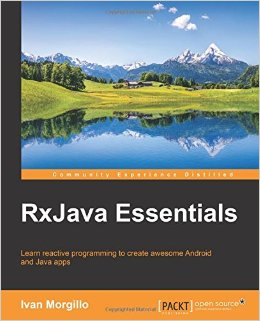

# RxJava Essentials 中文翻译版



本书是对 Ivan.Morgillo 所写一书的中文翻译版本，仅供交流学习使用，严禁商业用途。另外推荐一本姊妹篇《Learning Reactive Programming》。

*   《RxJava Essentials》[翻译中文版电子书](https://www.gitbook.com/book/yuxingxin/rxjava-essentials-cn/)

*   《RxJava Essentials》一书作者[代码样例](https://github.com/hamen/rxjava-essentials)

* * *

# 本书内容有

### **1.RX-from .NET to RxJava**

> 本章带你进入 reactive 的世界。我们会比较 reactive 方法和传统方法，进而探索它们之间的相似和不同的地方。

### **2.Why Observables?**

> 本章会对观察者模式做一个概述，如何实现它以及怎样用 RxJava 来进行扩展，被观察者是什么，以及被观察者如何与迭代联系到一起的。

### **3.Hello Reactive World**

> 本章会利用我们所学的知识来创建第一个 reactive Android 应用。

### **4.Filtering Observables**

> 本章我们会研究 Observable 序列的本质:filtering.我们也将学到如何从一个发出的 Observable 中选取我们想要的值，如何获得一个有限的数值，如何处理溢出的场景，以及更多有用的技巧。

### **5.Transforming Observables**

> 本章将讲述如何通过变换 Observable 序列来创建出我们所需要的序列。

### **6.Combining Observables**

> 本章将研究与函数结合，同时也会学到当创建我们想要的 Observable 时又如何与多个 Observable 协同工作。

### **7.Schedulers-Defeating the Android MainThread Issue**

> 本章将介绍如何使用 RxJava Schedulers 来处理多线程和并发编程。我们也将用 reactive 的方式来创建网络操作、内存访问、耗时处理。

### **8.REST in peace-RxJava and Retrofit**

> 本章教会你如何让 Square 公司的 Retrofit 和 RxJava 结合来一起使用，来创建一个更高效的 REST 客户端程序。

# 学习这本书你需要做的：

为了能够运行书中的例子，你需要一个标准的 Android 开发环境：

*   Android Studio 或 Intellij IDEA
*   Android SDK
*   Java SDK

作为一个纯粹的 Java 开发者，当你接触 RxJava 时，很明显你需要一个你喜欢 Java 编辑器和一个标准的 Java JDK 环境。这本书中的一些图表来自[`rxmarbles.com`](http://rxmarbles.com) 和 [`reactivex.io。`](http://reactivex.io。)

# 这本书适合哪些人看

如果你是一名有经验的 Java 开发者，reactive 编程将会在后端系统中给你一种新的学习扩展和并发的方式，而这不需要更换开发语言。这本书将帮助你学习 RxJava 的核心方面,也能帮助你克服 Android 平台局限性从而创建一个基于事件驱动的，响应式的，流畅体验的 Android 应用。

# 一些约定

在这本书中，你会发现许多用来区分不同信息的文本样式，这列举这些样式的一些例子和对他们释义的说明。

以下列举了些文本中的代码、数据库表名、文件夹名、文件名、文件扩展名、路径名、伪造的 URL、用户输入、Twitter handles ：“正如你看到的那样：zip()有三个参数：两个 Observable 和一个 Func2”

如下面的一块代码：

```java
public Observable<List<User>> getMostPopularSOusers(int howmany){
        return mStackExchangeService
                .getMostPopularSOusers(howmany)
                .map(UsersResponse::getUsers)
                .subscribeOn(Schedulers.io())
               .observeOn(AndroidSchedulers.mainThread());
} 
```

当我们想对代码块的某一部分引起你的注意时，会在对应的那一行或列设置为粗体

```java
public Observable<List<User>> getMostPopularSOusers(int howmany){
        return mStackExchangeService
                .getMostPopularSOusers(howmany)
                .map(UsersResponse::getUsers)   //也就是这句加粗显示
                .subscribeOn(Schedulers.io())
               .observeOn(AndroidSchedulers.mainThread());
} 
```

**新的项目**和**重要的词语**都会以粗体显示。你在屏幕看到的字，例如在菜单或者对话框，会以类似这样的形式出现在文本中：“We will just need a fancy progress bar and a **DOWNLOAD** button.

**Note**

类似这样的是警告或者出现在框中的重要提示。

**Tip** 类似这样的是提示和技巧

# 读者反馈

发送邮件到 feedback@packtpub.com 在你的邮件主题中要提到书的标题。

如果你有擅长的话题并且你对写作感兴趣或者想出书的话，可以看我们作者指南：[`www.packtpub.com/authors`](http://www.packtpub.com/authors)

# 下载样例代码

你可以从你在[`www.packtpub.com 的账户中下载所有你购买 Packt`](http://www.packtpub.com 的账户中下载所有你购买 Packt) 出版的图书的样例代码，如果你从别处购买这本书的话，你可以访问：[`www.packtpub.com/support`](http://www.packtpub.com/support) 注册并将文件用附件直接发给你。

## 版权说明

RxJava Essentials 中文翻译版 仅供交流学习使用，严禁商业用途。转载请联系作者[yuxingxin](https://github.com/yuxingxin)。