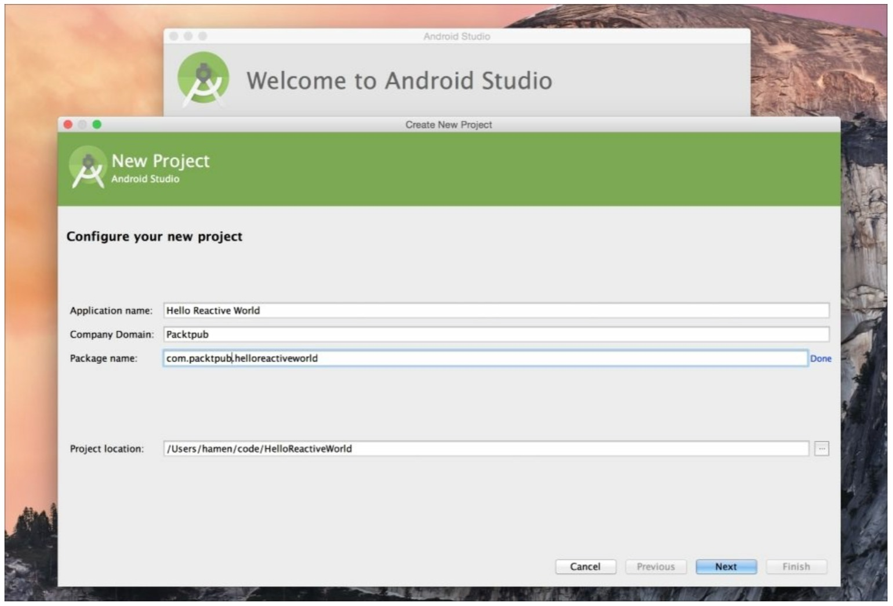
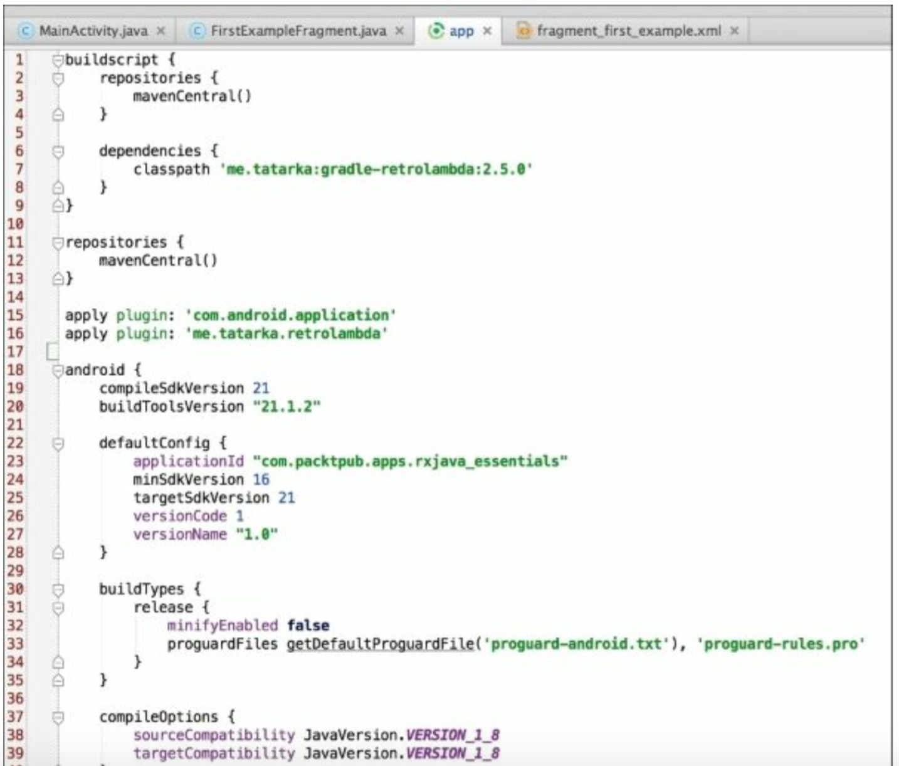
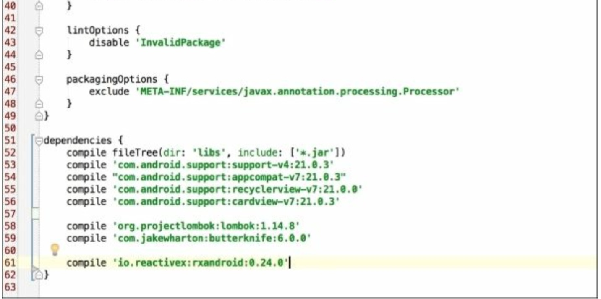
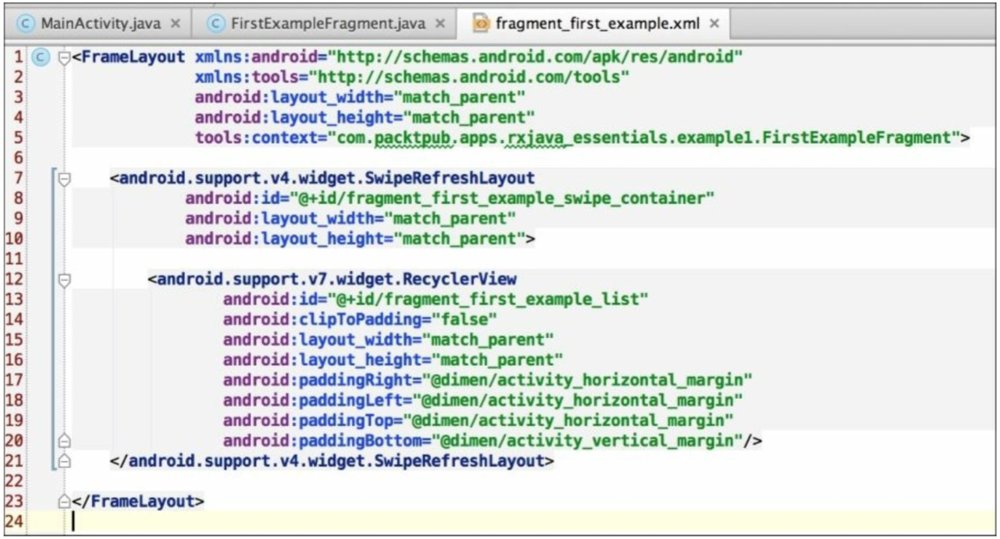

# 向响应式世界问好

在上一章中，我们对观察者模式有个理论上的快速概述。我们也看了从头开始、从列表、或者从已经存在的函数来创建 Observables。在本章中，我们将用我们学到的来创建我们第一个响应式 Android 应用程序。首先，我们需要搭建环境，导入需要的库和有用的库。然后我们将创建一个简单的应用程序，在不同的 flavors 中包含几个用 RxJava 填充的 RecycleView items。

# 启动引擎

我们将使用 IntelliJ IDEA/Android Studio 来创建这个工程，因此你会对截图看起来比较熟悉。

让我们开始创建一个新的 Android 工程。你可以创建你自己的工程或者用本书中提供的导入。选择你自己喜欢的创建方式这取决于你。

如果你想用 Android Studio 创建一个新的工程，通常你可以参考官方文档：[`developer.android.com/intl/zh-cn/training/basics/firstapp/creating-project.html`](http://developer.android.com/intl/zh-cn/training/basics/firstapp/creating-project.html)



### 依赖

很明显，我们将使用**Gradle**来管理我们的依赖列表。我们的 build.gradble 文件看起来像这样：   正如你看到的我们引入了 RxAndroid。RxAndroid 是 RxJava 的增强版，尤其是针对 Android 设计的。

### RxAndroid

RxAndroid 是 RxJava 家族的一部分。它基于 RxJava1.0.x,在普通的 RxJava 基础上添加了几个有用的类。大多数情况下，它为 Android 添加了特殊的调度器。我们将在第七章 Schedulers-Defeating the Android MainThread Issue 再讨论它。

# 工具

出于实用，我们引入了 Lombok 和 Butter Knife。这两个可以帮助我们在 Android 应用程序中少写许多模板类代码。

### Lombok

Lombok 使用注解的方式为你生成许多代码。我们将使用它老生成`getter/setter`、`toString()`、`equals()`、`hashCode()`。它借助于 Gradle 依赖和一个 Android Studio 插件。

### Butter Knife

Butter Knife 使用注解的方式来帮助我们免去写`findViewById()`和设置点击监听的痛苦。至于 Lombok,我们可以通过导入依赖和安装 Android Studio 插件来获得更好的体验。

### Retrolambda

最后，我们导入 Retrolambda，是因为我们开发的 Android 是基于 Java 1.6，然后我们可以借助它来实现 Java 8 Lambda 函数从而减少许多模板代码。

# 我们的第一个 Observable

在我们的第一个列子里，我们将检索安装的应用列表并填充 RecycleView 的 item 来展示它们。我们也设想一个下拉刷新的功能和一个进度条来告知用户当前任务正在执行。

首先，我们创建 Observable。我们需要一个函数来检索安装的应用程序列表并把它提供给我们的观察者。我们一个接一个的发射这些应用程序数据，将它们分组到一个单独的列表中，以此来展示响应式方法的灵活性。

```java
private Observable<AppInfo> getApps(){
    return Observable.create(subscriber -> {
        List<AppInfoRich> apps = new ArrayList<AppInfoRich>();

        final Intent mainIntent = new Intent(Intent.ACTION_MAIN,null);
        mainIntent.addCategory(Intent.CATEGORY_LAUNCHER);

        List<ResolveInfo> infos = getActivity().getPackageManager().queryIntentActivities(mainIntent, 0);

        for(ResolveInfo info : infos){
            apps.add(new AppInfoRich(getActivity(),info));
        }

        for (AppInfoRich appInfo:apps) {
            Bitmap icon = Utils.drawableToBitmap(appInfo.getIcon());
            String name = appInfo.getName();
            String iconPath = mFilesDir + "/" + name;
            Utils.storeBitmap(App.instance, icon,name);

            if (subscriber.isUnsubscribed()){
                return;
            }
            subscriber.onNext(new AppInfo(name,iconPath,appInfo.getLastUpdateTime()));                
        }
        if (!subscriber.isUnsubscribed()){
            subscriber.onCompleted();
        }
    });
} 
```

AppInfo 对象如下：

```java
@Data
@Accessors(prefix = "m")
public class AppInfo implements Comparable<Object> {

    long mLastUpdateTime;
    String mName;
    String mIcon;

    public AppInfo(String nName, long lastUpdateTime, String icon) {
        mName = nName;
        mIcon = icon;
        mLastUpdateTime = lastUpdateTime;
    }

    @Override
    public int compareTo(Object another) {
        AppInfo f = (AppInfo)another;
        return getName().compareTo(f.getName());
    }
} 
```

需要重点注意的是在发射新的数据或者完成序列之前要检测观察者的订阅情况。这样的话代码会更高效，因为如果没有观察者等待时我们就不生成没有必要的数据项。

此时，我们可以订阅 Observable 并观察它。订阅一个 Observable 意味着当我们需要的数据进来时我们必须提供对应的操作来执行它。

当前的场景是什么？我们展示一个进度条来等待数据。当数据到来时，我们需要隐藏掉进度条,填充 list,最终展示列表。现在，我们知道当一切都准备好了该做什么。那么错误的场景呢？对于错误这种情况，我们仅仅是用 Toast 展示一个错误的信息。

使用 Butter Knife,我们得到 list 和下拉刷新组件的引用：

```java
@InjetcView(R.id.fragment_first_example_list)
RecyclerView mRecycleView;

@InjectView(R.id.fragment_first_example_swipe_container)
SwipeRefreshLayout mSwipeRefreshLayout; 
```

我们使用 Android 5 的标准组件：RecyclerView 和 SwipeRefreshLayout。截屏展示了我们这个简单 App 的 list Fragment 的 layout 文件：



我们使用一个下拉刷新方法，因此列表数据可以来自初始化加载，或由用户触发的一个刷新动作。针对这两个场景，我们用同样的行为，因此我们把我们的观察者放在一个易被复用的函数里面。下面是我们的观察者，定义了成功、失败、完成要做的事情：

```java
private void refreshTheList() {
    getApps().toSortedList()
            .subscribe(new Observer<List<AppInfo>>() {

                @Override
                public void onCompleted() {
                    Toast.makeText(getActivity(), "Here is the list!", Toast.LENGTH_LONG).show();
                }

                @Override
                public void onError(Throwable e) {
                    Toast.makeText(getActivity(), "Something went wrong!", Toast.LENGTH_SHORT).show();
                    mSwipeRefreshLayout.setRefreshing(false);
                }

                @Override
                public void onNext(List<AppInfo> appInfos) {
                    mRecyclerView.setVisibility(View.VISIBLE);
                    mAdapter.addApplications(appInfos);
                    mSwipeRefreshLayout.setRefreshing(false);
                }
            });
} 
```

定义一个函数使我们能够用同样一个 block 来处理两种场景成为了可能。当 fragment 加载时我们只需调用`refreshTheList()`方法并设置`refreshTheList()`方法作为用户下拉这一行为所触发的方法。

```java
mSwipeRefreshLayout.setOnRefreshListener(this::refreshTheList); 
```

我们第一个例子现在完成了，运行跑一下。


# 从列表创建一个 Observable

在这个例子中，我们将引入`from()`函数。使用这个特殊的“创建”函数，我们可以从一个列表中创建一个 Observable。Observable 将发射出列表中的每一个元素，我们可以通过订阅它们来对这些发出的元素做出响应。

为了实现和第一个例子同样的结果，我们在每一个`onNext()`函数更新我们的适配器，添加元素并通知插入。

我们将复用和第一个例子同样的结构。主要的不同的是我们不再检索已安装的应用列表。列表由外部实体提供：

```java
mApps = ApplicationsList.getInstance().getList(); 
```

获得列表后，我们仅需将它响应化并填充 RecyclerView 的 item:

```java
private void loadList(List<AppInfo> apps) {
    mRecyclerView.setVisibility(View.VISIBLE);
    Observable.from(apps)
            .subscribe(new Observer<AppInfo>() {

                @Override
                public void onCompleted() {
                    mSwipeRefreshLayout.setRefreshing(false);
                    Toast.makeText(getActivity(), "Here is the list!", Toast.LENGTH_LONG).show();
                }

                @Override
                public void onError(Throwable e) {
                    Toast.makeText(getActivity(), "Something went wrong!", Toast.LENGTH_SHORT).show();
                    mSwipeRefreshLayout.setRefreshing(false);
                }

                @Override
                public void onNext(AppInfo appInfo) {
                    mAddedApps.add(appInfo); 
                    mAdapter.addApplication(mAddedApps.size() - 1,appInfo);
                }
            });
} 
```

正如你看到的，我们将已安装的应用程序列表作为参数传进`from()`函数，然后我们订阅生成的 Observable。观察者和我们第一个例子中的观察者十分相像。一个主要的不同是我们在`onCompleted()`函数中停掉进度条是因为我们一个一个的发射元素；第一个例子中的 Observable 发射的是整个 list,因此在`onNext()`函数中停掉进度条的做法是安全的。

# 再多几个例子

在这一节中，我们将基于 RxJava 的`just()`,`repeat()`,`defer()`,`range()`,`interval()`,和`timer()`方法展示一些例子。

## just()

假如我们只有 3 个独立的 AppInfo 对象并且我们想把他们转化为 Observable 并填充到 RecyclerView 的 item 中：

```java
List<AppInfo> apps = ApplicationsList.getInstance().getList();

AppInfo appOne = apps.get(0);

AppInfo appTwo = apps.get(10);

AppInfo appThree = apps.get(24);

loadApps(appOne,appTwo,appThree); 
```

我们可以像我们之前的例子那样检索列表并提取出这三个元素。然后我们将他们传到这个`loadApps()`函数里面：

```java
private void loadApps(AppInfo appOne,AppInfo appTwo,AppInfo appThree) {
    mRecyclerView.setVisibility(View.VISIBLE);
    Observable.just(appOne,appTwo,appThree)
            .subscribe(new Observer<AppInfo>() {

                @Override
                public void onCompleted() {
                    mSwipeRefreshLayout.setRefreshing(false);
                    Toast.makeText(getActivity(), "Here is the list!", Toast.LENGTH_LONG).show();
                }

                @Override
                public void onError(Throwable e) {
                    Toast.makeText(getActivity(), "Something went wrong!", Toast.LENGTH_SHORT).show();
                    mSwipeRefreshLayout.setRefreshing(false);
                }

                @Override
                public void onNext(AppInfo appInfo) {
                    mAddedApps.add(appInfo); 
                    mAdapter.addApplication(mAddedApps.size() - 1,appInfo);
                }
            });
} 
```

正如你看到的，代码和之前的例子很像。这种方法让我们有机会来考虑一下代码的复用。

你可以将一个函数作为参数传给`just()`方法，你将会得到一个已存在代码的原始 Observable 版本。在一个新的响应式架构的基础上迁移已存在的代码，这个方法可能是一个有用的开始点。

## repeat()

假如你想对一个 Observable 重复发射三次数据。例如，我们用`just()`例子中的 Observable：

```java
private void loadApps(AppInfo appOne,AppInfo appTwo,AppInfo appThree) {
    mRecyclerView.setVisibility(View.VISIBLE);
    Observable.just(appOne,appTwo,appThree)
            .repeat(3)
            .subscribe(new Observer<AppInfo>() {

                @Override
                public void onCompleted() {
                    mSwipeRefreshLayout.setRefreshing(false);
                    Toast.makeText(getActivity(), "Here is the list!", Toast.LENGTH_LONG).show();
                }

                @Override
                public void onError(Throwable e) {
                    Toast.makeText(getActivity(), "Something went wrong!", Toast.LENGTH_SHORT).show();
                    mSwipeRefreshLayout.setRefreshing(false);
                }

                @Override
                public void onNext(AppInfo appInfo) {
                    mAddedApps.add(appInfo); 
                    mAdapter.addApplication(mAddedApps.size() - 1,appInfo);
                }
            });
} 
```

正如你看到的，我们在`just()`创建 Observable 后追加了`repeat(3)`，它将会创建 9 个元素的序列，每一个都单独发射。

## defer()

有这样一个场景，你想在这声明一个 Observable 但是你又想推迟这个 Observable 的创建直到观察者订阅时。看下面的`getInt()`函数：

```java
private Observable<Integer> getInt(){
    return Observable.create(subscriber -> {
        if(subscriber.isUnsubscribed()){
            return;
        }
        App.L.debug("GETINT");
        subscriber.onNext(42);
        subscriber.onCompleted();
    });
} 
```

这比较简单，并且它没有做太多事情，但是它正好为我们服务。现在，我们可以创建一个新的 Observable 并且应用`defer()`:

```java
Observable<Integer> deferred = Observable.defer(this::getInt); 
```

这次，`deferred`存在，但是`getInt()` `create()`方法还没有调用:logcat 日志也没有“GETINT”打印出来:

```java
deferred.subscribe(number -> {
    App.L.debug(String.valueOf(number));
}); 
```

但是一旦我们订阅了，`create()`方法就会被调用并且我们也可以在 logcat 日志中得到下卖弄两个：GETINT 和 42。

## range()

你需要从一个指定的数字 X 开始发射 N 个数字吗？你可以用`range`:

```java
Observable.range(10,3)
    .subscribe(new Observer<Integer>() {

        @Override
        public void onCompleted() {
            Toast.makeText(getActivity(), "Yeaaah!", Toast.LENGTH_LONG).show();
        }

        @Override
        public void onError(Throwable e) {
            Toast.makeText(getActivity(), "Something went wrong!", Toast.LENGTH_SHORT).show();
        }

        @Override
        public void onNext(Integer number) {
            Toast.makeText(getActivity(), "I say " + number, Toast.LENGTH_SHORT).show();
        }
    }); 
```

`range()`函数用两个数字作为参数：第一个是起始点，第二个是我们想发射数字的个数。

## interval()

`interval()`函数在你需要创建一个轮询程序时非常好用。

```java
Subscription stopMePlease = Observable.interval(3,TimeUnit.SECONDS)
    .subscribe(new Observer<Integer>() {

        @Override
        public void onCompleted() {
            Toast.makeText(getActivity(), "Yeaaah!", Toast.LENGTH_LONG).show();
        }

        @Override
        public void onError(Throwable e) {
            Toast.makeText(getActivity(), "Something went wrong!", Toast.LENGTH_SHORT).show();
        }

        @Override
        public void onNext(Integer number) {
            Toast.makeText(getActivity(), "I say " + number, Toast.LENGTH_SHORT).show();
        }
    }); 
```

`interval()`函数的两个参数：一个指定两次发射的时间间隔，另一个是用到的时间单位。

## timer()

如果你需要一个一段时间之后才发射的 Observable，你可以像下面的例子使用`timer()`：

```java
Observable.timer(3,TimeUnit.SECONDS)
    .subscribe(new Observer<Long>() {

        @Override
        public void onCompleted() {

        }

        @Override
        public void onError(Throwable e) {

        }

        @Override
        public void onNext(Long number) {
            Log.d("RXJAVA", "I say " + number);
        }
    }); 
```

它将 3 秒后发射 0,然后就完成了。让我们使用`timer()`的第三个参数，就像下面的例子：

```java
Observable.timer(3,3,TimeUnit.SECONDS)
    .subscribe(new Observer<Long>() {

        @Override
        public void onCompleted() {

        }

        @Override
        public void onError(Throwable e) {

        }

        @Override
        public void onNext(Long number) {
            Log.d("RXJAVA", "I say " + number);
        }
    }); 
```

用这个代码，你可以创建一个以初始值来延迟（上一个例子是 3 秒）执行的`interval()`版本，然后每隔 N 秒就发射一个新的数字（前面的例子是 3 秒）。

# 总结

在本章中，我们创建了第一个由 RxJava 强化的 Android 应用程序。我们从头、从已有的列表、从已有的函数来创建 Observable。我们也学习了如何创建重复发射的 Observables，间隔发射的 Observables 以及延迟发射的 Observables。

在下一章中，我们将掌握过滤操作，能够从我们接收到的序列中创建我们需要的序列。