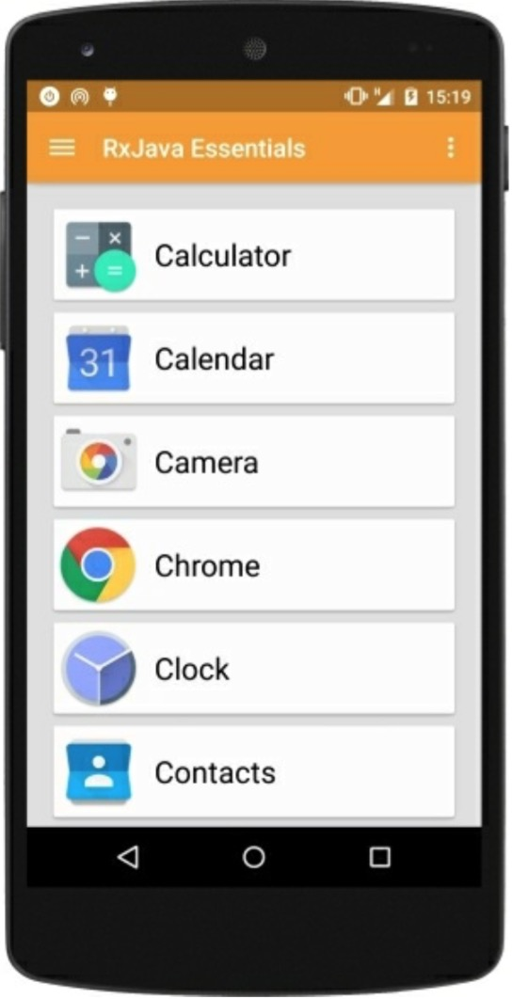
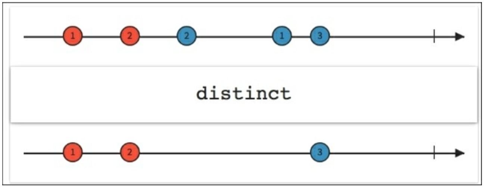
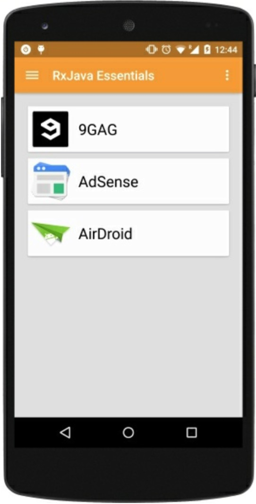
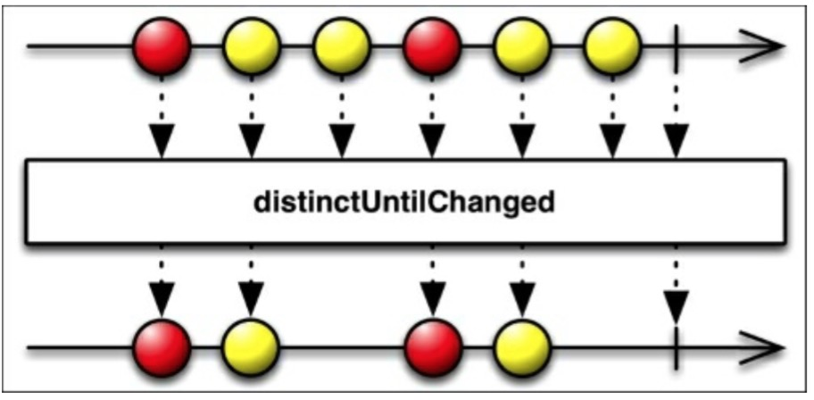
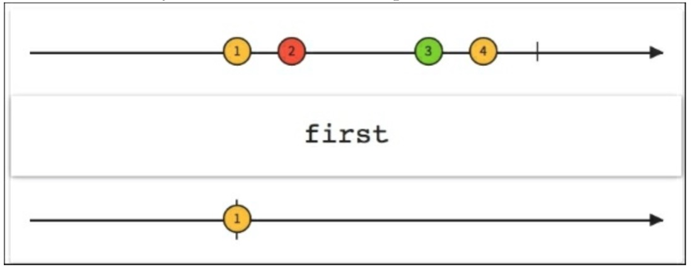
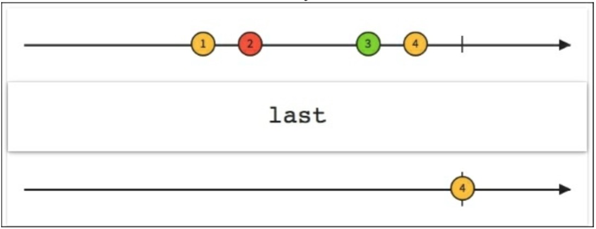
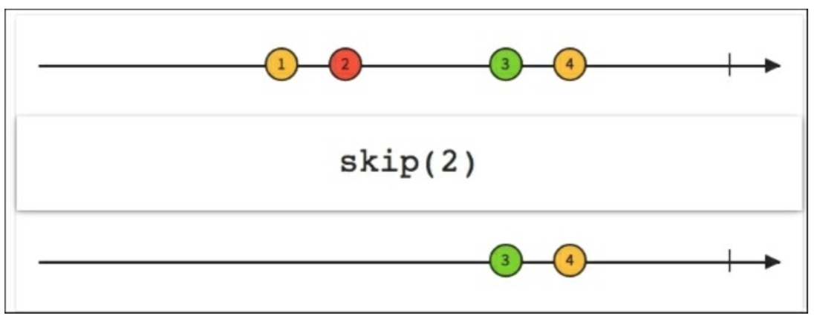
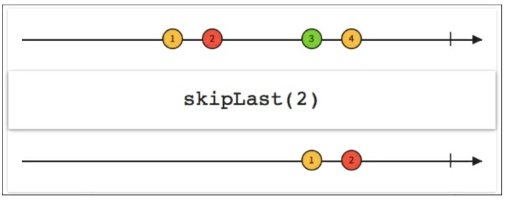
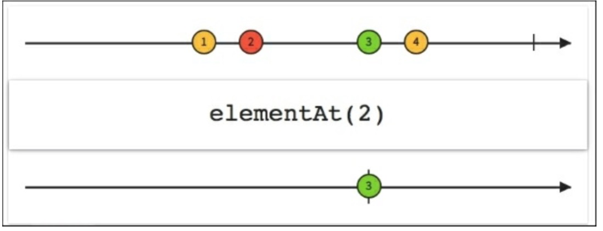
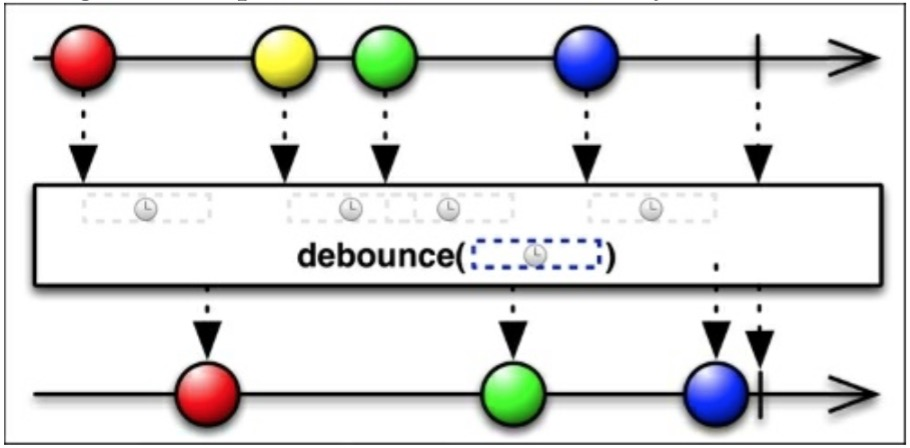

# 过滤 Observables

在上一章中，我们学习了使用 RxJava 创建一个 Android 工程以及如何创建一个可观测的列表来填充 RecyclerView。我们现在知道了如何从头、从列表、从一个已存在的传统 Java 函数来创建 Observable。

这一章中，我们将研究可观测序列的本质：过滤。我们将学到如何从发射的 Observable 中选取我们想要的值，如何获取有限个数的值，如何处理溢出的场景，以及更多的有用的技巧。

# 过滤序列

RxJava 让我们使用`filter()`方法来过滤我们观测序列中不想要的值，在上一章中，我们在几个例子中使用了已安装的应用列表，但是我们只想展示以字母`C`开头的已安装的应用该怎么办呢？在这个新的例子中，我们将使用同样的列表，但是我们会过滤它，通过把合适的谓词传给`filter()`函数来得到我们想要的值。

上一章中`loadList()`函数可以改成这样：

```java
private void loadList(List<AppInfo> apps) {
    mRecyclerView.setVisibility(View.VISIBLE);
    Observable.from(apps)
            .filter((appInfo) ->
            appInfo.getName().startsWith("C"))
            .subscribe(new Observer<AppInfo>() {

                @Override
                public void onCompleted() {
                    mSwipeRefreshLayout.setRefreshing(false);
                }

                @Override
                public void onError(Throwable e) {
                    Toast.makeText(getActivity(), "Something went wrong!", Toast.LENGTH_SHORT).show();
                    mSwipeRefreshLayout.setRefreshing(false);
                }

                @Override
                public void onNext(AppInfo appInfo) {
                    mAddedApps.add(appInfo); 
                    mAdapter.addApplication(mAddedApps.size() - 1,appInfo);
                }
            });
} 
```

我们从上一章中的`loadList()`函数中添加下面一行：

```java
.fliter((appInfo -> appInfo.getName().startsWith("C")) 
```

创建 Observable 完以后，我们从发出的每个元素中过滤掉开头字母不是 C 的。为了让这里更清楚一些，我们用 Java 7 的语法来实现：

```java
.filter(new Func1<AppInfo,Boolean>(){
    @Override
    public Boolean call(AppInfo appInfo){
        return appInfo.getName().startsWith("C");
    }
}) 
```

我们传一个新的`Func1`对象给`filter()`函数，即只有一个参数的函数。`Func1`有一个`AppInfo`对象来作为它的参数类型并且返回`Boolean`对象。只要条件符合`filter()`函数就会返回`true`。此时，值会发射出去并且所有的观察者都会接收到。

正如你想的那样，从一个我们得到的可观测序列中创建一个我们需要的序列`filter()`是很好用的。我们不需要知道可观测序列的源或者为什么发射这么多不同的数据。我们只是想要这些元素的子集来创建一个可以在应用中使用的新序列。这种思想促进了我们编码中的分离性与抽象性。

`filter()`函数最常用的用法之一时过滤`null`对象：

```java
.filter(new Func1<AppInfo,Boolean>(){
    @Override
    public Boolean call(AppInfo appInfo){
        return appInfo != null;
    }
}) 
```

这看起来简单，对于简单的事情有许多模板代码，但是它帮我们免去了在`onNext()`函数调用中再去检测`null`值，让我们把注意力集中在应用业务逻辑上。

下图展示了过滤出的 C 字母开头的已安装的应用列表。



# 获取我们需要的数据

当我们不需要整个序列时，而是只想取开头或结尾的几个元素，我们可以用`take()`或`takeLast()`。

## Take

如果我们只想要一个可观测序列中的前三个元素那将会怎么样，发射它们，然后让 Observable 完成吗？`take()`函数用整数 N 来作为一个参数，从原始的序列中发射前 N 个元素，然后完成：

```java
private void loadList(List<AppInfo> apps) {
    mRecyclerView.setVisibility(View.VISIBLE);
    Observable.from(apps)
            .take(3)
            .subscribe(new Observer<AppInfo>() {

                @Override
                public void onCompleted() {
                    mSwipeRefreshLayout.setRefreshing(false);
                }

                @Override
                public void onError(Throwable e) {
                    Toast.makeText(getActivity(), "Something went wrong!", Toast.LENGTH_SHORT).show();
                    mSwipeRefreshLayout.setRefreshing(false);
                }

                @Override
                public void onNext(AppInfo appInfo) {
                    mAddedApps.add(appInfo);
                    mAdapter.addApplication(mAddedApps.size() - 1,appInfo);
                }
            });
} 
```

下图中展示了发射数字的一个可观测序列。我们对这个可观测序列应用`take(2)`函数，然后我们创建一个只发射可观测源的第一个和第二个数据的新序列。


## TakeLast

如果我们想要最后 N 个元素，我们只需使用`takeLast()`函数：

```java
Observable.from(apps)
        .takeLast(3)
        .subscribe(...); 
```

正如听起来那样不值一提，值得注意的是因为 takeLast()方法只能作用于一组有限的序列（发射元素），它只能应用于一个完整的序列。

下图中展示了如何从可观测源中发射最后一个元素来创建一个新的序列：


下图中展示了我们在已安装的应用列表使用`take()`和`takeLast()`函数后发生的结果：


# 有且仅有一次

一个可观测序列会在出错时重复发射或者被设计成重复发射。`distinct()`和`distinctUntilChanged()`函数可以方便的让我们处理这种重复问题。

## Distinct

如果我们想对一个指定的值仅处理一次该怎么办？我们可以对我们的序列使用`distinct()`函数去掉重复的。就像`takeLast()`一样，`distinct()`作用于一个完整的序列，然后得到重复的过滤项，它需要记录每一个发射的值。如果你在处理一大堆序列或者大的数据记得关注内存使用情况。

下图展示了如何在一个发射 1 和 2 两次的可观测源上创建一个无重的序列： 

为了创建我们例子中序列，我们将使用我们至今已经学到的几个方法：

*   `take()`：它有一小组的可识别的数据项。
*   `repeat()`：创建一个有重复的大的序列。

然后，我们将应用`distinct()`函数来去除重复。

## 注意

我们用程序实现一个重复的序列，然后过滤出它们。这听起来时不可思议的，但是为了实现这个例子来使用我们至今为止已学习到的东西则是个不错的练习。

```java
Observable<AppInfo> fullOfDuplicates = Observable.from(apps)
    .take(3)
    .repeat(3); 
```

`fullOfDuplicates`变量里把我们已安装应用的前三个重复了 3 次：有 9 个并且许多重复的。然后，我们使用`distinct()`:

```java
fullOfDuplicates.distinct()
            .subscribe(new Observer<AppInfo>() {

                @Override
                public void onCompleted() {
                    mSwipeRefreshLayout.setRefreshing(false);
                }

                @Override
                public void onError(Throwable e) {
                    Toast.makeText(getActivity(), "Something went wrong!", Toast.LENGTH_SHORT).show();
                    mSwipeRefreshLayout.setRefreshing(false);
                }

                @Override
                public void onNext(AppInfo appInfo) {
                    mAddedApps.add(appInfo); 
                    mAdapter.addApplication(mAddedApps.size() - 1,appInfo);
                }
            });
} 
```

结果，很明显，我们得到：



## DistinctUntilsChanged

如果在一个可观测序列发射一个不同于之前的一个新值时让我们得到通知这时候该怎么做？我们猜想一下我们观测的温度传感器，每秒发射的室内温度：

```java
21°...21°...21°...21°...22°... 
```

每次我们获得一个新值，我们都会更新当前正在显示的温度。我们出于系统资源保护并不想在每次值一样时更新数据。我们想忽略掉重复的值并且在温度确实改变时才想得到通知。`ditinctUntilChanged()`过滤函数能做到这一点。它能轻易的忽略掉所有的重复并且只发射出新的值。

下图用图形化的方式展示了我们如何将`distinctUntilChanged()`函数应用在一个存在的序列上来创建一个新的不重复发射元素的序列。



# First and last

下图展示了如何从一个从可观测源序列中创建只发射第一个元素的序列。



`first()`方法和`last()`方法很容易弄明白。它们从 Observable 中只发射第一个元素或者最后一个元素。这两个都可以传`Func1`作为参数，：一个可以确定我们感兴趣的第一个或者最后一个的谓词：

下图展示了`last()`应用在一个完成的序列上来创建一个仅仅发射最后一个元素的新的 Observable。



与`first()`和`last()`相似的变量有：`firstOrDefault()`和`lastOrDefault()`.这两个函数当可观测序列完成时不再发射任何值时用得上。在这种场景下，如果 Observable 不再发射任何值时我们可以指定发射一个默认的值

# Skip and SkipLast

下图中展示了如何使用`skip(2)`来创建一个不发射前两个元素而是发射它后面的那些数据的序列。



`skip()`和`skipLast()`函数与`take()`和`takeLast()`相对应。它们用整数 N 作参数，从本质上来说，它们不让 Observable 发射前 N 个或者后 N 个值。如果我们知道一个序列以没有太多用的“可控”元素开头或结尾时我们可以使用它。

下图与前一个场景相对应：我们创建一个新的序列，它会跳过后面两个元素从源序列中发射剩下的其他元素。



# ElementAt

如果我们只想要可观测序列发射的第五个元素该怎么办？`elementAt()`函数仅从一个序列中发射第 n 个元素然后就完成了。

如果我们想查找第五个元素但是可观测序列只有三个元素可供发射时该怎么办？我们可以使用`elementAtOrDefault()`。下图展示了如何通过使用`elementAt(2)`从一个序列中选择第三个元素以及如何创建一个只发射指定元素的新的 Observable。



# Sampling

让我们再回到那个温度传感器。它每秒都会发射当前室内的温度。说实话，我们并不认为温度会变化这么快，我们可以使用一个小的发射间隔。在 Observable 后面加一个`sample()`，我们将创建一个新的可观测序列，它将在一个指定的时间间隔里由 Observable 发射最近一次的数值：

```java
Observable<Integer> sensor = [...]

sensor.sample(30,TimeUnit.SECONDS)
    .subscribe(new Observer<Integer>() {

        @Override
        public void onCompleted() {

        }

        @Override
        public void onError(Throwable e) {

        }

        @Override
        public void onNext(Integer currentTemperature) {
            updateDisplay(currentTemperature)
        }
    }); 
```

例子中 Observable 将会观测温度 Observable 然后每隔 30 秒就会发射最后一个温度值。很明显，`sample()`支持全部的时间单位：秒，毫秒，天，分等等。

下图中展示了一个间隔发射字母的 Observable 如何采样一个发射数字的 Observable。Observable 的结果将会发射每个已发射字母的最后一组数据：1，4，5.


如果我们想让它定时发射第一个元素而不是最近的一个元素，我们可以使用`throttleFirst()`。

# Timeout

假设我们工作的是一个时效性的环境，我们温度传感器每秒都在发射一个温度值。我们想让它每隔两秒至少发射一个，我们可以使用`timeout()`函数来监听源可观测序列,就是在我们设定的时间间隔内如果没有得到一个值则发射一个错误。我们可以认为`timeout()`为一个 Observable 的限时的副本。如果在指定的时间间隔内 Observable 不发射值的话，它监听的原始的 Observable 时就会触发`onError()`函数。

```java
Subscription subscription = getCurrentTemperature()
    .timeout(2,TimeUnit.SECONDS)
    .subscribe(new Observer<Integer>() {

        @Override
        public void onCompleted() {

        }

        @Override
        public void onError(Throwable e) {
            Log.d("RXJAVA","You should go check the sensor, dude");
        }

        @Override
        public void onNext(Integer currentTemperature) {
            updateDisplay(currentTemperature)
        }
    }); 
```

和`sample()`一样，`timeout()`使用`TimeUnit`对象来指定时间间隔。

下图中展示了一旦 Observable 超过了限时就会触发`onError()`函数：因为超时后它才到达，所以最后一个元素将不会发射出去。


# Debounce

`debounce()`函数过滤掉由 Observable 发射的速率过快的数据；如果在一个指定的时间间隔过去了仍旧没有发射一个，那么它将发射最后的那个。

就像`sample()`和`timeout()`函数一样，`debounce()`使用`TimeUnit`对象指定时间间隔。

下图展示了多久从 Observable 发射一次新的数据，`debounce()`函数开启一个内部定时器，如果在这个时间间隔内没有新的数据发射，则新的 Observable 发射出最后一个数据：



# 总结

这一章中，我们学习了如何过滤一个可观测序列。我们现在可以使用`filter()`，`skip()`，和`sample()`来创建我们想要的 Observable。

下一章中，我们将学习如何转换一个序列，将函数应用到每个元素，给它们分组和扫描来创建我们所需要的能完成目标的特定 Observable。