# 变换 Observables

# 转换 Observables

在上一章中，我们探索了 RxJava 通用过滤方法。我们学习了如何使用`filter()`方法过滤我们不需要的值，如何使用`take()`得到发射元素的子集，如何使用`distinct()`函数来去除重复的。我们学习了如何借助`timeout()`，`sample()`，以及`debounce()`来利用时间。

这一章中，我们将通过学习如何变换可观测序列来创建一个能够更好的满足我们需求的序列。

# *map 家族

RxJava 提供了几个 mapping 函数：`map()`,`flatMap()`,`concatMap()`,`flatMapIterable()`以及`switchMap()`.所有这些函数都作用于一个可观测序列，然后变换它发射的值，最后用一种新的形式返回它们。让我们用合适的“真实世界”的例子一个个的学习下。

## Map

RxJava 的`map`函数接收一个指定的`Func`对象然后将它应用到每一个由 Observable 发射的值上。下图展示了如何将一个乘法函数应用到每个发出的值上以此创建一个新的 Observable 来发射转换的数据。

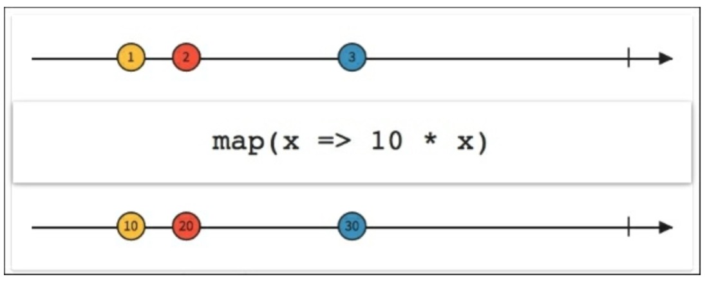

考虑下我们已安装的应用列表。我们怎么才能够显示同样的列表，但是又要所有的名字都小写呢？

我们的`loadList()`函数可以改成这样：

```java
private void loadList(List<AppInfo> apps) {
    mRecyclerView.setVisibility(View.VISIBLE);
    Observable.from(apps)
        .map(new Func1<AppInfo,AppInfo>(){
            @Override
            public Appinfo call(AppInfo appInfo){
                String currentName = appInfo.getName();
                String lowerCaseName = currentName.toLowerCase();
                appInfo.setName(lowerCaseName);
                return appInfo;
            }
        })
        .subscribe(new Observer<AppInfo>() {

            @Override
            public void onCompleted() {
                mSwipeRefreshLayout.setRefreshing(false);
            }

            @Override
            public void onError(Throwable e) {
                Toast.makeText(getActivity(), "Something went wrong!", Toast.LENGTH_SHORT).show();
                mSwipeRefreshLayout.setRefreshing(false);
            }

            @Override
            public void onNext(AppInfo appInfo) {
                mAddedApps.add(appInfo); 
                mAdapter.addApplication(mAddedApps.size() - 1,appInfo);
            }
        });
} 
```

正如你看到的，像往常一样创建我们发射的 Observable 之后，我们追加一个`map`调用，我们创建一个简单的函数来更新`AppInfo`对象并提供一个名字小写的新版本给观察者。

## FlatMap

在复杂的场景中，我们有一个这样的 Observable：它发射一个数据序列，这些数据本身也可以发射 Observable。RxJava 的`flatMap()`函数提供一种铺平序列的方式，然后合并这些 Observables 发射的数据，最后将合并后的结果作为最终的 Observable。

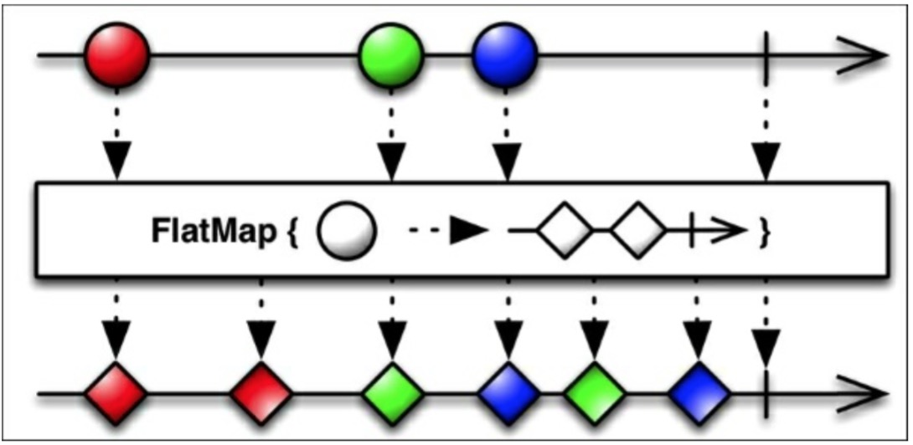

当我们在处理可能有大量的 Observables 时，重要是记住任何一个 Observables 发生错误的情况，`flatMap()`将会触发它自己的`onError()`函数并放弃整个链。

重要的一点提示是关于合并部分：它允许交叉。正如上图所示，这意味着`flatMap()`不能够保证在最终生成的 Observable 中源 Observables 确切的发射顺序。

## ConcatMap

RxJava 的`concatMap()`函数解决了`flatMap()`的交叉问题，提供了一种能够把发射的值连续在一起的铺平函数，而不是合并它们，如下图所示：

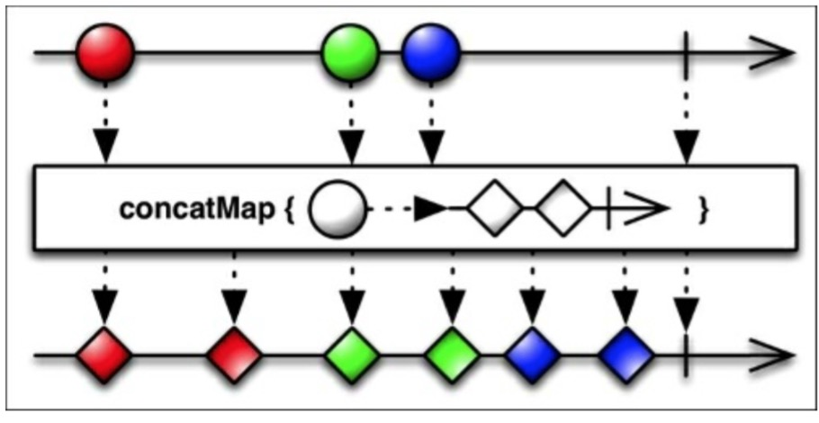

## FlatMapIterable

作为*map 家族的一员，`flatMapInterable()`和`flatMap()`很像。仅有的本质不同是它将源数据两两结成对并生成 Iterable，而不是原始数据项和生成的 Observables。

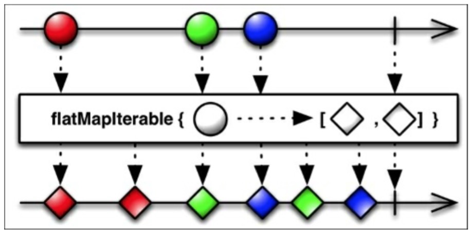

## SwitchMap

如下图所示，`switchMap()`和`flatMap()`很像，除了一点：每当源 Observable 发射一个新的数据项（Observable）时，它将取消订阅并停止监视之前那个数据项产生的 Observable，并开始监视当前发射的这一个。

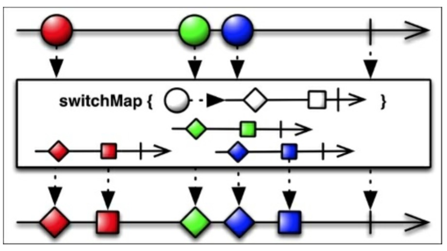

## Scan

RxJava 的`scan()`函数可以看做是一个累积函数。`scan()`函数对原始 Observable 发射的每一项数据都应用一个函数，计算出函数的结果值，并将该值填充回可观测序列，等待和下一次发射的数据一起使用。

作为一个通用的例子，给出一个累加器：

```java
Observable.just(1,2,3,4,5)
        .scan((sum,item) -> sum + item)
        .subscribe(new Subscriber<Integer>() {
            @Override
            public void onCompleted() {
                Log.d("RXJAVA", "Sequence completed.");
            }

            @Override
            public void onError(Throwable e) {
                Log.e("RXJAVA", "Something went south!");
            }

            @Override
            public void onNext(Integer item) {
                Log.d("RXJAVA", "item is: " + item);
            }
        }); 
```

我们得到的结果是：

```java
RXJAVA: item is: 1
RXJAVA: item is: 3
RXJAVA: item is: 6
RXJAVA: item is: 10
RXJAVA: item is: 15
RXJAVA: Sequence completed. 
```

我们也可以创建一个新版本的`loadList()`函数用来比较每个安装应用的名字从而创建一个名字长度递增的列表。

```java
private void loadList(List<AppInfo> apps) {
    mRecyclerView.setVisibility(View.VISIBLE);
    Observable.from(apps)
            .scan((appInfo,appInfo2) -> {
                if(appInfo.getName().length > appInfo2.getName().length()){
                    return appInfo;
                } else {
                    return appInfo2;
                }
            })
            .distinct()
            .subscribe(new Observer<AppInfo>() {

                @Override
                public void onCompleted() {
                    mSwipeRefreshLayout.setRefreshing(false);
                }

                @Override
                public void onError(Throwable e) {
                    Toast.makeText(getActivity(), "Something went wrong!", Toast.LENGTH_SHORT).show();
                    mSwipeRefreshLayout.setRefreshing(false);
                }

                @Override
                public void onNext(AppInfo appInfo) {
                    mAddedApps.add(appInfo); 
                    mAdapter.addApplication(mAddedApps.size() - 1,appInfo);
                }
            });
} 
```

结果如下：


有一个`scan()`函数的变体，它用初始值作为第一个发射的值，方法签名看起来像：`scan(R,Func2)`，如下图中的例子这样：

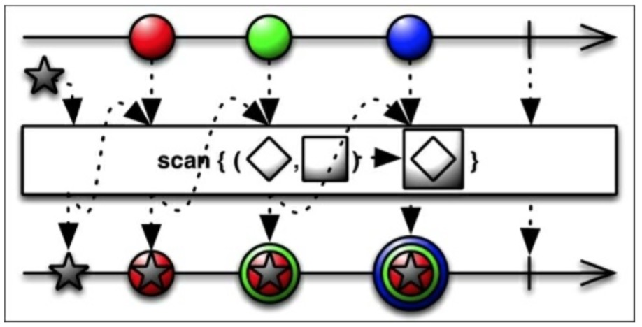

# GroupBy

拿第一个例子开始，我们安装的应用程序列表按照字母表的顺序排序。然而，如果现在我们想按照最近更新日期来排序我们的 App 时该怎么办？RxJava 提供了一个有用的函数从列表中按照指定的规则：`groupBy()`来分组元素。下图中的例子展示了`groupBy()`如何将发射的值根据他们的形状来进行分组。

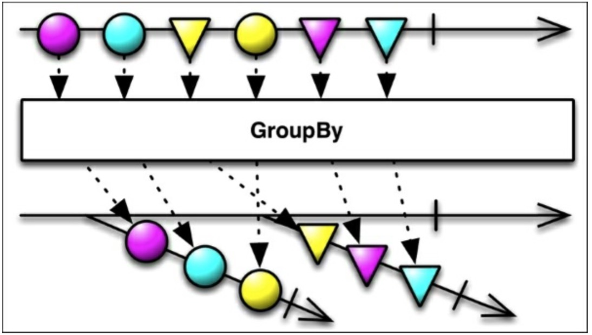

这个函数将源 Observable 变换成一个发射 Observables 的新的 Observable。它们中的每一个新的 Observable 都发射一组指定的数据。

为了创建一个分组了的已安装应用列表，我们在`loadList()`函数中引入了一个新的元素：

```java
Observable<GroupedObservable<String,AppInfo>> groupedItems = Observable.from(apps)
    .groupBy(new Func1<AppInfo,String>(){
        @Override
        public String call(AppInfo appInfo){
            SimpleDateFormat formatter = new SimpleDateFormat("MM/yyyy");
            return formatter.format(new Date(appInfo.getLastUpdateTime()));
        }
    }); 
```

现在我们创建了一个新的 Observable，`groupedItems`，它将会发射一个带有`GroupedObservable`的序列。`GroupedObservable`是一个特殊的 Observable，它源自一个分组的 key。在这个例子中，key 就是`String`，代表的意思是`Month/Year`格式化的最近更新日期。

这一点，我们已经创建了几个发射`AppInfo`数据的 Observable，用来填充我们的列表。我们想保留字母排序和分组排序。我们将创建一个新的 Observable 将所有的联系起来，像往常一样然后订阅它：

```java
Observable.concat(groupedItems)
    .subscribe(new Observer<AppInfo>() {

        @Override
        public void onCompleted() {
            mSwipeRefreshLayout.setRefreshing(false);
        }

        @Override
        public void onError(Throwable e) {
            Toast.makeText(getActivity(), "Something went wrong!", Toast.LENGTH_SHORT).show();
            mSwipeRefreshLayout.setRefreshing(false);
        }

        @Override
        public void onNext(AppInfo appInfo) {
            mAddedApps.add(appInfo); 
            mAdapter.addApplication(mAddedApps.size() - 1,appInfo);
        }
    }); 
```

我们的`loadList()`函数完成了，结果是：


# Buffer

RxJava 中的`buffer()`函数将源 Observable 变换一个新的 Observable，这个新的 Observable 每次发射一组列表值而不是一个一个发射。

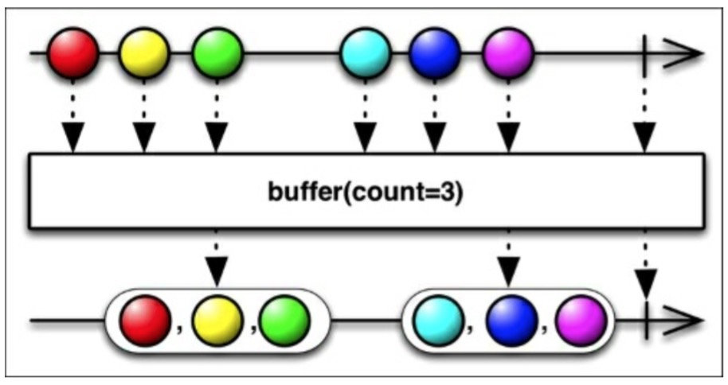

上图中展示了`buffer()`如何将`count`作为一个参数来指定有多少数据项被包在发射的列表中。实际上，`buffer()`函数有几种变体。其中有一个是允许你指定一个`skip`值：此后每`skip`项数据，然后又用 count 项数据填充缓冲区。如下图所示：

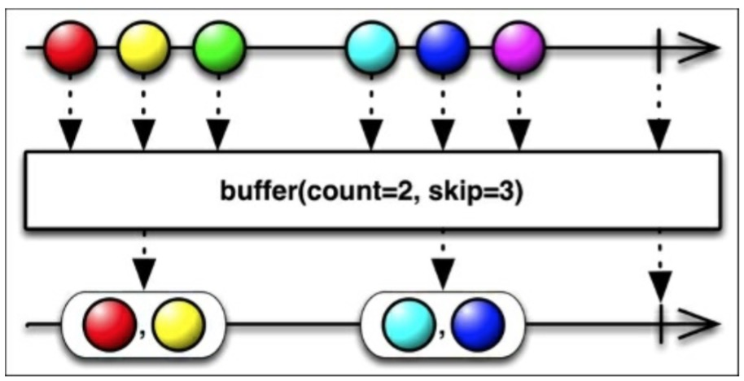

`buffer()`带一个`timespan`的参数，会创建一个每隔 timespan 时间段就会发射一个列表的 Observable。

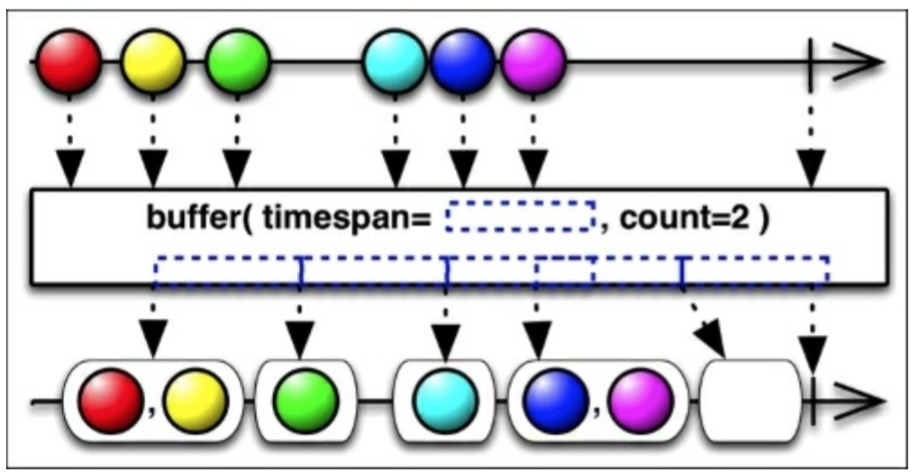

# Window

RxJava 的`window()`函数和`buffer()`很像，但是它发射的是 Observable 而不是列表。下图展示了`window()`如何缓存 3 个数据项并把它们作为一个新的 Observable 发射出去。

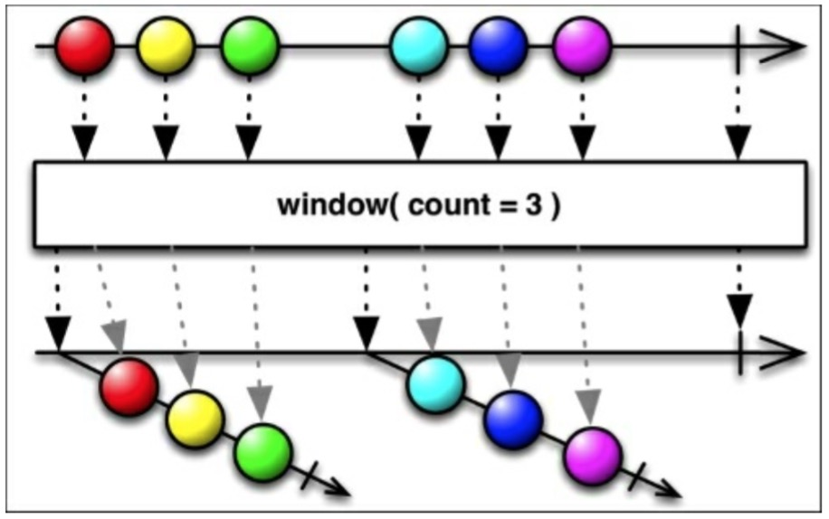

这些 Observables 中的每一个都发射原始 Observable 数据的一个子集，数量由`count`指定,最后发射一个`onCompleted()`结束。正如`buffer()`一样,`window()`也有一个`skip`变体,如下图所示：

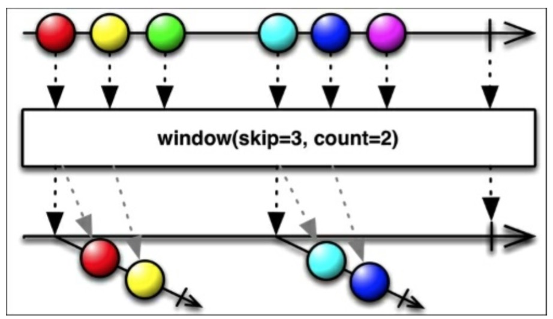

# Cast

RxJava 的`cast()`函数是本章中最后一个操作符。它是`map()`操作符的特殊版本。它将源 Observable 中的每一项数据都转换为新的类型，把它变成了不同的`Class`。

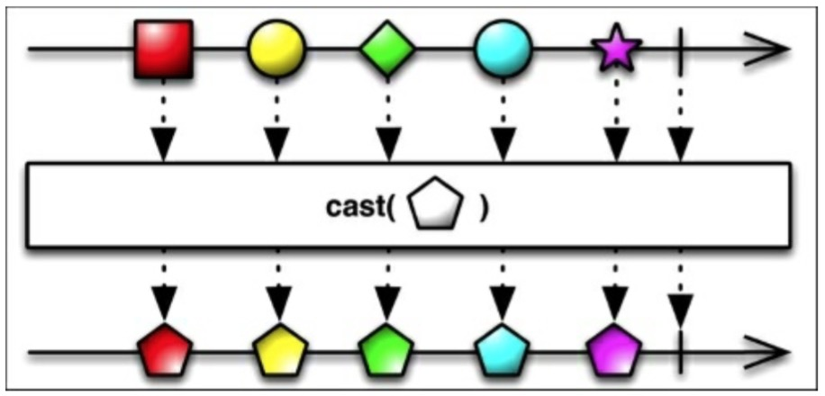

# 总结

这一章中，我们学习了 RxJava 时如何控制和转换可观测序列。用我们现在所学的知识，我们可以创建、过滤、转换我们所想要的任何种类的可观测序列。

下一章，我们将学习如何组合 Observable，合并它们，连接它们，再或者打包它们。