# 组合 Observables

上一章中，我们学到如何转换可观测序列。我们也看到了`map()`,`scan()`,`groupBY()`,以及更多有用的函数的实际例子，它们帮助我们操作 Observable 来创建我们想要的 Observable。

本章中，我们将研究组合函数并学习如何同时处理多个 Observables 来创建我们想要的 Observable。

# Merge

在”异步的世界“中经常会创建这样的场景，我们有多个来源但是又只想有一个结果：多输入，单输出。RxJava 的`merge()`方法将帮助你把两个甚至更多的 Observables 合并到他们发射的数据项里。下图给出了把两个序列合并在一个最终发射的 Observable。

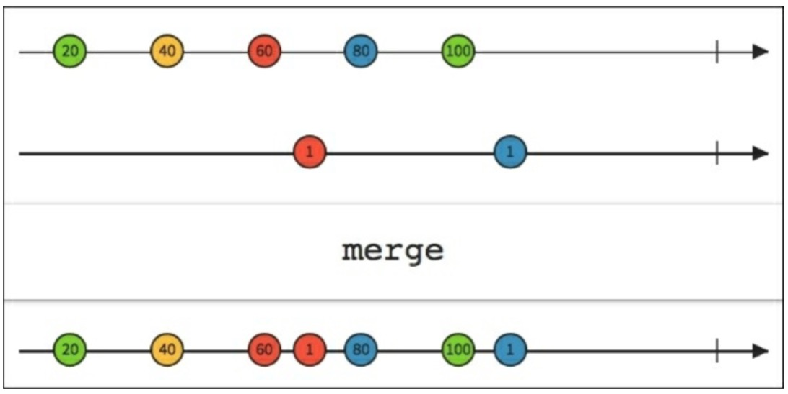

正如你看到的那样，发射的数据被交叉合并到一个 Observable 里面。注意如果你同步的合并 Observable，它们将连接在一起并且不会交叉。

像往常一样，我们用我们的 App 和已安装的 App 列表来创建了一个“真实世界”的例子。为此我们还需要第二个 Observable。我们可以创建一个单独的应用列表然后让它逆序排列。当然这没有实际的意义，只是为了这个例子。对于第二个列表，我们的`loadList()`函数像下面这样：

```java
private void loadList(List<AppInfo> apps) {
    mRecyclerView.setVisibility(View.VISIBLE);
    List reversedApps = Lists.reverse(apps);
    Observable<AppInfo> observableApps =Observable.from(apps);
    Observable<AppInfo> observableReversedApps =Observable.from(reversedApps);
    Observable<AppInfo> mergedObserbable = Observable.merge(observableApps,observableReversedApps);

    mergedObserbable.subscribe(new Observer<AppInfo>(){
        @Override
        public void onCompleted() {
            mSwipeRefreshLayout.setRefreshing(false);
            Toast.makeText(getActivity(), "Here is the list!", Toast.LENGTH_LONG).show();
        }

        @Override
        public void onError(Throwable e) {
            Toast.makeText(getActivity(), "One of the two Observable threw an error!", Toast.LENGTH_SHORT).show();
            mSwipeRefreshLayout.setRefreshing(false);
        }

        @Override
        public void onNext(AppInfoappInfo) {
            mAddedApps.add(appInfo);
            mAdapter.addApplication(mAddedApps.size() - 1, appInfo);
        } 
    });
} 
```

我们创建了 Observable 和 observableApps 数据项以及新的 observableReversedApps 逆序列表。使用`Observable.merge()`，我们可以创建新的`Observable MergedObservable`，它在单个可观测序列中发射源 Observables 发出的所有数据。

正如你能看到的,每个方法签名都是一样的，因此我们的观察者无需在意任何不同就可以复用代码。结果如下： 

注意错误时的 toast 消息，你可以认为每个 Observable 抛出的错误都将会打断合并。如果你需要避免这种情况，RxJava 提供了`mergeDelayError()`，它能从一个 Observable 中继续发射数据即便是其中有一个抛出了错误。当所有的 Observables 都完成时，`mergeDelayError()`将会发射`onError()`，如下图所示：

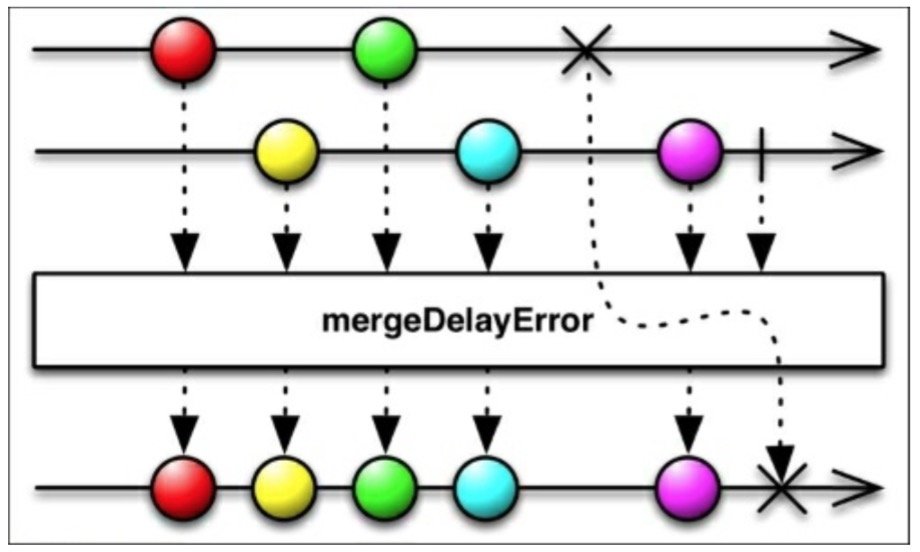

# Zip

在一种新的可能场景中处理多个数据来源时会带来：多从个 Observables 接收数据，处理它们，然后将它们合并成一个新的可观测序列来使用。RxJava 有一个特殊的方法可以完成：`zip()`合并两个或者多个 Observables 发射出的数据项，根据指定的函数`Func*`变换它们，并发射一个新值。下图展示了`zip()`方法如何处理发射的“numbers”和“letters”然后将它们合并一个新的数据项：

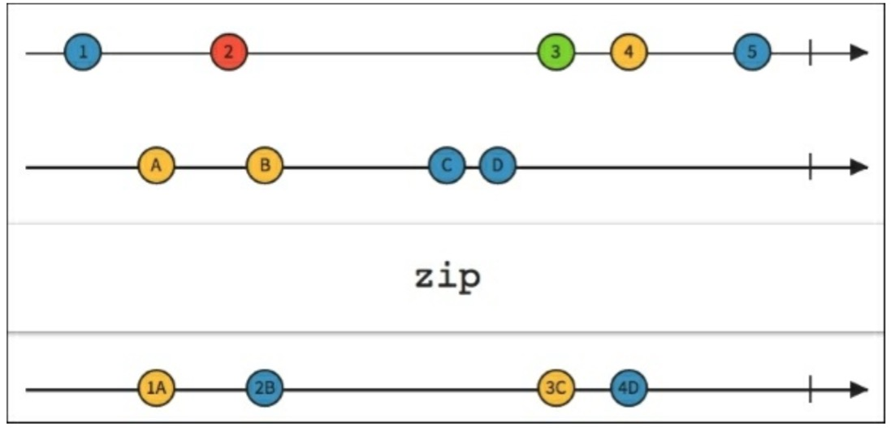

对于“真实世界”的例子来说，我们将使用已安装的应用列表和一个新的动态的 Observable 来让例子变得有点有趣味。

```java
Observable<Long> tictoc = Observable.interval(1, TimeUnit.SECONDS); 
```

`tictoc`Observable 变量使用`interval()`函数每秒生成一个 Long 类型的数据：虽简单但有效，正如之前所说的，我们需要一个`Func`对象。因为它需要传两个参数，所以是`Func2`:

```java
private AppInfo updateTitle(AppInfoappInfo, Long time) {
    appInfo.setName(time + " " + appInfo.getName());
    return appInfo;
} 
```

现在我们的`loadList()`函数变成这样：

```java
private void loadList(List<AppInfo> apps) {
    mRecyclerView.setVisibility(View.VISIBLE);
    Observable<AppInfo> observableApp = Observable.from(apps);

    Observable<Long> tictoc = Observable.interval(1, TimeUnit.SECONDS);

    Observable.zip(observableApp, tictoc,
    (AppInfo appInfo, Long time) -> updateTitle(appInfo, time))
    .observeOn(AndroidSchedulers.mainThread())
    .subscribe(new Observer<AppInfo>() {
        @Override
        public void onCompleted() {
            Toast.makeText(getActivity(), "Here is the list!", Toast.LENGTH_LONG).show();
        }

        @Override
        public void onError(Throwable e) {
            mSwipeRefreshLayout.setRefreshing(false);
            Toast.makeText(getActivity(), "Something went wrong!", Toast.LENGTH_SHORT).show();
        }

        @Override
        public void onNext(AppInfoappInfo) {
            if (mSwipeRefreshLayout.isRefreshing()) {
                mSwipeRefreshLayout.setRefreshing(false);
            } 
            mAddedApps.add(appInfo);
            int position = mAddedApps.size() - 1;
            mAdapter.addApplication(position, appInfo);
            mRecyclerView.smoothScrollToPosition(position);
        }
    });
} 
```

正如你看到的那样，`zip()`函数有三个参数：两个 Observables 和一个`Func2`。

仔细一看会发现`observeOn()`函数。它将在下一章中讲解：现在我们可以小试一下。

结果如下：


# Join

前面两个方法，`zip()`和`merge()`方法作用在发射数据的范畴内，在决定如何操作值之前有些场景我们需要考虑时间的。RxJava 的`join()`函数基于时间窗口将两个 Observables 发射的数据结合在一起。

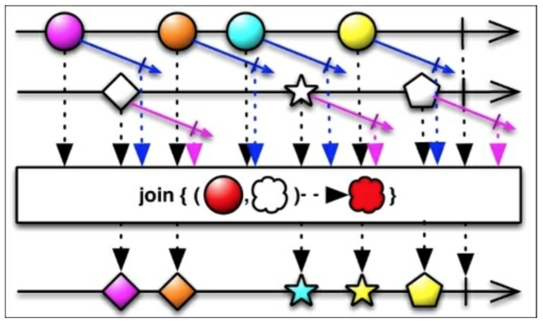

为了正确的理解上一张图，我们解释下`join()`需要的参数：

*   第二个 Observable 和源 Observable 结合。
*   `Func1`参数：在指定的由时间窗口定义时间间隔内，源 Observable 发射的数据和从第二个 Observable 发射的数据相互配合返回的 Observable。
*   `Func1`参数：在指定的由时间窗口定义时间间隔内，第二个 Observable 发射的数据和从源 Observable 发射的数据相互配合返回的 Observable。
*   `Func2`参数：定义已发射的数据如何与新发射的数据项相结合。
*   如下练习的例子，我们可以修改`loadList()`函数像下面这样：

    ```java
    private void loadList(List<AppInfo> apps) {
      mRecyclerView.setVisibility(View.VISIBLE);

      Observable<AppInfo> appsSequence =
      Observable.interval(1000, TimeUnit.MILLISECONDS)
                  .map(position -> {
                      return apps.get(position.intValue());
                  });

      Observable<Long> tictoc = Observable.interval(1000,TimeUnit.MILLISECONDS);

      appsSequence.join(
          tictoc, 
          appInfo -> Observable.timer(2,TimeUnit.SECONDS),
          time -> Observable.timer(0, TimeUnit.SECONDS),
          this::updateTitle)
          .observeOn(AndroidSchedulers.mainThread())
          .take(10)
          .subscribe(new Observer<AppInfo>() {
              @Override
              public void onCompleted() {
                  Toast.makeText(getActivity(), "Here is the list!", Toast.LENGTH_LONG).show();
              }

              @Override
              public void onError(Throwable e) {
                  mSwipeRefreshLayout.setRefreshing(false); 
                  Toast.makeText(getActivity(), "Something went wrong!", Toast.LENGTH_SHORT).show();
              }

              @Override
              public void onNext(AppInfoappInfo) {
                  if (mSwipeRefreshLayout.isRefreshing()) {
                      mSwipeRefreshLayout.setRefreshing(false);
                  } 
                  mAddedApps.add(appInfo);
                  int position = mAddedApps.size() - 1;
                  mAdapter.addApplication(position, appInfo);
                  mRecyclerView.smoothScrollToPosition(position);
              } 
          });
    } 
    ```

我们有一个新的对象`appsSequence`，它是一个每秒从我们已安装的 app 列表发射 app 数据的可观测序列。`tictoc`这个 Observable 数据每秒只发射一个新的`Long`型整数。为了合并它们，我们需要指定两个`Func1`变量：

```java
appInfo -> Observable.timer(2, TimeUnit.SECONDS)

time -> Observable.timer(0, TimeUnit.SECONDS) 
```

上面描述了两个时间窗口。下面一行描述我们如何使用`Func2`将两个发射的数据结合在一起。

```java
this::updateTitle 
```

结果如下：

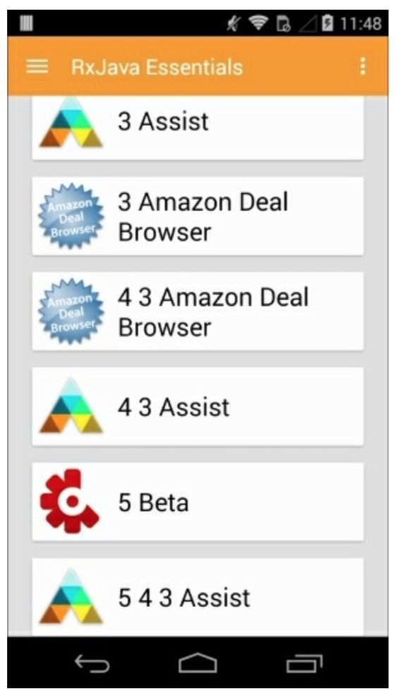

它看起来有点乱，但是注意 app 的名字和我们指定的时间窗口，我们可以看到：一旦第二个数据发射了我们就会将它与源数据结合，但我们用同一个源数据有 2 秒钟。这就是为什么标题重复数字增加的原因。

值得一提的是，为了简单起见，也有一个`join()`操作符作用于字符串然后简单的和发射的字符串连接成最终的字符串。

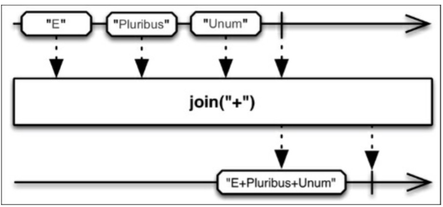

# combineLatest

RxJava 的`combineLatest()`函数有点像`zip()`函数的特殊形式。正如我们已经学习的，`zip()`作用于最近未打包的两个 Observables。相反，`combineLatest()`作用于最近发射的数据项：如果`Observable1`发射了 A 并且`Observable2`发射了 B 和 C，`combineLatest()`将会分组处理 AB 和 AC，如下图所示：

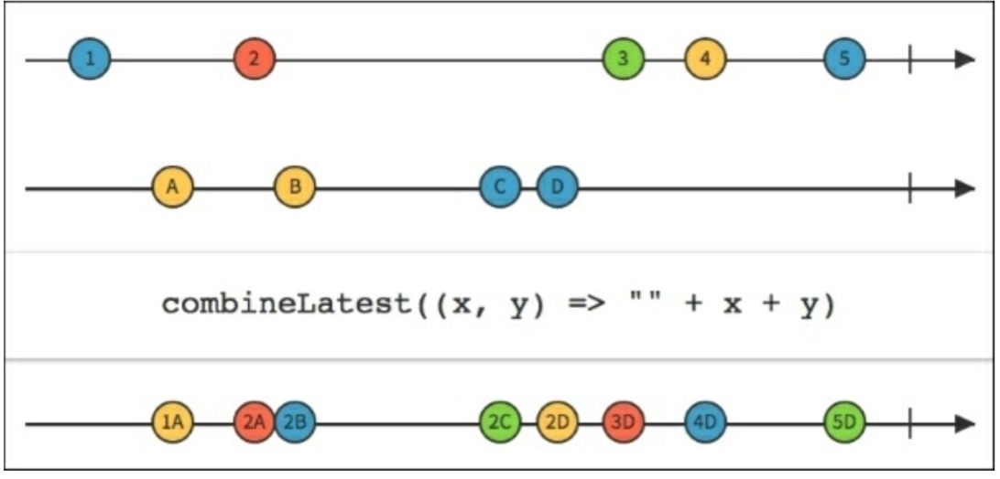

`combineLatest()`函数接受二到九个 Observable 作为参数，如果有需要的话或者单个 Observables 列表作为参数。

从之前的例子中把`loadList()`函数借用过来，我们可以修改一下来用于`combineLatest()`实现“真实世界”这个例子：

```java
private void loadList(List<AppInfo> apps) {
    mRecyclerView.setVisibility(View.VISIBLE);
    Observable<AppInfo> appsSequence = Observable.interval(1000, TimeUnit.MILLISECONDS)
              .map(position ->apps.get(position.intValue()));
    Observable<Long> tictoc = Observable.interval(1500, TimeUnit.MILLISECONDS);
    Observable.combineLatest(appsSequence, tictoc,
               this::updateTitle)
       .observeOn(AndroidSchedulers.mainThread())
        .subscribe(new Observer<AppInfo>() {

        @Override
        public void onCompleted() {
            Toast.makeText(getActivity(), "Here is the list!", Toast.LENGTH_LONG).show();
        }

        @Override
        public void onError(Throwable e) {
            mSwipeRefreshLayout.setRefreshing(false);
            Toast.makeText(getActivity(), "Something went wrong!", Toast.LENGTH_SHORT).show();
        }

        @Override
        public void onNext(AppInfoappInfo) {
            if (mSwipeRefreshLayout.isRefreshing()) {
                mSwipeRefreshLayout.setRefreshing(false);
            } 
            mAddedApps.add(appInfo);
            int position = mAddedApps.size() - 1;
            mAdapter.addApplication(position, appInfo);
            mRecyclerView.smoothScrollToPosition(position);
        } 
    });
} 
```

这我们使用了两个 Observables：一个是每秒钟从我们已安装的应用列表发射一个 App 数据，第二个是每隔 1.5 秒发射一个`Long`型整数。我们将他们结合起来并执行`updateTitle()`函数，结果如下：

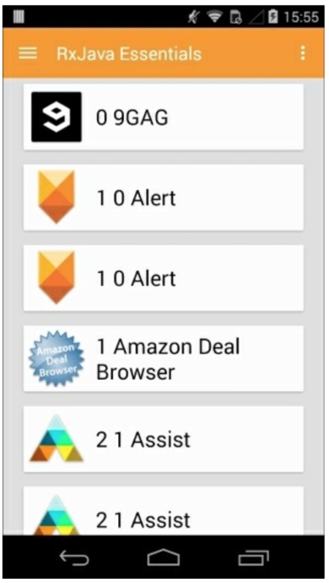

正如你看到的，由于不同的时间间隔，`AppInfo`对象如我们所预料的那样有时候会重复。

# And,Then 和 When

在将来还有一些`zip()`满足不了的场景。如复杂的架构，或者是仅仅为了个人爱好，你可以使用 And/Then/When 解决方案。它们在 RxJava 的 joins 包下，使用 Pattern 和 Plan 作为中介，将发射的数据集合并到一起。

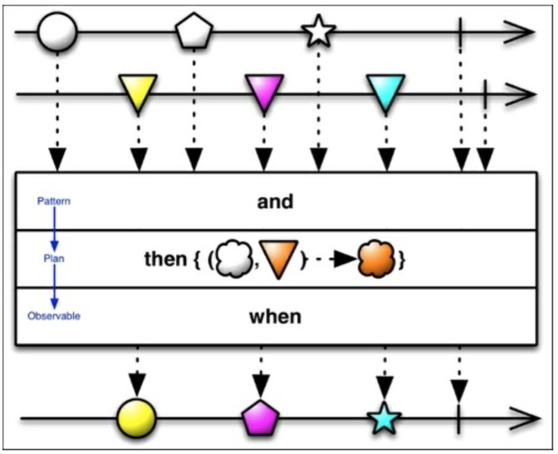

我们的`loadList()`函数将会被修改从这样：

```java
private void loadList(List<AppInfo> apps) {

    mRecyclerView.setVisibility(View.VISIBLE);

    Observable<AppInfo> observableApp = Observable.from(apps);

    Observable<Long> tictoc = Observable.interval(1, TimeUnit.SECONDS);

    Pattern2<AppInfo, Long> pattern = JoinObservable.from(observableApp).and(tictoc); 

    Plan0<AppInfo> plan = pattern.then(this::updateTitle);

    JoinObservable
        .when(plan)
        .toObservable()
        .observeOn(AndroidSchedulers.mainThread())
        .subscribe(new Observer<AppInfo>() {

            @Override
            public void onCompleted() {
                Toast.makeText(getActivity(), "Here is the list!", Toast.LENGTH_LONG).show();
            }

            @Override
            public void onError(Throwable e) {
                mSwipeRefreshLayout.setRefreshing(false); 
                Toast.makeText(getActivity(), "Something went wrong!", Toast.LENGTH_SHORT).show();
            }

            @Override
            public void onNext(AppInfoappInfo) {
                if (mSwipeRefreshLayout.isRefreshing()) { 
                mSwipeRefreshLayout.setRefreshing(false);
                } 
                mAddedApps.add(appInfo);
                int position = mAddedApps.size() - 1;
                mAdapter.addApplication(position, appInfo); mRecyclerView.smoothScrollToPosition(position);
            } 
        });
} 
```

和通常一样，我们有两个发射的序列，`observableApp`，发射我们安装的应用列表数据，`tictoc`每秒发射一个`Long`型整数。现在我们用`and()`连接源 Observable 和第二个 Observable。

```java
JoinObservable.from(observableApp).and(tictoc); 
```

这里创建一个`pattern`对象，使用这个对象我们可以创建一个`Plan`对象:"我们有两个发射数据的 Observables,`then()`是做什么的？"

```java
pattern.then(this::updateTitle); 
```

现在我们有了一个`Plan`对象并且当 plan 发生时我们可以决定接下来发生的事情。

```java
.when(plan).toObservable() 
```

这时候，我们可以订阅新的 Observable，正如我们总是做的那样。

# Switch

有这样一个复杂的场景就是在一个`subscribe-unsubscribe`的序列里我们能够从一个 Observable 自动取消订阅来订阅一个新的 Observable。

RxJava 的`switch()`，正如定义的，将一个发射多个 Observables 的 Observable 转换成另一个单独的 Observable，后者发射那些 Observables 最近发射的数据项。

给出一个发射多个 Observables 序列的源 Observable，`switch()`订阅到源 Observable 然后开始发射由第一个发射的 Observable 发射的一样的数据。当源 Observable 发射一个新的 Observable 时，`switch()`立即取消订阅前一个发射数据的 Observable（因此打断了从它那里发射的数据流）然后订阅一个新的 Observable，并开始发射它的数据。

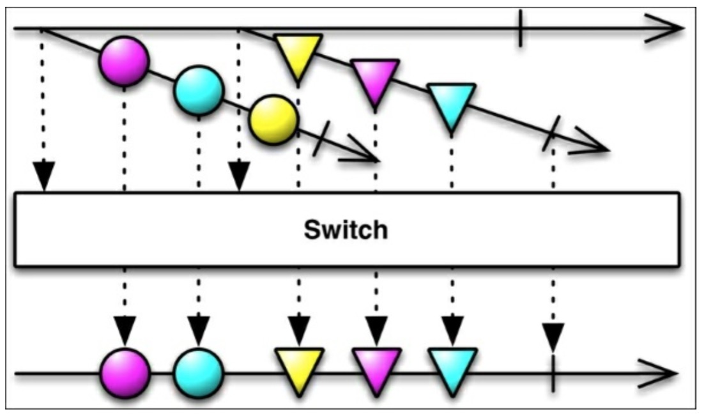

# StartWith

我们已经学到如何连接多个 Observables 并追加指定的值到一个发射序列里。RxJava 的`startWith()`是`concat()`的对应部分。正如`concat()`向发射数据的 Observable 追加数据那样，在 Observable 开始发射他们的数据之前， `startWith()`通过传递一个参数来先发射一个数据序列。

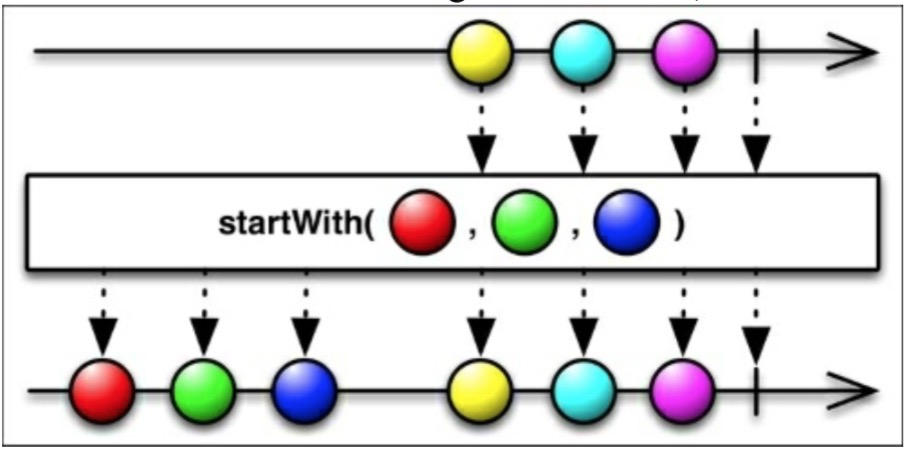

# 总结

这章中，我们学习了如何将两个或者更多个 Observable 结合来创建一个新的可观测序列。我们将能够`merge` Observable，`join` Observables ，`zip` Observables 并在几种情况下把他们结合在一起。

下一章，我们将介绍调度器，它将很容易的帮助我们创建主线程以及提高我们应用程序的性能。我们也将学习如何正确的执行长任务或者 I/O 任务来获得更好的性能。