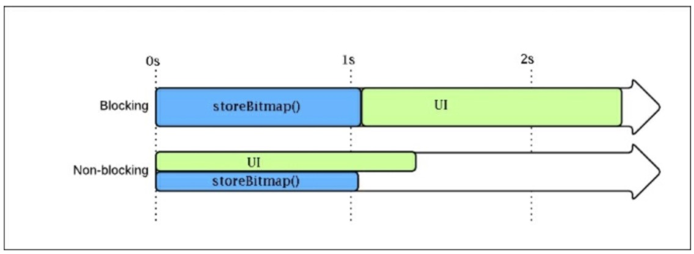
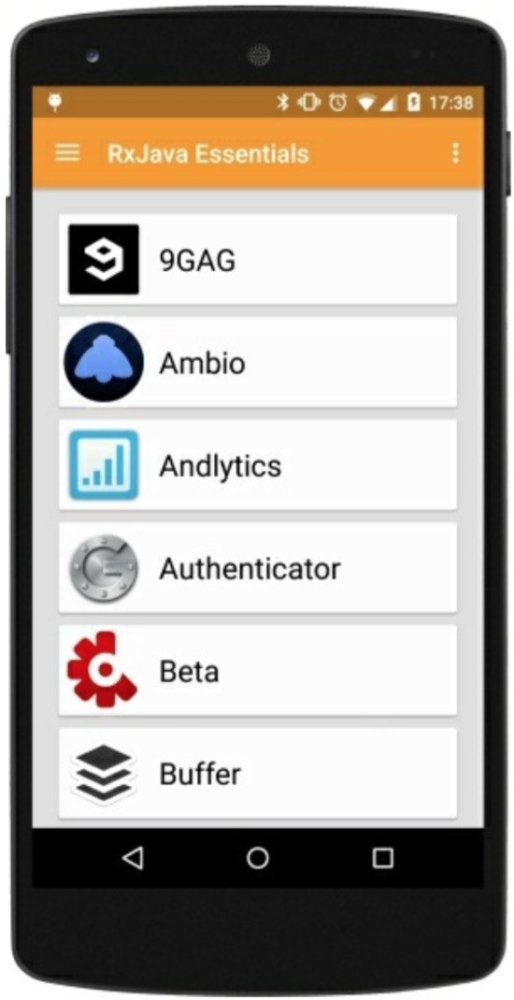
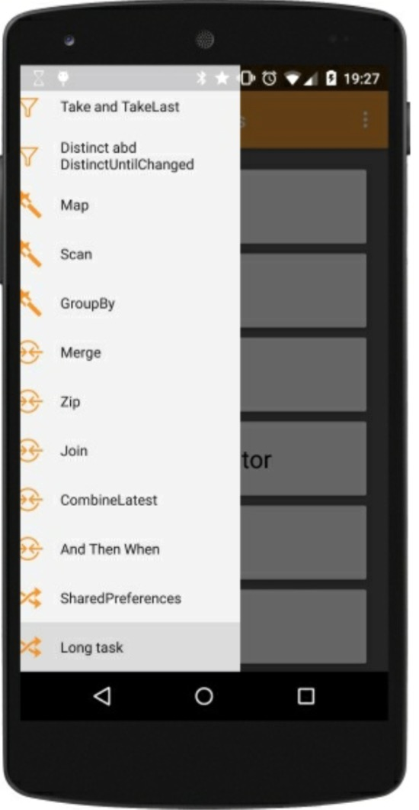
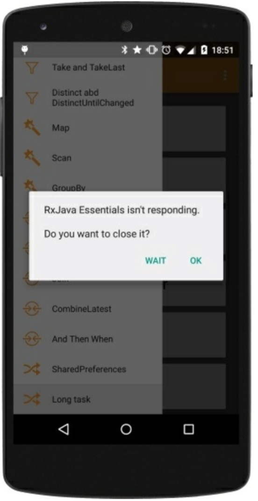
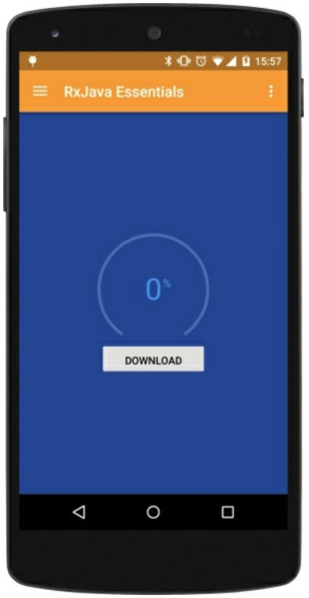
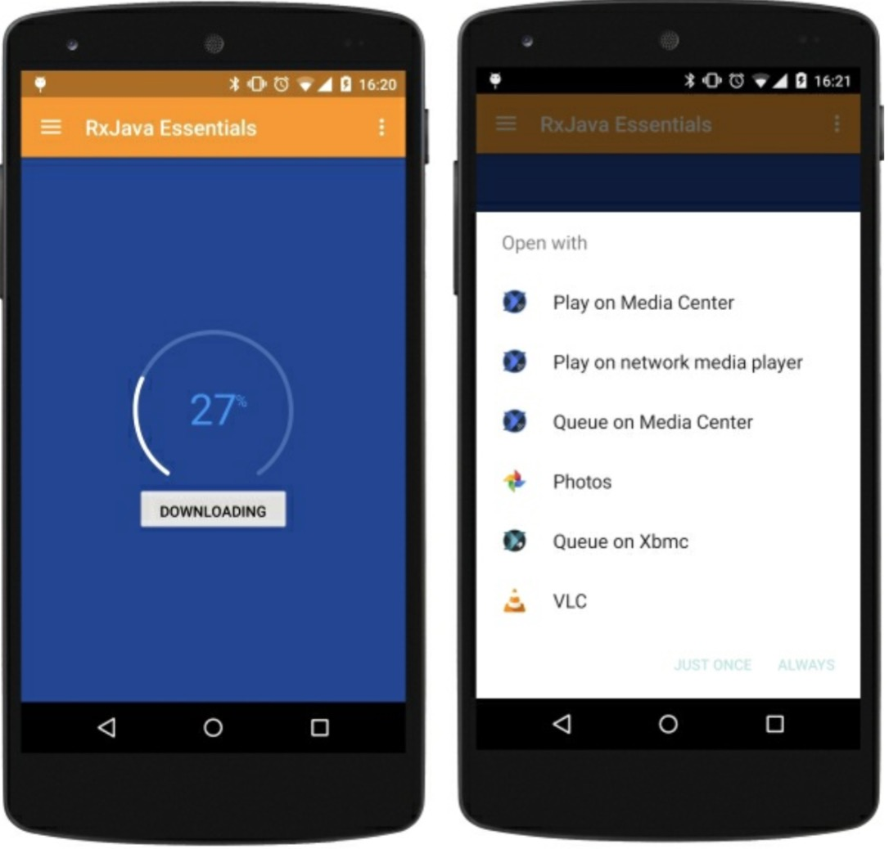

# Schedulers-解决 Android 主线程问题

前面一章是最后一章关于 RxJava 的 Observable 的创建和操作的章节。我们学习到了如何将两个或更多的 Observables 合并在一起，`join`它们，`zip`它们，`merge`它们以及如何创建一个新的 Observable 来满足我们特殊的需求。

本章中，我们提升标准看看如何使用 RxJava 的调度器来处理多线程和并发编程的问题。我们将学习到如何以响应式的方式创建网络操作，内存访问，以及耗时任务。

# StrictMode

为了获得更多出现在代码中的关于公共问题的信息，我们激活了`StrictMode`模式。

`StrictMode`帮助我们侦测敏感的活动，如我们无意的在主线程执行磁盘访问或者网络调用。正如你所知道的，在主线程执行繁重的或者长时的任务是不可取的。因为 Android 应用的主线程时 UI 线程，它被用来处理和 UI 相关的操作：这也是获得更平滑的动画体验和响应式 App 的唯一方法。

为了在我们的 App 中激活`StrictMode`，我们只需要在`MainActivity`中添加几行代码，即`onCreate()`方法中这样：

```java
@Override
public void onCreate() { 
    super.onCreate();
    if (BuildConfig.DEBUG) {
        StrictMode.setThreadPolicy(new StrictMode.ThreadPolicy.Builder().detectAll().penaltyLog().build()); 
        StrictMode.setVmPolicy(new StrictMode.VmPolicy.Builder().detectAll().penaltyLog().build());
    } 
} 
```

我们并不想它总是激活着，因此我们只在 debug 构建时使用。这种配置将报告每一种关于主线程用法的违规做法，并且这些做法都可能与内存泄露有关：`Activities`、`BroadcastReceivers`、`Sqlite`等对象。

选择了`penaltyLog()`，当违规做法发生时，`StrictMode`将会在 logcat 打印一条信息。

# 避免阻塞 I/O 的操作

阻塞 I/O 的操作会导致 App 必须等待结果返回（阻塞结束）才能进行下一步操作。在 UI 线程上执行一个阻塞操作会将 UI 强行卡住，直接造成很糟糕的用户体验。

我们激活`StrictMode`后，我们开始收到了关于我们的 App 错误操作磁盘 I/O 的不良信息。

```java
D/StrictMode  StrictMode policy violation; ~duration=998 ms: android.os.StrictMode$StrictModeDiskReadViolation: policy=31 violation=2
at android.os.StrictMode$AndroidBlockGuardPolicy.onReadFromDisk (StrictMode.java:1135)
at libcore.io.BlockGuardOs.open(BlockGuardOs.java:106) at libcore.io.IoBridge.open(IoBridge.java:393)
at java.io.FileOutputStream.<init>(FileOutputStream.java:88) 
at android.app.ContextImpl.openFileOutput(ContextImpl.java:918) 
at android.content.ContextWrapper.openFileOutput(ContextWrapper. java:185)
at com.packtpub.apps.rxjava_essentials.Utils.storeBitmap (Utils.java:30) 
```

上一条信息告诉我们`Utils.storeBitmap()`函数执行完耗时 998ms：在 UI 线程上近 1 秒的不必要的工作和 App 上近 1 秒不必要的迟钝。这是因为我们以阻塞的方式访问磁盘。我们的`storeBitmap()`函数包含了：

```java
FileOutputStream fOut = context.openFileOutput(filename, Context.MODE_PRIVATE); 
```

它直接访问智能手机的固态存储然后就慢了。我们该如何提高访问速度呢？`storeBitmap()`函数保存了已安装 App 的图标。他的返回值类型为`void`，因此在执行下一个操作前我们毫无理由去等待直到它完成。我们可以启动它并让它执行在不同的线程。近几年来 Android 的线程管理发生了许多变化，导致 App 出现诡异的行为。我们可以使用`AsyncTask`，但是我们要避免掉入前几章里的`onPre... onPost...doInBackGround`地狱。下面我们将换用 RxJava 的方式。调度器万岁！

# Schedulers

调度器以一种最简单的方式将多线程用在你的 Apps 的中。它们时 RxJava 重要的一部分并能很好地与 Observables 协同工作。它们无需处理实现、同步、线程、平台限制、平台变化而可以提供一种灵活的方式来创建并发程序。

RxJava 提供了 5 种调度器：

*   `.io()`
*   `.computation()`
*   `.immediate()`
*   `.newThread()`
*   `.trampoline()`

让我们一个一个的来看下它们：

## Schedulers.io()

这个调度器时用于 I/O 操作。它基于根据需要，增长或缩减来自适应的线程池。我们将使用它来修复我们之前看到的`StrictMode`违规做法。由于它专用于 I/O 操作，所以并不是 RxJava 的默认方法；正确的使用它是由开发者决定的。

重点需要注意的是线程池是无限制的，大量的 I/O 调度操作将创建许多个线程并占用内存。一如既往的是，我们需要在性能和简捷两者之间找到一个有效的平衡点。

## Schedulers.computation()

这个是计算工作默认的调度器，它与 I/O 操作无关。它也是许多 RxJava 方法的默认调度器：`buffer()`,`debounce()`,`delay()`,`interval()`,`sample()`,`skip()`。

## Schedulers.immediate()

这个调度器允许你立即在当前线程执行你指定的工作。它是`timeout()`,`timeInterval()`,以及`timestamp()`方法默认的调度器。

## Schedulers.newThread()

这个调度器正如它所看起来的那样：它为指定任务启动一个新的线程。

## Schedulers.trampoline()

当我们想在当前线程执行一个任务时，并不是立即，我们可以用`.trampoline()`将它入队。这个调度器将会处理它的队列并且按序运行队列中每一个任务。它是`repeat()`和`retry()`方法默认的调度器。

# 非阻塞 I/O 操作

现在我们知道如何在一个指定 I/O 调度器上来调度一个任务，我们可以修改`storeBitmap()`函数并再次检查`StrictMode`的不合规做法。为了这个例子，我们可以在新的`blockingStoreBitmap()`函数中重排代码。

```java
private static void blockingStoreBitmap(Context context, Bitmap bitmap, String filename) {
    FileOutputStream fOut = null; 
    try {
        fOut = context.openFileOutput(filename, Context.MODE_PRIVATE);
        bitmap.compress(Bitmap.CompressFormat.PNG, 100, fOut); 
        fOut.flush();
        fOut.close();
    } catch (Exception e) {
        throw new RuntimeException(e);
    } finally { 
        try {
            if (fOut != null) {
                fOut.close();
            }
        } catch (IOException e) {
            throw new RuntimeException(e); 
        }
    } 
} 
```

现在我们可以使用`Schedulers.io()`创建非阻塞的版本：

```java
public static void storeBitmap(Context context, Bitmap bitmap, String filename) {
    Schedulers.io().createWorker().schedule(() -> {
        blockingStoreBitmap(context, bitmap, filename);
    }); 
} 
```

每次我们调用`storeBitmap()`，RxJava 处理创建所有它需要从 I / O 线程池一个特定的 I/ O 线程执行我们的任务。所有要执行的操作都避免在 UI 线程执行并且我们的 App 比之前要快上 1 秒：logcat 上也不再有`StrictMode`的不合规做法。

下图展示了我们在`storeBitmap()`场景看到的两种方法的不同：



# SubscribeOn and ObserveOn

我们学到了如何在一个调度器上运行一个任务。但是我们如何利用它来和 Observables 一起工作呢？RxJava 提供了`subscribeOn()`方法来用于每个 Observable 对象。`subscribeOn()`方法用`Scheduler`来作为参数并在这个 Scheduler 上执行 Observable 调用。

在“真实世界”这个例子中，我们调整`loadList()`函数。首先，我们需要一个新的`getApps()`方法来检索已安装的应用列表：

```java
private Observable<AppInfo> getApps() { 
    return Observable.create(subscriber -> {
        List<AppInfo> apps = new ArrayList<>();
        SharedPreferences sharedPref = getActivity().getPreferences(Context.MODE_PRIVATE);
        Type appInfoType = new TypeToken<List<AppInfo>>(){}.getType();
        String serializedApps = sharedPref.getString("APPS", "");
        if (!"".equals(serializedApps)) {
            apps = new Gson().fromJson(serializedApps,appInfoType); 
        }
        for (AppInfo app : apps) {
            subscriber.onNext(app);
        }
        subscriber.onCompleted(); 
    });
} 
```

`getApps()`方法返回一个`AppInfo`的 Observable。它先从 Android 的 SharePreferences 读取到已安装的应用程序列表。反序列化，并一个接一个的发射 AppInfo 数据。使用新的方法来检索列表，`loadList()`函数改成下面这样：

```java
private void loadList() {
    mRecyclerView.setVisibility(View.VISIBLE);
    getApps().subscribe(new Observer<AppInfo>() {
        @Override
        public void onCompleted() {
            mSwipeRefreshLayout.setRefreshing(false);
            Toast.makeText(getActivity(), "Here is the list!", Toast.LENGTH_LONG).show();
        }

        @Override
        public void onError(Throwable e) {
            Toast.makeText(getActivity(), "Something went wrong!", Toast.LENGTH_SHORT).show();
            mSwipeRefreshLayout.setRefreshing(false);
        }

        @Override
        public void onNext(AppInfo appInfo) {
            mAddedApps.add(appInfo);
                mAdapter.addApplication(mAddedApps.size() - 1, appInfo);
        } 
    });
} 
```

如果我们运行代码，`StrictMode`将会报告一个不合规操作，这是因为`SharePreferences`会减慢 I/O 操作。我们所需要做的是指定`getApps()`需要在调度器上执行：

```java
 getApps().subscribeOn(Schedulers.io())
        .subscribe(new Observer<AppInfo>() { [...] 
```

`Schedulers.io()`将会去掉`StrictMode`的不合规操作，但是我们的 App 现在崩溃了是因为：

```java
at rx.internal.schedulers.ScheduledAction.run(ScheduledAction.jav a:58)
at java.util.concurrent.Executors$RunnableAdapter.call(Executors. java:422)
at java.util.concurrent.FutureTask.run(FutureTask.java:237) 
at java.util.concurrent.ScheduledThreadPoolExecutor$ScheduledFutu reTask.access$201(ScheduledThreadPoolExecutor.java:152)
at java.util.concurrent.ScheduledThreadPoolExecutor$ScheduledFutu reTask.run(ScheduledThreadPoolExecutor.java:265)
at java.util.concurrent.ThreadPoolExecutor.runWorker(ThreadPoolEx ecutor.java:1112)
at java.util.concurrent.ThreadPoolExecutor$Worker.run(ThreadPoolE xecutor.java:587)
at java.lang.Thread.run(Thread.java:841) Caused by:
    android.view.ViewRootImpl$CalledFromWrongThreadException: Only the original thread that created a view hierarchy can touch its views. 
```

Only the original thread that created a view hierarchy can touch its views.

我们再次回到 Android 的世界。这条信息简单的告诉我们我们试图在一个非 UI 线程来修改 UI 操作。意思是我们需要在 I/O 调度器上执行我们的代码。因此我们需要和 I/O 调度器一起执行代码，但是当结果返回时我们需要在 UI 线程上操作。RxJava 让你能够订阅一个指定的调度器并观察它。我们只需在`loadList()`函数添加几行代码，那么每一项就都准备好了：

```java
getApps()
.onBackpressureBuffer()
.subscribeOn(Schedulers.io())
.observeOn(AndroidSchedulers.mainThread())
.subscribe(new Observer<AppInfo>() { [...] 
```

`observeOn()`方法将会在指定的调度器上返回结果：如例子中的 UI 线程。`onBackpressureBuffer()`方法将告诉 Observable 发射的数据如果比观察者消费的数据要更快的话，它必须把它们存储在缓存中并提供一个合适的时间给它们。做完这些工作之后，如果我们运行 App，就会出现已安装的程序列表：



# 处理耗时的任务

我们已经知道如何处理缓慢的 I/O 操作。让我们看一个与 I/O 无关的耗时的任务。例如，我们修改`loadList()`函数并创建一个新的`slow`函数发射我们已安装的 app 数据。

```java
private Observable<AppInfo> getObservableApps(List<AppInfo> apps) {
    return Observable .create(subscriber -> {
        for (double i = 0; i < 1000000000; i++) {
            double y = i * i;
        }
        for (AppInfo app : apps) {
            subscriber.onNext(app);
        }
        subscriber.onCompleted(); 
    });
} 
```

正如你看到的，这个函数执行了一些毫无意义的计算，只是针对这个例子消耗时间，然后从`List<AppInfo>`对象中发射我们的`AppInfo`数据，现在，我们重排`loadList()`函数如下：

```java
private void loadList(List<AppInfo> apps) {
    mRecyclerView.setVisibility(View.VISIBLE);
    getObservableApps(apps)
        .subscribe(new Observer<AppInfo>() {
            @Override
            public void onCompleted() {
                mSwipeRefreshLayout.setRefreshing(false);
                Toast.makeText(getActivity(), "Here is the list!", Toast.LENGTH_LONG).show();
            }

            @Override
            public void onError(Throwable e) {
                Toast.makeText(getActivity(), "Something went wrong!", Toast.LENGTH_SHORT).show();
                mSwipeRefreshLayout.setRefreshing(false);
            }

            @Override
            public void onNext(AppInfo appInfo) { 
                mAddedApps.add(appInfo);  
                mAdapter.addApplication(mAddedApps.size() - 1, appInfo);
            } 
        });
} 
```

如果我们运行这段代码，当我们点击`Navigation Drawer`菜单项时 App 将会卡住一会，然后你能看到下图中半关闭的菜单:



如果我们不够走运的话，我们可以看到下图中经典的 ANR 信息框：



可以确定的是，我们将会看到下面在 logcat 中不愉快的信息：

```java
I/Choreographer  Skipped 598 frames! The application may be doing too much work on its main thread. 
```

这条信息比较清楚，Android 在告诉我们用户体验非常差的原因是我们用不必要的工作量阻塞了 UI 线程。但是我们已经知道了如何处理它：我们有调度器！我们只须添加几行代码到我们的 Observable 链中就能去掉加载慢和`Choreographer`信息：

```java
getObservableApps(apps)
    .onBackpressureBuffer()
    .subscribeOn(Schedulers.computation())
    .observeOn(AndroidSchedulers.mainThread())
    .subscribe(new Observer<AppInfo>() { [...] 
```

用这几行代码，我们将可以快速关掉`Navigation Drawer`,一个漂亮的进度条，一个工作在独立的线程缓慢执行的计算任务，并在主线程返回结果让我们更新已安装的应用列表。

# 执行网络任务

在当今 99%的移动应用中网络都是必不可缺的一部分：总是需要连接远程服务器来检索 App 需要的信息。

作为网络访问的第一个案例，我们将创建下面这样一个场景:

*   加载一个进度条。
*   用一个按钮开始文件下载。
*   下载过程中更新进度条。
*   下载完后开始视频播放。

我们的用户界面非常简单，我们只需要一个有趣的进度条和一个下载按钮。



首先，我们创建`mDownloadProgress`

```java
private PublishSubject<Integer> mDownloadProgress = PublishSubject.create(); 
```

这个主题我们用来管理进度的更新，它和`download`函数协同工作。

```java
private boolean downloadFile(String source, String destination) {
    boolean result = false;
    InputStream input = null; 
    OutputStream output = null; 
    HttpURLConnection connection = null;
    try {
        URL url = new URL(source);
        connection = (HttpURLConnection) url.openConnection(); 
        connection.connect();
        if (connection.getResponseCode() != HttpURLConnection.HTTP_OK) {
            return false;
        }
        int fileLength = connection.getContentLength();
        input = connection.getInputStream();
        output = new FileOutputStream(destination);
        byte data[] = new byte[4096];
        long total = 0;
        int count;
        while ((count = input.read(data)) != -1) {
            total += count;
            if (fileLength >0) {
                int percentage = (int) (total * 100 / fileLength);
                mDownloadProgress.onNext(percentage);
            }
            output.write(data, 0, count); 
        }
        mDownloadProgress.onCompleted(); 
        result = true;
    } catch (Exception e) { 
        mDownloadProgress.onError(e);
    } finally { 
        try {
            if (output != null) { 
                output.close();
            }
            if (input != null) {
                input.close(); 
            }
        } catch (IOException e) {    
            mDownloadProgress.onError(e);
        }
        if (connection != null) {
            connection.disconnect();
            mDownloadProgress.onCompleted();
        }
    }
    return result;
} 
```

上面的这段代码将会触发`NetworkOnMainThreadException`异常。我们可以创建 RxJava 版本的函数进入我们挚爱的响应式世界来解决这个问题：

```java
private Observable<Boolean> obserbableDownload(String source, String destination) {
    return Observable.create(subscriber -> {
        try {
            boolean result = downloadFile(source, destination); 
            if (result) {
                subscriber.onNext(true);
                subscriber.onCompleted(); 
            } else {
                subscriber.onError(new Throwable("Download failed."));
            }
        } catch (Exception e) { 
            subscriber.onError(e);
        } 
    });
} 
```

现在我们需要触发下载操作，点击下载按钮:

```java
@OnClick(R.id.button_download)
void download() {
    mButton.setText(getString(R.string.downloading));
    mButton.setClickable(false);
    mDownloadProgress.distinct()
    .observeOn(AndroidSchedulers.mainThread())
    .subscribe(new Observer<Integer>() {

        @Override
        public void onCompleted() {  
            App.L.debug("Completed");
        }

        @Override
        public void onError(Throwable e) {
            App.L.error(e.toString()); 
        }

        @Override
        public void onNext(Integer progress) {
            mArcProgress.setProgress(progress);
        } 
    });

    String destination = "sdcardsoftboy.avi";
    obserbableDownload("http://archive.blender.org/fileadmin/movies/softboy.avi", destination)
        .subscribeOn(Schedulers.io())
        .observeOn(AndroidSchedulers.mainThread())
        .subscribe(success -> {
            resetDownloadButton();
            Intent intent = new Intent(android.content.Intent.ACTION_VIEW);
            File file = new File(destination);
            intent.setDataAndType(Uri.fromFile(file),"video/avi");
            intent.addFlags(Intent.FLAG_ACTIVITY_NEW_TASK); 
            startActivity(intent);
        }, error -> {
            Toast.makeText(getActivity(), "Something went south", Toast.LENGTH_SHORT).show();
            resetDownloadButton();
        });
} 
```

我们使用 Butter Knife 的注解`@OnClick`来绑定按钮的方法并更新按钮信息和点击状态：我们不想让用户点击多次从而触发多次下载事件。

然后，我们创建一个 subscription 来观察下载进度并相应的更新进度条。很明显，我们订阅在主线程是因为进度条是 UI 元素。

```java
obserbableDownload("http://archive.blender.org/fileadmin/movies/softboy.avi", "sdcardsoftboy.avi";) 
```

这是一个下载 Observable。网络调用是一个 I/O 任务，理应使用 I/O 调度器。当下载完成，就会在`onNext()` 中启动视频播放器，并且播放器将会在目标路径找到下载的文件.。

下图展示了下载进度和视频播放器选择对话框：



# 总结

这一章中，我们学习了如何简单的将多线程应用在我们的 App 中。RxJava 为此提供了极其实用的工具：调度器。调度器以及不同应用场景下的优化方案一起，将我们从`StrictMode`中的不合法操作以及阻塞 I/O 的方法中解放出来。我们现在可以用简单的，响应式的，并在整个 App 中保持一致的方式来访问本地存储和网络。

下一章中，我们将会冒更大的险来创建一个正儿八经的 App，并使用 Square 公司开源的 REST API 库[Retrofit](http://https://github.com/square/retrofit "GitHub")来获取不同的远程数据并创建一个复杂的 material design UI。